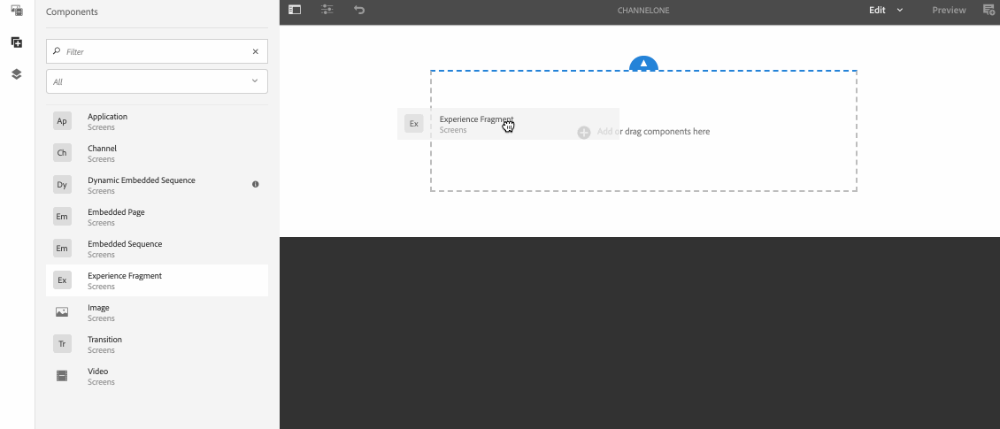

# 將元件添加到通道{#adding-components-to-a-channel}

元件是AEM(Adobe Experience Manager)體驗的基本元素。 您可以使用數個元件，並將其新增至AEM Screens專案中的管道。

## AEM Screens中的元件{#components-in-aem-screens}

AEM Screens提供可用於Screens專案的不同AEM元件。

### 檢視AEM Screens元件{#viewing-aem-screens-components}

每當您建立AEM Screens專案時，就會看到可新增至專案的預設元件清單。

若要檢視Screens專案的預設元件，請遵循下列步驟：

1. 選取通道。 例如，**We.Retail In Store** —> **Channels** —> **Idle Channel**。

1. 按一下動作列中的&#x200B;**編輯**&#x200B;以開啟AEM編輯器。
1. 按一下側欄中的&#x200B;**+**&#x200B;圖示以開啟元件。
1. 依預設，會顯示AEM Screens專案中包含的所有元件，如下圖所示。

### 添加新元件{#adding-a-new-component}

AEM提供許多其他元件。 鑑於其他元件與AEM Screens相容，您一律可以新增其他元件（預設不包含）至專案。

下列範例顯示將Livefyre元件新增至AEM Screens專案：

1. 選取您要新增元件的管道。 例如，**We.Retail In Store** —> **Channels** —> **Idle Channel**。

1. 按一下動作列中的&#x200B;**編輯**&#x200B;以開啟編輯器。
1. 選擇&#x200B;**Design**&#x200B;模式。
1. 選擇右側的整個設計編輯器，然後按一下設定符號以開啟&#x200B;**ParSys Design**&#x200B;對話框。
1. 您可以選取要匯入至AEM Screens專案的元件。 下列範例顯示將&#x200B;**Livefyre**&#x200B;元件新增至AEM Screens專案。

>[!NOTE]
>
>同樣地，您也可以將任何數量與AEM Screens相容的其他新元件新增至專案。

## 了解AEM螢幕元件{#understanding-aem-screen-components}

下節說明您可在專案中使用的AEM Screens元件。

>[!NOTE]
>
>要查看任何元件的屬性，請選擇該元件並按一下錘表徵圖以開啟/查看屬性。

### 應用程式 {#application}

**Application**&#x200B;元件允許您將應用程式添加到通道中。

應用程式元件具有以下屬性：

| **屬性** | **說明** |
|---|---|
| ***應用程式路徑*** | 選擇應用程式所在的絕對路徑。 |
| ***持續時間 (毫秒)*** | 選擇應用程式的持續時間。 依預設，持續時間會設為–1，這表示元素會永遠執行（即單頁應用程式）。 設定持續時間值>0，顯示指定持續時間的元素，然後繼續到下一個。 |

下列範例說明如何內嵌應用程式元件及其屬性的預覽：

>[!NOTE]
>
>請參閱上述範例，檢視下方每個元件的屬性。

### 頻道 {#channel}

**Channel**&#x200B;元件可讓您將整個通道新增至專案。

通道元件具有以下屬性：

<table>
 <tbody>
  <tr>
   <td><strong>屬性</strong></td>
   <td><strong>說明</strong></td>
  </tr>
  <tr>
   <td><strong><em>頻道路徑</em></strong></td>
   <td>選擇應用程式所在的絕對路徑。  </td>
  </tr>
  <tr>
   <td><strong><em>持續時間 (毫秒)</em></strong></td>
   <td>選取管道的整個持續時間。 將持續時間設定為–1表示嵌入通道將在特定通道中運行其完整長度。</td>
  </tr>
 </tbody>
</table>

### 內嵌頁面 {#embedded-page}

**內嵌頁面**&#x200B;可讓您將內嵌頁面新增至專案。 例如，它可以是Web應用程式或產品目錄。

「嵌入」頁具有以下屬性：

<table>
 <tbody>
  <tr>
   <td><strong>屬性</strong></td>
   <td><strong>說明</strong></td>
  </tr>
  <tr>
   <td><strong><em>頁面路徑  </em></strong></td>
   <td>選擇此通道存在的絕對路徑。  </td>
  </tr>
  <tr>
   <td><strong><em>持續時間 (毫秒)</em></strong></td>
   <td>選取管道的整個持續時間。 將持續時間設定為–1表示嵌入通道將在特定通道中運行其完整長度。</td>
  </tr>
 </tbody>
</table>

### 內嵌順序 {#embedded-sequence}

>[!NOTE]
>
>請參閱製作畫面區段下的[內嵌序列](embedded-sequences.md)，深入了解內嵌序列。

內嵌序列可讓您在現有管道內新增內嵌序列管道（搭配其他資產）。

內嵌序列具有下列頁面屬性：

<table>
 <tbody>
  <tr>
   <td><strong>屬性</strong></td>
   <td><strong>說明</strong></td>
  </tr>
  <tr>
   <td>頻道路徑</td>
   <td>選擇要包含在通道中的序列的絕對路徑。  </td>
  </tr>
  <tr>
   <td><strong><em>持續時間 (毫秒)</em></strong></td>
   <td>選取管道的整個持續時間。 將持續時間設定為–1表示嵌入通道將在特定通道中運行其完整長度。</td>
  </tr>
  <tr>
   <td><strong><em>策略</em></strong></td>
   <td>將其設為<strong>original</strong>或<strong>single</strong>。 將值設定為<strong>original</strong>表示子序列將在父序列的每個循環上完全運行。 另一個可能值是<strong>single</strong>，它將只顯示每次運行時的子序列的一個項目（例如，第一個循環上的第一個項目，第二個循環上的第二個項目，等等）。</td>
  </tr>
 </tbody>
</table>

### 動態內嵌序列 {#dynamic-embedded-sequence}

動態內嵌序列可新增與上述類似的序列，但管道角色除外。

請參閱製作畫面區段下的[內嵌序列](embedded-sequences.md)，深入了解內嵌序列。

動態內嵌序列具有下列屬性：

<table>
 <tbody>
  <tr>
   <td><strong>屬性</strong></td>
   <td><strong>說明</strong></td>
  </tr>
  <tr>
   <td><strong><em>頻道指定任務角色</em></strong>  </td>
   <td>輸入通道角色。  </td>
  </tr>
  <tr>
   <td><strong><em>持續時間 (毫秒)</em></strong></td>
   <td>選取管道的整個持續時間。 將持續時間設定為–1表示嵌入通道將在特定通道中運行其完整長度。</td>
  </tr>
  <tr>
   <td><strong><em>策略</em></strong></td>
   <td>將其設為<strong>original</strong>或<strong>single</strong>。 將值設定為<strong>original</strong>表示子序列將在父序列的每個循環上完全運行。 另一個可能值是<strong>single</strong>，它將只顯示每次運行時的子序列的一個項目（例如，第一個循環上的第一個項目，第二個循環上的第二個項目，等等）。</td>
  </tr>
 </tbody>
</table>

### 體驗片段 {#experience-fragment}

體驗片段可讓您將體驗片段（一或多個元件的群組，包括可在頁面中參照的內容和版面）新增至AEM Screens頻道。 將元件拖放至AEM編輯器並選取體驗片段。

若要進一步了解如何建立體驗片段並將其運用於AEM Screens專案，請參閱[使用體驗片段](experience-fragments-in-screens.md)。

| **屬性** | **說明** |
|---|---|
| **體驗片段** |
| ***體驗片段*** | 選取體驗片段。 |
| ***持續時間*** | 選取在管道中播放的體驗片段的整個期間。 |
| **離線設定** |
| ***用戶端資源庫*** | Javascript和CSS檔案。 |
| ***靜態檔案*** | 您可以新增為離線設定的靜態檔案至體驗片段。 |

>[!NOTE]
>
>您從此元件新增的&#x200B;**用戶端程式庫**&#x200B;和&#x200B;**靜態檔案**，除了已設定的&#x200B;**用戶端程式庫**&#x200B;和從體驗片段的&#x200B;**屬性**&#x200B;新增的靜態檔案外。

### 影像 {#image}

影像可讓您將影像新增至通道。

影像資產有三個索引標籤，分別為&#x200B;**Image**、**Accessibility**&#x200B;和&#x200B;**Sequence**:

| **屬性** | **說明** |
|---|---|
| **影像** |
| ***影像資產*** | 選取影像資產。 |
| ***標題*** | 影像的標題。 |
| ***連結至*** | 新增連結至影像。 |
| ***說明*** | 影像的簡短說明。 |
| ***大小*** | 影像大小。 |
| **協助工具** |
| ***替代文字*** | 影像的替代文字。 |
| **順序** |
| ***持續時間*** | 預設情況下，持續時間設為&#x200B;*8000 ms*。 如果要更改影像的播放持續時間，請更新&#x200B;**持續時間**&#x200B;欄位。 |

### 切換 {#transition}

「轉變」元件可讓您將轉變新增至Screens專案。

下圖顯示轉變元件（透過拖放方式新增）至編輯器。

選取轉變圖示，然後按一下&#x200B;**Configure**（扳手圖示）以開啟&#x200B;**Transition**&#x200B;對話方塊。 此對話方塊包含三個標籤：

* **切換**
* **順序**
* **啟動**

>[!NOTE]
>
>依預設，序列會設為600毫秒。 您可以使用&#x200B;**Sequence**&#x200B;標籤將轉變序列更新為其他值。

轉變元件具有以下屬性：

<table>
 <tbody>
  <tr>
   <td><strong>屬性</strong></td>
   <td><strong>說明</strong></td>
  </tr>
  <tr>
   <td><strong>切換</strong></td>
   <td></td>
  </tr>
  <tr>
   <td><strong><em>類型</em></strong></td>
   <td>
元素之前和之後之間的轉變類型。 轉變<strong>Type</strong>包含下列選項：

    <ul>
     <li><strong>普通</strong></li>
     <li><strong>淡化</strong></li>
     <li><strong>從右邊滑入</strong></li>
     <li><strong>從左邊滑入</strong></li>
     <li><strong>從頂端滑入</strong></li>
     <li><strong>從底部滑入</strong></li>
    </ul> </td>
  </tr>
  <tr>
   <td><strong>順序</strong></td>
   <td></td>
  </tr>
  <tr>
   <td><strong><em>持續時間</em></strong></td>
   <td>選取轉變的整個期間。 預設為600毫秒。</td>
  </tr>
  <tr>
   <td><strong>啟動</strong></td>
   <td></td>
  </tr>
  <tr>
   <td><strong><em>活動自</em></strong></td>
   <td>說明轉變可於何時生效的時間戳記。  </td>
  </tr>
  <tr>
   <td><strong><em>活動到</em></strong></td>
   <td>描述至轉換可作用時為止的時間戳記。</td>
  </tr>
  <tr>
   <td><strong><em>計劃</em></strong></td>
   <td>新增預先定義的排程。</td>
  </tr>
 </tbody>
</table>

### 影片 {#video}

視訊元件可讓您將視訊新增至您的Screens專案。

視訊元件具有下列屬性：

<table>
 <tbody>
  <tr>
   <td><strong>屬性</strong></td>
   <td><strong>說明</strong></td>
  </tr>
  <tr>
   <td><em><strong>視訊資產</strong></em></td>
   <td>選取視訊的連結。</td>
  </tr>
  <tr>
   <td><em><strong>持續時間</strong></em></td>
   <td>選取視訊的持續時間。 預設情況下，持續時間設為–1，表示元素會永遠執行。 設定持續時間值&gt;0，顯示指定持續時間的元素，然後繼續到下一個。  </td>
  </tr>
  <tr>
   <td><em><strong>轉譯</strong></em></td>
   <td>
如果視訊外觀比例不符合螢幕大小，您可以將呈現調整為<strong>contain</strong>或<strong>cover</strong>。
 
<em></em> 「包含」表示會顯示完整視訊，且遺漏的區域會以黑色邊框填補。
 
<em></em> Cover表示影片涵蓋整個檢視區，但溢出至側邊的部分會隱藏。
 </td>
  </tr>
  <tr>
   <td><em><strong>大小</strong></em></td>
   <td>視訊大小。</td>
  </tr>
 </tbody>
</table>

