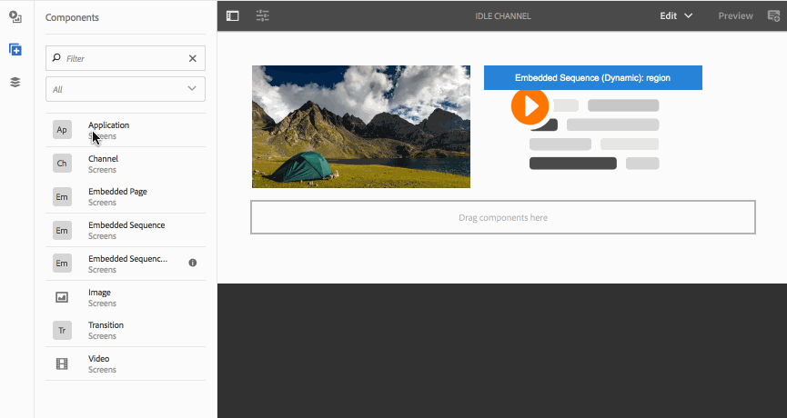

# 新增元件至管道{#adding-components-to-a-channel}

元件是AEM (Adobe Experience Manager)體驗的基本元素。 您可以在AEM Screens專案中使用數個元件，並將其新增至您的頻道。

## AEM Screens中的元件 {#components-in-aem-screens}

AEM Screens提供不同的AEM元件，這些元件可用於畫面專案。

### 檢視AEM Screens元件 {#viewing-aem-screens-components}

建立AEM Screens專案時，您會看到可新增至專案的預設元件清單。

若要檢視畫面專案的預設元件，請遵循下列步驟：

1. 選取頻道。 例如， **`We.Retail In Store`** > **頻道** > **閒置頻道**.

1. 選取 **編輯** 從動作列移除。
1. 在AEM編輯器中，選取 **+** 圖示來檢查自己的位置。
1. AEM Screens專案中預設包含的所有元件都會顯示，如下圖所示。

### 新增元件 {#adding-a-new-component}

AEM提供數個其他元件。 您一律可以新增其他元件（預設不包含）至專案，前提是這些元件與AEM Screens相容。

下列範例說明如何將Livefyre元件新增至AEM Screens專案：

1. 選取您要新增元件的管道。 例如， **`We.Retail In Store`** > **頻道** > **閒置頻道**.

1. 選取 **編輯** 從動作列移除。
1. 選取 **設計** 模式。
1. 選取右側的整個設計編輯器，然後選取設定符號，以便您能開啟 **Parsys設計** 對話方塊。
1. 您可以選取要匯入AEM Screens專案的元件。 下列範例顯示新增的 **Livefyre** 元件至AEM Screens專案。

>[!NOTE]
>
>同樣地，您可以將與AEM Screens相容的任何其他新元件新增至專案。

## 瞭解AEM畫面元件 {#understanding-aem-screen-components}

下節將說明您可在專案中使用的AEM Screens元件。

>[!NOTE]
>
>若要檢視任何元件的屬性，請選取該元件，然後選取槌子圖示以開啟/檢視屬性。

### 應用程式 {#application}

此 **應用** 元件可讓您將應用程式新增至您的頻道。

應用程式元件具有下列屬性：

| **屬性** | **說明** |
|---|---|
| ***應用程式路徑*** | 選取應用程式所在的絕對路徑。 |
| ***持續時間（毫秒）*** | 選取應用程式的持續時間。 根據預設，持續時間設為–1，表示元素會永遠執行（即單頁應用程式）。 設定持續時間值>0，顯示指定持續時間的元素，然後移至下一個專案。 |

下列範例說明如何內嵌應用程式元件及其屬性的預覽：

>[!NOTE]
>
>請參閱上述範例，檢視下列每個元件的屬性。

### 管道 {#channel}

此 **頻道** 元件可讓您將整個管道新增至專案。

Channel元件具有以下屬性：

<table>
 <tbody>
  <tr>
   <td><strong>屬性</strong></td>
   <td><strong>說明</strong></td>
  </tr>
  <tr>
   <td><strong><em>頻道路徑</em></strong></td>
   <td>選取應用程式所在的絕對路徑。  </td>
  </tr>
  <tr>
   <td><strong><em>持續時間（毫秒）</em></strong></td>
   <td>選取管道的整個期間。 將持續時間設為–1表示內嵌頻道在特定頻道中執行其完整長度。</td>
  </tr>
 </tbody>
</table>

### 內嵌頁面 {#embedded-page}

一個 **內嵌頁面** 可讓您將內嵌頁面新增至專案。 例如，它可以是網頁應用程式或產品目錄。

內嵌頁面具有下列屬性：

<table>
 <tbody>
  <tr>
   <td><strong>屬性</strong></td>
   <td><strong>說明</strong></td>
  </tr>
  <tr>
   <td><strong><em>頁面路徑  </em></strong></td>
   <td>選取此管道存在的絕對路徑。  </td>
  </tr>
  <tr>
   <td><strong><em>持續時間（毫秒）</em></strong></td>
   <td>選取管道的整個期間。 將持續時間設為–1表示內嵌頻道在特定頻道中執行其完整長度。</td>
  </tr>
 </tbody>
</table>

### 內嵌順序 {#embedded-sequence}

>[!NOTE]
>
>若要深入瞭解內嵌序列，請參閱 [內嵌順序](embedded-sequences.md) 在製作畫面區段下。

內嵌序列可讓您在現有管道中新增內嵌序列管道（包含其他資產）。

內嵌序列具有下列頁面屬性：

<table>
 <tbody>
  <tr>
   <td><strong>屬性</strong></td>
   <td><strong>說明</strong></td>
  </tr>
  <tr>
   <td>頻道路徑</td>
   <td>選取您要包含在管道中的序列的絕對路徑。  </td>
  </tr>
  <tr>
   <td><strong><em>持續時間（毫秒）</em></strong></td>
   <td>選取管道的整個期間。 將持續時間設為–1表示內嵌頻道在特定頻道中執行其完整長度。</td>
  </tr>
  <tr>
   <td><strong><em>策略</em></strong></td>
   <td>將其設為 <strong>原始</strong> 或 <strong>單一</strong>. 將值設為 <strong>原始</strong> 表示子序號會在父序號的每個週期完全執行。 另一個可能的值是 <strong>單一</strong>. 每次執行時，這類值只會顯示一個子序列專案。 例如，第一個回圈上的第一個專案，以及第二個回圈上的第二個專案。</td>
  </tr>
 </tbody>
</table>

### 動態內嵌序列 {#dynamic-embedded-sequence}

動態內嵌序列可讓您新增與上述類似的序列，但頻道角色除外。

若要瞭解內嵌序列，請參閱 [內嵌順序](embedded-sequences.md) 在製作畫面區段下。

動態內嵌序列具有以下屬性：

<table>
 <tbody>
  <tr>
   <td><strong>屬性</strong></td>
   <td><strong>說明</strong></td>
  </tr>
  <tr>
   <td><strong><em>頻道指定任務角色</em></strong>  </td>
   <td>輸入頻道角色。  </td>
  </tr>
  <tr>
   <td><strong><em>持續時間（毫秒）</em></strong></td>
   <td>選取管道的整個期間。 將持續時間設為–1表示內嵌頻道在特定頻道中執行其完整長度。</td>
  </tr>
  <tr>
   <td><strong><em>策略</em></strong></td>
   <td>將其設為 <strong>原始</strong> 或 <strong>單一</strong>. 將值設為 <strong>原始</strong> 表示子序號會在父序號的每個週期完全執行。 另一個可能的值是 <strong>單一</strong>. 每次執行時，這類值只會顯示子序列的一個專案。 例如，第一個回圈上的第一個專案，以及第二個回圈上的第二個專案。</td>
  </tr>
 </tbody>
</table>

### 體驗片段 {#experience-fragment}

體驗片段可讓您將體驗片段（一或多個元件的群組，包括可在頁面中參考的內容和版面）新增到您的AEM Screens頻道。 將元件拖放至AEM編輯器並選取體驗片段。

要瞭解有關如何建立體驗片段並將其套用至AEM Screens專案的詳細資訊，請參閱 [使用體驗片段](experience-fragments-in-screens.md).

| **屬性** | **說明** |
|---|---|
| **體驗片段** |
| ***體驗片段*** | 選取體驗片段。 |
| ***持續時間*** | 選取在頻道中播放的體驗片段的整個期間。 |
| **離線設定** |
| ***使用者端資料庫*** | JavaScript和CSS檔案。 |
| ***靜態檔案*** | 您可以新增為離線設定至體驗片段的靜態檔案。 |

>[!NOTE]
>
>此 **使用者端資料庫** 和 **靜態檔案** 您從此元件新增的專案，除了已設定的專案 **使用者端資料庫** 以及從體驗片段新增的靜態檔案 **屬性**.

### 影像 {#image}

影像可讓您將影像新增至色版。

影像資產有三個索引標籤，即 **影像**， **協助工具**、和 **序列**：

| **屬性** | **說明** |
|---|---|
| **影像** |
| ***影像資產*** | 選取影像資產。 |
| ***標題*** | 影像標題。 |
| ***連結至*** | 新增影像的連結。 |
| ***說明*** | 影像的簡短說明。 |
| ***大小*** | 影像的大小。 |
| **協助工具** |
| ***替代文字*** | 影像的替代文字。 |
| **序列** |
| ***持續時間*** | 根據預設，持續時間設為 *8000毫秒*. 如果您想要變更影像的播放持續時間，請更新 **持續時間** 欄位。 |

### 切換 {#transition}

「轉變」元件可讓您將轉變新增到您的Screens專案。

下圖顯示編輯器中的轉變元件（透過拖放方式新增）。

選取轉變圖示並選取 **設定** （扳手圖示）開啟 **轉變** 對話方塊。 此對話方塊包含三個索引標籤：

* **轉變**
* **序列**
* **啟用**

>[!NOTE]
>
>依預設，順序會設為600毫秒。 您可以使用將轉變序列更新為其他值 **序列** 標籤。

轉場元件具有下列屬性：

<table>
 <tbody>
  <tr>
   <td><strong>屬性</strong></td>
   <td><strong>說明</strong></td>
  </tr>
  <tr>
   <td><strong>切換</strong></td>
   <td></td>
  </tr>
  <tr>
   <td><strong><em>類型</em></strong></td>
   <td>
元素之前和之後之間的轉變型別。 轉變 <strong>型別</strong> 包含下列選項：

    <ul>
     <li><strong>一般</strong></li>
     <li><strong>淡化</strong></li>
     <li><strong>從右邊滑入</strong></li>
     <li><strong>從左邊滑入</strong></li>
     <li><strong>從頂端滑入</strong></li>
     <li><strong>從底部滑入</strong></li>
    </ul> </td>
  </tr>
  <tr>
   <td><strong>順序</strong></td>
   <td></td>
  </tr>
  <tr>
   <td><strong><em>持續時間</em></strong></td>
   <td>選取轉變的整個期間。 預設為600毫秒。</td>
  </tr>
  <tr>
   <td><strong>啟用</strong></td>
   <td></td>
  </tr>
  <tr>
   <td><strong><em>啟用開始日期</em></strong></td>
   <td>說明轉變何時生效的時間戳記。  </td>
  </tr>
  <tr>
   <td><strong><em>啟用結束日期</em></strong></td>
   <td>說明轉變何時可以啟用的時間戳記。</td>
  </tr>
  <tr>
   <td><strong><em>計劃</em></strong></td>
   <td>新增預先定義的排程。</td>
  </tr>
 </tbody>
</table>

### 影片 {#video}

視訊元件可讓您將視訊新增至Screens專案。

視訊元件具有下列屬性：

<table>
 <tbody>
  <tr>
   <td><strong>屬性</strong></td>
   <td><strong>說明</strong></td>
  </tr>
  <tr>
   <td><em><strong>視訊資產</strong></em></td>
   <td>選取視訊的連結。</td>
  </tr>
  <tr>
   <td><em><strong>持續時間</strong></em></td>
   <td>選取視訊的持續時間。 根據預設，持續時間設為–1，表示元素會永遠執行。 設定持續時間值&gt;0，顯示指定持續時間的元素，然後移至下一個專案。  </td>
  </tr>
  <tr>
   <td><em><strong>轉譯</strong></em></td>
   <td>
如果視訊外觀比例不符合熒幕，您可以將演算調整為 <strong>contain</strong> 或 <strong>封面</strong>.
 
<em>包含</em> 表示顯示完整視訊，並以黑色邊框填入遺失區域。
 
<em>封面</em> 這表示視訊涵蓋整個檢視區，但兩側溢位的部分會隱藏。
 </td>
  </tr>
  <tr>
   <td><em><strong>大小</strong></em></td>
   <td>視訊的大小。</td>
  </tr>
 </tbody>
</table>
