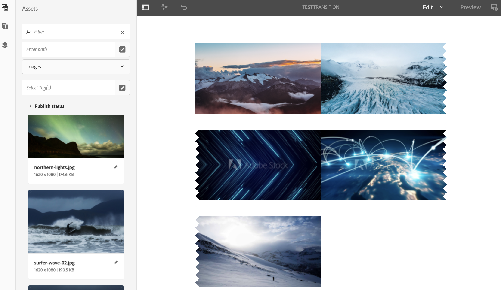

# 套用轉變 {#applying-transitions}

>[!IMPORTANT]
>此內容對AEM內部部署/AMS （AEM 6.5LTS和AEM 6.5）有效。 如需AEM as a Cloud Service Screens內容，請參閱[AEM as a Cloud Service指南](https://experienceleague.adobe.com/en/docs/experience-manager-cloud-service/content/screens-as-cloud-service/overview/introduction)。

本節說明如何在不同的資產（影像和視訊）與管道中的內嵌序列之間套用&#x200B;**轉變**&#x200B;元件。

>[!CAUTION]
>
>若要深入瞭解&#x200B;**轉變**&#x200B;元件的屬性，請參閱[轉變](adding-components-to-a-channel.md#transition)。

## 在頻道中新增轉變元件至Assets {#adding-transition}

請依照下列步驟，將轉變元件新增至AEM Screens專案：

>[!NOTE]
>
>**先決條件**
>
>使用管道&#x200B;**TestTransition**&#x200B;建立AEM Screens專案&#x200B;**TestProject**。 此外，設定位置和顯示以檢視輸出。

1. 導覽至頻道&#x200B;**TestTransition**，然後按一下動作列中的&#x200B;**編輯**。

   

   >[!NOTE]
   >
   >**TestTransition**&#x200B;頻道中已有一些資產（影像和影片）。 例如，**TestTransition**&#x200B;頻道包含三個影像和兩個影片，如下所示：

   

1. 將&#x200B;**轉變**&#x200B;元件拖放到您的編輯器中。

   >[!CAUTION]
   >
   >將轉變新增至頻道中的資產之前，請務必不要在循序頻道中的第一個資產之前新增轉變。 管道中的第一個專案必須是資產，而非轉變。

   

   >[!NOTE]
   >
   >根據預設，轉換元件（例如&#x200B;**Type**）的屬性設定為&#x200B;**淡化**，而&#x200B;**持續時間**&#x200B;設定為&#x200B;*1600毫秒*。 此外，不建議將轉換持續時間設定為超過套用到的資產。

1. 此外，如果您將&#x200B;**內嵌順序**&#x200B;元件（包含順序頻道）新增至此頻道編輯器，則可以在結尾新增轉變元件。 這麼做可確保內容以正確順序播放，如下圖所示：

   
