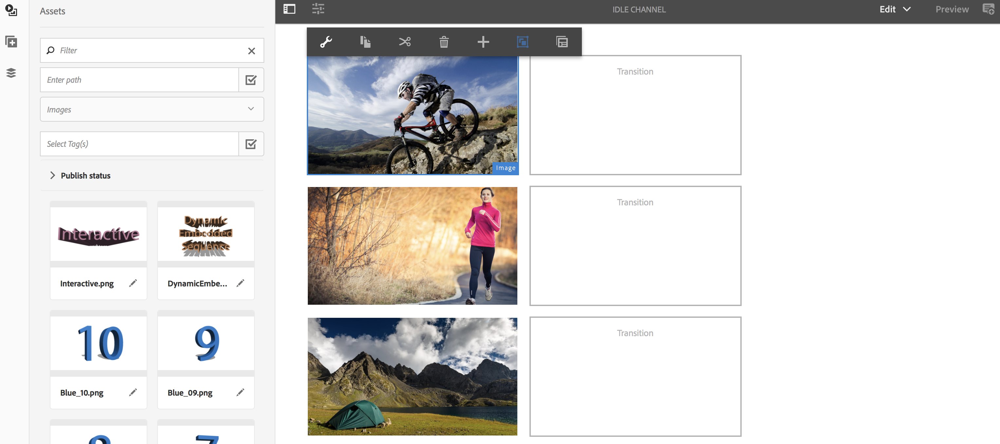

# 資產層計畫 {#asset-level-scheduling}

本節說明「渠道」中所使用資產的資產層級排程。

本節將介紹以下主題：

* OvervieW
* 使用資產層計畫
* 處理資產中的定期
* 多資產計畫

>[!CAUTION]
>
>只有在您已安裝AEM 6.3 Feature Pack 3或AEM 6.4 Screens Feature Pack 1時，才能使用此AEM Screens功能。
>
>若要存取此功能套件，您必須聯絡Adobe支援並要求存取權。 一旦您擁有權限，就可從「套件共用」下載。

## 概覽 {#overview}

***資產層級排程***，可讓您在播放器的本機時區中，針對排程的時段，在頻道中啟動特定資產。 這適用於影像、視訊、轉場、頁面和內嵌頻道（動態或靜態）。

*例如*，您只想在星期一和星期三的開心時段（下午2點到5點）顯示特殊促銷。

使用此功能，您不僅可以指定開始和結束日期和時間，還可以指定循環模式。

## 使用資產層計畫 {#using-asset-level-scheduling}

「資產層級排程」是在存取資產屬性 **時設定** 「啟動」標籤來完成。

請依照下列步驟執行資產層計畫：

1. 選取任何頻道，然後從 **動作列按一下** 「編輯」，以新增或編輯頻道中的內容。

   

   >[!NOTE]
   >
   >若要詳細瞭解如何
   >
   >* 建立項目，請參 [閱建立新項目](creating-a-screens-project.md)。
   >* 建立內容並新增至頻道，請參 [閱管理頻道](managing-channels.md)。

1. 按一 **下「編輯** 」以開啟渠道編輯器，並選取您要套用排程的資產。

   

1. 選取資產，然後按一下左上角的「 **設定** 」圖示，以開啟影像的屬性。

   按一下「 **啟動** 」標籤。

   

1. 您可以從「活動自」和「活動至」欄位中，從 **日期選擇器****指定日期** 。

   如果您選取「 **活動自** 」和「活動 **** 至」，則資產只會在該開始日期／時間和結束日期／時間之間顯示並循環顯示。

   

## 處理資產中的定期 {#handling-recurrence-in-assets}

您可依需求，將資產排程為依特定間隔每日、每週或每月重複。

假設您只想在週五下午1:00到10:00之間顯示影像。 您可以使用「啟動」標籤來設定資產所需的循環間隔。

### 新增資產的週期性事件 {#adding-a-recurring-event-for-your-asset}

1. 選取資產，然後按一下「設 **定** 」圖示以開啟屬性對話方塊。
1. 在輸入開始日期／時間和結束／日期時間後，您可以使用cron運算式或自然文字版本來指定您的定期排程。

   您可以搜尋Web中的免費cron運算式產生器，然後將cron運算式複製並貼入 **Schedule** ，您的資產就會在特定的日期和時間間隔顯示。

   *或者*，您也可以使用自然文字版本，例如週五6:00 *之後和18:00* 之前，來完成您的工作。 在「排程」中輸入 **文字** ，以顯示資產。

## 多資產排程 {#multi-asset-scheduling}

>[!CAUTION]
>
>只 **有在您已安裝AEM 6.3 Feature Pack 5或AEM 6.4 Feature Pack 3時，才能使用Multi** -Asset Scheduling功能。

***多資產排程*** (Multi-asset Scheduling)可讓使用者選取多個資產，並將播放排程套用至所有選取的資產。

### 必備條件 {#prerequisites}

若要針對您的資產使用多資產層級排程，請建立具有序列頻道的AEM畫面專案。 例如，下列使用案例會展示功能的實作：

* 建立標題為「MultiAssetDemo」的AEM Screens專 **案**
* 建立標題為 **MultiAssetChannel** 的頻道，並新增內容至頻道，如下圖所示

請依照下列步驟選取多個資產，並排程它們在AEM Screens專案中的顯示：

1. 選取 **MultiAssetChannel** ，然後按一 **下動作列中的「編輯** 」以開啟編輯器。

   

1. 從編輯器中選取多個資產，然後按一下「 **編輯啟動** 」（左上角的圖示）。

   

1. 從「元件啟動」對話 **方塊中，選取「從****活動** 」和「活動至 **」的日期** 和時間。 完成選擇計畫後，按一下複選標籤表徵圖。

   

1. 按一下重新整理，以檢查套用多資產排程的資產。

   >[!NOTE]
   >
   >對於具有多個資產排程的資產，右上角會顯示排程圖示。

   

