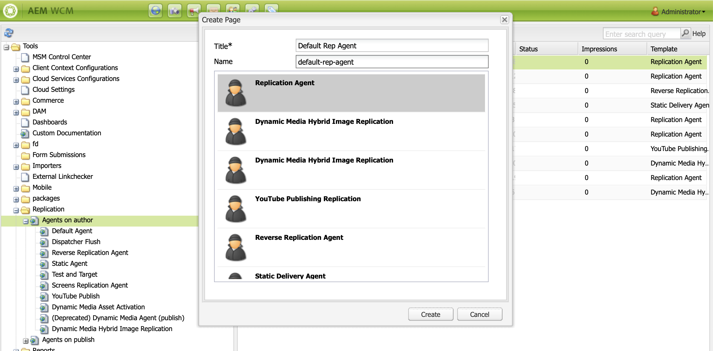

# 在AEM Screens中設定作者和Publish執行個體 {#configuring-author-and-publish-in-aem-screens}

本頁面主要說明下列主題：

* **設定Author和Publish執行個體**
* **設定Publish拓撲**
* **管理出版物：將內容更新從作者傳送到Publish到裝置**

## 先決條件 {#prerequisites}

在開始使用Author和Publish伺服器之前，您應該具備以下預先知識：

* **AEM拓撲**
* **建立和管理AEM Screens專案**
* **裝置註冊程式**

>[!NOTE]
>
>此AEM Screens功能僅在您已安裝AEM 6.4 Screens Feature Pack 2時可用。 若要存取此Feature Pack，請聯絡Adobe支援並要求存取權。 取得許可權後，即可從「封裝共用」下載。

>[!IMPORTANT]
>
>如果您想要搭配Dispatcher使用多個Publish執行個體，請更新Dispatcher。 請參閱[啟用粘性工作階段](dispatcher-configurations-aem-screens.md#enable-sticky-session)。

## 設定作者和Publish執行個體 {#configuring-author-and-publish-instances}

>[!NOTE]
>
>若要進一步瞭解Author和Publish架構概觀，以及如何在AEM Author執行個體上製作內容，然後轉送復寫至多個Publish執行個體，請參閱[Author和Publish架構概觀](author-publish-architecture-overview.md)。

以下章節說明如何在Author和Publish拓撲上設定復寫代理。

您可以設定一個簡單範例，在此範例中託管「作者」和兩個Publish例項：

* 作者> localhost：4502
* Publish 1 (pub1) > localhost：4503
* Publish 2 (pub2) > localhost：4504

## 在作者上設定復寫代理 {#setting-replication-agents}

若要建立復寫代理，請瞭解如何建立標準復寫代理。

Screens需要三個復寫代理：

1. **預設復寫代理程式&#x200B;***（指定為&#x200B;***標準復寫代理程式**）
1. **Screens復寫代理程式**
1. **反向復寫代理程式**

### 步驟1：建立預設復寫代理程式 {#step-creating-a-default-replication-agent}

請依照下列步驟建立預設的復寫代理程式：

1. 瀏覽至您的AEM執行個體>槌子圖示> **作業** > **設定**。

   

1. 從左側導覽樹狀結構按一下&#x200B;**復寫**。

   

1. 從&#x200B;**復寫**&#x200B;資料夾按一下作者&#x200B;**上的**&#x200B;代理程式，然後按一下&#x200B;**新增**&#x200B;以建立新的標準復寫代理程式。

   

1. 輸入&#x200B;**Title**&#x200B;和&#x200B;**Name**，以便建立復寫代理程式，然後按一下&#x200B;**建立**。

   

1. 用滑鼠右鍵按一下復寫代理程式，然後按一下[開啟]&#x200B;**以編輯設定。**

   

1. 按一下&#x200B;**編輯**。

1. 在&#x200B;**代理程式設定**&#x200B;對話方塊中，輸入詳細資料。

   >[!NOTE]
   >
   >使用者必須勾選&#x200B;**已啟用**，才能啟用復寫代理程式。 在預設、Screens和反向復寫代理上核取此選項。

   

1. 瀏覽至&#x200B;**傳輸**&#x200B;標籤，並輸入&#x200B;**URI**、**使用者**&#x200B;和&#x200B;**密碼**。

   

   >[!NOTE]
   >
   >您也可以複製和重新命名現有的預設復寫代理程式。

#### 建立標準復寫代理 {#creating-standard-replication-agents}

1. 為pub1建立標準復寫代理程式（應已設定立即可用的預設代理程式）。 例如 *`https://<hostname>:4503/bin/receive?sling:authRequestLogin=1`*
1. 建立pub2的標準復寫代理程式。 您可以複製pub1的復寫代理程式，並變更傳輸組態中的連線埠，更新要用於pub2的傳輸。 例如，*`https://<hostname>:4504/bin/receive?sling:authRequestLogin=1`*。

#### 建立Screens復寫代理 {#creating-screens-replication-agents}

1. 建立pub1的AEM Screens復寫代理程式。 現成可用的一個名為Screens復寫代理程式指向連線埠4503。 啟用它。
1. 建立pub2的AEM Screens復寫代理程式。 複製pub1的Screens復寫代理程式，並將pub2的連線埠變更為指向4504。

   >[!NOTE]
   >若要瞭解如何設定Screens復寫代理，請參閱[設定Screens復寫代理](https://experienceleague.adobe.com/en/docs/experience-manager-screens/user-guide/administering/configure-screens-replication)。

#### 建立Screens反向復寫代理 {#creating-screens-reverse-replication-agents}

1. 為pub1建立反向復寫代理程式。
1. 為pub2建立反向復寫代理程式。 您可以複製pub1的反向復寫代理程式，並透過變更傳輸組態中的連線埠來更新要用於pub2的傳輸。

## 設定Publish拓撲 {#setting-up-publish-topology}

### 步驟1：設定Apache Sling Oak型探索 {#step-configure-apache-sling-oak-based-discovery}

為拓撲中的所有Publish執行個體設定Apache Sling Oak型探索

對於每個Publish例項：

1. 瀏覽至`https://<host>:<port>/system/console/configMgr`
1. 按一下&#x200B;**Apache Sling Oak Discovery Service**&#x200B;設定。
1. 更新拓朴聯結器URL：新增以下所有參與Publish執行個體的URL：
   * `https://publish:4503/libs/sling/topology/connector`
   * `https://publish:4504/libs/sling/topology/connector`
1. **拓撲聯結器`Whitelist`清單**：調整為涵蓋所有Publish執行個體的IP或子網路。 請確定您`whitelist`沒有連線埠號碼的所有Publish執行個體的IP/主機名稱。

1. 啟用&#x200B;**自動停止本機回圈**

每個Publish例項的設定應該相同，而且自動停止本機回圈可防止無限回圈。

#### 步驟2：驗證Publish拓撲 {#step-verify-publish-topology}

針對任何Publish執行個體，導覽至`https://:/system/console/topology`。 您應該會在&#x200B;**傳出拓撲聯結器**&#x200B;下看到拓撲中顯示的每個Publish執行個體。

#### 步驟3：設定ActiveMQ Artemis叢集 {#step-setup-activemq-artemis-cluster}

此步驟可讓您為ActiveMQ Artemis叢集建立加密密碼。
拓撲中所有Publish執行個體的叢集使用者和密碼必須相同。 必須加密ActiveMQ Artemis設定的密碼。 因為每個執行個體都有自己的加密金鑰，所以必須使用「加密支援」來建立加密的密碼字串。 接著，加密密碼便可用於ActiveMQ的OSGi設定。

在每個Publish例項上：

1. 在OSGi主控台中，導覽至&#x200B;**MAIN** > **Crypto支援** (`https://<host>:<port>/system/console/crypto`)。
1. 在&#x200B;**純文字**&#x200B;中輸入想要的純文字密碼（所有執行個體都相同）
1. 按一下&#x200B;**Protect**。
1. 將值&#x200B;**Protected Text**&#x200B;複製到記事本或文字編輯器。 此值可用於ActiveMQ的OSGi設定。

由於每個Publish執行個體預設都有唯一的加密編譯金鑰，因此請在每個pub執行個體執行此步驟，並儲存唯一的金鑰以供下一個設定使用。

>[!NOTE]
>
>密碼的開頭和結尾應該要有大括弧。 例如：
>`{1ec346330f1c26b5c48255084c3b7272a5e85260322edd59119828d1fa0a610e}`

#### 步驟4：啟動ActiveMQ Artemis叢集 {#step-activate-activemq-artemis-cluster}

在每個發佈執行個體上：

1. 瀏覽至OSGi設定管理員`https://<host>:<port>/system/console/configMgr`
1. 按一下&#x200B;**Apache ActiveMQ Artemis JMS Provider**&#x200B;設定
1. 更新下列專案：

   * ***叢集密碼***：針對個別執行個體使用先前步驟的加密值
   * ***主題***： `{name: 'commands', address: 'com.adobe.cq.screens.commands', maxConsumers: 50}`

#### 驗證ActiveMQ Artemis叢集 {#verify-activemq-artemis-cluster}

在每個Publish執行個體上依照下列步驟操作：

1. 導覽至OSGi主控台> Main > ActiveMQ Artemis `https://localhost:4505/system/console/mq`。
1. 在「叢集資訊>拓撲>節點=2，成員=2」下驗證並檢查以檢視其他執行處理的連線埠。
1. 傳送測試訊息（畫面頂端的「代理人資訊」下方）
1. 在欄位中輸入下列變更：

   1. **目的地**： /com.adobe.cq.screens/devTestTopic
   1. **文字**：您好！
   1. 檢視每個執行個體的`error.log`，以便檢視訊息是否已在叢集中傳送及接收。

>[!NOTE]
>
>在上一步中儲存設定後，導覽至OSGi控制檯可能需要幾秒鐘的時間。 您也可以檢查error.log以取得詳細資料。

例如，下列影像會顯示在ActiveMQ Artemis伺服器的成功設定上。

如果您沒有從&#x200B;*/system/console/mq*&#x200B;看到下列組態，請瀏覽至&#x200B;*/system/console/mq*，然後按一下[重新啟動]&#x200B;**以重新啟動代理人。**

#### 移除反向連結標題要求 {#remove-referrer-header-requirement}

請依照每個Publish例項中的步驟操作：

1. 導覽至&#x200B;**OSGi主控台** > **組態管理員**
1. 按一下&#x200B;**Apache Sling反向連結篩選器**
1. 更新設定並&#x200B;**檢查允許空白**

### 設定作者和Publish例項 {#configuring-author-and-publish-instance}

設定發佈拓朴後，請設定Author和Publish例項以檢視實作的實際結果：

>[!NOTE]
>
>**必備條件**
>
>若要開始使用此範例，請建立AEM Screens專案，接著在您的專案中建立位置、顯示和頻道。 新增內容至您的頻道，並將頻道指派給顯示區。

#### 步驟1：啟動AEM Screens播放器（裝置）

1. 啟動個別的瀏覽器視窗。
1. 使用&#x200B;*網頁瀏覽器* （亦即`https://localhost:4502/content/mobileapps/cq-screens-player/firmware.html`）前往Screens播放器，或啟動AEM Screens應用程式。 開啟裝置時，請注意裝置狀態為「已取消註冊」。

>[!NOTE]
>
>您可以使用下載的AEM Screens應用程式或網頁瀏覽器開啟AEM Screens Player。

#### 步驟2：在作者上註冊裝置 {#step-registering-a-device-on-author}

1. 前往`https://localhost:4502/screens.html/content/screens/we-retail`或按一下您的專案，然後導覽至「裝置>裝置管理員」。
1. 按一下&#x200B;**註冊裝置**。
1. 按一下&#x200B;**裝置註冊**。
1. 按一下您要註冊的裝置，然後按一下&#x200B;**註冊裝置**。
1. 驗證註冊代碼，然後按一下[驗證]。**&#x200B;**
1. 輸入裝置的標題，然後按一下&#x200B;**註冊**。

#### 步驟3：指派要顯示的裝置 {#step-assigning-the-device-to-display}

1. 在上一步的對話方塊中，按一下&#x200B;**指派顯示區**。
1. 從&#x200B;**位置**&#x200B;資料夾按一下您頻道的顯示路徑。
1. 按一下&#x200B;**指派**。
1. 按一下&#x200B;**完成**&#x200B;以完成程式，現在裝置已指派。

檢查您的播放器，並注意您在頻道中新增的內容。

#### 步驟4：將裝置設定發佈至Publish執行個體 {#step-publishing-device-configuration-to-publish-instances}

**正在驗證裝置**

請依照下列步驟複製裝置使用者：

1. 瀏覽至使用者管理頁面。 例如，`https://localhost:4502/useradmin`。
1. 搜尋&#x200B;**`screens-devices-master`**&#x200B;群組。
1. 以滑鼠右鍵按一下群組，然後按一下&#x200B;**啟動**。

>[!CAUTION]
>
>請勿啟用author-publish-screens-service，因為它是作者工作使用的系統使用者。

您也可以從「裝置管理主控台」啟動裝置。 請遵循下列步驟：

1. 導覽至您的Screens專案> **裝置**。
1. 按一下動作列中的&#x200B;**裝置管理員**。
1. 按一下裝置，然後按一下動作列中的&#x200B;**啟動**，如下圖所示。

>[!NOTE]
>
>或者，在啟動裝置後，您也可以編輯或更新伺服器URL。 在動作列中，按一下&#x200B;**編輯伺服器URL**，如下圖所示。 您的變更會傳播至AEM Screens Player。

### 發佈檢查清單 {#publishing-check-list}

下列幾點為「發佈檢查」清單的摘要：

* *Screens裝置使用者* — 此資訊會儲存為AEM使用者，並可從&#x200B;**工具** > **安全性** > **使用者**&#x200B;啟動。 使用者會以含有長序列化字串的「畫面」為前置詞。

* *專案* - AEM Screens專案。
* *位置* — 裝置連線的位置。
* *管道* — 此位置顯示的一或多個管道。
* *排程* — 如果使用排程，請確定此排程已發佈。
* *位置、排程和頻道資料夾* — 如果資料夾中有對應的資源。

請依照下列步驟操作，確認編寫和發佈行為：

1. 更新Author例項上的部分管道內容。
1. 執行&#x200B;**管理出版物**&#x200B;以將新變更發佈到所有Publish執行個體。
1. 按&#x200B;**啟動**&#x200B;從&#x200B;**裝置管理員**&#x200B;啟動裝置。
1. 從作者執行個體URL選取&#x200B;**編輯URL**，使其成為其中一個發佈執行個體URL。
1. 驗證AEM Screens Player上是否顯示更新的頻道內容。
1. 使用不同的Publish例項重複這些步驟。

#### 步驟5：在管理面板中將裝置指向Publish執行個體 {#step-pointing-the-device-to-publish-instance-in-the-admin-panel}

1. 從Screens播放器檢視管理員UI，按一下左上角，您就能在觸控式AEM Screens播放器上或使用滑鼠開啟「管理員」功能表。
1. 從側面板按一下&#x200B;**組態**&#x200B;選項。
1. 在&#x200B;**伺服器**&#x200B;中將作者執行個體變更為Publish執行個體。

在AEM Screens播放器中檢視變更。

或者，您也可以使用下列步驟，從裝置管理主控台更新/編輯伺服器URL：

1. 導覽至您的AEM Screens專案，然後按一下「**裝置**」資料夾。
1. 按一下動作列中的&#x200B;**裝置管理員**。
1. 按一下裝置，然後在動作列中按一下&#x200B;**編輯伺服器URL**，如下圖所示。 您的變更會傳播至AEM Screens Player。

**管理出版物**&#x200B;功能可讓您從作者將內容更新傳送到Publish到裝置。 您可以為整個AEM Screens專案或僅限其中一個管道、位置、裝置、應用程式或排程發佈/取消發佈內容。 若要深入瞭解此功能，請參閱[隨選內容更新](on-demand-content.md)。

## 疑難排解提示 {#troubleshoot-tips}

請依照以下章節取得與Author/Publish設定相關的常見問題解答。

### 如何在初始註冊和指派後新增從https到http的重新導向？ {#add-redirect}

**解決方案**
將[啟用] `Proxy/Load Balancer Connection in the Jetty configuration`設定為`true`。

### 如何更新`/content/dam/projects/<project>`外部資產的離線內容和播放器下載問題？{#update-offline-content}

**解決方案**
如果您想要更嚴格的限制，請針對所有`/content/dam`或您要使用的特定資產，授予bulk-offline-update-screens-service使用者和`screens-devices-master`群組的讀取許可權。

### 如何解決Screens復寫代理程式錯誤？ {#replication-agent}

**解決方案**
請確定您尚未在代理程式設定中勾選「使用反向復寫」選項。 Screens復寫代理程式無法當作反向復寫代理程式使用，此功能的範圍是將裝置命令從Author轉送至Publish。