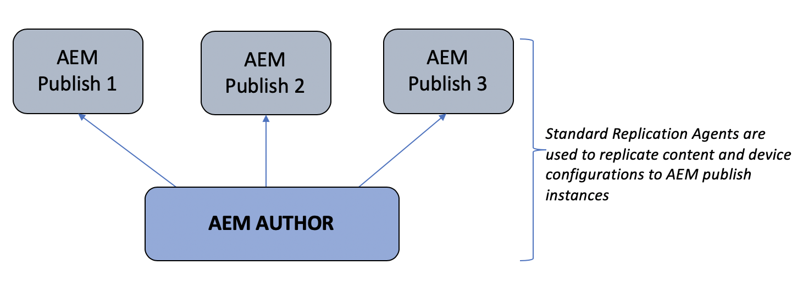

# 製作與發佈架構概覽 {#author-and-publish-architectural-overview}

本頁面主要說明下列主題：

* **發佈伺服器簡介**
* **架構概述**
* **註冊程式**

## 先決條件 {#prerequisites}

開始使用作者伺服器和發佈伺服器之前，您應具備以下預先知識：

* **AEM拓撲**
* **建立和管理AEM Screens專案**
* **裝置註冊程式**

>[!NOTE]
>
>此AEM Screens功能僅在您已安裝AEM 6.4 Screens Feature Pack 2時可用。 若要存取此Feature Pack，請聯絡Adobe支援並要求存取權。 取得許可權後，請從「封裝共用」下載。

## 簡介 {#introduction}

AEM Screens架構類似傳統的AEM Sites架構。 內容會在AEM編寫執行個體上編寫，然後轉送復寫到多個發佈執行個體。 AEM Screens上的裝置現在可以透過負載平衡器連線至AEM發佈陣列。 可以新增多個AEM發佈執行個體以繼續擴充發佈陣列。

*例如*，AEM Screens內容作者會在編寫系統上為特定裝置發出命令。 該裝置已設定為與發佈伺服器陣列或AEM Screens內容作者互動，後者會取得關於已設定為與發佈伺服器陣列互動之裝置的資訊。

下圖說明作者環境和發佈環境。

## 架構設計 {#architectural-design}

有五個架構元件有助於此解決方案：

* ***復寫內容*** 從作者發佈到發佈以供裝置顯示

* ***反向*** 將二進位內容從發佈環境（從裝置接收）複製到編寫環境。
* ***傳送中*** 透過特定REST API從作者到發佈的命令。
* ***傳訊*** 在發佈執行個體之間同步裝置資訊更新和命令。
* ***輪詢*** 發佈執行個體的作者，透過特定REST API取得裝置資訊。

### 內容和設定的復寫（轉送）  {#replication-forward-of-content-and-configurations}

標準復寫代理程式用於復寫AEM Screens通道內容、位置設定和裝置設定。 這可讓作者更新管道內容，並在發佈管道更新之前選擇性地進行某種核准工作流程。 必須為發佈伺服器陣列中的每個發佈執行個體建立復寫代理程式。

下圖說明了復製程式：

>[!NOTE]
>
>必須為發佈伺服器陣列中的每個發佈執行個體建立復寫代理程式。

### Screens復寫代理和命令  {#screens-replication-agents-and-commands}

自訂Screens會建立特定的復寫代理，以將命令從Author例項傳送至AEM Screens裝置。 AEM Publish執行個體可作為中介將這些命令轉送至裝置。

這可讓作者繼續管理裝置，例如，傳送裝置更新，以及從作者環境擷取熒幕擷圖。 AEM Screens復寫代理程式具有自訂傳輸設定，例如標準復寫代理。

### 發佈執行個體之間的傳訊  {#messaging-between-publish-instances}

通常命令只適用於傳送至裝置。 但在負載平衡的發佈架構中，未知裝置要連線的發佈執行個體。

因此，作者執行個體會將訊息傳送給所有發佈執行個體。 不過，之後只應將單一訊息轉送至裝置。 為確保傳訊功能正確無誤，發佈執行個體之間必須通訊。 這是使用取得的 *Apache ActiveMQ Artemis*. 每個發佈執行個體都會使用Oak型Sling探索服務放在鬆散耦合的拓撲中，且ActiveMQ的設定方式讓每個發佈執行個體可以通訊並建立單一訊息佇列。 AEM Screens裝置透過負載平衡器輪詢AEM發佈陣列，並從佇列頂端挑選命令。

### 反向複寫 {#reverse-replication}

通常，在命令之後，會從Screens裝置將某種回應轉送到Author例項。 若要實現此AEM ***反向復寫*** 已使用。

* 為每個發佈執行個體建立反向復寫代理，類似於標準復寫代理和AEM Screens復寫代理。
* 工作流程啟動器設定會監聽在AEM發佈執行個體上修改的節點，然後觸發工作流程將裝置的回應放入AEM發佈執行個體的寄件匣中。
* 此內容中的反向復寫僅適用於裝置提供的二進位資料（例如記錄檔和熒幕擷取畫面）。 非二進位資料會透過輪詢擷取。
* 從AEM製作執行個體反向復寫輪詢會擷取回應，並將其儲存至製作執行個體。

### 輪詢發佈執行個體  {#polling-of-publish-instances}

編寫執行個體必須能夠輪詢裝置以取得心率並瞭解連線裝置的健康狀態。

裝置ping負載平衡器並路由至發佈執行個體。 然後AEM發佈執行個體會透過提供的Publish API公開裝置的狀態@ **api/screens-dcc/devices/static** 適用於所有使用中裝置和 **api/screens-dcc/devices/&lt;device_id>/status.json** 適用於單一裝置。

製作執行個體輪詢所有發佈執行個體，並將裝置狀態回應合併為單一狀態。 輪詢作者的排程工作為 `com.adobe.cq.screens.impl.jobs.DistributedDevicesStatiUpdateJob` 並且可以根據cron運算式進行設定。

## 註冊 {#registration}

註冊會繼續源自AEM編寫執行個體。 AEM Screens裝置指向作者例項且註冊完成。

在AEM製作環境中註冊裝置後，裝置設定和管道/排程指派會複製到AEM發佈執行個體。 AEM Screens裝置設定接著會更新，以指向AEM發佈伺服器陣列前的負載平衡器。 此為一次性設定。 在Screens裝置成功連線至發佈環境後，可以繼續接收源自製作環境的命令。 不需要直接將AEM Screens裝置連線至AEM製作環境。

### 後續步驟 {#the-next-steps}

若您瞭解AEM Screens中作者與發佈設定的架構設計，請參閱 [設定AEM Screens的作者和發佈](author-and-publish.md) 以取得更多詳細資料。
