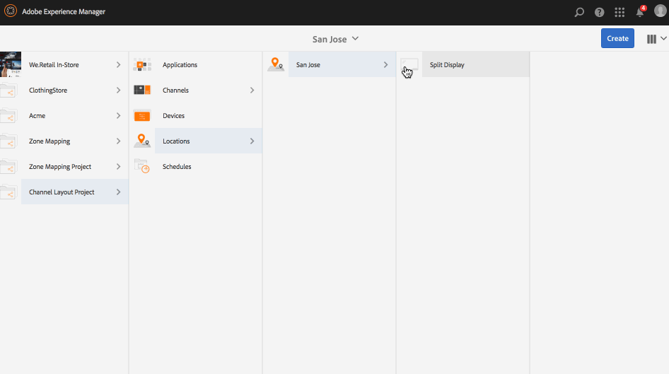

# 頻道版面編輯器 {#channel-layout-editor}

***頻道版面編輯器*** ，可讓您建立多區域內容，並使用視訊、影像和文字等各種資產，這些資產可以在單一螢幕中以不同的方式組合。 您可以拉進影像、視訊和文字，讓所有內容融為一體，創造直覺式和互動式數位體驗。

根據專案需求，有時您需要一個通道中的多個區域，並將它們作為一個完整單元進行編輯。 例如，產品序列，其相關社交媒體摘要會在單一頻道的三個獨立區域中執行。

## 概覽 {#overview}

在建立渠道時，您可以使用不同的範本在渠道中建立區域。 您可以新增影像、視訊或內嵌頻道，以根據專案需求運用內容。

### 使用案例說明 {#use-case-description}

以下使用案例說明如何在渠道中建立多區域。

1. ***建立畫面專案***

   1. 依序選取Adobe Experience Manager連結（左上）和「畫 **面」**。 或者，您也可以直接前往： `http://localhost:4502/screens.html/content/screens`。
   1. 按一 **下「建立** 」以建立新的「畫面」專案。
   1. 從「建 **立畫面** 」專案精靈中選 **取「畫面」** ，然後按一下「 **下一步**」。
   1. 將標題輸入為 **Channel Layout Project** ，然後按 **一下Create**。
   

1. ***建立渠道***

   1. 導覽至 **渠道版面專案**。
   1. 從動 **作列按一下** 「建立」。 嚮導將開啟。
   1. 選擇「 **1x2 Split Screen Channel（1x2分割畫面頻道）」** ，然後按「 **Next（下一步）**」。
   1. 將標題輸 **入為水準分割(Split horizontal** ) **，然後按一下「** 建立 ****」。
   

1. ***新增內容至您的頻道***

   1. 導覽至您建 **立的渠道配置專案** ，然後選取渠道(**分割渠道**)。
   1. 從操 **作欄按一下「編輯** 」,「分割色版」的編輯 **器隨即開啟** 。
   1. 按一下切換動作列左側側面板的圖示，以開啟資產和元件。 拖放您要新增至渠道的元件。
   

   >[!NOTE]
   >
   >例如，編輯器中會新增下列兩張影像至頻道。

   

1. ***建立位置***

   1. 導覽至您要建立顯示畫面的「位置」檔案夾(**頻道版面專案**—&gt; **位置**)。
   1. 從動 **作列按一下** 「建立」。
   1. 從「創 **建」嚮導中選** 擇「位置 **」，然後按一下「** 下一步 ****」。
   1. 輸 **入** San Jose位置 **的Title**。
   1. 按一下&#x200B;**「建立」**。
   

1. ***建立新顯示***

   1. 導覽至您要建立顯示畫面的位置(**Acme** —&gt; **Locations** —&gt; **San Jose**)，然後選取 **** San JoseChan。
   1. 從動 **作列按一下** 「建立」。 從「創 **建** 」嚮導中選擇「顯 **示」** ，然後按一下「 **下一步**」。
   1. 輸入 **顯示位置** (將標題輸入為分割 **顯示)**。
   1. 在「顯 **示** 」標籤下，選擇「版面」的詳細資訊。 選擇「 **Resolution** (解析 **度)」為「Full HD**（全高清）」。 選擇「 **水準設備數** 1」和「垂 **直設備數****1」**。
   1. 按一下&#x200B;**「建立」**。
   

1. ***指派渠道***

   1. 從Channel Layout Project **—&gt;** Locations **—&gt;** San Jose **—&gt;****** Split Display Logations導覽至顯示。
   1. 選取 **分割顯示** ，並從動作列點選／按 **一下「指定頻道** 」，或
   1. 按一 **下「控制面板** 」，然後從「已指派的頻道與排程」面板中，選取右上方的「 **指派頻道」(Assign Channel****** )。 **「渠道分配** 」對話框開啟。
   1. 將渠道角 **色輸入為** 「分 **割」**。
   1. 選擇「 **參照渠道** 」(Reference Channel)。 在渠道中選擇渠道文&#x200B;**件夾路徑(Channel Layout Project** —&gt; **Channels** —&gt; **水準分割**)。
   1. 選擇此 **渠道的** 「優先順序」 **為1**。
   1. 選擇「支 **援的事件** 」作 **為「初始載** 入」和「 **閒置」畫面**。
   1. 按一下&#x200B;**「儲存」**。
   

1. ***註冊和分配設備***

   1. 啟動個別的瀏覽器視窗。 使用網頁瀏覽器前往「畫面播放器」，或啟動AEM Screens應用程式。
   1. 當您開啟裝置時，會注意到裝置的狀態為未註冊。 從AEM儀表板，導覽至「 **Channel Layout Project** —&gt;裝 **置」**。
   1. 從動 **作列按一下「裝置管理器** 」。
   1. 按一 **下「裝置註冊** 」，您就會看到擱置中的裝置。 選擇要註冊的設備，然後按一下「 **Register Device（註冊設備）**」。
   1. 您必須從網頁瀏覽器或AEM Screens播放器驗證程式碼，以驗證程式碼。 按一下 **驗證** ，導覽至「裝 **置註冊** 」畫面。
   1. 輸入Title as **NewD** ，然後單 **擊Register** （註冊），設備將註冊。
   1. 按一 **下「指派顯示** 」，移至您指派裝置至顯示畫面的下一個步驟。
   1. 按一下「指派裝置」，並選取頻道()的顯示路徑為/content/screens/Test_Project/Locations/TestLocation/TestDisplay。 按一下 **指派**。
   1. 按一下 **完成** ，完成該過程，現在已分配設備。
   

#### 在AEM Screens Player中檢視內容 {#viewing-content-in-aem-screens-player}

載入您的AEM Screens Player或使用網頁瀏覽器。 您會注意到螢幕播放器中顯示的頻道內容。 內容會顯示為1x2分割畫面頻道範本。

### 推理 {#inference}

在建立渠道時使用可用範本，可讓您在不同區域中運用和顯示內容。 上例顯示2x2範本的使用案例。

以下影像顯示可使用不同範本取得的版面。
