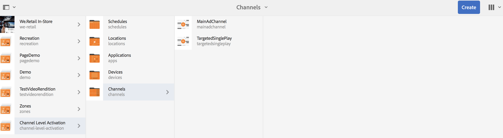

# 通道級激活 {#channel-level-activation-single-event-playback}

本頁面說明「管道」中所用資產的管道層級啟動。

本節將介紹下列主題：

* 概覽
* 啟用時間
* 將管道層級啟動設為單一事件播放
* 處理管道中資產的週期
   * 日劃分
   * 周分段
   * 月分
   * 零件組合
* 將管道層級啟動設為單一事件播放

## 概覽 {#overview}

***通道級*** 別活動允許通道在特定設定的調度後進行切換。在設定排程後，單一事件管道會取代主要管道，並在特定時間播放，直到主要管道再次播放其內容為止。

下列範例提供解決方案，著重於下列關鍵字：

* 全局序列的&#x200B;***主序列通道***
* a ***單事件通道***&#x200B;在設定時間只運行一次
* 主序列頻道內發生的單一播放事件的&#x200B;***設定排程和優先順序***

## 啟用時間 {#using-channel-level-activation}

下節說明如何為AEM Screens專案在管道內建立單一事件播放。

### 必備條件 {#prerequisites}

開始實作此功能之前，請確定您具備下列準備就緒條件，可開始實作管道層級啟動：

* 建立AEM Screens專案，在此範例中， **Channel Level Activation**

* 在&#x200B;**Channels**&#x200B;資料夾下，將通道建立為&#x200B;**MainAdChannel**

* 在&#x200B;**Channels**&#x200B;資料夾下，將另一個通道建立為&#x200B;**TargetedSinglePlay**

* 將相關資產新增至這兩個管道

下圖顯示&#x200B;**Channels**&#x200B;資料夾中&#x200B;**MainAdChannel**&#x200B;和&#x200B;**TargetedSinglePlay**&#x200B;頻道的&#x200B;**頻道激活**&#x200B;專案。

>[!NOTE]
>
>如需如何建立專案及如何建立序列管道的詳細資訊，請參閱下列資源：
>
>* [建立和管理專案](creating-a-screens-project.md)

* [管理管道](managing-channels.md)

### 實施 {#implementation}

在AEM Screens專案中實作管道層級啟用包含三項主要工作：

1. **設定專案分類法，包括管道、位置和顯示**
1. **為顯示指定通道**
1. **設定排程和優先順序**

請依照下列步驟來實作功能：

1. **建立位置**

   導覽至AEM Screens專案中的&#x200B;**Locations**&#x200B;資料夾，並建立&#x200B;**Region**&#x200B;的位置。

   

   >[!NOTE]
   要了解如何建立位置，請參閱&#x200B;**[建立和管理位置](managing-locations.md)**。

1. **在位置下建立顯示**

   1. 導覽至「**通道層激活** > **位置** > **地區**」。
   1. 選擇&#x200B;**Region**，然後從操作欄按一下&#x200B;**+ Create**。
   1. 從嚮導中選擇&#x200B;**Display**&#x200B;並建立標題為&#x200B;**RegionDisplay的顯示。**

   

1. **指定要顯示的管道**

   對於&#x200B;**MainAdChannel:**

   1. 導航至&#x200B;**通道級激活** > **位置** > **區域** > **RegionDisplay**，然後按一下操作欄中的&#x200B;**分配通道**。
   1. **管道** 分配對話框開啟。
   1. 選擇&#x200B;**引用通道**。 依路徑.
   1. 選擇&#x200B;**通道路徑**&#x200B;作為&#x200B;**通道級激活** —> ***通道*** —> ***MainAdChannel***。
   1. **通道角色**&#x200B;填入為&#x200B;**mainadchannel**。
   1. 選擇&#x200B;**優先順序**&#x200B;作為&#x200B;**1**。
   1. 選擇&#x200B;**支援的事件**&#x200B;作為&#x200B;**初始載入**&#x200B;和&#x200B;**空閒螢幕**。
   1. 按一下「**儲存**」。

   

   >[!NOTE]
   您也可以從顯示控制面板指派通道，方法是導覽至&#x200B;**通道層激活** —> **位置** —> **地區** —> **RegionDisplay**，然後從動作列按一下&#x200B;**控制面板**。 從&#x200B;**「已分配通道和計畫」**&#x200B;面板按一下「**+分配通道**」。

   同樣地，為display**指派channel **TargetedSinglePlay**:

   1. 導航至&#x200B;**通道級激活** —> **位置** —> **區域** —> **RegionDisplay**，然後按一下操作欄中的&#x200B;**分配通道**。
   1. **管道** 分配對話框開啟。
   1. 選擇&#x200B;**引用通道**。 依路徑.
   1. 選擇&#x200B;**通道路徑**&#x200B;作為&#x200B;**通道級激活*** —> ***通道*** —> ***TargetedSinglePlay***。
   1. **通道角色**&#x200B;填入為&#x200B;**targetedsingleplay**。
   1. 將&#x200B;**優先順序**&#x200B;設定為&#x200B;**2**。
   1. 選擇&#x200B;**支援的事件**&#x200B;作為&#x200B;**初始載入**、**空閒螢幕**&#x200B;和&#x200B;**計時器**, *如下圖所示。
   1. 選擇&#x200B;**作用中日期（從**&#x200B;開始至2018年11月27日11:59 pm）和&#x200B;**作用中日期(從2018年11月28日上午12:05開始至**&#x200B;作用中日期。
   1. 按一下「**儲存**」。

   >[!CAUTION]
   您必須為&#x200B;**TargetedSinglePlay**&#x200B;頻道設定高於&#x200B;**MainAdSegment**&#x200B;頻道的優先順序。

   

   >[!NOTE]
   若要選擇當天，您必須選取隔天，並手動將日期編輯為當天，但稍後才能編輯。 這會限制使用者選取過去的日期。 請參閱以下範例：

   

## 查看結果 {#viewing-the-results}

設定好頻道和顯示完成後，請啟動AEM Screens播放器以檢視內容。

播放器會顯示&#x200B;**MainAdChannel**&#x200B;的內容，並在晚上11:59（如排程設定）準確顯示， **TargetedSinglePlay**&#x200B;頻道會顯示其內容，直到凌晨12:05，然後&#x200B;**MainAdChannel**&#x200B;會繼續播放其內容。

>[!NOTE]
若要了解AEM Screen Player，請參閱下列資源：
[AEM Screens播放器下載](https://download.macromedia.com/screens/)
[使用AEM Screens Player](working-with-screens-player.md)

## 處理管道中資產的週期 {#handling-recurrence-in-assets}

您可以視需求，將管道中的資產排程為每日、每週或每月重複執行特定間隔。

假設您只想在週五下午1:00至晚上10:00顯示管道的內容。 您可以使用&#x200B;**Activation**&#x200B;標籤來設定資產所需的循環間隔。

### 日劃分 {#day-parting}

1. 選取通道，然後按一下動作列中的&#x200B;**控制面板**&#x200B;以開啟通道控制面板。

1. 在從&#x200B;**通道分配**&#x200B;對話框輸入開始日期/時間和結束/日期時間後，可以使用表達式或自然文本版本來指定重複計畫。

   >[!NOTE]
   您可以略過或包含&#x200B;**Active from**&#x200B;和&#x200B;**Active Until**&#x200B;欄位，並根據您的需求將運算式新增至「排程」欄位。

1. 在&#x200B;**Schedule**&#x200B;中輸入運算式，您的資產將針對特定的日期和時間間隔顯示。

#### 日劃分的運算式範例 {#example-one}

下表總結了一些示例表達式，在為顯示器分配通道時，可將這些表達式添加到調度中。

| **運算式** | **解釋** |
|---|---|
| 早上8點 | 管道中的資產每天上午8:00之前播放 |
| 下午2:00後 | 頻道中的資產每天下午2:00後播放 |
| 12:15後和12:45前 | 頻道中的資產每天中午12:15後播放30分鐘 |
| 12:15之前也是12:45之後 | 頻道中的資產每天中午12:15之前播放，然後在中午12:45之後播放 |
| 週一、週二、週三或週三 | 從星期一到星期三，資產會在管道中播放資產 |
| 1月1日後2點也是1月2日，也是1月3日前3點 | 頻道中的資產會在1月1日下午2點後開始播放，1月2日一整天會持續播放，直到1月3日凌晨3點 |
| 1月1-2日（1月1-2日）晚上2:00，也是1月2-3日(3:00)前 | channel中的資產會在1月1日下午2:00後開始播放器，持續播放至1月2日凌晨3:00，然後在1月2日下午2:00再次開始，持續播放至1月3日凌晨3:00 |

>[!NOTE]
您也可以使用&#x200B;_軍事時間_&#x200B;標籤法（即14:00），而非&#x200B;*am/pm*&#x200B;標籤法（即下午2:00）。

### 周分段 {#week-parting}

1. 選取通道，然後按一下動作列中的&#x200B;**控制面板**&#x200B;以開啟通道控制面板。

1. 在從&#x200B;**通道分配**&#x200B;對話框輸入開始日期/時間和結束/日期時間後，可以使用表達式或自然文本版本來指定重複計畫。

   >[!NOTE]
   您可以略過或包含&#x200B;**Active from**&#x200B;和&#x200B;**Active Until**&#x200B;欄位，並根據您的需求將運算式新增至「排程」欄位。

1. 在&#x200B;**Schedule**&#x200B;中輸入運算式，您的資產將針對特定的日期和時間間隔顯示。

#### WeekParting的運算式範例 {#example-two}

下表總結了一些示例表達式，在為顯示器分配通道時，可將這些表達式添加到調度中。

| **運算式** | **解釋** |
|---|---|
| 週一、週二、週三或週三 | 從星期一到星期三，資產會在管道中播放資產 |
| 早上8點 | 管道中的資產每天上午8:00之前播放 |
| 下午2:00後 | 頻道中的資產每天下午2:00後播放 |
| 12:15後和12:45前 | 頻道中的資產每天中午12:15後播放30分鐘 |
| 12:15之前也是12:45之後 | 頻道每天中午12:15之前播放，然後在中午12:45之後播放 |

>[!NOTE]
您也可以使用&#x200B;_軍事時間_&#x200B;標籤法（即14:00），而非&#x200B;*am/pm*&#x200B;標籤法（即下午2:00）。

### 月分 {#month-parting}

1. 選取通道，然後按一下動作列中的&#x200B;**控制面板**&#x200B;以開啟通道控制面板。

1. 在從&#x200B;**通道分配**&#x200B;對話框輸入開始日期/時間和結束/日期時間後，可以使用表達式或自然文本版本來指定重複計畫。

   >[!NOTE]
   您可以略過或包含&#x200B;**Active from**&#x200B;和&#x200B;**Active Until**&#x200B;欄位，並根據您的需求將運算式新增至「排程」欄位。

1. 在&#x200B;**Schedule**&#x200B;中輸入運算式，您的資產將針對特定的日期和時間間隔顯示。

#### MonthParting的運算式範例 {#example-three}

下表總結了一些示例表達式，在為顯示器分配通道時，可將這些表達式添加到調度中。

| **運算式** | **解釋** |
|---|---|
| 2月、5月、8月、11月 | 資產在2月、5月、8月、11月於頻道播放 |

>[!NOTE]
定義一週中的天數和月數時，您可以同時使用簡寫和全名附註，例如週一/週一和一月/一月。

>[!NOTE]
您也可以使用&#x200B;_軍事時間_&#x200B;標籤法（即14:00），而非&#x200B;*am/pm*&#x200B;標籤法（即下午2:00）。

### 零件組合 {#combined-parting}

1. 選取通道，然後按一下動作列中的&#x200B;**控制面板**&#x200B;以開啟通道控制面板。

1. 在從&#x200B;**通道分配**&#x200B;對話框輸入開始日期/時間和結束/日期時間後，可以使用表達式或自然文本版本來指定重複計畫。

   >[!NOTE]
   您可以略過或包含&#x200B;**Active from**&#x200B;和&#x200B;**Active Until**&#x200B;欄位，並根據您的需求將運算式新增至「排程」欄位。

1. 在&#x200B;**Schedule**&#x200B;中輸入運算式，您的資產將針對特定的日期和時間間隔顯示。

#### 部件組合的示例表達式 {#example-four}

下表總結了一些示例表達式，在為顯示器分配通道時，可將這些表達式添加到調度中。

| **運算式** | **解釋** |
|---|---|
| 週一6點多到18點之前，1月3日 | 從1月到3月底的星期一到星期三，資產在頻道中播放 |
| 1月1日後2點也是1月2日，也是1月3日前3點 | 頻道中的資產會在1月1日下午2點後開始播放，1月2日一整天會持續播放，直到1月3日凌晨3點 |
| 1月1-2日（1月1-2日）晚上2:00，也是1月2-3日(3:00)前 | channel中的資產會在1月1日下午2:00後開始播放器，持續播放至1月2日凌晨3:00，然後在1月2日下午2:00再次開始，持續播放至1月3日凌晨3:00 |

>[!NOTE]
定義一週中的天數和月數時，您可以同時使用簡寫和全名附註，例如週一/週一和一月/一月。  此外，您也可以使用&#x200B;_軍事時間_&#x200B;標籤法（即14:00），而非&#x200B;*am/pm*&#x200B;標籤法（即下午2:00）。
