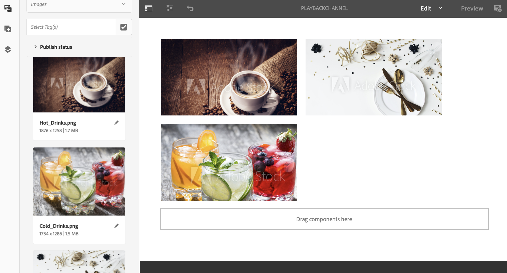

# 頻道層級大量影像播放持續時間 {#channel-level-bulk-image-playback-duration}

## 概觀 {#overview}

>[!IMPORTANT]
>此內容對AEM內部部署/AMS （AEM 6.5LTS和AEM 6.5）有效。 如需AEM as a Cloud Service Screens內容，請參閱[AEM as a Cloud Service指南](https://experienceleague.adobe.com/zh-hant/docs/experience-manager-cloud-service/content/screens-as-cloud-service/overview/introduction)。

當您建立序列色版並在其中新增影像時，根據預設，所有影像都會採用色版等級設定中定義的播放持續時間。 任何個別影像仍可覆寫預設值，並具有不同的播放持續時間。 此功能可透過編輯特定影像元件的播放持續時間來完成。

### 先決條件 {#prerequisites}

在開始實作此功能之前，請確定您已設定專案作為開始實作此功能的先決條件。 例如，

1. 建立AEM Screens專案範例，**ChannelLevelPlayback**。

1. 在&#x200B;**Channels**&#x200B;資料夾下，將順序頻道建立為&#x200B;**PlaybackChannel**。

1. 將內容新增至&#x200B;**PlaybackChannel**。

## 編輯頻道層級影像播放持續時間指派 {#editing-channel-level-image-playback-duration-assignment}

以下章節說明如何在AEM Screens頻道中編輯內容的播放持續時間。

### 更新頻道中影像的播放持續時間 {#updating-the-playback-duration-for-images-in-a-channel}

請依照下列步驟瞭解如何更新頻道層級影像播放期間指派：

1. 導覽至順序頻道&#x200B;**PlaybackChannel**。

   

1. 按一下動作列中的&#x200B;**編輯**。

   

1. 在色版編輯器中新增兩個或多個影像，如下圖所示。

   

1. 按一下色版中的所有影像，然後按一下左上方的扳手圖示（如下圖所示），即可開啟「色版層級設定」對話方塊。

   

1. **頁面**&#x200B;對話方塊開啟。

   >[!NOTE]
   >根據預設，色版中的影像會設為8秒的播放期間。

   

   編輯&#x200B;**持續時間**，從8000 （毫秒）到3000 （毫秒），即3秒。 按一下&#x200B;**頁面**&#x200B;對話方塊右上方的核取記號，即可儲存變更。

   

### 檢視結果 {#viewing-the-result}

在您更新頻道播放持續時間（在此範例中是三個影像）後，請注意影像現在會播放3秒而非8秒（預設值）。

