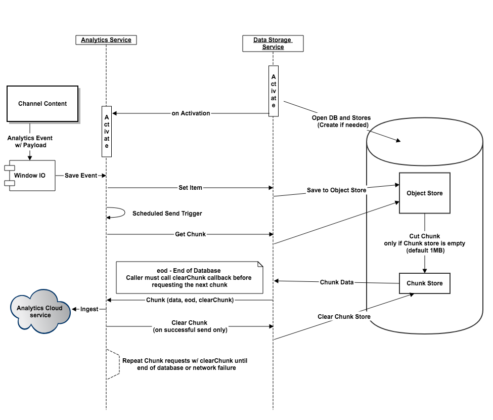

# 使用AEM Screens設定Adobe Analytics {#configuring-adobe-analytics-with-aem-screens}

>[!CAUTION]
>
>此AEM Screens功能僅在您已安裝AEM 6.4.2 Feature Pack 2和AEM 6.3.3 Feature Pack 4時可用。
>
>若要存取這兩個Feature Pack，您必須聯絡Adobe支援並請求存取權。 一旦您擁有許可權，就可以從「封裝共用」下載它。

本節涵蓋下列主題：

* **使用AEM Screens在Adobe Analytics中排序**
* **使用離線Adobe Analytics傳送自訂事件**

## 使用AEM Screens在Adobe Analytics中排序 {#sequencing-in-adobe-analytics-with-aem-screens}

此 ***排序程式*** 從啟用Adobe Analytics服務的資料儲存服務開始。 管道內容會傳送具有給薪的Adobe Analytics事件，也就是將資料測試擷取傳送到Windows I/O，並觸發保留事件。 事件會儲存至索引DB，並進一步放入物件存放區。 管理員會根據排程設定，從物件存放區剪下資料，然後進一步在區塊存放區中傳輸資料。 它會嘗試在連線時傳送最大數量的資料。

### 排序圖表 {#sequencing-diagram}

下列順序圖說明Adobe Analytics與AEM Screens的整合：

## 使用離線Adobe Analytics傳送自訂事件 {#sending-custom-events-using-offline-adobe-analytics}

下表總結列出事件的標準資料模型。 其中列出傳送至Adobe Analytics的所有欄位：

<table>
 <tbody>
  <tr>
   <td><strong>章節</strong></td> 
   <td><strong>屬性標籤</strong></td> 
   <td><strong>屬性名稱/金鑰</strong></td> 
   <td><strong>必要</strong></td> 
   <td><strong>資料類型</strong></td> 
   <td><strong>屬性型別</strong>  </td> 
   <td><strong>說明</strong></td> 
  </tr>
  <tr>
   <td><strong><em>核心/事件</em></strong></td> 
   <td>事件GUID</td> 
   <td>event.guid</td> 
   <td>建議</td> 
   <td>字串</td> 
   <td>UUID</td> 
   <td>識別事件執行個體的唯一ID</td> 
  </tr>
  <tr>
   <td> </td> 
   <td>收集事件的日期時間</td> 
   <td>event.coll_dts</td> 
   <td>可選</td> 
   <td>字串</td> 
   <td>時間戳記 — UTC</td> 
   <td>集合日期時間</td> 
  </tr>
  <tr>
   <td> </td> 
   <td>事件的日期時間（開始）</td> 
   <td>event.dts_start</td> 
   <td>建議</td> 
   <td>字串</td> 
   <td>時間戳記 — UTC</td> 
   <td>事件開始日期時間，如果您未指定此時間，則會將事件時間假設為伺服器收到該事件的時間</td> 
  </tr>
  <tr>
   <td> </td> 
   <td>事件的日期時間（結束）</td> 
   <td>event.dts_end</td> 
   <td>可選</td> 
   <td>字串</td> 
   <td>時間戳記 — UTC</td> 
   <td>事件完成日期時間</td> 
  </tr>
  <tr>
   <td> </td> 
   <td>工作流程</td> 
   <td>event.workflow</td> 
   <td>建議</td> 
   <td>字串</td> 
   <td> </td> 
   <td>工作流程名稱（畫面）</td> 
  </tr>
  <tr>
   <td> </td> 
   <td>主要DMe類別</td> 
   <td>event.category</td> 
   <td>必填</td> 
   <td>字串</td> 
   <td> </td> 
   <td>主要類別（案頭、行動裝置、網頁、程式、SDK、服務、生態系統） — 事件型別分組 —  <strong>我們傳送播放器</strong></td> 
  </tr>
  <tr>
   <td> </td> 
   <td>子類別</td> 
   <td>event.subcategory</td> 
   <td>建議</td> 
   <td>字串</td> 
   <td> </td> 
   <td>子類別 — 工作流程的區段或熒幕區域等。 （最近使用的檔案、CC檔案、行動裝置建立等）。</td> 
  </tr>
  <tr>
   <td> </td> 
   <td>事件/動作型別</td> 
   <td>event.type</td> 
   <td>必填</td> 
   <td>字串</td> 
   <td> </td> 
   <td>事件型別（轉譯、按一下、捏合、縮放） — 主要使用者動作</td> 
  </tr>
  <tr>
   <td> </td> 
   <td>子類型</td> 
   <td>event.subtype</td> 
   <td>建議</td> 
   <td>字串</td> 
   <td> </td> 
   <td>事件子型別（建立、更新、刪除、發佈等）  — 使用者動作的其他詳細資訊</td> 
  </tr>
  <tr>
   <td> </td> 
   <td>離線</td> 
   <td>event.offline</td> 
   <td>可選</td> 
   <td>布林值</td> 
   <td> </td> 
   <td>動作離線/上線時產生事件(true/false)</td> 
  </tr>
  <tr>
   <td> </td> 
   <td>使用者代理</td> 
   <td>event.user_agent</td> 
   <td>建議（Web屬性）</td> 
   <td>字串</td> 
   <td> </td> 
   <td>使用者代理</td> 
  </tr>
  <tr>
   <td> </td> 
   <td>語言/地區設定</td> 
   <td>event.language</td> 
   <td>建議</td> 
   <td>字串</td> 
   <td> </td> 
   <td>使用者地區設定是以RFC 3066的語言標籤慣例為基礎的字串（例如，en-US、fr-FR或es-ES）</td> 
  </tr>
  <tr>
   <td> </td> 
   <td>裝置GUI</td> 
   <td>event.device_guid</td> 
   <td>可選</td> 
   <td>字串  </td> 
   <td>UUID</td> 
   <td>識別裝置GUID （例如電腦ID或IP位址的雜湊+子網路遮罩+網路ID +使用者代理） — 我們將在這裡傳送註冊時產生的播放器使用者名稱。</td> 
  </tr>
  <tr>
   <td> </td> 
   <td>計數</td> 
   <td>event.count</td> 
   <td>可選</td> 
   <td>數字</td> 
   <td> </td> 
   <td>事件發生的次數 — 我們在這裡傳送影片持續時間</td> 
  </tr>
  <tr>
   <td> </td> 
   <td>值</td> 
   <td>event.value</td> 
   <td>可選</td> 
   <td>字串</td> 
   <td> </td> 
   <td>事件的值（例如開啟/關閉設定）</td> 
  </tr>
  <tr>
   <td> </td> 
   <td>Pagename</td> 
   <td>event.pagename</td> 
   <td>AA的必要專案</td> 
   <td>字串</td> 
   <td> </td> 
   <td>Adobe Analytics對自訂頁面名稱的支援</td> 
  </tr>
  <tr>
   <td> </td> 
   <td>URL</td> 
   <td>event.url</td> 
   <td>可選</td> 
   <td>字串</td> 
   <td> </td> 
   <td>Web屬性或行動結構描述的URL — 必須包含完整限定的URL</td> 
  </tr>
  <tr>
   <td> </td> 
   <td>錯誤代碼</td> 
   <td>event.error_code</td> 
   <td> </td> 
   <td>字串</td> 
   <td> </td> 
   <td>失敗碼</td> 
  </tr>
  <tr>
   <td> </td> 
   <td>錯誤類型</td> 
   <td>event.error_type</td> 
   <td> </td> 
   <td>字串</td> 
   <td> </td> 
   <td>失敗型別</td> 
  </tr>
  <tr>
   <td> </td> 
   <td>錯誤說明</td> 
   <td>event.error_description</td> 
   <td> </td> 
   <td>字串</td> 
   <td> </td> 
   <td>失敗說明  </td> 
  </tr>
  <tr>
   <td><strong><em>來源/原始產品</em></strong></td> 
   <td>名稱</td> 
   <td>source.name</td> 
   <td>必填</td> 
   <td>字串</td> 
   <td> </td> 
   <td>應用程式名稱(AEM Screens)</td> 
  </tr>
  <tr>
   <td> </td> 
   <td>版本</td> 
   <td>source.version</td> 
   <td>必填</td> 
   <td>字串</td> 
   <td> </td> 
   <td>韌體版本</td> 
  </tr>
  <tr>
   <td> </td> 
   <td>Platform</td> 
   <td>source.platform</td> 
   <td>必填</td> 
   <td>字串</td> 
   <td> </td> 
   <td>navigator.platform</td> 
  </tr>
  <tr>
   <td> </td> 
   <td>裝置</td> 
   <td>source.device</td> 
   <td>必填（包含例外）</td> 
   <td>字串</td> 
   <td> </td> 
   <td>播放器名稱</td> 
  </tr>
  <tr>
   <td> </td> 
   <td>作業系統版本</td> 
   <td>source.os_version</td> 
   <td>必填（包含例外）</td> 
   <td>字串</td> 
   <td> </td> 
   <td>作業系統版本</td> 
  </tr>
  <tr>
   <td><strong><em>內容</em></strong></td> 
   <td>動作</td> 
   <td>content.action</td> 
   <td>必填</td> 
   <td>字串</td> 
   <td> </td> 
   <td>資產（包括實際播放的轉譯）的URL</td> 
  </tr>
  <tr>
   <td> </td> 
   <td>Mime型別</td> 
   <td>content.mimetype</td> 
   <td>可選</td> 
   <td>字串</td> 
   <td> </td> 
   <td>內容的MIME型別</td> 
  </tr>
  <tr>
   <td><strong><em>交易</em></strong></td> 
   <td>交易編號</td> 
   <td>trn.number</td> 
   <td>必填</td> 
   <td>字串</td> 
   <td>UUID</td> 
   <td>最好遵守UUID v4的唯一ID</td> 
  </tr>
  <tr>
   <td> </td> 
   <td>產品說明</td> 
   <td>trn.product</td> 
   <td>必填</td> 
   <td>字串</td> 
   <td> </td> 
   <td>資產的URL （不包括轉譯）</td> 
  </tr>
  <tr>
   <td> </td> 
   <td>數量</td> 
   <td>trn.quantity</td> 
   <td>必填</td> 
   <td>字串</td> 
   <td> </td> 
   <td>播放持續時間</td> 
  </tr>
 </tbody>
</table>
