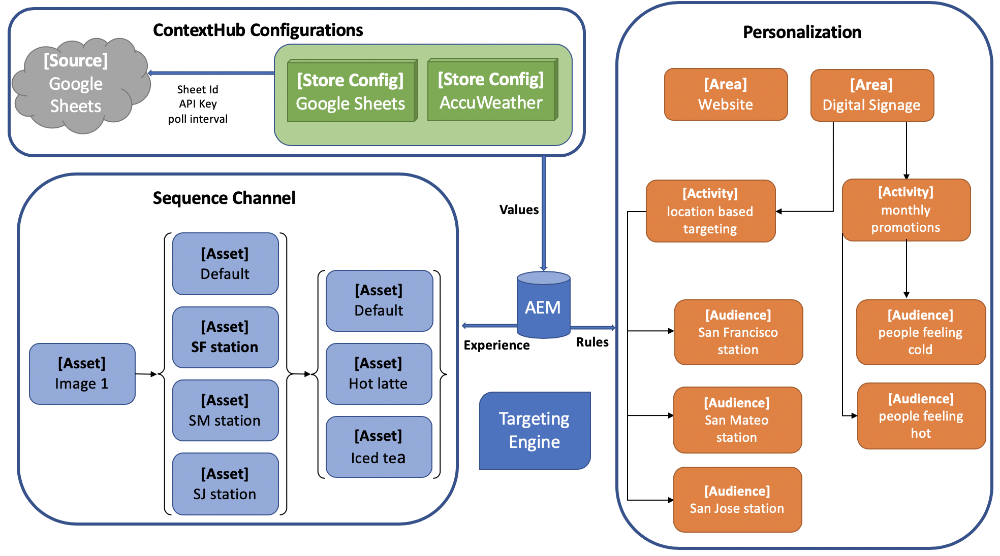

# 在AEM畫面中設定ContextHub {#configuring-contexthub-in-aem-screens}

本節著重說明如何使用資料存放區來建立和管理資料導向的資產變更。

## 主要條款 {#key-terms}

在我們瞭解在AEM Screens專案中建立和管理庫存導向渠道的詳細資訊之前，您必須先瞭解一些重要且與不同藍本相關的關鍵詞。

**品牌** ：指您的高階專案說明。

**區域** ：指您的AEM Screens專案名稱，例如數位廣告標牌

**活動** ：定義規則類別，例如庫存驅動、氣象驅動、部門可用性驅動等。

**對象** ：定義規則。

**區段** ：指要依特定規則播放的資產版本，例如，如果溫度低於華氏50度，則螢幕會顯示熱咖啡的影像，否則會顯示冷飲。

下圖以視覺化方式呈現ContextHub組態與「活動」、「對象」和「頻道」的一致性。



## 先決條件 {#preconditions}

在您開始為AEM Screens專案設定「內容中樞設定」之前，您必須先設定Google工作表（以供展示之用）。

>[!IMPORTANT]
>
>Google Sheets在下列範例中用作擷取值的範例資料庫系統，僅供教育用途。 Adobe不會為生產環境使用Google Sheets背書。
>
>如需詳細資訊，請參閱 [Google檔案中的「取得API金鑰](https://developers.google.com/maps/documentation/javascript/get-api-key) 」。

## 步驟1:設定資料儲存區 {#step-setting-up-a-data-store}

您可以將資料儲存設定為本地I/O事件或本地資料庫事件。

下列資產層級資料觸發器範例會展示本機資料庫事件，此事件會設定資料存放區，例如Excel表單，讓您使用ContextHub組態和AEM Screens頻道的區段路徑。

在您正確設定Google工作表後，例如，如下所示：


以下驗證是您在檢查連線時，會以下列格式輸入兩個值( *google sheet ID* 和 *API金鑰* )所檢視的驗證：

`https://sheets.googleapis.com/v4/spreadsheets/<your sheet id>/values/Sheet1?key=<your API key>`


>[!NOTE]
> 下列特定範例會將Google工作表顯示為資料存放區，當值高於100或小於50時，會觸發資產變更。

## 步驟2:設定儲存配置 {#step-setting-store-configurations}

1. **導覽至ContextHub**

   導覽至您的AEM例項，然後按一下左側邊欄中的工具圖示。 按一 **下Sites** —> **ContextHub**，如下圖所示。

   

1. **建立新的ContextHub商店設定**

   1. 導覽至名為畫面的設定容 **器**。

   1. 按一 **下「建立** > **建立設定容器** 」，然後輸入標題為 **ContextHubDemo**。

      

   1. **導覽至** ContextHubDemo **>建立** ContentHubDemo設定中心 **，然後按一下Save**********（儲存）。

      >[!NOTE]
      > 按一下「 **儲存** 」後，就會出現 **在ContextHub Configuration畫面中** 。

   1. 在「 **ContextHub設定** 」畫面中，按一 **下「建立** > **ContentHub商店設定」。**

      

   1. 輸入「 **Google Sheets** 」 **、「Google Sheets**」、「 **Store Title Store Type** Store As **Conthushub.jsontClickNextGoogle Sheets Name」為Google Sheets**************、Store Title Type Store As Conthub.
      

   1. 輸入您的特定json設定。 例如，您可將下列json用於示範用途，然後按一下「 **Save** 」（儲存），您就會看到名為「 **ContextHub設定中的Google Sheets** 」(Google Sheets)的商店設定。

      >[!IMPORTANT]
      >請務必以您在設定Google工作表時擷取 *的&lt;工作表ID>**和&lt;API金鑰>*，來取代程式碼。

      ```
       {
        "service": {
        "host": "sheets.googleapis.com",
        "port": 80,
        "path": "/v4/spreadsheets/<your google sheets id>/values/Sheet1",
        "jsonp": false,
        "secure": true,
        "params": {
        "key": "<your Google API key>"
       }
      },
      "pollInterval": 10000
      }
      ```

      >[!NOTE]
      在上述范常式式碼中， **pollInterval** 定義值重新整理的頻率（以毫秒為單位）。
將程式碼取 *代為您在設定Google工作表時擷* 取的&lt;工作表ID>和&lt;API金鑰> **。

      >[!CAUTION]
      如果您建立Google Sheets會將設定儲存在全域資料夾以外（例如在您自己的專案資料夾中），則定位將無法立即使用。

1. **設定商店區段**

   1. 導覽至 **ContentHub商店設定。** 然後在畫面設定容器中建立另一個商店設定，並將 **Title** -contushub **、** Store Name **(如** toreStore Store分段text.segmentation tex.am)設定為 **Title-conthub**********、Store Store類型分段tex.segmentation。

      

   1. Click **Next** and then **Save**.

      >[!NOTE]
您必須略過定義json的程式，並將其保留為空白。


## 步驟3:在觀眾中設定區段 {#setting-up-audience}

1. **在觀眾中建立區段**

   1. 從您的AEM例項導覽至「個人化 **>觀眾** >熒 **幕」******。

   1. 按一 **下「建立** >建 **立內容中樞區段」。** 「新 **建ContextHub區段** 」對話方塊隨即開啟。

   1. 將標題輸 **入為** Higherthan50 **，然後按一** 下Create ****。 同樣地，請建立另一個標題為 **Loberthan50的區段**。

      

   1. 選取區段 **Higherthan50** ，然後從動 **作列按一下「屬性** 」。
      

   1. 從「區段 **屬性** 」中選取「個 **人化」標籤**。 將ContextHub路徑設 **置為** ，將ContextHub路徑設 `/conf/screens/settings/cloudsettings/ContextHubDemo/contexthub` 置為Segments路徑 **，然後按一下「儲** 存 `/conf/screens/settings/wcm/segments`****&#x200B;縮圖」，如下圖所示。

      

   1. 同樣地，也可 **以設定Lowerthan** 50 **區段的ContextHub路徑和Segments路徑(ContextHub Path** ) **** 。

## 步驟4:設定品牌和區域 {#setting-brand-area}

請依照下列步驟，在您的活動和品牌下方建立品牌：

1. **在活動中建立品牌**

   1. 從您的AEM例項導覽至「個人化 **>活** 動」 ****。

   1. 按一 **下「建立** > **建立品牌**」。

   1. 從「建 **立頁面** 」精靈中選 **取「品牌」** ，然後按一 **下「下一步**」。

   1. 將標題輸 **入為** ScreensBrand **，然後按一** 下Create ****。 您的品牌現在已建立，如下所示。

      


      >[!CAUTION]
      已知問題：若要新增區域，請從URL移除主版，例如
      `http://localhost:4502/libs/cq/personalization/touch-ui/content/v2/activities.html/content/campaigns/screensbrand/master`.

1. **在品牌中建立區域**

   請依照下列步驟，在品牌中建立區域：

   1. 按一 **下「建立** 」，然 **後按一下「建立區域**」。

      

   1. 從「 **建立頁面** 」精靈中選 **取「區域** 」，然後按「 **下一步**」。

   1. 將標題輸 **入為** ScreensValue **，然後按一** 下Create ****。
您的品牌中會建立一個區域。

## 步驟5:在活動中建立區段 {#step-setting-up-audience-segmentation}

設定資料儲存區並定義活動（品牌和區域）後，請依照下列步驟在活動中建立區段。

1. **在活動中建立區段**

   1. 從您的AEM例項導覽至「個人化 **>活動****ScreensBrand** > ******** Value」畫面。

   1. 按一 **下「建立** > **建立活動」。** 將打 **開配置活動嚮導** 。

   1. 輸入 **Title** as **ValueCheck50** , **Name** as **** valuecheck50。 從下拉 **式清單中選取「定位引擎** 」 **為ContextHub(AEM)** ，然後按一下「下 **一步**」。

      

   1. 按一 **下「設定活動** 」精靈 **中的「新增體驗」**。

   1. 從「 **Javerthan** 500 **** 」和「Higherthan 500 **」中** ，選擇Higherthan500 **和「Higherclick Erthyn 50Name**************」，然後進入Chigherthan50Audiences。 按一下「 **確定**」。

   1. 從「 **受眾**」中，將 **Lowerthan500** Audiences和 **Lowerclick Experience輸入為小於055LowerclickName的Oracle****************** Audiences，小於5LowerJoudeAudiences。 按一下「 **確定**」。

      

   1. Click **Next** and then **Save**. **ValueCheck50活動現在已建立** ，並已加以設定。

      

## 步驟5:編輯觀眾中的區段{#editing-audience-segmentation}

1. **編輯區段**

   1. 從您的AEM例項導覽至「個人化 **>觀眾** >熒 **幕」******。

   1. 選取區段 **Higherthan50**，然後從動作列按 **一下「編** 輯」。

   1. 拖放比 **較：屬性** -編輯器的值元件。

   1. 按一下扳手圖示以開啟「 **比較屬性與值** 」對話方塊。

   1. 從「 **屬性名稱」(Property name)的下拉式清單中選取** Googlesheets/value/1/0 ****。

   1. 從下 **拉式選** 單中，選 **取「運算子大於** 」。

   1. 將「值 **」輸入** 「 **50」**。
   >[!NOTE]
   AEM會將區段顯示為綠色，以驗證您來自Google工作表的資料。

   

   同樣地，請將屬性值編輯為 **Lowerthan50**。

   1. 拖放比 **較：屬性** -編輯器的值元件。

   1. 按一下扳手圖示以開啟「 **比較屬性與值** 」對話方塊。

   1. 從「 **屬性名稱」(Property name)的下拉式清單中選取** Googlesheets/value/1/0 ****。

   1. 從下 **拉式選** 單中，選 **取「運算子** 」為「小於」。

   1. 將「值 **」輸入** 「 **50」**。


## 在渠道中啟用定位 {#step-enabling-targeting-in-channels}

請依照下列步驟，在您的通道中啟用定位。

1. 導覽至其中一個AEM Screens頻道。 下列步驟示範如何使用在AEM畫面頻道中建 **立的DataDrivenRetail** ，來啟用定位。

1. 選取渠道 **DataDrivenRetail** ，然後從動作列 **按一下「屬性** 」。

   

1. 選擇「個 **人化** 」標籤以設定ContextHub組態。

   1. 選擇ContextHub路徑 **,** 作為libs **>** settings **> Default Settings** > Default Zetings ****************> Configurations Journations CloudSelectLoudLouds。

   1. 選擇「路徑 **」** 段作為「會議 **」** >「零售」 **>「零售」>「****************** WcmSegments」>「AldSignments」>「ChickSelectSelectLight」。

   1. 按一 **下儲存並關閉**。
   >[!NOTE]
   使用ContextHub和區段路徑，您最初在此儲存上下文中心組態和區段。

   

1. 從DataDriven Assets > **Channels中導覽並選取** DataDriven Retail **，然後從動作列** 按一下Edit ******** Driven Retail。

   >[!NOTE]
   如果您已正確設定所有項目，您會從編輯器的下拉式清單中看到 **Targeting** （定位）選項，如下圖所示。

   

   >[!NOTE]
   為渠道配置ContextHub配置後，如果您要遵循下列所有使用案例，請務必遵循1到4的前述步驟，對於其他三個順序渠道亦然。

## 更多資訊：範例使用案例 {#learn-more-example-use-cases}

在您為AEM Screens專案設定ContextHub後，您可以依照不同的使用案例來瞭解資料觸發資產在不同產業中扮演重要角色的方式：

1. **[零售庫存鎖定](retail-inventory-activation.md)**
1. **[旅行中心溫度激活](local-temperature-activation.md)**
1. **[酒店預訂激活](hospitality-reservation-activation.md)**
