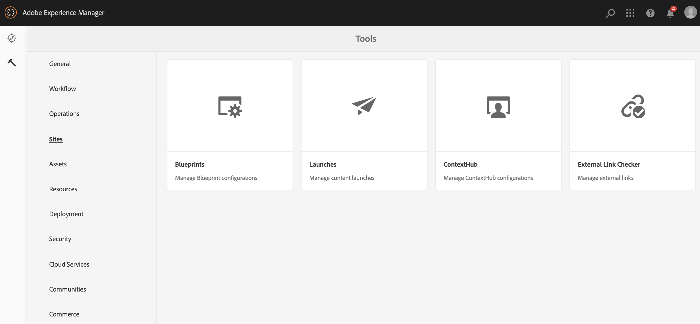

# 在AEM畫面中設定ContextHub {#configuring-contexthub-in-aem-screens}

本節著重說明如何使用資料存放區來建立和管理資料導向的資產變更。

## 主要條款 {#key-terms}

在我們瞭解在AEM Screens專案中建立和管理庫存導向渠道的詳細資訊之前，您必須先瞭解一些重要且與不同藍本相關的重要術語。

**品牌** ：指您的高階專案說明。

**區域** ：指您的AEM Screens專案名稱，例如數位廣告標牌

**活動** ：定義規則類別，例如庫存驅動、氣象驅動、部門可用性驅動等。

**對象** ：定義規則。

**區段** ：指要依特定規則播放的資產版本，例如，如果溫度低於華氏50度，則螢幕會顯示熱咖啡的影像，否則會顯示冷飲。

下圖以視覺化方式呈現ContextHub組態與「活動」、「對象」和「頻道」的一致性。


## 先決條件 {#preconditions}

在您開始為AEM Screens專案設定「內容中樞設定」之前，您必須先設定Google工作表（以供展示之用）。

>[!CAUTION]
>
>Google Sheets在下列範例中用作擷取值的範例資料庫系統，僅供教育用途。 Adobe不會為生產環境使用Google Sheets背書。
>
>如需詳細資訊，請參閱 [Google檔案中的「取得API金鑰](https://developers.google.com/maps/documentation/javascript/get-api-key) 」。

## 步驟1:設定資料儲存區 {#step-setting-up-a-data-store}

您可以將資料儲存設定為本地I/O事件或本地資料庫事件。

### 本地I/O事件 {#local-io-event}

請依照下列步驟來設定資料儲存區，例如ASCII事件，讓您使用ContextHub組態和區段路徑，以連至AEM Screens頻道。

### 本地資料庫事件 {#local-db-event}

請依照下列步驟來設定資料儲存區，例如可讓您使用ContextHub組態和區段路徑至「AEM畫面」頻道的Excel工作表。

1. **導覽至ContextHub**

   導覽至您的AEM例項，然後按一下左側邊欄中的工具圖示。 按一 **下Sites** —> **ContextHub**，如下圖所示。

   

1. **建立新的ContextHub商店設定**

   1. 導覽至 **全域** >預 **設** > **ContextHub設定**。

   1. 按一 **下「建立** >設 **定容器** 」，然後輸入標題為 **ContextHubDemo**。

   1. **** 導覽至&#x200B;**「** ContextHubDemo **>** ContentHub商店設定……」以開啟「配 **置」嚮導**。

   1. 將Google Sheets **輸入為** Google Sheets **,Google Store Name** as **Google Sheets Store Name,************as Contexthushusonp.Type Store**

   1. 按「下一 **步」**
   1. 輸入您的特定json設定。 例如，您可以使用下列json進行示範。
   1. 按一下&#x200B;**「儲存」**。

   ```
   {
     "service": {
       "host": "sheets.googleapis.com",
       "port": 80,
       "path": "/v4/spreadsheets/<your sheet it>/values/Sheet1",
       "jsonp": false,
       "secure": true,
       "params": {
         "key": "<your API key>"
       }
     },
     "pollInterval": 3000
   }
   ```

   >[!NOTE]
   >
   >在上述范常式式碼中， **pollInterval** 定義值重新整理的頻率（以毫秒為單位）。
   >
   >
   >將程式碼取 *代為您在設定Google工作表時擷* 取的&lt;工作表ID>和&lt;API金鑰> **。

   >[!CAUTION]
   如果您建立Google Sheets會將設定儲存在舊版資料夾以外（例如在您自己的專案資料夾中），則定位將無法立即使用。
   如果您想要在全域舊式資料夾外設定Google Sheets商店設定，則必須將 **Store Name** （商店名稱）設 **為區段，而** Store Type **（商店類型）******&#x200B;設為Aem.segmentationProduct。 此外，您必須略過如上定義json的程式。

1. **在活動中建立品牌**

   1. 從您的AEM例項導覽至「個人化 **>活動」****。**

   1. 按一 **下「建立** >建 **立品牌」**

   1. 從「建 **立頁面** 」精靈中選 **取「品牌」** ，然後按「下一 **步」**

   1. 輸入Title **as** ContextHubDemo **，然後按一** 下Create ****。 您的品牌現在已建立，如下所示。
   


   >[!CAUTION]
   已知問題：
   若要新增區域，請從URL移除主版，例如
   `https://localhost:4502/libs/cq/personalization/touch-ui/content/v2/activities.html/content/campaigns/contexthubdemo/master`

1. **在品牌中建立區域**

   請依照下列步驟，在品牌中建立區域：

   1. 按一 **下「建立** 」，然 **後按一下「建立」**

   1. 從「 **建立頁面** 」精靈中選 **取「區域** 」，然後按「下一步」

   1. 將標題輸 **入為****GoogleSheets** ，然後按一 **下建立**。
您的區域將會在活動中建立。

## 步驟2:設定受眾細分 {#step-setting-up-audience-segmentation}

在您設定資料儲存區並定義品牌後，請依照下列步驟設定受眾區段。

1. **在觀眾中建立區段**

   1. 從您的AEM例項導覽至「個 **人化** >觀眾 **>** We.Retail ****」。

   1. 按一 **下「建立** >建 **立內容中樞區段」。** 「新 **建ContextHub區段** 」對話方塊隨即開啟。

   1. 將「標 **題** 」輸入 **為SheetA1 1** ，然後單 **擊建立**。 同樣地，請建立另一個名為 **SheetA2 2的區段**。

1. **編輯區段**

   1. 選取區 **段工作表A1 1** (在步驟(5)中建立)，然後從動作列按 **一下編輯** 。

   1. 拖放比 **較：屬性** -編輯器的值元件。
   1. 按一下扳手圖示以開啟「 **比較屬性與值** 」對話方塊。
   1. 從「 **屬性名稱」(Property name)的下拉式清單中選取** Googlesheets/value/1/0 ****。

   1. 從下拉 **式選單中** ，選 **取「運算子為Equal** 」。

   1. 將值輸 **入** 1 ****。
   >[!NOTE]
   AEM會將區段顯示為綠色，以驗證您來自Google工作表的資料。

   

   同樣地，請將屬性值編輯 **為工作表A1 2**。

   1. 拖放比 **較：屬性** -編輯器的值元件。
   1. 按一下扳手圖示以開啟「 **比較屬性與值** 」對話方塊。
   1. 從「 **屬性名稱」(Property name)的下拉式清單中選取** Googlesheets/value/1/0 ****。

   1. 從下拉 **式選單中** ，選 **取「運算子為Equal** 」。

   1. 將值 **輸入****為2**。
   >[!NOTE]
   上述步驟中套用的規則只是您如何設定區段以實施下列使用案例的範例。

## 步驟3:在渠道中啟用定位 {#step-enabling-targeting-in-channels}

請依照下列步驟，在您的通道中啟用定位。

1. 導覽至其中一個AEM Screens頻道。 下列步驟示範如何使用在AEM畫面頻道中建 **立的DataDrivenRetail** ，來啟用定位。

1. 選取渠道 **DataDrivenRetail** ，然後從動作列 **按一下「屬性** 」。

   

1. 選擇「個 **人化** 」標籤以設定ContextHub組態。

   1. 選擇ContextHub路徑 **,** 作為libs **>** settings **> Default Settings** > Default Zetings ****************> Configurations Journations CloudSelectLoudLouds。

   1. 選擇「路徑 **」** 段作為「會議 **」** >「零售」 **>「零售」>「****************** WcmSegments」>「AldSignments」>「ChickSelectSelectLight」。

   1. 按一 **下儲存並關閉**。
   >[!NOTE]
   使用ContextHub和區段路徑，您最初在此儲存上下文中心組態和區段。

   

1. 從DataDriven Assets > **Channels中導覽並選取** DataDriven Retail **，然後從動作列** 按一下Edit ******** Driven Retail。

   >[!NOTE]
   如果您已正確設定所有項目，您會從編輯器的下拉式清單中看到 **Targeting** （定位）選項，如下圖所示。

   

   >[!NOTE]
   為渠道配置ContextHub配置後，如果您要遵循下列所有使用案例，請務必遵循1到4的前述步驟，對於其他三個順序渠道亦然。

## 更多資訊：範例使用案例 {#learn-more-example-use-cases}

在您為AEM Screens專案設定ContextHub後，您可以依照不同的使用案例來瞭解資料觸發資產在不同產業中扮演重要角色的方式：

1. **[零售庫存鎖定](retail-inventory-activation.md)**
1. **[旅行中心溫度激活](local-temperature-activation.md)**
1. **[酒店預訂激活](hospitality-reservation-activation.md)**
