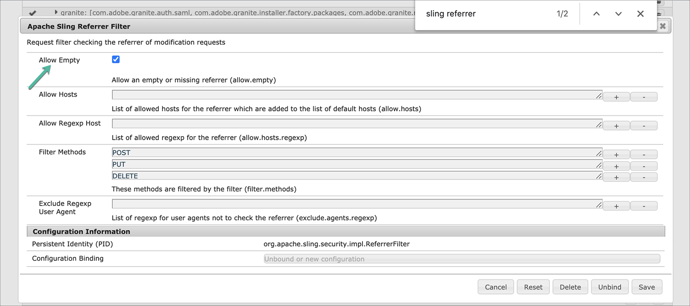

# 設定和部署AEM畫面 {#configuring-and-deploying-aem-screens}

本頁說明如何在您的裝置上安裝和設定畫面播放器。

## Server Configuration {#server-configuration}

>[!NOTE]
>
>**重要**:
>
>AEM Screens播放器不會使用跨網站偽造要求(CSRF)代號。 因此，若要設定AEM伺服器並讓AEM伺服器準備好用於AEM畫面，請允許空的反向連結，以略過反向連結篩選。

## Health Check Framework {#health-check-framework}

The Health Check framework lows the user to check if two exence configurations are set before running an AEM Screens project.

它可讓使用者驗證下列兩項設定檢查以執行AEM Screens專案，即檢查下列兩個篩選器的狀態：

1. **允許空的反向連結**
2. **https**

請依照下列步驟，檢查AEM Screens是否啟用這兩個重要的設定：

1. 導覽至 [Adobe Experience Manager Web Console Sling Health Check](http://localhost:4502/system/console/healthcheck?tags=screensconfigs&amp;overrideGlobalTimeout=)。

   

2. 按一下「執 **行所選健康檢查** 」對上面列出的兩個屬性運行驗證。

   如果同時啟用了這兩個篩選器，則 **Screens Configuration Health Service** （螢幕配置健康服務）將 **Result** 顯示為 **OK** ，並且兩個配置均為啟用。

   

   如果一個或兩個篩選器都被禁用，則會為用戶顯示警報，如下圖所示。

   如果同時禁用了這兩個過濾器，以下警報將顯示：
   

>[!NOTE]
>
>* 若要啟用 **Apache Sling Referrer Filter**，請參閱 [Allow Empty Referrer Requests](/help/user-guide/configuring-screens-introduction.md#allow-empty-referrer-requests)。
>* 若要啟用 **HTTP服務** ，請參閱 [Apache Felix Jetty Based HTTP Service](/help/user-guide/configuring-screens-introduction.md#allow-apache-felix-service)。

### 必備條件 {#prerequisites}

下列關鍵點可協助您設定和AEM伺服器以便準備好用於AEM畫面。

#### 允許空的反向連結請求 {#allow-empty-referrer-requests}

1. 透過 **AEM例項** —> hammer圖示—> **Operations** —> **Web Console導覽至Adobe Experience Manager Web Console Configuration**。

   

1. **Adobe Experience Manager Web Console設定隨即開啟** 。 搜尋sling referrer。

   若要搜尋sling referrer屬性，請按 **Command+F** for **Mac** , **Control+F** for **** Windows。

1. 勾選「 **允許空白** 」選項，如下圖所示。

   

1. 按一 **下「儲存** 」以啟用Apache Sling Referrer Filter Allow Empty。

#### 基於Apache Felix Jetty的HTTP服務 {#allow-apache-felix-service}

1. 透過 **AEM例項** —> hammer圖示—> **Operations** —> **Web Console導覽至Adobe Experience Manager Web Console Configuration**。

   

1. **Adobe Experience Manager Web Console設定隨即開啟** 。 搜尋以Apache Felix Jetty為基礎的HTTP服務。

   要搜索此屬性，請 **按Command+F** ( **Mac** )和 **Control+F(****** Windows)。

1. 勾選「 **啟用HTTP** 」選項，如下圖所示。

   

1. 按一 **下「儲存** 」以啟用 *http服務* 。

#### 為AEM螢幕啟用Touch UI {#enable-touch-ui-for-aem-screens}

AEM Screens需要TOUCH UI，無法與Adobe Experience Manager(AEM)的CLASSIC UI搭配使用。

1. 導覽至 *&lt;yourAuthorInstance>/system/console/configMgr/com.day.cq.wcm.core.impl.AuthoringUIModeServiceImpl*
1. 請確定「預 **設編寫UI** 」模式已設 **為TOUCH**，如下圖所示

或者，您也可以使用AuthorInstance *->* tools（hammer圖示）-> **Operations** -> **Web Console** ，並搜尋 **** WCM Authoring UI Mode Service Achignation。

>[!NOTE]
>
>您隨時都可以使用使用者偏好設定，為特定使用者啟用Classic UI。

#### NOSAMPLECONTENT執行模式中的AEM {#aem-in-nosamplecontent-runmode}

在生產中執行AEM會使 **用NOSAMPLECONTENT** 執行模式。 將 *X-Frame-Options=SAMEORIGIN* （在其他回應標題區段中）的標題從

`https://localhost:4502/system/console/configMgr/org.apache.sling.engine.impl.SlingMainServlet`。

這是AEM Screens Player播放線上頻道的必要項。

#### 密碼限制 {#password-restrictions}

對 ***DeviceServiceImpl進行最新變更***，您不必移除密碼限制。

您可以從 ***下列連結設定DeviceServiceImpl*** ，以在為畫面裝置使用者建立密碼時啟用密碼限制：

`https://localhost:4502/system/console/configMgr/com.adobe.cq.screens.device.impl.DeviceService`

請依照下列步驟來設定 ***DeviceServiceImpl***:

1. 透過 **AEM例項** —> hammer圖示—> **Operations** —> **Web Console導覽至Adobe Experience Manager Web Console Configuration**。

1. **Adobe Experience Manager Web Console設定隨即開啟** 。 搜尋裝 *置服務*。 要搜索屬性，請按 **Command+F** for macOS和 **Control+F** for Microsoft Windows。

#### Dispatcher Configuration {#dispatcher-configuration}

若要瞭解如何為AEM Screens專案設定分派程式，請參閱「為AEM Screens專案 [設定Dispatcher」](dispatcher-configurations-aem-screens.md)。

#### Java編碼 {#java-encoding}

將 ***Java編碼設為*** Unicode。 例如， *Dfile.encoding=Cp1252* 將無法運作。

>[!NOTE]
>**建議：**
>建議在生產使用中，將HTTPS用於AEM Screens Server。

