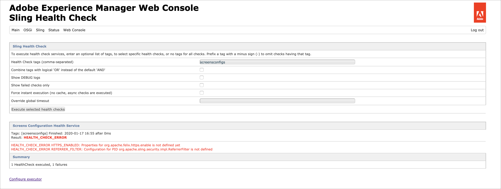

# 配置和部署AEM Screens {#configuring-and-deploying-aem-screens}

本頁面顯示如何在裝置上安裝和設定Screens播放器。

## 伺服器配置{#server-configuration}

>[!NOTE]
>
>**重要**:
>
>AEM Screens播放器未使用跨網站請求偽造(CSRF)代號。 因此，若要設定和AEM伺服器以準備好用於AEM Screens，請允許空的反向連結，以略過反向連結篩選。

## 運行狀況檢查框架{#health-check-framework}

運行狀況檢查架構可讓使用者在執行AEM Screens專案前，檢查是否已設定兩個必要的設定。

它可讓使用者驗證下列兩個設定檢查以執行AEM Screens專案，即檢查下列兩個篩選器的狀態：

1. **允許空白反向連結**
2. **https**

請依照下列步驟，檢查這兩個重要設定是否已針對AEM Screens啟用：

1. 導覽至[Adobe Experience Manager Web Console Sling健康狀況檢查](http://localhost:4502/system/console/healthcheck?tags=screensconfigs&amp;overrideGlobalTimeout=)。

   

2. 按一下&#x200B;**執行所選健康檢查** ，對上面列出的兩個屬性運行驗證。

   如果同時啟用了這兩個篩選器，則&#x200B;**Screens Configuration Health Service**&#x200B;將&#x200B;**Result**&#x200B;顯示為&#x200B;**OK**&#x200B;並同時將這兩個配置顯示為已啟用。

   

   如果禁用了一個或兩個篩選器，則會為用戶顯示警報，如下圖所示。

   如果同時停用篩選器，下列警報將會展示：
   

>[!NOTE]
>
>* 若要啟用&#x200B;**Apache Sling Referrer Filter**，請參閱[Allow Empty Referrer Requests](/help/user-guide/configuring-screens-introduction.md#allow-empty-referrer-requests)。
>* 若要啟用&#x200B;**HTTP**&#x200B;服務，請參閱[Apache Felix Jetty Based HTTP服務](/help/user-guide/configuring-screens-introduction.md#allow-apache-felix-service)。

### 必備條件 {#prerequisites}

以下關鍵點可協助設定及AEM伺服器以準備好使用於AEM Screens。

#### 允許空的反向連結請求{#allow-empty-referrer-requests}

1. 透過AEM例項 — >槌子圖示 — > **Operations** —> **Web主控台**&#x200B;導覽至&#x200B;**Adobe Experience Manager Web主控台設定**。

   

1. **Adobe Experience Manager Web主控台設** 定隨即開啟。搜尋Sling反向連結。

   要搜尋Sling反向連結屬性，請按&#x200B;**Command+F**&#x200B;鍵&#x200B;**Mac**&#x200B;和&#x200B;**Control+F**&#x200B;鍵&#x200B;**Windows**。

1. 勾選&#x200B;**允許空白**&#x200B;選項，如下圖所示。

   

1. 按一下&#x200B;**Save**&#x200B;以啟用Apache Sling反向連結篩選器允許空白。

#### Apache Felix Jetty Based HTTP服務{#allow-apache-felix-service}

1. 透過AEM例項 — >槌子圖示 — > **Operations** —> **Web主控台**&#x200B;導覽至&#x200B;**Adobe Experience Manager Web主控台設定**。

   

1. **Adobe Experience Manager Web主控台設** 定隨即開啟。搜尋Apache Felix Jetty Based HTTP Service。

   要搜索此屬性，請按&#x200B;**Command+F**&#x200B;鍵&#x200B;**Mac**&#x200B;和&#x200B;**Control+F**&#x200B;鍵&#x200B;**Windows**。

1. 檢查&#x200B;**ENABLE HTTP**&#x200B;選項，如下圖所示。

   

1. 按一下&#x200B;**Save**&#x200B;以啟用&#x200B;*http*&#x200B;服務。

#### 啟用AEM Screens的觸控式UI {#enable-touch-ui-for-aem-screens}

AEM Screens需要觸控式UI，無法與Adobe Experience Manager(AEM)的傳統UI搭配使用。

1. 導覽至&#x200B;*&lt;yourAuthorInstance>/system/console/configMgr/com.day.cq.wcm.core.impl.AuthoringUIModeServiceImpl*
1. 請確定&#x200B;**預設編寫UI模式**&#x200B;已設為&#x200B;**TOUCH**，如下圖所示

或者，您也可以使用AuthorInstance *->*&#x200B;工具（槌子圖示） — > **Operations** -> **Web Console**&#x200B;執行相同的設定，並搜尋&#x200B;**WCM編寫UI模式服務**。

>[!NOTE]
>
>您一律可以使用使用者偏好設定，為特定使用者啟用傳統UI。

#### AEM在NOSAMPLECONTENT運行模式{#aem-in-nosamplecontent-runmode}中

在生產環境中執行AEM會使用&#x200B;**NOSAMPLECONTENT**&#x200B;執行模式。 移除&#x200B;*X-Frame-Options=SAMEORIGIN*&#x200B;標題（位於其他回應標題區段中），從

`https://localhost:4502/system/console/configMgr/org.apache.sling.engine.impl.SlingMainServlet`。

這是AEM Screens播放器播放線上頻道的必要項目。

#### 密碼限制{#password-restrictions}

對&#x200B;***DeviceServiceImpl***&#x200B;進行最新更改後，您不必刪除密碼限制。

您可以從以下連結配置&#x200B;***DeviceServiceImpl***&#x200B;以在為螢幕設備用戶建立密碼時啟用密碼限制：

`https://localhost:4502/system/console/configMgr/com.adobe.cq.screens.device.impl.DeviceService`

請依照以下步驟配置&#x200B;***DeviceServiceImpl***:

1. 透過AEM例項 — >槌子圖示 — > **Operations** —> **Web主控台**&#x200B;導覽至&#x200B;**Adobe Experience Manager Web主控台設定**。

1. **Adobe Experience Manager Web主控台設** 定隨即開啟。搜索&#x200B;*deviceservice*。 要搜索屬性，請按&#x200B;**Command+F**(macOS)和&#x200B;**Control+F**(Microsoft Windows)。

#### Dispatcher設定{#dispatcher-configuration}

若要了解如何為AEM Screens專案設定Dispatcher，請參閱[為AEM Screens專案設定Dispatcher](dispatcher-configurations-aem-screens.md)。

#### Java編碼{#java-encoding}

將&#x200B;***Java encoding***&#x200B;設定為Unicode。 例如， *Dfile.encoding=Cp1252*&#x200B;將無法運作。

>[!NOTE]
>**建議：**
>建議在生產使用中對AEM Screens伺服器使用HTTPS。
