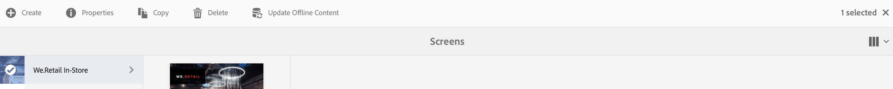

# 內容更新即服務 {#content-update-as-a-service}

>[!IMPORTANT]
>此內容對AEM內部部署/AMS （AEM 6.5LTS和AEM 6.5）有效。 如需AEM as a Cloud Service Screens內容，請參閱[AEM as a Cloud Service指南](https://experienceleague.adobe.com/en/docs/experience-manager-cloud-service/content/screens-as-cloud-service/overview/introduction)。

本節涵蓋下列有關更新content-as-a-service的主題：

* **概觀**
* **使用大量離線更新**

<!--
>[!CAUTION]
>
>This AEM Screens functionality is only available, if you have installed AEM 6.3 Feature Pack 3 or AEM 6.4 Screens Feature Pack 1.
>
>To get access to this Feature Pack, contact Adobe Support and request access. When you have permission you can download it from Package Share. 
-->

## 概觀 {#overview}

大量離線更新可讓您大量更新所有管道。 這可避免導覽至特定頻道和更新內容的麻煩。 反之，您可以一次更新一個特定專案之頻道中的所有內容。

您也可以將此活動排程在網路流量較低的時候。

>[!NOTE]
>
>「大量離線更新」功能已最佳化，僅更新已修改的管道。

## 使用大量離線更新 {#using-bulk-offline-update}

您可以從使用者介面(UI)手動使用大量離線更新，或從OSGi服務排程大量更新。

### 使用AEM Screens使用者介面 {#using-aem-screens-user-interface}

請依照下列步驟，對AEM Screens專案使用大量離線更新：

1. 導覽至您的AEM Screens專案。
1. 按一下專案，然後從動作列按一下&#x200B;**更新離線內容**，以手動更新頻道內容。

   

### Adobe Experience Manager Web主控台設定 {#adobe-experience-manager-web-console-configuration}

請依照下列步驟，對AEM Screens專案使用大量離線更新：

1. Adobe Experience Manager Web主控台設定。
1. 搜尋大量離線更新服務。

   

1. 新增下列屬性：

   **專案路徑** — 指定AEM Screens專案的路徑。 路徑通常是`/content/screens/<Name of your project>`。

   *例如*，`/content/screens/we-retail`。 您可以選取AEM Screens底下的任何專案（不要按一下圖示），在URL中找到此路徑。

   >[!NOTE]
   >
   >指定相對於您管道的專案路徑。

   **排程頻率** — 指定此服務應更新離線內容的時間，例如，下午5:00或17:00。

1. 按一下「儲存&#x200B;**&#x200B;**」，以便儲存您的設定。 您的所有內容都會在指定的時間更新。
