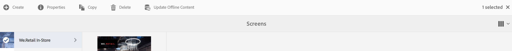

# 內容更新即服務 {#content-update-as-a-service}

本節涵蓋下列有關更新content-as-a-service的主題：

* **概觀**
* **使用大量離線更新**

>[!CAUTION]
>
>此AEM Screens功能僅在您已安裝AEM 6.3 Feature Pack 3或AEM 6.4 Screens Feature Pack 1時可用。
>
>若要存取此Feature Pack，您必須聯絡Adobe支援並要求存取權。 一旦您擁有許可權，就可以從「封裝共用」下載它。

## 概觀 {#overview}

大量離線更新，可讓您大量更新所有頻道。 這可避免導覽至特定頻道和更新內容的麻煩。 反之，您可以立即更新某個特定專案之頻道中的所有內容。

您也可以將此活動排程在網路流量較低的時候。

>[!NOTE]
>
>「大量離線更新」功能已最佳化，以僅更新已修改的頻道。

## 使用大量離線更新 {#using-bulk-offline-update}

您可以從使用者介面(UI)手動使用大量離線更新，或從OSGi服務排程大量更新。

### 使用AEM Screens使用者介面 {#using-aem-screens-user-interface}

請依照下列步驟，對AEM Screens專案使用大量離線更新：

1. 導覽至您的AEM Screens專案。
1. 選取專案並按一下 **更新離線內容** 以手動更新頻道內容。

   

### Adobe Experience Manager Web主控台設定 {#adobe-experience-manager-web-console-configuration}

請依照下列步驟，對AEM Screens專案使用大量離線更新：

1. Adobe Experience Manager Web主控台設定。
1. 搜尋大量離線更新服務。

   

1. 新增下列屬性：

   **專案路徑** 指定AEM Screens專案的路徑。 路徑通常為 `/content/screens/<Name of your project>`.

   *例如*， `/content/screens/we-retail`. 在AEM Screens底下選取任何專案（請勿按一下圖示），即可在URL中找到此路徑。

   >[!NOTE]
   >
   >指定相對於您頻道的專案路徑。

   **排程頻率** 指定時間，例如，下午5:00或17:00，此服務應在此時間更新離線內容。

1. 按一下 **儲存** 以儲存您的設定，您的內容將在指定的時間更新。
