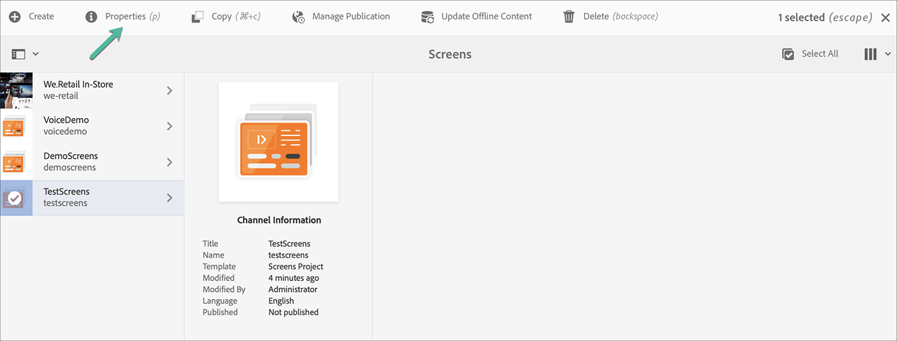
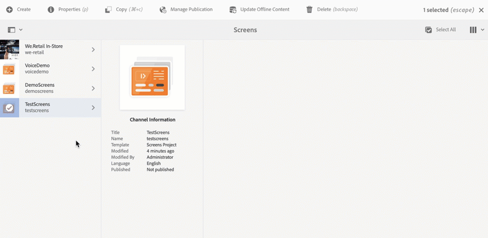

# 建立和管理專案 {#creating-and-managing-projects}

>[!IMPORTANT]
>此內容對AEM內部部署/AMS （AEM 6.5LTS和AEM 6.5）有效。 如需AEM as a Cloud Service Screens內容，請參閱[AEM as a Cloud Service指南](https://experienceleague.adobe.com/en/docs/experience-manager-cloud-service/content/screens-as-cloud-service/overview/introduction)。

選取AEM Screens連結（左上方），然後選取Adobe Experience Manager ，即可使用Screens。

或者，您可以直接導覽至： `http://localhost:4502/screens.html/content/screens`

>[!NOTE]
>**導覽提示：**
>您也可以使用游標鍵，在AEM中瀏覽不同的資料夾。此外，按一下特定圖元後，按空格鍵可編輯或檢視該特定資料夾的屬性。

## 建立新的Screens專案

1. 從您的AEM執行個體按一下&#x200B;**Screens**。
1. 按一下&#x200B;**建立Screens專案**。
1. 輸入標題為&#x200B;**TestScreens**，然後按一下&#x200B;**儲存**。

專案已建立，並帶您回到Screens專案主控台。 您現在可以按一下專案。

在專案中有五種資料夾，如下圖所示：

* **排程**
* **位置**
* **應用程式**
* **裝置**
* **管道**

>[!NOTE]
>
>依預設，初始結構包含&#x200B;**排程**、**位置**、**應用程式**、**管道**&#x200B;和&#x200B;**裝置**&#x200B;主要頁面，但可視需要手動調整此結構。 如果可用的選項與專案無關，您可以移除選項。

## 檢視屬性 {#viewing-properties}

建立Screens專案後，按一下專案，然後從動作列按一下&#x200B;**屬性**，以便編輯專案的屬性。

下列選項可讓您編輯/變更&#x200B;**TestScreens**&#x200B;的屬性。

## 建立自訂資料夾 {#creating-a-custom-folder}

您也可以在專案中可用的&#x200B;**排程**、**位置**、**應用程式**、**頻道**&#x200B;和&#x200B;**裝置**&#x200B;主要頁面下，建立自己的自訂資料夾。

若要建立自訂資料夾：

1. 按一下您的專案，然後按一下動作列中加號圖示旁的&#x200B;**建立**。
1. **建立**&#x200B;精靈會開啟，然後按一下適當的選項。
1. 按一下「**下一步**」。
1. 輸入內容並按一下&#x200B;**建立**。

下列步驟顯示在&#x200B;**TestScreens**&#x200B;中建立應用程式資料夾到您的&#x200B;**應用程式**&#x200B;主要頁面。

### 後續步驟 {#the-next-steps}

當您建立自己的專案時，請參閱[頻道管理](managing-channels.md)以建立和管理您頻道中的內容。
