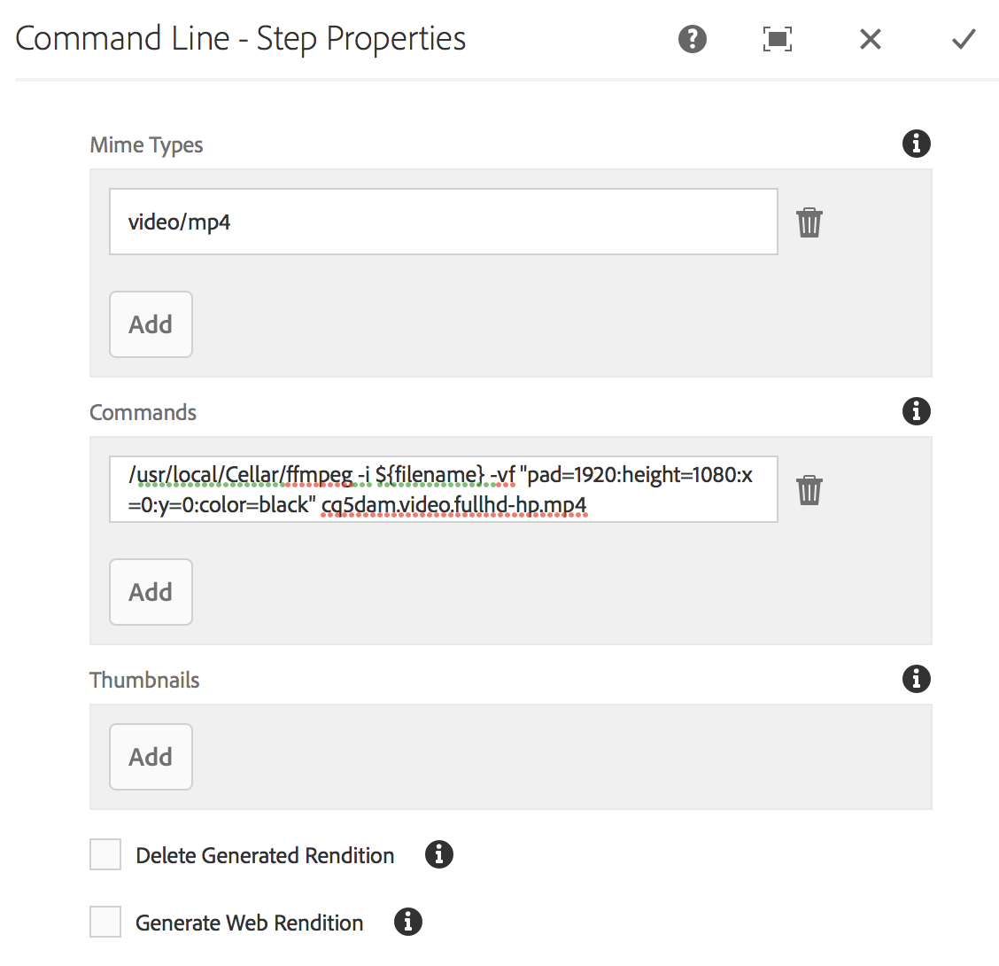
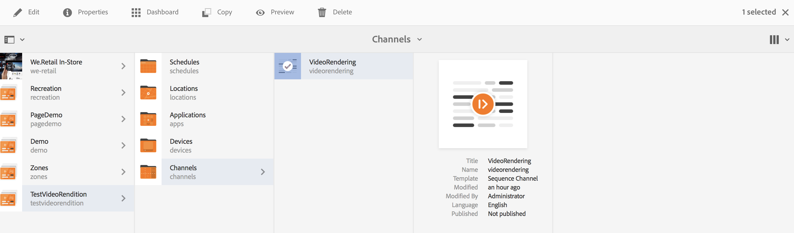
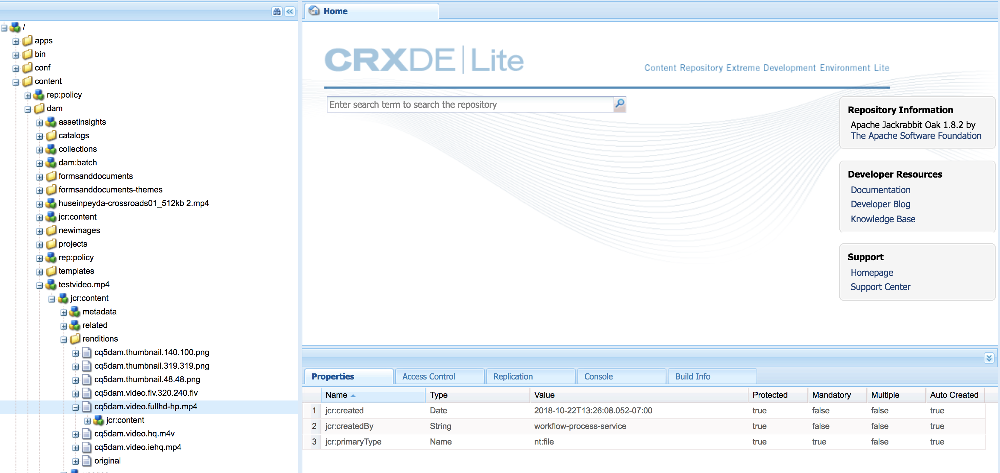

# 建立視頻填充工作流{#creating-a-video-padding-workflow}

本節涵蓋下列主題：

* **概覽**
* **必備條件**
* **建立視訊填補工作流程**
   * **建立工作流程**
   * **使用AEM Screens項目中的工作流**

* **驗證工作流的輸出**

## 概覽 {#overview}

下列使用案例涉及放置視訊(範例：1280 x 720)，在顯示器為1920 x 1080且視訊放置於0x0（左上）的頻道中。 視訊不應以任何方式拉伸或修改，也不應在視訊元件中使用&#x200B;**Cover**。

視訊會以物件的形式顯示，從像素1到像素1280橫跨像素1到像素720向下，而其餘的色版則為預設顏色。

## 必備條件 {#prerequisites}

在建立視訊工作流程之前，請先完成下列必要條件：

1. 在您的例項中的&#x200B;**Assets**&#x200B;資料夾中上傳影AEM片
1. 建立AEM Screens專案（例如&#x200B;**TestVideoRendition**）和名為(**VideoRendition**)的頻道，如下圖所示：

## 建立視頻填充工作流{#creating-a-video-padding-workflow-1}

若要建立視訊填補工作流程，您必須為視訊建立工作流程，然後在AEM Screens專案頻道中使用相同的工作流程。

請依照下列步驟來建立和使用工作流程：

1. 建立工作流程
1. 在AEM Screens項目中使用工作流

### 建立工作流{#creating-a-workflow}

請依照下列步驟，為您的視訊建立工作流程：

1. 導覽至您AEM的例項，然後從側欄按一下工具。 選擇&#x200B;**Workflow** —> **Models**&#x200B;以建立新模型。

   

1. 按一下&#x200B;**Models** —> **Create** —> **Create Model**。 在&#x200B;**添加工作流模型**&#x200B;中輸入&#x200B;**Title**（作為&#x200B;**VideoRendition**）和&#x200B;**Name**。 按一下&#x200B;**Done**&#x200B;添加工作流模型。

   

1. 建立工作流程模型後，請選取模型(**VideoRendition**)，然後從動作列按一下「編輯」(Edit)。****

   

1. 將&#x200B;**命令行**&#x200B;元件拖放到工作流中。

   

1. 選擇&#x200B;**命令行**&#x200B;元件並開啟屬性對話框。

   

1. 選擇&#x200B;**參數**&#x200B;頁籤，以輸入&#x200B;**命令行——步驟屬性**&#x200B;對話框中的欄位。

   在&#x200B;**Mime類型**（以&#x200B;***video/mp4***&#x200B;的形式輸入格式）和命令(***/usr/local/Cellar/ffmpeg -i ${filename} -vf &quot;pad=1920:height=1080:x=0:color=black&quot; cq5q.video.fullhd-hp.mp4***)，以在&#x200B;**Commands**&#x200B;欄位中啟動工作流程。

   請參閱以下注釋中有關&#x200B;**Mime類型**&#x200B;和&#x200B;**Commands**&#x200B;的詳細資訊。

   

1. 選擇工作流(**VideoRenditions**)，然後從操作欄按一下「啟動工作流」，開啟「運行工作流」對話框。********

   

1. 在&#x200B;**Payload**(as ***/content/dam/huseinpeyda-crossroads01_512kb 2.mp4***)中選擇資產路徑，然後將&#x200B;**Title**&#x200B;輸入為&#x200B;***RunVideo***&#x200B;並按一下&#x200B;**Run**。

   

### 在AEM Screens項目{#using-the-workflow-in-an-aem-screens-project}中使用工作流

請依照下列步驟，使用您的AEM Screens專案中的工作流程：

1. 導覽至AEM Screens專案(**TestVideoRendition** —> **Channels** —>**VideoRendition**)。

   

1. 從操作欄按一下「編輯」(**Edit)。**&#x200B;拖放您最初上傳至&#x200B;**Assets**&#x200B;的視訊。

   

1. 上傳視訊後，按一下「預覽」以檢視輸出。****

   

## 驗證工作流{#validating-the-output-for-the-workflow}的輸出

您可以通過以下方式驗證輸出：

* 檢查頻道中的視訊預覽
* 導覽至CRXDE Lite中的&#x200B;***/content/dam/testvideo.mp4/jcr:content/renditions/cq5dam.video.fullhd-hp.mp4***，如下圖所示：

