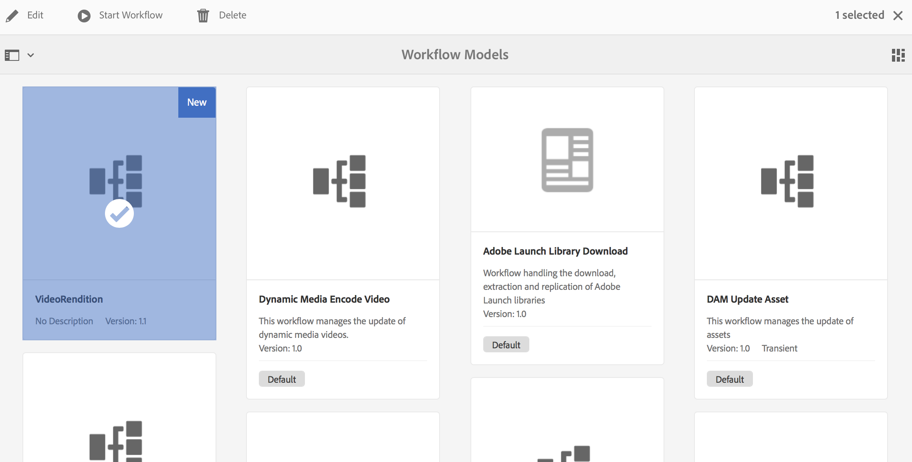

# 建立視訊邊框間距工作流程 {#creating-a-video-padding-workflow}

本節涵蓋下列主題：

* **概觀**
* **必備條件**
* **建立視訊邊框間距工作流程**
   * **建立工作流程**
   * **在AEM Screens專案中使用工作流程**

* **驗證工作流程的輸出**

## 概觀 {#overview}

下列使用案例涉及將視訊（範例： 1280 x 720）放置在顯示為1920 x 1080的頻道中，並將視訊放置在0x0 （左上方）。 視訊不應以任何方式延伸或修改，也不應使用 **封面** 在視訊元件中。

視訊會以物件的形式顯示，從畫素1到畫素1280 （橫跨畫素1，從畫素1到畫素720），其餘色版為預設顏色。

## 必備條件 {#prerequisites}

在建立視訊工作流程之前，請先完成下列必要條件：

1. 上傳視訊於 **資產** 在您的AEM執行個體中的資料夾
1. 建立AEM Screens專案(例如， **TestVideoRendition**)和名為(**視訊演算**)，如下圖所示：

## 建立視訊邊框間距工作流程 {#creating-a-video-padding-workflow-1}

若要建立視訊填補工作流程，您必須為視訊建立工作流程，然後在AEM Screens專案頻道中使用相同的工作流程。

請依照下列步驟建立及使用工作流程：

1. 建立工作流程
1. 在AEM Screens專案中使用工作流程

### 建立工作流程 {#creating-a-workflow}

請依照下列步驟，為您的影片建立工作流程：

1. 導覽至您的AEM執行個體，然後從側邊欄按一下工具。 選取 **工作流程** —> **模型** 以建立新模型。

   

1. 按一下 **模型** —> **建立** —> **建立模型**. 輸入 **標題** (as **視訊轉譯**)和 **名稱** 在 **新增工作流程模型**. 按一下 **完成** 以新增工作流程模型。

   

1. 建立工作流程模型後，請選取模型(**視訊轉譯**)，然後按一下 **編輯** 動作列中的。

   

1. 拖放 **命令列** 元件至工作流程。

   

1. 選取 **命令列** 元件並開啟「屬性」對話方塊。

   

1. 選取 **引數** 標籤以輸入欄位 **命令列 — 步驟屬性** 對話方塊。

   輸入格式 **Mime型別** (as ***video/mp4***)和命令為(***/usr/local/Cellar/ffmpeg -i ${filename} -vf &quot;pad=1920：height=1080：x=0：y=0：color=black&quot; cq5dam.video.fullhd-hp.mp4***)，以啟動工作流程於 **命令** 欄位。

   請參考以下詳細資料： **Mime型別** 和 **命令** 在下面的註解中。

   

1. 選取工作流程(**視訊轉譯**)並按一下 **開始工作流程** 從動作列開啟 **執行工作流程** 對話方塊。

   

1. 在「 」中選取資產的路徑 **裝載** (as ***/content/dam/huseinpeyda-crossroads01_512kb 2.mp4***)並輸入 **標題** 作為 ***RunVideo*** 並按一下 **執行**.

   

### 在AEM Screens專案中使用工作流程 {#using-the-workflow-in-an-aem-screens-project}

請依照下列步驟，在您的AEM Screens專案中使用工作流程：

1. 導覽至AEM Screens專案(**TestVideoRendition** —> **頻道** —>**視訊轉譯**)。

   

1. 按一下 **編輯** 動作列中的。 拖放您最初上傳的視訊 **資產**.

   

1. 上傳視訊後，請按一下 **預覽** 以檢視輸出。

   

## 驗證工作流程的輸出 {#validating-the-output-for-the-workflow}

您可以透過以下方式驗證輸出：

* 檢查頻道中的視訊預覽
* 導覽至 ***/content/dam/testvideo.mp4/jcr：content/renditions/cq5dam.video.fullhd-hp.mp4*** CRXDE Lite，如下圖所示：

