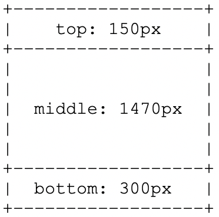

# 在多區域版面中建立自訂範本 {#creating-custom-templates-multizone}

下列範例展示如何在多區域版面中建立自訂範本。

例如，以下章節將示範如何使用下列組態，在多區域版面中建立自訂範本：




## 使用特定配置建立自定義模板 {#basic-flow-setting}

請依照下列步驟建立自訂範本。

1. 在 `/apps/<project>/templates/my-custom-layout`

   ```shell
    <?xml version="1.0" encoding="UTF-8"?>
    <jcr:root xmlns:sling="http://sling.apache.org/jcr/sling/1.0" xmlns:cq="http://www.day.com/jcr/cq/1.0" xmlns:jcr="http://www.jcp.org/jcr/1.0" xmlns:nt="http://www.jcp.org/jcr/nt/1.0"
    jcr:description="My Custom 3-zones layout "
    jcr:primaryType="cq:Template"
    jcr:title="3-zones layout"
    allowedParents="[/libs/screens/core/templates/channelfolder]"
    allowedPaths="[/content/screens(/.*)?]"
    ranking="{Long}20000">
    <jcr:content
        cq:cssClass="aem-Layout aem-Layout--3x1 my-CustomLayout"
        cq:designPath="/apps/settings/wcm/designs/<project>"
        cq:deviceGroups="[mobile/groups/responsive]"
        jcr:primaryType="cq:PageContent"
        sling:resourceSuperType="screens/core/components/channel"
        sling:resourceType="screens/core/components/multiscreenchannel">
        <r1c1
            cq:cssClass="aem-LayoutCell--1-1 my-CustomLayout-top"
            jcr:primaryType="nt:unstructured"
            sling:resourceType="wcm/foundation/components/responsivegrid"/>
        <r2c1
            cq:cssClass="aem-LayoutCell--1-1 my-CustomLayout-middle"
            jcr:primaryType="nt:unstructured"
            sling:resourceType="wcm/foundation/components/responsivegrid"/>
        <r3c1
            cq:cssClass="aem-LayoutCell--1-1 my-CustomLayout-bottom"
            jcr:primaryType="nt:unstructured"
            sling:resourceType="wcm/foundation/components/responsivegrid"/>
        <cq:responsive jcr:primaryType="nt:unstructured">
            <breakpoints jcr:primaryType="nt:unstructured"/>
        </cq:responsive>
        <offline-config/>
    </jcr:content>
   </jcr:root>
   ```

1. 在中建立頁面設計 `/apps/settings/wcm/designs/<project>`。

   >[!NOTE]
   >
   >請確定上 `cq:designPath` 述路徑相符。

1. 更新 **離線設定節點** ，讓設計指向新路徑

1. 在資料 **夾中新增static.css**`/apps/settings/wcm/designs/<project>` 檔案，並將其內容設定為

   ```shell
   .cq-Screens-channel--multizone.my-CustomLayout {}
   .cq-Screens-channel--multizone.my-CustomLayout .my-CustomLayout-top { height: 150px; }
   .cq-Screens-channel--multizone.my-CustomLayout .my-CustomLayout-middle { height: 1470px; }
   .cq-Screens-channel--multizone.my-CustomLayout .my-CustomLayout-bottom { height: 300px; }
   ```

## 將影像插入背景圖層 {#inserting-image}

您可以將影像設定為版面的背景圖層：

您可以調整CSS規則，使用稱為「data-uri」的項目，並直接將影像（Base64編碼）內嵌在CSS檔案中。

這如下所述：
`.cq-Screens-channel--multizone.my-CustomLayout { background: url('data:image/…;base64,…') no-repeat center center; }`

或者，您可以遵循下列步驟：

1. 請確定影像是否包含在頻道的離線設定中
1. 使用上述CSS中影像的直接連結，而非「data-uri」變體


## 更新背景顏色 {#updating-color}

若要變更背景顏色，請將下列程式碼新增至xml檔案：

`.cq-Screens-channel--multizone.my-CustomLayout { background-color: …; }`


