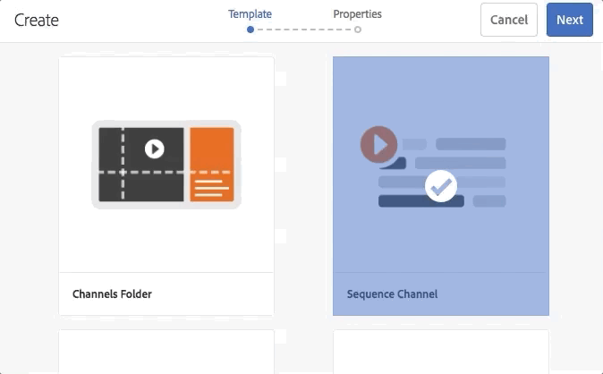

# 為AEM Screens開發自訂元件 {#developing-a-custom-component-for-aem-screens}

下列教學課程將逐步說明為AEM Screens建立自訂元件的步驟。 AEM Screens會重複使用其他AEM產品的許多現有設計模式與技術。 本教學課程著重說明針對AEM Screens進行開發時的差異和特殊考量事項。

## 概觀 {#overview}

本教學課程適用於AEM Screens的新手開發人員。 在本教學課程中，我們會為AEM Screens中的順序頻道建置簡單的「Hello World」元件。 對話方塊可讓作者更新顯示的文字。


## 先決條件 {#prerequisites}

若要完成本教學課程，您需要下列專案：

1. [AEM 6.5](https://experienceleague.adobe.com/zh-hant/docs/experience-manager-65/content/release-notes/release-notes) 加上最新的Screens Feature Pack。

1. [AEM Screens Player](https://experienceleague.adobe.com/en/docs/experience-manager-screens/user-guide/administering/configuring-screens-introduction)
1. 本機開發環境

使用執行教學課程步驟和熒幕擷取畫面 **CRXDE-Lite**. 您也可以使用IDE來完成本教學課程。 有關使用IDE來開發的詳細資訊 [若需AEM，請前往此處。](https://experienceleague.adobe.com/en/docs/experience-manager-learn/getting-started-wknd-tutorial-develop/project-archetype/project-setup)


## 專案設定 {#project-setup}

Screens專案的原始程式碼通常會作為多模組Maven專案來管理。 為了加速教學課程，已使用預先產生專案 [AEM專案原型13](https://github.com/adobe/aem-project-archetype). 更多詳細資訊 [您可以在此處找到使用Maven AEM專案原型建立專案](https://experienceleague.adobe.com/en/docs/experience-manager-learn/getting-started-wknd-tutorial-develop/project-archetype/project-setup).

1. 使用下載並安裝下列套件 [CRX封裝管理員](http://localhost:4502/crx/packmgr/index.jsp)：

[取得檔案](assets/base-screens-weretail-runuiapps-001-snapshot.zip)

   [取得檔案](assets/base-screens-weretail-runuicontent-001-snapshot.zip)
   **選擇性** 如果使用Eclipse或其他IDE，請下載以下來源套件。 使用Maven命令將專案部署到本機AEM執行個體：

   **`mvn -PautoInstallPackage clean install`**

   啟動HelloWorld SRC畫面 `We.Retail` 執行專案。

[取得檔案](assets/src-screens-weretail-run.zip)

1. 在 [CRX封裝管理員](http://localhost:4502/crx/packmgr/index.jsp)，確認已安裝下列兩個套件：

   1. **screens-weretail-run.ui.content-0.0.1-SNAPSHOT.zip**
   1. **screens-weretail-run.ui.apps-0.0.1-SNAPSHOT.zip**

   

   Screens `We.Retail` 執行 `Ui.Apps` 和 `Ui.Content` 透過CRX Package Manager安裝的套件。

1. 此 **screens-weretail-run.ui.apps** 套件會在下方安裝程式碼 `/apps/weretail-run`.

   此套件包含負責呈現專案自訂元件的程式碼。 此套件包含元件程式碼以及所需的任何JavaScript或CSS。 此套件也會嵌入 **screens-weretail-run.core-0.0.1-SNAPSHOT.jar** 包含專案所需的任何Java™程式碼。

   >[!NOTE]
   >
   >在本教學課程中，不會撰寫任何Java™程式碼。 如果需要更複雜的商業邏輯，可以使用核心Java™套件組合來建立及部署後端Java™。

   

   以CRXDE Lite表示ui.apps程式碼

   此 **Hello World** 元件只是預留位置。 在教學課程中新增功能，讓作者可更新元件顯示的訊息。

1. 此 **screens-weretail-run.ui.content** 套件會在下方安裝程式碼：

   * `/conf/we-retail-run`
   * `/content/dam/we-retail-run`
   * `/content/screens/we-retail-run`

   此套件包含專案所需的起始內容和設定結構。 **`/conf/we-retail-run`** 包含的所有設定 `We.Retail` 執行專案。 **`/content/dam/we-retail-run`** 包括開始專案的數位資產。 **`/content/screens/we-retail-run`** 包含Screens內容結構。 所有這些路徑的內容主要是在AEM中更新。 為了提高環境（本機、開發、舞台、生產）之間的一致性，通常會將基本內容結構儲存在原始檔控制中。

1. **導覽至AEM Screens > `We.Retail` 執行專案：**

   從AEM「開始」功能表，按一下「畫面」圖示。 驗證 `We.Retail` 出現執行專案。

   

## 建立Hello World元件 {#hello-world-cmp}

Hello World元件是簡單元件，可讓使用者輸入要在畫面上顯示的訊息。 元件是根據 [AEM Screens元件範本： https://github.com/Adobe-Marketing-Cloud/aem-screens-component-template](https://github.com/Adobe-Marketing-Cloud/aem-screens-component-template).

AEM Screens有一些有趣的限制，不適用於傳統WCM Sites元件。

* 大部分的Screens元件都必須在目標數位看板裝置上以全熒幕執行
* 大部分的Screens元件都必須在序列頻道中內嵌，才能產生投影片
* 製作時應允許編輯序列頻道中的個別元件，因此全熒幕呈現這些元件是不可能的

1. 在 **CRXDE-Lite** `http://localhost:4502/crx/de/index.jsp` （或選擇的IDE）瀏覽至 `/apps/weretail-run/components/content/helloworld.`

   將下列屬性新增至 `helloworld` 元件：

   ```
       jcr:title="Hello World"
       sling:resourceSuperType="foundation/components/parbase"
       componentGroup="We.Retail Run - Content"
   ```

   

   /apps/weretail-run/components/content/helloworld的屬性

   此 **Hello World** 元件延伸 **foundation，元件， parbase** 元件，以便在序列頻道中正確使用。

1. 在下方建立檔案 `/apps/weretail-run/components/content/helloworld` 已命名 `helloworld.html.`

   將下列專案填入檔案中：

   ```xml
   <!--/*
   
    /apps/weretail-run/components/content/helloworld/helloworld.html
   
   */-->
   
   <!--/* production: preview authoring mode + unspecified mode (i.e. on publish) */-->
   <sly data-sly-test.production="${wcmmode.preview || wcmmode.disabled}" data-sly-include="production.html" />
   
   <!--/* edit: any other authoring mode, i.e. edit, design, scaffolding, etc. */-->
   <sly data-sly-test="${!production}" data-sly-include="edit.html" />
   ```

   Screens元件需要兩種不同的轉譯，視何者而定 [製作模式](https://experienceleague.adobe.com/en/docs/experience-manager-64/authoring/authoring/author-environment-tools) 正在使用：

   1. **生產**：預覽或發佈模式(wcmmode=disabled)
   1. **編輯**：用於所有其他撰寫模式，即編輯、設計、支架、開發人員……

   `helloworld.html`充當開關，檢查處於活動狀態的創作模式，並重新導向到另一個HTL指令碼。 Screens元件使用的常見慣例是 `edit.html` 編輯模式的指令碼和 `production.html` 生產模式的指令碼。

1. 在下方建立檔案 `/apps/weretail-run/components/content/helloworld` 已命名 `production.html.`

   將下列專案填入檔案中：

   ```xml
   <!--/*
    /apps/weretail-run/components/content/helloworld/production.html
   
   */-->
   
   <div data-duration="${properties.duration}" class="cmp-hello-world">
    <h1 class="cmp-hello-world__message">${properties.message}</h1>
   </div>
   ```

   以上是Hello World元件的生產標籤。 A `data-duration` 屬性包含在內，因為元件用於序列頻道上。 此 `data-duration` 「序列」管道會使用屬性來瞭解序列專案要顯示多久。

   元件會呈現 `div` 和 `h1` 標籤文字。 `${properties.message}` 是HTL指令碼的一部分，會輸出名為的JCR屬性的內容 `message`. 稍後會建立一個對話方塊，讓使用者可以輸入 `message` 屬性文字。

   另請注意，元件會使用BEM （區塊元素修飾元）記號。 BEM是CSS編碼慣例，可讓您更輕鬆地建立可重複使用的元件。 BEM是以下專案使用的記號： [AEM Core Components](https://github.com/adobe/aem-core-wcm-components/wiki/CSS-coding-conventions). <!-- DEAD LINK More info can be found at: [https://getbem.com/](https://getbem.com/) -->

1. 在下方建立檔案 `/apps/weretail-run/components/content/helloworld` 已命名 `edit.html.`

   將下列專案填入檔案中：

   ```xml
   <!--/*
   
    /apps/weretail-run/components/content/helloworld/edit.html
   
   */-->
   
   <!--/* if message populated */-->
   <div
    data-sly-test.message="${properties.message}"
    class="aem-Screens-editWrapper cmp-hello-world">
    <p class="cmp-hello-world__message">${message}</p>
   </div>
   
   <!--/* empty place holder */-->
   <div data-sly-test="${!message}"
        class="aem-Screens-editWrapper cq-placeholder cmp-hello-world"
        data-emptytext="${'Hello World' @ i18n, locale=request.locale}">
   </div>
   ```

   以上是Hello World元件的已編輯標籤。 如果已填入對話方塊訊息，第一個區塊會顯示元件的已編輯版本。

   如果未輸入任何對話方塊訊息，則會轉譯第二個區塊。 此 `cq-placeholder` 和 `data-emptytext` 轉譯標籤 ***Hello World*** 在該情況下為預留位置。 可使用i18n將標籤的字串國際化，以支援在多個語言環境中撰寫。

1. **複製Screens影像對話方塊以用於Hello World元件。**

   最簡單的做法是從現有的對話方塊開始，然後進行修改。

   1. 從下列位置複製對話方塊： `/libs/screens/core/components/content/image/cq:dialog`
   1. 在下方貼上對話方塊 `/apps/weretail-run/components/content/helloworld`

   

1. **更新Hello World對話方塊以包含訊息的標籤。**

   更新對話方塊，使其符合下列內容。 最後對話方塊的JCR節點結構以XML形式顯示如下：

   ```xml
   <?xml version="1.0" encoding="UTF-8"?>
   <jcr:root xmlns:sling="https://sling.apache.org/jcr/sling/1.0" xmlns:cq="https://www.day.com/jcr/cq/1.0" xmlns:jcr="https://www.jcp.org/jcr/1.0" xmlns:nt="https://www.jcp.org/jcr/nt/1.0"
       jcr:primaryType="nt:unstructured"
       jcr:title="Hello World"
       sling:resourceType="cq/gui/components/authoring/dialog">
       <content
           jcr:primaryType="nt:unstructured"
           sling:resourceType="granite/ui/components/coral/foundation/tabs"
           size="L">
           <items jcr:primaryType="nt:unstructured">
               <message
                   jcr:primaryType="nt:unstructured"
                   jcr:title="Message"
                   sling:resourceType="granite/ui/components/coral/foundation/fixedcolumns">
                   <items jcr:primaryType="nt:unstructured">
                       <column
                           jcr:primaryType="nt:unstructured"
                           sling:resourceType="granite/ui/components/coral/foundation/container">
                           <items jcr:primaryType="nt:unstructured">
                               <message
                                   jcr:primaryType="nt:unstructured"
                                   sling:resourceType="granite/ui/components/coral/foundation/form/textfield"
                                   fieldDescription="Message for component to display"
                                   fieldLabel="Message"
                                   name="./message"/>
                           </items>
                       </column>
                   </items>
               </message>
               <sequence
                   jcr:primaryType="nt:unstructured"
                   jcr:title="Sequence"
                   sling:resourceType="granite/ui/components/coral/foundation/fixedcolumns">
                   <items jcr:primaryType="nt:unstructured">
                       <column
                           jcr:primaryType="nt:unstructured"
                           sling:resourceType="granite/ui/components/coral/foundation/container">
                           <items jcr:primaryType="nt:unstructured">
                               <duration
                                   jcr:primaryType="nt:unstructured"
                                   sling:resourceType="granite/ui/components/coral/foundation/form/numberfield"
                                   defaultValue=""
                                   fieldDescription="Amount of time the image is shown in the sequence, in milliseconds"
                                   fieldLabel="Duration (milliseconds)"
                                   min="0"
                                   name="./duration"/>
                           </items>
                       </column>
                   </items>
               </sequence>
           </items>
       </content>
   </jcr:root>
   ```

   訊息的文字欄位會儲存到名為的屬性 `message` 且「持續時間」的數字欄位會儲存至名為的屬性 `duration`. 這兩個屬性都在 `/apps/weretail-run/components/content/helloworld/production.html` 由HTL作為 `${properties.message}` 和 `${properties.duration}`.

   

   Hello World — 完成的對話方塊

## 建立使用者端程式庫 {#clientlibs}

使用者端資料庫提供一種機制，可整理和管理AEM實施所需的CSS和JavaScript檔案。

AEM Screens元件在編輯模式與預覽 — 生產模式中的轉譯方式不同。 已建立兩個使用者端程式庫：一個用於編輯模式，另一個用於預覽 — 生產模式。

1. 為Hello World元件的使用者端資料庫建立資料夾。

   下 `/apps/weretail-run/components/content/helloworld`，建立名為的資料夾 `clientlibs`.

   

1. 在 `clientlibs` 資料夾，建立名為的節點 `shared` 型別 `cq:ClientLibraryFolder`.

   

1. 將下列屬性新增至共用使用者端程式庫：

   * `allowProxy` | 布林值 | `true`

   * `categories`| 字串[] | `cq.screens.components`

   

   /apps/weretail-run/components/content/helloworld/clientlibs/shared的屬性

   categories屬性是識別使用者端程式庫的字串。 cq.screens.componentscategory會用於編輯和預覽生產模式。 因此，在sharedclientlib中定義的任何CSS或JS都會以所有模式載入。

   最佳實務是，任何直接 `/apps` 絕不應該在生產環境中公開。 allowProxy屬性可確保透過前置詞參考使用者端程式庫CSS和JS。 `/etc.clientlibs`.

1. 建立名為的檔案 `css.txt` 共用資料夾的下方。

   將下列專案填入檔案中：

   ```
   #base=css
   
   styles.less
   ```

1. 建立名為的資料夾 `css` 在 `shared` 資料夾。 新增名為的檔案 `style.less` 在 `css` 資料夾。 使用者端程式庫的結構現在看起來應該像這樣：

   

   本教學課程不直接撰寫CSS，而是使用LESS。 [更少](https://lesscss.org/) 是常用的CSS預先編譯器，支援CSS變數、mixin和函式。 AEM使用者端程式庫原生支援LESS編譯。 可以使用Sass或其他預先編譯程式，但必須在AEM外部編譯。

1. 填入 `/apps/weretail-run/components/content/helloworld/clientlibs/shared/css/styles.less` ，其功能如下：

   ```css
   /**
       Shared Styles
      /apps/weretail-run/components/content/helloworld/clientlibs/shared/css/styles.less
   
   **/
   
   .cmp-hello-world {
       background-color: #fff;
   
    &__message {
     color: #000;
     font-family: Helvetica;
     text-align:center;
    }
   }
   ```

1. 複製並貼上 `shared` 使用者端資源庫資料夾，以建立名為的使用者端資源庫 `production`.

   

   複製共用使用者端程式庫以建立生產使用者端程式庫。

1. 更新 `categories` 要建置的生產使用者端程式庫屬性 `cq.screens.components.production.`

   這麼做可確保只在「預覽 — 生產」模式中載入樣式。

   

   屬性 `/apps/weretail-run/components/content/helloworld/clientlibs/production`.

1. 填入 `/apps/weretail-run/components/content/helloworld/clientlibs/production/css/styles.less` ，其功能如下：

   ```css
   /**
       Production Styles
      /apps/weretail-run/components/content/helloworld/clientlibs/production/css/styles.less
   
   **/
   .cmp-hello-world {
   
       height: 100%;
       width: 100%;
       position: fixed;
   
    &__message {
   
     position: relative;
     font-size: 5rem;
     top:25%;
    }
   }
   ```

   上述樣式會在畫面中央顯示訊息，但僅會顯示在「生產」模式中。

第三個使用者端程式庫類別： `cq.screens.components.edit` 可用來將僅限編輯的特定樣式新增至元件。

| Clientlib類別 | 使用情況 |
|---|---|
| `cq.screens.components` | 在編輯和生產模式之間共用的樣式和指令碼 |
| `cq.screens.components.edit` | 僅用於編輯模式的樣式和指令碼 |
| `cq.screens.components.production` | 僅用於生產模式的樣式和指令碼 |

## 建立設計頁面 {#design-page}

AEM Screens使用 [靜態頁面範本](https://experienceleague.adobe.com/en/docs/experience-manager-65/content/implementing/developing/platform/templates/page-templates-static) 和 [設計組態](https://experienceleague.adobe.com/en/docs/experience-manager-64/authoring/siteandpage/default-components-designmode) 全域變更。 設計設定常用於設定通道上Parsys的允許元件。 最佳實務是以應用程式專屬的方式儲存這些設定。

低於 `We.Retail` 會建立「執行設計」頁面，其中儲存所有特定於 `We.Retail` 執行專案。

1. 在 **CRXDE Lite** `http://localhost:4502/crx/de/index.jsp#/apps/settings/wcm/designs`，導覽至 `/apps/settings/wcm/designs`.
1. 在設計資料夾下建立節點，名為 `we-retail-run` 具有型別 `cq:Page`.
1. 在 `we-retail-run` 頁面，新增另一個名為的節點 `jcr:content` 型別 `nt:unstructured`. 將下列屬性新增至 `jcr:content` 節點：

   | 名稱 | 類型 | 值 |
   |---|---|---|
   | `jcr:title` | 字串 | `We.Retail` 執行 |
   | `sling:resourceType` | 字串 | `wcm`， `core`， `components`， `designer` |
   | `cq:doctype` | 字串 | html_5 |

   

   設計頁面於 `/apps/settings/wcm/designs/we-retail-run`.

## 建立順序頻道 {#create-sequence-channel}

Hello World元件適用於序列頻道。 為了測試元件，會建立新的「序列」通道。

1. 從AEM「開始」功能表，導覽至 **Screens** > **`We.Retail`執行** >並按一下 **頻道**.

1. 按一下 **建立** 按鈕

   1. 選擇 **建立實體**

   

1. 在建立精靈中：

1. 範本步驟 — 選擇 **順序頻道**

   1. 屬性步驟

   * 基本標籤>標題= **閒置頻道**
   * 管道標籤>檢查 **讓頻道上線**

   

1. 開啟「閒置頻道」的頁面屬性。
1. 更新設計欄位，使其指向 `/apps/settings/wcm/designs/we-retail-run`，即在上一節中建立的設計頁面。

   

   指向/apps/settings/wcm/designs/we-retail-run的設計設定

1. 編輯新建立的「閒置頻道」，以將其開啟。

1. 切換頁面模式至 **設計** 模式。

   1. 按一下 **扳手** 圖示來設定允許的元件。

   1. 按一下 **Screens** 群組與 **`We.Retail`執行 — 內容** 群組。

   

1. 切換頁面模式至 **編輯**. Hello World元件現在可以新增到頁面，並與其他「序列」頻道元件結合。

   

1. 在 **CRXDE Lite** `http://localhost:4502/crx/de/index.jsp#/apps/settings/wcm/designs/we-retail-run/jcr%3Acontent/sequencechannel/par`，導覽至 `/apps/settings/wcm/designs/we-retail-run/jcr:content/sequencechannel/par`. 請注意 `components` 屬性現在包含 `group:Screens`， `group:We.Retail Run - Content`.

   

   在/apps/settings/wcm/designs/we-retail-run下的設計設定

## 自訂處理常式的範本 {#custom-handlers}

如果您的自訂元件使用外部資源，例如資產（影像、影片、字型和圖示）、特定資產轉譯或使用者端資料庫（css和js），這些資源不會自動新增到離線設定。 原因是因為預設只會整合HTML標示。

為了讓您自訂並最佳化下載至播放器的確切資產，Adobe提供擴充功能機制。 此機制可供自訂元件向AEM Screens中的離線快取邏輯公開其相依性。

下節將展示自訂離線資源處理常式的範本。 它也會顯示 `pom.xml` 特定專案的。

```java
package …;

import javax.annotation.Nonnull;

import org.apache.felix.scr.annotations.Component;
import org.apache.felix.scr.annotations.Reference;
import org.apache.felix.scr.annotations.Service;
import org.apache.sling.api.resource.Resource;
import org.apache.sling.api.resource.ResourceUtil;
import org.apache.sling.api.resource.ValueMap;

import com.adobe.cq.screens.visitor.OfflineResourceHandler;

@Service(value = OfflineResourceHandler.class)
@Component(immediate = true)
public class MyCustomHandler extends AbstractResourceHandler {

 @Reference
 private …; // OSGi services injection

 /**
  * The resource types that are handled by the handler.
  * @return the handled resource types
  */
 @Nonnull
 @Override
 public String[] getSupportedResourceTypes() {
     return new String[] { … };
 }

 /**
  * Accept the provided resource, visit and traverse it as needed.
  * @param resource The resource to accept
  */
 @Override
 public void accept(@Nonnull Resource resource) {
     ValueMap properties = ResourceUtil.getValueMap(resource);
     
     /* You can directly add explicit paths for offline caching using the `visit`
        method of the visitor. */
     
     // retrieve a custom property from the component
     String myCustomRenditionUrl = properties.get("myCustomRenditionUrl", String.class);
     // adding that exact asset/rendition/path to the offline manifest
     this.visitor.visit(myCustomRenditionUrl);
     
     
     /* You can delegate handling for dependent resources so they are also added to
        the offline cache using the `accept` method of the visitor. */
     
     // retrieve a referenced dependent resource
     String referencedResourcePath = properties.get("myOtherResource", String.class);
     ResourceResolver resolver = resource.getResourceResolver();
     Resource referencedResource = resolver.getResource(referencedResourcePath);
     // let the handler for that resource handle it
     if (referencedResource != null) {
         this.visitor.accept(referencedResource);
     }
   }
}
```

下列程式碼提供 `pom.xml` 針對該特定專案：

```css
   <dependencies>
        …
        <!-- Felix annotations -->
        <dependency>
            <groupId>org.apache.felix</groupId>
            <artifactId>org.apache.felix.scr.annotations</artifactId>
            <version>1.9.0</version>
            <scope>provided</scope>
        </dependency>

        <!-- Screens core bundle with OfflineResourceHandler/AbstractResourceHandler -->
        <dependency>
            <groupId>com.adobe.cq.screens</groupId>
            <artifactId>com.adobe.cq.screens</artifactId>
            <version>1.5.90</version>
            <scope>provided</scope>
        </dependency>
        …
      </dependencies>
```

**注意** ：如果有AEMas a Cloud Service，請在中使用以下相依性 `pom.xml` 特定專案的。

```css
   <dependencies>
        …
        <!-- AEM Screens SDK API with OfflineResourceHandler/AbstractResourceHandler -->
        <dependency>
            <groupId>com.adobe.aem</groupId>
            <artifactId>aem-screens-sdk-api</artifactId>
            <version>1.0.8</version>
        </dependency>
        …
      </dependencies>
```

## 整合所有內容 {#putting-it-all-together}

以下影片說明完成的元件，以及如何將其新增到序列頻道。 該頻道接著會新增至「位置」顯示，並最終指派給Screens播放器。

>[!VIDEO](https://video.tv.adobe.com/v/22385?quaity=9)

## 自訂元件嵌入其他頁面或片段的其他考量事項 {#additional-considerations}

如果您的自訂元件要包含其他頁面或體驗片段，而您希望播放器自動擷取內嵌內容中的變更（而不重新發佈頻道），請考慮以下兩個限制：

1. 不要直接擴充 `foundation/components/parbase`，您必須擴充其中一項 `screens/core/components/content/page` 或 `screens/core/components/content/experiencefragment`
2. 您用來參照內嵌內容的屬性名稱必須是 `pagePath`.

使用這兩個Screens核心元件也隨附其他好處，讓這些元件能妥善套件您所需的部分相依性（使用者端程式庫、字型等）。 此功能是透過元件對話方塊中的離線組態選項來完成。 如此一來，您將無需負責任何自訂離線處理常式。 有時甚至可以完全移除一開始使用測試的需求。

## 完成的程式碼 {#finished-code}

以下是教學課程中完成的程式碼。 此 **screens-weretail-run.ui.apps-0.0.1-SNAPSHOT.zip** 和 **screens-weretail-run.ui.content-0.0.1-SNAPSHOT.zip** 是編譯過的AEM套件。 **SRC-screens-weretail-run-0.0.1.zip **是可以使用Maven部署的未編譯原始程式碼。

[取得檔案](assets/screens-weretail-runuiapps-001-snapshot.zip)

[取得檔案](assets/screens-weretail-runuicontent-001-snapshot.zip)

[取得檔案](assets/screens-weretail-run.zip)
