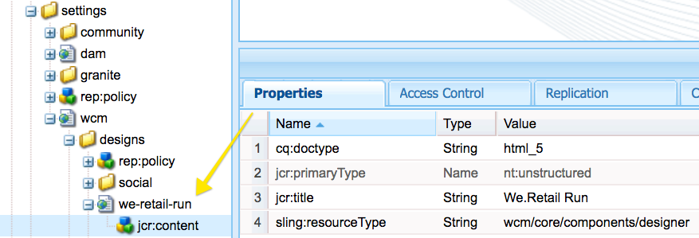

# 開發AEM Screens的自訂元件{#developing-a-custom-component-for-aem-screens}

下列教學課程將逐步說明為AEM Screens建立自訂元件的步驟。 AEM Screens會重新使用其他AEM產品的許多現有設計模式和技術。 本教學課程著重說明開發AEM Screens時的差異和特殊考量。

## 概覽 {#overview}

本教學課程適用於剛接觸AEM Screens的開發人員。 在本教學課程中，已針對AEM Screens中的序列管道建置簡單的「Hello World」元件。 對話方塊可讓作者更新顯示的文字。


## 必備條件 {#prerequisites}

若要完成本教學課程，需要執行下列操作：

1. [AEM 6.5](https://helpx.adobe.com/tw/experience-manager/6-4/release-notes.html) 或 [AEM 6.3](https://helpx.adobe.com/tw/experience-manager/6-3/release-notes.html) + Latest Screens Feature Pack

1. [AEM Screens 播放器](https://helpx.adobe.com/experience-manager/6-4/sites/deploying/using/configuring-screens-introduction.html)
1. 本機開發環境

教學課程步驟和螢幕擷取畫面是使用&#x200B;**CRXDE-Lite**&#x200B;執行。 IDE也可用於完成本教程。 有關使用IDE開發[和AEM的更多資訊，請參見此處。](https://helpx.adobe.com/experience-manager/kt/sites/using/getting-started-wknd-tutorial-develop/part1.html#eclipse-ide)


## 項目設定{#project-setup}

Screens專案的原始碼通常以多模組Maven專案的形式管理。 為了加速教學課程，已使用[AEM專案原型13](https://github.com/Adobe-Marketing-Cloud/aem-project-archetype)預先產生專案。 有關使用Maven AEM專案原型建立專案的[詳細資訊，請參閱此處](https://helpx.adobe.com/experience-manager/kt/sites/using/getting-started-wknd-tutorial-develop/part1.html#maven-multimodule)。

1. 使用[CRX套件管理器](http://localhost:4502/crx/packmgr/index.jsp)下載並安裝下列套件：

[取得檔案](assets/base-screens-weretail-runuiapps-001-snapshot.zip)

   [取得檔案](assets/base-screens-weretail-runuicontent-001-snapshot.zip)
   **** 若使用Eclipse或其他IDE，可選擇下載下列來源套件。使用Maven命令將專案部署至本機AEM執行個體：

   **`mvn -PautoInstallPackage clean install`**

   啟動HelloWorld SRC螢幕We.Retail運行項目

[取得檔案](assets/src-screens-weretail-run.zip)

1. 在[CRX軟體包管理器](http://localhost:4502/crx/packmgr/index.jsp)中，驗證是否安裝了以下兩個軟體包：

   1. **screens-weretail-run.ui.content-0.0.1-SNAPSHOT.zip**
   1. **screens-weretail-run.ui.apps-0.0.1-SNAPSHOT.zip**

   

   透過CRX套件管理器安裝的Screens We.Retail執行Ui.Apps和Ui.Content套件

1. **screens-weretail-run.ui.apps**&#x200B;套件會在`/apps/weretail-run`下安裝程式碼。

   此套件包含負責呈現專案自訂元件的程式碼。 此套件包含元件程式碼，以及需要的任何JavaScript或CSS。 此套件也內嵌&#x200B;**screens-weretail-run.core-0.0.1-SNAPSHOT.jar**，其中包含專案所需的任何Java程式碼。

   >[!NOTE]
   >
   >在本教學課程中，不會編寫Java程式碼。 如果需要更複雜的業務邏輯，可使用核心Java套件來建立和部署後端Java。

   

   在CRXDE Lite中呈現ui.apps程式碼

   **helloworld**&#x200B;元件目前只是預留位置。 在教學課程中，將新增功能，讓作者更新元件顯示的訊息。

1. **screens-weretail-run.ui.content**&#x200B;套件會在下方安裝程式碼：

   * `/conf/we-retail-run`
   * `/content/dam/we-retail-run`
   * `/content/screens/we-retail-run`

   此套件包含專案所需的開始內容和設定結構。 **`/conf/we-retail-run`** 包含We.Retail Run專案的所有設定。**`/content/dam/we-retail-run`** 包括啟動專案的數位資產。**`/content/screens/we-retail-run`** 包含Screens內容結構。這些路徑下方的內容主要會在AEM中更新。 為了提高環境（本地、開發、階段、生產）之間的一致性，通常在原始碼控制中保存基本內容結構。

1. **導覽至「AEM Screens > We.Retail執行」專案：**

   從「 AEM開始」功能表>按一下「畫面」圖示。 驗證是否可以看到We.Retail運行項目。

   

## 建立Hello World元件{#hello-world-cmp}

Hello World元件是一個簡單元件，允許用戶輸入要在螢幕上顯示的消息。 元件以[AEM Screens元件範本為基礎：https://github.com/Adobe-Marketing-Cloud/aem-screens-component-template](https://github.com/Adobe-Marketing-Cloud/aem-screens-component-template)。

AEM Screens有一些有趣的限制，但傳統WCM Sites元件未必如此。

* 大部分的Screens元件都需要在目標數位看板裝置上以全螢幕執行
* 大部分的Screens元件需內嵌在序列頻道中，才能產生投影片
* 製作應允許編輯序列管道中的個別元件，因此無法呈現全螢幕

1. 在&#x200B;**CRXDE-Lite** `http://localhost:4502/crx/de/index.jsp`（或您選擇的IDE）中導航到`/apps/weretail-run/components/content/helloworld.`

   將以下屬性添加到`helloworld`元件中：

   ```
       jcr:title="Hello World"
       sling:resourceSuperType="foundation/components/parbase"
       componentGroup="We.Retail Run - Content"
   ```

   

   /apps/weretail-run/components/content/helloworld的屬性

   **helloworld**&#x200B;元件延伸&#x200B;**foundation/components/parbase**&#x200B;元件，使其能夠在序列通道內正確使用。

1. 在`/apps/weretail-run/components/content/helloworld`下建立名為`helloworld.html.`的檔案

   將下列項目填入檔案：

   ```xml
   <!--/*
   
    /apps/weretail-run/components/content/helloworld/helloworld.html
   
   */-->
   
   <!--/* production: preview authoring mode + unspecified mode (i.e. on publish) */-->
   <sly data-sly-test.production="${wcmmode.preview || wcmmode.disabled}" data-sly-include="production.html" />
   
   <!--/* edit: any other authoring mode, i.e. edit, design, scaffolding, etc. */-->
   <sly data-sly-test="${!production}" data-sly-include="edit.html" />
   ```

   根據使用的[製作模式](https://helpx.adobe.com/experience-manager/6-4/sites/authoring/using/author-environment-tools.html#PageModes),Screens元件需要兩種不同的呈現：

   1. **生產**:預覽或發佈模式(wcmmode=disabled)
   1. **編輯**:用於所有其他製作模式，例如編輯、設計、支架、開發人員……

   `helloworld.html`可做為交換機，檢查目前作用中的製作模式，並重新導向至其他HTL指令碼。螢幕元件使用的常見慣例是為「編輯」模式使用`edit.html`指令碼，為「生產」模式使用`production.html`指令碼。

1. 在`/apps/weretail-run/components/content/helloworld`下建立名為`production.html.`的檔案

   將下列項目填入檔案：

   ```xml
   <!--/*
    /apps/weretail-run/components/content/helloworld/production.html
   
   */-->
   
   <div data-duration="${properties.duration}" class="cmp-hello-world">
    <h1 class="cmp-hello-world__message">${properties.message}</h1>
   </div>
   ```

   以上是Hello World元件的生產標籤。 由於元件用於序列通道，因此包括`data-duration`屬性。 序列通道使用`data-duration`屬性來知道序列項的顯示時間。

   元件會轉譯`div`和包含文字的`h1`標籤。 `${properties.message}` 是HTL指令碼的一部分，會輸出名為的JCR屬性的內 `message`容。稍後將建立一個對話框，允許用戶為`message`屬性文本輸入值。

   另請注意，BEM（區塊元素修飾元）標籤法會與元件搭配使用。 BEM是CSS編碼慣例，可讓您更輕鬆建立可重複使用的元件。 BEM是[AEM核心元件](https://github.com/Adobe-Marketing-Cloud/aem-core-wcm-components/wiki/CSS-coding-conventions)使用的記號。 如需詳細資訊，請參閱：[https://getbem.com/](https://getbem.com/)

1. 在`/apps/weretail-run/components/content/helloworld`下建立名為`edit.html.`的檔案

   將下列項目填入檔案：

   ```xml
   <!--/*
   
    /apps/weretail-run/components/content/helloworld/edit.html
   
   */-->
   
   <!--/* if message populated */-->
   <div
    data-sly-test.message="${properties.message}"
    class="aem-Screens-editWrapper cmp-hello-world">
    <p class="cmp-hello-world__message">${message}</p>
   </div>
   
   <!--/* empty place holder */-->
   <div data-sly-test="${!message}"
        class="aem-Screens-editWrapper cq-placeholder cmp-hello-world"
        data-emptytext="${'Hello World' @ i18n, locale=request.locale}">
   </div>
   ```

   以上是Hello World元件的編輯標籤。 如果已填入對話方塊訊息，第一個區塊會顯示元件的編輯版本。

   如果未輸入對話消息，則呈現第二塊。 `cq-placeholder`和`data-emptytext`將標籤&#x200B;***Hello World***&#x200B;呈現為該情況下的位置保持器。 標籤的字串可以使用i18n進行國際化，以支援在多個語言環境中編寫。

1. **複製要用於Hello World元件的螢幕影像對話框。**

   最簡單的方式是從現有對話方塊開始，然後進行修改。

   1. 從以下位置複製對話框：`/libs/screens/core/components/content/image/cq:dialog`
   1. 在`/apps/weretail-run/components/content/helloworld`下方貼上對話方塊

   

1. **更新「Hello World」對話框以包含消息的頁簽。**

   更新對話方塊，使其符合下列項目。 最終對話框的JCR節點結構以XML形式顯示如下：

   ```xml
   <?xml version="1.0" encoding="UTF-8"?>
   <jcr:root xmlns:sling="https://sling.apache.org/jcr/sling/1.0" xmlns:cq="https://www.day.com/jcr/cq/1.0" xmlns:jcr="https://www.jcp.org/jcr/1.0" xmlns:nt="https://www.jcp.org/jcr/nt/1.0"
       jcr:primaryType="nt:unstructured"
       jcr:title="Hello World"
       sling:resourceType="cq/gui/components/authoring/dialog">
       <content
           jcr:primaryType="nt:unstructured"
           sling:resourceType="granite/ui/components/coral/foundation/tabs"
           size="L">
           <items jcr:primaryType="nt:unstructured">
               <message
                   jcr:primaryType="nt:unstructured"
                   jcr:title="Message"
                   sling:resourceType="granite/ui/components/coral/foundation/fixedcolumns">
                   <items jcr:primaryType="nt:unstructured">
                       <column
                           jcr:primaryType="nt:unstructured"
                           sling:resourceType="granite/ui/components/coral/foundation/container">
                           <items jcr:primaryType="nt:unstructured">
                               <message
                                   jcr:primaryType="nt:unstructured"
                                   sling:resourceType="granite/ui/components/coral/foundation/form/textfield"
                                   fieldDescription="Message for component to display"
                                   fieldLabel="Message"
                                   name="./message"/>
                           </items>
                       </column>
                   </items>
               </message>
               <sequence
                   jcr:primaryType="nt:unstructured"
                   jcr:title="Sequence"
                   sling:resourceType="granite/ui/components/coral/foundation/fixedcolumns">
                   <items jcr:primaryType="nt:unstructured">
                       <column
                           jcr:primaryType="nt:unstructured"
                           sling:resourceType="granite/ui/components/coral/foundation/container">
                           <items jcr:primaryType="nt:unstructured">
                               <duration
                                   jcr:primaryType="nt:unstructured"
                                   sling:resourceType="granite/ui/components/coral/foundation/form/numberfield"
                                   defaultValue=""
                                   fieldDescription="Amount of time the image will be shown in the sequence, in milliseconds"
                                   fieldLabel="Duration (ms)"
                                   min="0"
                                   name="./duration"/>
                           </items>
                       </column>
                   </items>
               </sequence>
           </items>
       </content>
   </jcr:root>
   ```

   消息的文本欄位將保存到名為`message`的屬性，並且持續時間的數字欄位將保存到名為`duration`的屬性。 HTL在`/apps/weretail-run/components/content/helloworld/production.html`中將這兩個屬性都參照為`${properties.message}`和`${properties.duration}`。

   

   Hello World — 已完成對話

## 建立用戶端程式庫 {#clientlibs}

用戶端資料庫提供組織及管理AEM實作所需CSS和JavaScript檔案的機制。

AEM Screens元件在編輯模式和預覽/生產模式中呈現的呈現方式不同。 將建立兩個用戶端程式庫，一個用於編輯模式，另一個用於預覽/生產。

1. 為Hello World元件的用戶端程式庫建立資料夾。

   在`/apps/weretail-run/components/content/helloworld`下方建立名為`clientlibs`的新資料夾。

   

1. 在`clientlibs`資料夾下面建立一個名為`shared`的`cq:ClientLibraryFolder.`類型的新節點

   

1. 將以下屬性添加到共用客戶端庫：

   * `allowProxy` | 布林函數 | `true`

   * `categories`|字串[] |  `cq.screens.components`

   

   /apps/weretail-run/components/content/helloworld/clientlibs/shared的屬性

   categories屬性是識別用戶端程式庫的字串。 cq.screens.components類別可在「編輯」和「預覽/生產」模式中使用。 因此，在sharedclientlib中定義的任何CSS/JS都會在所有模式中載入。

   最佳作法是絕不直接公開任何路徑至生產環境中的/apps。 allowProxy屬性可確保透過首碼of/etc.clientlibs參考用戶端程式庫CSS和JS。

1. 在共用資料夾下建立名為`css.txt`的檔案。

   將下列項目填入檔案：

   ```
   #base=css
   
   styles.less
   ```

1. 在`shared`資料夾下方建立名為`css`的資料夾。 在`css`資料夾下方新增名為`style.less`的檔案。 用戶端程式庫的結構現在應該如下所示：

   

   本教學課程不會直接編寫CSS，而是使用LESS。 [](https://lesscss.org/) LESS是一種熱門的CSS預編譯器，支援CSS變數、mixin和函式。AEM用戶端程式庫原本支援LESS編譯。 可以使用Sas或其他預編譯器，但需要在AEM之外進行編譯。

1. 將以下內容填入`/apps/weretail-run/components/content/helloworld/clientlibs/shared/css/styles.less`:

   ```css
   /**
       Shared Styles
      /apps/weretail-run/components/content/helloworld/clientlibs/shared/css/styles.less
   
   **/
   
   .cmp-hello-world {
       background-color: #fff;
   
    &__message {
     color: #000;
     font-family: Helvetica;
     text-align:center;
    }
   }
   ```

1. 複製並貼上`shared`客戶端庫資料夾以建立名為`production`的新客戶端庫。

   

   複製共用客戶端庫以建立新的生產客戶端庫

1. 將生產clientlibrary的`categories`屬性更新為`cq.screens.components.production.`

   這可確保樣式只有在預覽/生產模式中才會載入。

   

   /apps/weretail-run/components/content/helloworld/clientlibs/production的屬性

1. 將以下內容填入`/apps/weretail-run/components/content/helloworld/clientlibs/production/css/styles.less`:

   ```css
   /**
       Production Styles
      /apps/weretail-run/components/content/helloworld/clientlibs/production/css/styles.less
   
   **/
   .cmp-hello-world {
   
       height: 100%;
       width: 100%;
       position: fixed;
   
    &__message {
   
     position: relative;
     font-size: 5rem;
     top:25%;
    }
   }
   ```

   上述樣式會在畫面中央顯示訊息，但僅限在生產模式中。

第三個clientlibrary類別：`cq.screens.components.edit`可用來將僅限編輯的特定樣式新增至元件。

| Clientlib類別 | 使用狀況 |
|---|---|
| `cq.screens.components` | 在編輯和生產模式之間共用的樣式和指令碼 |
| `cq.screens.components.edit` | 僅用於編輯模式的樣式和指令碼 |
| `cq.screens.components.production` | 僅用於生產模式的樣式和指令碼 |

## 建立設計頁面{#design-page}

AEM Screens使用[靜態頁面範本](https://helpx.adobe.com/experience-manager/6-5/sites/developing/using/page-templates-static.html)和[設計設定](https://helpx.adobe.com/experience-manager/6-4/sites/authoring/using/default-components-designmode.html)進行全域變更。 設計設定常用來為通道上的Parsys設定允許的元件。 最佳實務是以應用程式專屬的方式儲存這些設定。

在「We.Retail執行設計」頁面下方建立，該頁面會儲存We.Retail執行專案的所有特定設定。

1. 在&#x200B;**CRXDE-Lite** `http://localhost:4502/crx/de/index.jsp#/apps/settings/wcm/designs`中導覽至`/apps/settings/wcm/designs`
1. 在設計資料夾下方建立新節點，名為`we-retail-run`，類型為`cq:Page`。
1. 在`we-retail-run`頁面下，添加另一個名為`jcr:content`的`nt:unstructured`類型節點。 將以下屬性添加到`jcr:content`節點：

   | 名稱 | 類型 | 值 |
   |---|---|---|
   | jcr:title | 字串 | We.Retail運行 |
   | sling:resourceType | 字串 | wcm/core/components/designer |
   | cq:doctype | 字串 | html_5 |

   

   設計頁面（位於/apps/settings/wcm/designs/we-retail-run）

## 建立序列通道{#create-sequence-channel}

Hello World元件用於序列管道。 要測試元件，將建立新的「序列通道」。

1. 從「AEM開始」菜單，導航至&#x200B;**Screens** > **We.Retail Ru** n >並選擇&#x200B;**Channels**。

1. 按一下&#x200B;**Create**&#x200B;按鈕

   1. 選擇&#x200B;**建立實體**

   

1. 在建立精靈中：

1. 模板步驟 — 選擇&#x200B;**序列通道**

   1. 屬性步驟
   * 基本頁簽>標題= **空閒通道**
   * 通道頁簽>檢查&#x200B;**使通道聯機**

   

1. 開啟「空閒通道」的頁面屬性。 更新「設計」欄位，以指向在前一節中建立的`/apps/settings/wcm/designs/we-retail-run,`設計頁面。

   

   指向/apps/settings/wcm/designs/we-retail-run的設計配置

1. 編輯新建立的空閒通道以開啟它。

1. 將頁面模式切換為&#x200B;**Design**&#x200B;模式

   1. 按一下Parsys中的&#x200B;**扳手**&#x200B;圖示，以設定允許的元件

   1. 選擇&#x200B;**Screens**&#x200B;群組和&#x200B;**We.Retail Run - Content**&#x200B;群組。

   

1. 將頁面模式切換為&#x200B;**Edit**。 您現在可以將Hello World元件新增至頁面，並與其他序列管道元件結合。

   

1. 在&#x200B;**CRXDE-Lite** `http://localhost:4502/crx/de/index.jsp#/apps/settings/wcm/designs/we-retail-run/jcr%3Acontent/sequencechannel/par`中導覽至`/apps/settings/wcm/designs/we-retail-run/jcr:content/sequencechannel/par`。 請注意，`components`屬性現在包含`group:Screens`、`group:We.Retail Run - Content`。

   

   /apps/settings/wcm/designs/we-retail-run下的設計配置

## 自定義處理程式的模板{#custom-handlers}

如果您的自訂元件使用外部資源，例如資產（影像、視訊、字型、圖示等）、特定資產轉譯或用戶端程式庫（css、js等），則這些資源不會自動新增至離線設定，因為我們預設只會捆綁HTML標籤。

為了讓您自訂並最佳化下載至播放器的確切資產，我們提供自訂元件的擴充功能機制，以在Screens中公開其相依性至離線快取邏輯。

下節將展示自訂離線資源處理常式的範本，以及該特定專案在`pom.xml`中的最低需求。

```java
package …;

import javax.annotation.Nonnull;

import org.apache.felix.scr.annotations.Component;
import org.apache.felix.scr.annotations.Reference;
import org.apache.felix.scr.annotations.Service;
import org.apache.sling.api.resource.Resource;
import org.apache.sling.api.resource.ResourceUtil;
import org.apache.sling.api.resource.ValueMap;

import com.adobe.cq.screens.visitor.OfflineResourceHandler;

@Service(value = OfflineResourceHandler.class)
@Component(immediate = true)
public class MyCustomHandler extends AbstractResourceHandler {

 @Reference
 private …; // OSGi services injection

 /**
  * The resource types that are handled by the handler.
  * @return the handled resource types
  */
 @Nonnull
 @Override
 public String[] getSupportedResourceTypes() {
     return new String[] { … };
 }

 /**
  * Accept the provided resource, visit and traverse it as needed.
  * @param resource The resource to accept
  */
 @Override
 public void accept(@Nonnull Resource resource) {
     ValueMap properties = ResourceUtil.getValueMap(resource);
     
     /* You can directly add explicit paths for offline caching using the `visit`
        method of the visitor. */
     
     // retrieve a custom property from the component
     String myCustomRenditionUrl = properties.get("myCustomRenditionUrl", String.class);
     // adding that exact asset/rendition/path to the offline manifest
     this.visitor.visit(myCustomRenditionUrl);
     
     
     /* You can delegate handling for dependent resources so they are also added to
        the offline cache using the `accept` method of the visitor. */
     
     // retrieve a referenced dependent resource
     String referencedResourcePath = properties.get("myOtherResource", String.class);
     ResourceResolver resolver = resource.getResourceResolver();
     Resource referencedResource = resolver.getResource(referencedResourcePath);
     // let the handler for that resource handle it
     if (referencedResource != null) {
         this.visitor.accept(referencedResource);
     }
   }
}
```

以下代碼提供`pom.xml`中該特定項目的最低要求：

```css
   <dependencies>
        …
        <!-- Felix annotations -->
        <dependency>
            <groupId>org.apache.felix</groupId>
            <artifactId>org.apache.felix.scr.annotations</artifactId>
            <version>1.9.0</version>
            <scope>provided</scope>
        </dependency>

        <!-- Screens core bundle with OfflineResourceHandler/AbstractResourceHandler -->
        <dependency>
            <groupId>com.adobe.cq.screens</groupId>
            <artifactId>com.adobe.cq.screens</artifactId>
            <version>1.5.90</version>
            <scope>provided</scope>
        </dependency>
        …
      </dependencies>
```

## 將所有內容放在一起{#putting-it-all-together}

以下影片顯示已完成的元件，以及如何將其新增至「序列」管道。 然後，該頻道會新增至「位置」顯示畫面，並最終指派給Screens播放器。

>[!VIDEO](https://video.tv.adobe.com/v/22385?quaity=9)

## 已完成代碼{#finished-code}

以下是教學課程中完成的程式碼。 **screens-weretail-run.ui.apps-0.0.1-SNAPSHOT.zip**&#x200B;和&#x200B;**screens-weretail-run.ui.content-0.0.1-SNAPSHOT.zip**&#x200B;是已編譯的AEM套件。 **SRC-screens-weretail-run-0.0.1.zip **是未編譯的原始碼，可使用Maven部署。

[取得檔案](assets/screens-weretail-runuiapps-001-snapshot.zip)

[取得檔案](assets/screens-weretail-runuicontent-001-snapshot.zip)

[取得檔案](assets/screens-weretail-run.zip)
