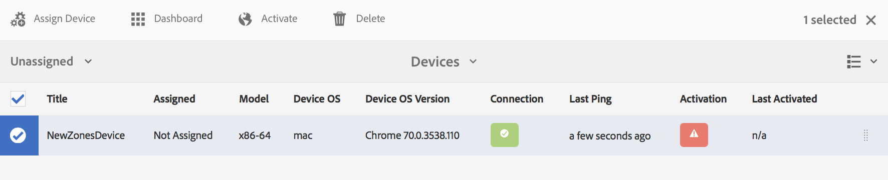

# 裝置註冊 {#device-registration}

下頁說明AEM Screens專案中的裝置註冊程式。

## 註冊設備 {#registering-a-device}

裝置註冊程式是在2部不同的電腦上完成：

* 要註冊的實際設備，例如您的標牌展示
* 用於註冊您裝置的AEM伺服器

>[!NOTE]
>
>在您從&#x200B;*AEM 6.4 Player下載頁面下載最新的Windows Player(*.exe [](https://download.macromedia.com/screens/) )後，請依照播放器上的步驟完成臨機安裝：
>
>1. 長按左上角以開啟管理面板。
>1. 從左側 **動作功能表導覽至** 「設定」，然後在 **Server中輸入AEM例項的位置位址，然後按一下「儲** 存」 ****。
>1. 按一下左 **側動作功能表** 中的「註冊」連結，以及下列步驟以完成裝置註冊程式。

>


1. 在您的裝置上啟動AEM Screens Player。 會顯示註冊UI。

   

1. 在AEM中，導覽至專案的 **Devices** （裝置）檔案夾。

   >[!NOTE]
   >
   >如需在AEM儀表板中建立新畫面專案的詳細資訊，請參閱「建立及管 [理畫面專案」](creating-a-screens-project.md)。

1. 點選／按一下動 **作列中的「Device Manager** （裝置管理器）」按鈕。

   

1. 點選／按一下右 **上方的「Device Registration** （裝置註冊）」按鈕。

   

1. 選取所需的裝置（與步驟1相同），然後點選／按一下「 **註冊裝置」**。

   

1. 在AEM中，請等候裝置傳送其註冊代碼。

   

1. 在您的裝置中，勾選注 **冊碼**。

   

1. 如果兩 **部電腦上的「註冊代碼** 」都相同，請點選／按一下AEM中的「驗證 **** 」按鈕，如步驟(6)所示。
1. 設定所要的裝置名稱，然後按一下「注 **冊」**。

   

1. 點選／按一 **下「完成** 」以完成註冊程式。

   

   >[!NOTE]
   >
   >「注 **冊新** 」允許您註冊新設備。
   >
   >「指 **派顯示** 」可讓您直接將裝置新增至顯示器。

   如果您按一 **下「完成**」，則需要將裝置指派給顯示器。

   

   >[!NOTE]
   >
   >若要進一步瞭解如何建立和管理螢幕專案的顯示，請參閱「建立 [和管理顯示」](managing-displays.md)。

### 將設備分配給顯示器 {#assigning-device-to-a-display}

如果您尚未將裝置指派給顯示器，請依照下列步驟，將裝置指派給AEM Screens專案中的顯示器：

1. 選擇設備，然後從操 **作欄中按一下** 「指定設備」。

   

1. 在「顯示／設備配置路徑」中 **選擇顯示的路徑**。

   

1. 選取 **路徑時** ，按一下「指派」。

   

1. 成功 **分配設備後** ，按一下「完成」(Finish)，如下圖所示。

   

   此外，按一下「完成」( **Finish)可查看顯示控制**&#x200B;板。

   

## 裝置註冊的限制 {#limitations-on-device-registration}

系統範圍的用戶密碼限制可能導致設備註冊失敗。 設備註冊使用隨機生成的口令來建立設備用戶。

如果密碼受到 *AuthorizableActionProvider配置的限制* ，則建立設備用戶可能失敗。

>[!NOTE]
>
>目前產生的隨機密碼由36個ASCII字元組成，範圍從33到122個（幾乎包含所有特殊字元）。

```java
25.09.2016 16:54:03.140 *ERROR* [59.100.121.82 [1474844043109] POST /content/screens/svc/registration HTTP/1.1] com.adobe.cq.screens.device.registration.impl.RegistrationServlet Error during device registration
javax.jcr.nodetype.ConstraintViolationException: Password violates password constraint (^(?=.*\d).{7,9}$).
        at org.apache.jackrabbit.oak.spi.security.user.action.PasswordValidationAction.validatePassword(PasswordValidationAction.java:105)
        at org.apache.jackrabbit.oak.spi.security.user.action.PasswordValidationAction.onPasswordChange(PasswordValidationAction.java:76)
        at org.apache.jackrabbit.oak.security.user.UserManagerImpl.onPasswordChange(UserManagerImpl.java:308)
```

### 其他資源 {#additional-resources}

若要瞭解AEM Screens Player，請參閱 [AEM Screens Player](working-with-screens-player.md)。
