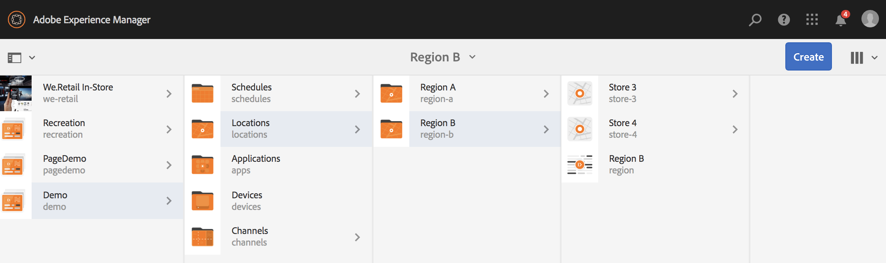
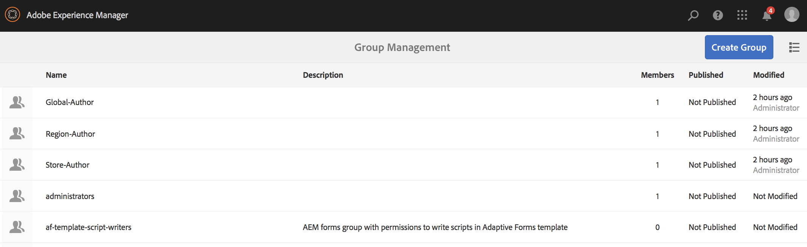
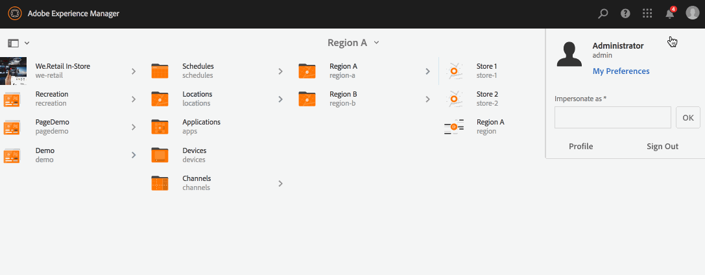

# 使用動態嵌入序列{#using-dynamic-embedded-sequence}

使用動態內嵌序列涵蓋下列主題：

* **概覽**
* **在AEM Screens中使用動態內嵌體驗**
* **查看結果**
* **限制用戶和修改ACL**

## 概覽 {#overview}

***動態內嵌*** 序列是為遵循父子階層的大型專案建立，其中子項是在位置資料夾而非管道資料夾內參照。它可讓使用者透過&#x200B;***管道角色***&#x200B;將序列內嵌在管道內。 它可讓使用者使用主管道內的內嵌序列，為不同辦公室定義位置特定預留位置。

將管道指派給顯示時，您可以選擇指定顯示路徑或管道角色，以依內容解析為實際管道。

若要使用動態內嵌序列，請依&#x200B;***通道角色***&#x200B;指派通道。 管道角色會定義顯示內容。 該角色由各種行動定位，且與實現該角色的實際渠道無關。 本節說明可依角色定義管道的使用案例，以及如何將該內容運用於全域管道。 您也可以將角色視為指派的識別碼，或的通道別名。

### 使用動態嵌入序列{#benefits-of-using-dynamic-embedded-sequences}的優點

將序列頻道放置在位置內（而非頻道資料夾）的主要優點，是可讓本機或區域作者編輯與其相關的內容，同時受限於編輯階層中上層的頻道。

參考&#x200B;*依角色的頻道*&#x200B;可讓您建立頻道的本機版本，以動態解析位置特定內容，也可讓您建立全域頻道，針對位置特定頻道運用內容。

>[!NOTE]
>
>**嵌入序列與動態嵌入序列**
>
>動態內嵌序列類似於內嵌序列，但可讓使用者遵循階層，對一個管道所做的變更/更新會傳播至相關的其他管道。 它遵循上下階層，也包含影像或視訊等資產。
>
>***「動態內嵌*** 序列」可讓您顯示特定位置的內容，而「內嵌 ***序列」*** 僅顯示內容的一般投影片放映。此外，在設定動態內嵌序列時，您需要使用管道角色和名稱來設定管道。 請參閱下列步驟，以實際實施。
>
>若要進一步了解如何實作內嵌序列，請參閱AEM Screens中的[內嵌序列](embedded-sequences.md)。

下列範例提供解決方案，著重於下列關鍵字：

* 全局序列的&#x200B;***主序列通道***
* ***針對序*** 列的每個本地可定製部分的動態嵌入式序列元件
* ***個別序*** 列會以符合動態 ** 內嵌序列元件角色的 **角色來改變個別 *位置*。**

>[!NOTE]
>
>若要深入了解通道指派，請參閱AEM Screens檔案中「編寫」區段下的&#x200B;**[通道指派](channel-assignment.md)**。

## 使用動態嵌入序列{#using-dynamic-embedded-sequence-2}

下節說明如何在AEM Screens管道中建立動態內嵌序列。

### 必備條件 {#prerequisites}

開始實作此功能之前，請確定您具備下列必要條件，準備好開始實作動態內嵌序列：

* 建立AEM Screens專案（在此範例中，**Demo**）

* 在&#x200B;**Channels**&#x200B;資料夾下，將通道建立為&#x200B;**Global**

* 將內容新增至您的&#x200B;**全域**&#x200B;頻道（*請檢查&#x200B;**Resources.zip**以取得相關資產*）

下圖顯示&#x200B;**Channels**&#x200B;資料夾中&#x200B;**Global**&#x200B;通道的&#x200B;**Demo**專案。

### 資源 {#resources}

您可以下載下列資源（影像並將這些資源新增至資產），並進一步將這些資源用作頻道內容以供展示。

[取得檔案](assets/resources.zip)

>[!NOTE]
>
>如需如何建立專案及如何建立序列管道的詳細資訊，請參閱下列資源：
>
>* **[建立和管理專案](creating-a-screens-project.md)**
>* **[管理管道](managing-channels.md)**

>

在AEM Screens專案中實作動態內嵌序列涉及三項主要工作：

1. **設定專案分類法，包括管道、位置和顯示**
1. **建立排程**
1. **為每個顯示分配調度**

請依照下列步驟來實作功能：

>[!CAUTION]
>
>實作動態內嵌序列時，在每個位置下建立通道時，請留意&#x200B;**Name**&#x200B;和&#x200B;**Title**&#x200B;欄位。 請認真按照命名法的說明。

1. **建立兩個位置資料夾。**

   導覽至AEM Screens專案中的&#x200B;**Locations**&#x200B;資料夾，並建立兩個位置資料夾，分別作為&#x200B;**Region A**&#x200B;和&#x200B;**Region B**。

   >[!NOTE]
   >
   >建立&#x200B;**Region A**&#x200B;位置資料夾時，請務必將&#x200B;**Title**&#x200B;輸入為&#x200B;**Region A**，並將&#x200B;**Name**&#x200B;欄位保留為空白，以便自動擷取&#x200B;**region-a**&#x200B;名稱。
   >
   >類似地，建立位置資料夾&#x200B;**區域B**&#x200B;的情況如下：

   

   >[!NOTE]
   >要了解如何建立位置，請參閱&#x200B;**[建立和管理位置](managing-locations.md)**。

1. **在每個位置資料夾下建立兩個位置和一個通道。**

   1. 導覽至&#x200B;**Demo** —> **Locations** —> **Region A**。
   1. 選擇&#x200B;**區域A**，然後從操作欄按一下&#x200B;**+建立**。
   1. 從嚮導中選擇&#x200B;**Location**，將&#x200B;**Title**&#x200B;作為&#x200B;**Store 1**。 同樣地，從名為&#x200B;**Store 2**&#x200B;的精靈中建立另一個位置，其中&#x200B;**Title**&#x200B;為&#x200B;**Store 2**。 建立&#x200B;**Store 1**&#x200B;和&#x200B;**Store 2**&#x200B;時，您可以將&#x200B;**Name**&#x200B;欄位留空。
   1. 重複步驟(b)，現在從嚮導中選擇&#x200B;**序列通道**。 為此通道輸入&#x200B;**Title**&#x200B;作為&#x200B;**Region A**&#x200B;和&#x200B;**Name**&#x200B;作為&#x200B;**region**。

   >[!CAUTION]
   >
   >請確保在建立通道&#x200B;**區域A**&#x200B;時，將&#x200B;**標題**&#x200B;輸入為&#x200B;**區域A**，將&#x200B;**名稱**&#x200B;輸入為&#x200B;**區域**。

   

   同樣地，在&#x200B;**Region B**&#x200B;下建立兩個位置，標題為&#x200B;**Store 3**&#x200B;和&#x200B;**Store 4**。 同時，建立&#x200B;**序列通道**，其中&#x200B;**標題**&#x200B;為&#x200B;**區域B**,**名稱**&#x200B;為&#x200B;**區域**。

   >[!CAUTION]
   >
   >請務必為在&#x200B;**地區A**&#x200B;和&#x200B;**地區B**&#x200B;中建立的頻道使用相同名稱，作為&#x200B;**地區**。

   

1. **在每個位置下建立顯示和通道。**

   1. 導覽至&#x200B;**Demo** —> **Locations** —> **Region A** —> **Store 1**。
   1. 選擇「**儲存1**」，然後從操作欄按一下「**+建立**」。
   1. 從嚮導中選擇&#x200B;**Display**&#x200B;並建立&#x200B;**Store1Display。**
   1. 重複步驟(b)，此次從嚮導中選擇&#x200B;**序列通道**。 將&#x200B;**Title**&#x200B;輸入為&#x200B;**Store1Channel**，將&#x200B;**Name**&#x200B;輸入為&#x200B;**store**。

   >[!CAUTION]
   >
   >建立序列通道時，通道的&#x200B;**Title**&#x200B;可以作為您的要求，但所有本地通道中的&#x200B;**Name**應相同。
   >在本例中，**區域A**&#x200B;和&#x200B;**區域B**&#x200B;下的通道與&#x200B;**區域**&#x200B;下的通道和&#x200B;**儲存1**、**儲存2**、**儲存3**&#x200B;和&lt;a14/4 **下的通道共用相同/>將**&#x200B;命名為&#x200B;**store**。********

   

   同樣地，在&#x200B;**Store 2**（名稱為&#x200B;**store**）下建立顯示為&#x200B;**Store2Display**&#x200B;和通道&#x200B;**Store2Channel**。

   >[!NOTE]
   >請務必為在&#x200B;**Store 1**&#x200B;和&#x200B;**Store 2**&#x200B;中建立的通道使用與&#x200B;**store**&#x200B;相同的名稱。

   

   按照上述步驟建立通道並顯示在&#x200B;**Store 3**&#x200B;和&#x200B;**Store 4****Region B**&#x200B;下。 同樣地，請務必在建立通道&#x200B;**Store3Channel**&#x200B;和&#x200B;**Store4Channel**&#x200B;時，使用與&#x200B;**store**&#x200B;相同的&#x200B;**名稱**。

   下圖顯示&#x200B;**Store 3**&#x200B;中的顯示和通道。

   

   下圖顯示&#x200B;**Store 4**&#x200B;中的顯示和通道。

   

1. **將內容新增至其個別位置中的頻道。**

   導覽至&#x200B;**Demo** -> **Locations** -> **Region A** -> **Region A** ，然後按一下動作列中的&#x200B;**Edit**。 拖放您要新增至管道的資產。

   >[!NOTE]
   >您可以使用上方&#x200B;**Resources**&#x200B;區段的&#x200B;***Resources.zip***&#x200B;檔案，將影像用作頻道內容的資產。

   

   同樣地，導覽至&#x200B;**Demo** -> **Locations** -> **Region B** -> **Region B** ，然後按一下動作列中的&#x200B;**Edit** ，將資產拖放至您的通道，如下所示：

   

   請依照上述步驟和資源，將內容新增至下列管道：

   * **Store1Channel**
   * **Store2Channel**
   * **Store3Channel**
   * **Store4Channel**

1. **建立排程**

   導覽並選取AEM Screens專案中的&#x200B;**排程**&#x200B;資料夾，然後按一下動作列中的&#x200B;**建立**&#x200B;以建立新排程。

   下圖顯示在&#x200B;**Demo**&#x200B;專案中建立的&#x200B;**AdSchedule**。

   

1. **將管道指派給排程**

   1. 導覽至&#x200B;**Demo** —> **Schedules** —> **AdSchedule** ，然後從動作列按一下&#x200B;**Dashboard**。
   1. 按一下&#x200B;**+從** ASSIGNED CHANNELS **面板中的「分配通道」**&#x200B;以開啟「**通道分配**」對話框。
   1. 選擇&#x200B;**引用通道**。 依路徑.
   1. 選擇&#x200B;**通道路徑**&#x200B;作為&#x200B;**Demo** —> ***通道*** —> ***全局***。
   1. 輸入&#x200B;**通道角色**&#x200B;作為&#x200B;**GlobalAdSegment**。
   1. 選擇&#x200B;**支援的事件**&#x200B;作為&#x200B;**初始載入**、**空閒螢幕**&#x200B;和&#x200B;**用戶交互**。
   1. 按一下「**儲存**」。

   **為地區按角色分配渠道：**

   1. 按一下&#x200B;**+從** ASSIGNED CHANNELS **面板中的「分配通道」**&#x200B;以開啟「**通道分配**」對話框。
   1. 選擇&#x200B;**引用通道**。 依名稱.
   1. 輸入&#x200B;**通道名稱**&#x200B;作為&#x200B;**region***。
   1. 輸入&#x200B;**通道角色**&#x200B;作為&#x200B;**RegionAdSegment**。
   1. 按一下「**儲存**」。

   **按角色為儲存分配管道：**

   1. 按一下&#x200B;**+從** ASSIGNED CHANNELS **面板中的「分配通道」**&#x200B;以開啟「**通道分配**」對話框。
   1. 選擇&#x200B;**引用通道**。 依名稱.
   1. 輸入&#x200B;**通道名稱**&#x200B;作為&#x200B;**store**。
   1. 輸入&#x200B;**通道角色**&#x200B;作為&#x200B;**StoreAdSegment**。
   1. 按一下「**儲存**」。

   下圖依路徑和角色顯示指派的通道。

   

1. **將動態內嵌序列設定為全域通道。**

   導覽至&#x200B;**全域**&#x200B;頻道，您最初是在&#x200B;**Demo**&#x200B;專案中建立。

   按一下動作中的&#x200B;**編輯**&#x200B;以開啟編輯器。

   

   在通道編輯器中拖放兩個&#x200B;**動態內嵌序列**&#x200B;元件。

   從其中一個元件開啟屬性，然後將&#x200B;**通道分配角色**&#x200B;輸入為&#x200B;**RegionAdSegment**。

   同樣，選擇其他元件並開啟屬性以將&#x200B;**通道分配角色**&#x200B;輸入為&#x200B;**StoreAdSegment**。

   

1. **為每個顯示分配調度**

   1. 導航到每個顯示，如&#x200B;**Demo** —> **Locations** —> **Region A** —>**Store 1** —>**Store1Display**。
   1. 從動作按一下&#x200B;**控制面板**&#x200B;以開啟顯示控制面板。
   1. 按一下&#x200B;**...**「已分配通道和計畫」**面板中的**，然後按一下&#x200B;**+「已分配計畫」**。
   1. 選擇「調度」的路徑（例如，此處&#x200B;**Demo** —> **調度** —>**AdSchedule**）。
   1. 按一下「**儲存**」。

## 查看結果{#viewing-the-results}

設定好頻道和顯示完成後，請啟動AEM Screens播放器以檢視內容。

>[!NOTE]
>
>若要了解AEM Screen Player，請參閱下列資源：
>
>* [AEM Screens播放器下載](https://download.macromedia.com/screens/)
>* [使用AEM Screens Player](working-with-screens-player.md)

下列輸出會根據顯示路徑，確認AEM Screens播放器中的頻道內容。

**案例1**:

如果將顯示路徑指定為&#x200B;**Demo** —> **Locations** —> **Region A** —> **Store 1** —> **Store1Display**，則以下內容將在您的AEM Screens播放器上顯示。

**案例1**:

如果將顯示路徑指定為&#x200B;**Demo** —> **Locations** —> **Region B** —> **Store 3** —> **Store3Display**，則以下內容將在您的AEM Screens播放器上顯示。

## 限制用戶和修改ACL {#restricting-users-and-modifying-the-acls}

您可以建立全域、地區或本機作者，以編輯與其相關的內容，同時限制編輯階層中上層的管道。

您需要修改ACL，以根據用戶的位置限制用戶對內容的訪問。

### 使用案例範例{#example-use-case}

以下範例可讓您為上述示範專案建立三個使用者。

為每個組分配的權限如下：

**群組**:

* **全域作者**:包含具有Demoproject中所有位置和通道的訪問權 **** 限，並具有所有讀、寫和編輯權限的用戶。

* **地區作者**:包含對地區和地區B具有讀取、寫入和編輯權 **限** 的 **使用者**。

* **商店作者**:包含只對Store 1 **、Store 2** **、Store 3** **和Store 4**&#x200B;擁有讀取、寫入和編輯權限的 ****&#x200B;使用者。

#### 建立用戶組、用戶和設定ACL的步驟{#steps-for-creating-user-groups-users-and-setting-up-acls}

>[!NOTE]
要詳細了解如何使用ACL隔離項目，使每個個人或團隊都能處理自己的項目，請參閱&#x200B;**設定ACL**。

請依照下列步驟建立群組、使用者，並依權限修改ACL:

1. **建立群組**

   1. 導覽至&#x200B;**Adobe Experience Manager**。
   1. 按一下&#x200B;**工具** —> **安全** —> **組**。
   1. 按一下「**建立組**」，然後在&#x200B;**ID**&#x200B;中輸入&#x200B;**Global-Author**。
   1. 按一下&#x200B;**「儲存並關閉」**。

   同樣地，建立其他兩個群組，例如&#x200B;**Region-Author**&#x200B;和&#x200B;**Store-Author**。

   

1. **建立使用者並新增使用者至群組**

   1. 導覽至&#x200B;**Adobe Experience Manager**。
   1. 按一下&#x200B;**工具** —> **安全** —> **用戶**。
   1. 按一下「**建立用戶**」，然後在&#x200B;**ID**&#x200B;中輸入&#x200B;**Global-User**。
   1. 輸入&#x200B;**密碼**&#x200B;並確認此用戶的密碼。
   1. 按一下&#x200B;**組**&#x200B;頁簽，在&#x200B;**選擇組**&#x200B;中輸入組名，例如，輸入&#x200B;**全局作者**&#x200B;以將&#x200B;**全局用戶**&#x200B;添加到該特定組。
   1. 按一下&#x200B;**「儲存並關閉」**。

   同樣地，建立其他兩個用戶，如&#x200B;**Region-User**&#x200B;和&#x200B;**Store-User**，並分別將這些用戶添加到&#x200B;**Region-Author**&#x200B;和&#x200B;**Store-Author**。

   >[!NOTE]
最佳作法是在群組中新增使用者，然後指派權限給每個特定使用者群組。

   

1. **將所有群組新增至貢獻者**

   1. 導覽至&#x200B;**Adobe Experience Manager**。
   1. 按一下&#x200B;**工具** —> **安全** —> **組**。
   1. 從清單中選擇&#x200B;**貢獻者**&#x200B;並選擇&#x200B;**成員**&#x200B;頁簽。
   1. 為貢獻者選取&#x200B;**群組**，例如&#x200B;**Global-Author**、**Region-Author、**&#x200B;和&#x200B;**Store-Author**。
   1. 按一下&#x200B;**「儲存並關閉」**。

1. **存取每個群組的權限**

   1. 導覽至&#x200B;*Useradmin*，並使用此UI修改不同群組的權限。
   1. 搜尋&#x200B;**Global-Author**，然後按一下&#x200B;**權限**&#x200B;標籤，如下圖所示。
   1. 同樣地，您也可以存取&#x200B;**Region-Author**&#x200B;和&#x200B;**Store-Author**&#x200B;的權限。

   

1. **修改每個群組的權限**

   **全域作者：**

   1. 導覽至&#x200B;**權限**&#x200B;標籤
   1. 導覽至&#x200B;***/content/screens/demo***&#x200B;並檢查所有權限
   1. 導覽至&#x200B;***/content/screens/demo/locations***&#x200B;並檢查所有權限
   1. 導覽至&#x200B;***/content/screens/demo/locations/region-a***&#x200B;並檢查所有權限。 同樣地，檢查&#x200B;**region-b**&#x200B;的權限。

   請參閱下圖以了解步驟：
   

   下圖顯示，現在&#x200B;**Global-User**&#x200B;可訪問&#x200B;**Global Channel**&#x200B;以及&#x200B;**Region A**&#x200B;和&#x200B;**Region B**，所有四個儲存：**Store 1**、**Store 2**、**Store 3**&#x200B;和&#x200B;**5/>。**

   

   **地區作者：**

   1. 導覽至「**權限**」標籤。
   1. 導覽至&#x200B;***/content/screens/demo***，並僅檢查&#x200B;**讀取**&#x200B;權限。
   1. 導覽至&#x200B;***/content/screens/demo/locations***，並僅檢查&#x200B;**讀取**&#x200B;權限。
   1. 導覽至&#x200B;***/content/screens/demo/channels***&#x200B;並取消勾選&#x200B;**Global**&#x200B;頻道的權限。
   1. 導覽至&#x200B;***/content/screens/demo/locations***/***region-a***&#x200B;並檢查所有權限。 同樣地，檢查&#x200B;**region-b**&#x200B;的權限。

   請參閱下圖以了解步驟：

   

   下圖顯示，現在區域用戶可以訪問&#x200B;**區域A**&#x200B;和&#x200B;**區域B**，其中所有四個儲存都是：**儲存1**、**儲存2**、**儲存3**&#x200B;和&#x200B;**儲存4**，但不能訪問&#x200B;**全局通道。**

   

   **對於Store-Author:**

   1. 導覽至「**權限**」標籤。
   1. 導覽至&#x200B;***/content/screens/demo***，並僅檢查&#x200B;**讀取**&#x200B;權限。
   1. 導覽至&#x200B;***/content/screens/demo/locations***，並僅檢查&#x200B;**讀取**&#x200B;權限。
   1. 導覽至&#x200B;***/content/screens/demo/channels***&#x200B;並取消勾選&#x200B;**Global**&#x200B;頻道的權限。
   1. 導覽至&#x200B;***/content/screens/demo/locations/region-a***&#x200B;並僅檢查&#x200B;**讀取**&#x200B;權限。 同樣地，請僅檢查&#x200B;**region-b**&#x200B;的&#x200B;**讀取**&#x200B;權限。
   1. 導覽至&#x200B;***/content/screens/demo/locations***/***region-a /store-1***&#x200B;並檢查所有權限。 同樣地，檢查&#x200B;**store-2、store-3、**&#x200B;和&#x200B;**store-4**&#x200B;的權限。

   請參閱下圖以了解步驟：

   

   下圖顯示，現在&#x200B;**Store-User**&#x200B;只能訪問四個儲存區，即&#x200B;**Store 1**、**Store 2**、**Store 3**&#x200B;和&#x200B;**Store 4**，但不具有訪問&#x200B;**Global**&#x200B;或區域（**A**&#x200B;和&#x200B;**A1/**）頻道。

   

>[!NOTE]
要詳細了解有關設定權限的資訊，請參閱[設定ACL](setting-up-acls.md)。

