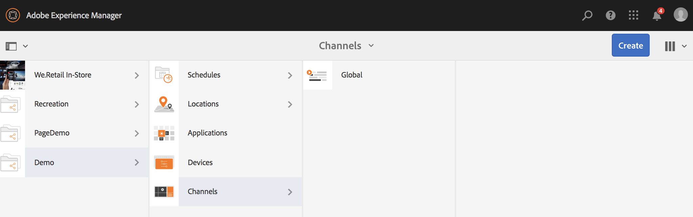
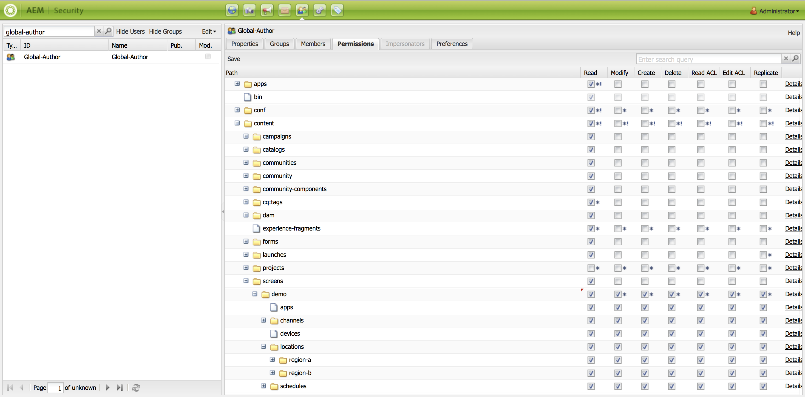

# 使用動態嵌入序列{#using-dynamic-embedded-sequence}

使用動態內嵌序列涵蓋下列主題：

* **概覽**
* **在AEM畫面中使用動態內嵌體驗**
* **查看結果**
* **限制用戶和修改ACL**

## 概覽 {#overview}

***動態內嵌*** 序列是為遵循父項子項階層的大型專案所建立，其中子項在位置檔案夾而非頻道檔案夾中參考。它允許用戶通過&#x200B;***渠道角色***&#x200B;將序列嵌入渠道中。 它可讓使用者使用主頻道內的內嵌序列，為不同辦公室定義特定位置的預留位置。

將渠道指派給顯示時，您可以選擇指定顯示路徑或渠道的角色，以便根據上下文解析為實際渠道。

要使用動態嵌入序列，可以通過&#x200B;***通道角色***&#x200B;分配通道。 渠道角色定義顯示的上下文。 角色由各種動作定位，且與實際執行角色的通道無關。 本節說明一個使用案例，可依角色定義渠道，以及如何將該內容運用到全域渠道。 您也可以將角色視為指派的識別碼，或在的上下文中為渠道的別名。

### 使用動態內嵌序列的優點{#benefits-of-using-dynamic-embedded-sequences}

將序列頻道置於位置而非頻道資料夾的主要優點，是可讓本機或地區作者編輯與其相關的內容，同時不受階層上層編輯頻道的限制。

參照&#x200B;*「依角色的頻道」*，可讓您建立頻道的本機版本，以動態解析特定位置的內容，也可讓您建立運用特定位置頻道內容的全域頻道。

>[!NOTE]
>
>**嵌入序列與動態嵌入序列**
>
>動態內嵌序列類似於內嵌序列，但允許使用者遵循階層，其中對一個頻道所做的變更／更新會傳播至相關的其他頻道。 它遵循父——子階層，也包含影像或視訊等資產。
>
>***「動態內嵌*** 序列」可讓您顯示特定位置的內容，而「內嵌 ***序*** 列」則只顯示內容的一般投影片。此外，在設定動態內嵌序列時，您需要使用頻道角色和名稱來設定頻道。 如需實際實作，請參閱以下步驟。
>
>若要進一步瞭解如何實作內嵌序列，請參閱「AEM畫面中的內嵌序列」。

以下範例針對下列關鍵詞提供解決方案：

* a ***全局序列的主序列通道***
* ***動態內嵌*** 序列元件，用於序列的每個可局部自訂部分
* ***單個序*** 列在各個位置中以符合 ** 動態嵌入序列組 **件角色的角色來 *改變*。**

>[!NOTE]
>
>若要進一步瞭解頻道指派，請參閱AEM Screens檔案中「編寫」區段下的&#x200B;**[頻道指派](channel-assignment.md)**。

## 使用動態嵌入序列{#using-dynamic-embedded-sequence-2}

下節說明如何在AEM Screens頻道中建立動態內嵌序列。

### 必備條件 {#prerequisites}

開始實作此功能之前，請確定您已具備下列必要條件，可開始實作動態內嵌序列：

* 建立AEM Screens專案（在此範例中，**Demo**）

* 在&#x200B;**Channels**&#x200B;資料夾下，建立以&#x200B;**Global**&#x200B;的渠道

* 將內容新增至您的&#x200B;**Global**&#x200B;頻道（*請檢查&#x200B;**Resources.zip**以取得相關資產*）

下圖顯示&#x200B;**Demo**&#x200B;專案，其中&#x200B;**Global**&#x200B;頻道資料夾位於&#x200B;**頻道**資料夾中。

### 資源 {#resources}

您可以下載下列資源（影像並將這些資源新增至資產），並進一步將這些資源用作頻道內容以進行展示。

[取得檔案](assets/resources.zip)

>[!NOTE]
>
>如需如何建立專案以及如何建立序列頻道的詳細資訊，請參閱下列資源：
>
>* **[建立和管理專案](creating-a-screens-project.md)**
>* **[管理渠道](managing-channels.md)**

>

在AEM Screens專案中實作動態內嵌序列涉及三項主要工作：

1. **設定項目分類法，包括渠道、位置和顯示**
1. **建立排程**
1. **將排程指派給每個顯示**

請依照下列步驟來實作功能：

>[!CAUTION]
>
>實作動態內嵌序列時，請務必留意&#x200B;**名稱**&#x200B;和&#x200B;**標題**&#x200B;欄位，同時在每個位置下建立頻道。 請謹慎遵循命名法的指示。

1. **建立兩個位置資料夾。**

   導覽至AEM Screens專案中的&#x200B;**Locations**&#x200B;資料夾，並建立兩個位置資料夾，分別為&#x200B;**Region A**&#x200B;和&#x200B;**Region B**。

   >[!NOTE]
   >
   >在建立&#x200B;**Region A**&#x200B;位置資料夾時，請確保將&#x200B;**Title**&#x200B;輸入為&#x200B;**Region A**，並可將&#x200B;**Name**&#x200B;欄位保留為空，因此會自動選擇&#x200B;**region-a**&#x200B;名稱。
   >
   >類似地，建立位置資料夾&#x200B;**Region B**&#x200B;的情況如下所示：

   

   >[!NOTE]
   >要瞭解如何建立位置，請參閱&#x200B;**[建立和管理位置](managing-locations.md)**。

1. **在每個位置資料夾下建立兩個位置和一個頻道。**

   1. 導覽至&#x200B;**Demo** —> **位置** —> **地區A**。
   1. 選擇&#x200B;**區域A**，然後從操作欄中按一下&#x200B;**+建立**。
   1. 從嚮導中選擇&#x200B;**位置**,**標題**&#x200B;作為&#x200B;**儲存1**。 同樣地，從名為&#x200B;**Store 2**&#x200B;的精靈中建立另一個位置，其中&#x200B;**Title**&#x200B;為&#x200B;**Store 2**。 在建立&#x200B;**商店1**&#x200B;和&#x200B;**商店2**&#x200B;時，可將&#x200B;**名稱**&#x200B;欄位留空。
   1. 重複步驟(b)，現在從嚮導中選擇「序列通道」。 ****&#x200B;為此通道輸入&#x200B;**Title**&#x200B;作為&#x200B;**區域A**&#x200B;和&#x200B;**名稱**&#x200B;作為&#x200B;**區域**&#x200B;的&lt;a1/>。

   >[!CAUTION]
   >
   >請確保在建立渠道&#x200B;**區域A**&#x200B;時，將&#x200B;**標題**&#x200B;輸入為&#x200B;**區域A**，將&#x200B;**名稱**&#x200B;輸入為&#x200B;**區域**。

   

   同樣地，在&#x200B;**區域B**&#x200B;下建立兩個名為&#x200B;**商店3**&#x200B;和&#x200B;**商店4**&#x200B;的位置。 此外，建立&#x200B;**序列通道**，其中&#x200B;**標題**&#x200B;為&#x200B;**區域B**,**名稱**&#x200B;為&#x200B;**區域**。

   >[!CAUTION]
   >
   >請確定您可以對在&#x200B;**地區A**&#x200B;和&#x200B;**地區B**&#x200B;中建立的頻道使用與&#x200B;**地區**&#x200B;相同的名稱。

   

1. **在每個位置下建立顯示和頻道。**

   1. 導覽至&#x200B;**Demo** —> **位置** —> **地區A** —> **商店1**。
   1. 選擇&#x200B;**儲存1** ，然後從操作欄中按一下&#x200B;**+建立**。
   1. 從嚮導中選擇&#x200B;**Display**&#x200B;並建立&#x200B;**Store1Display。**
   1. 重複步驟(b)，此時從嚮導中選擇「序列通道」。 ****&#x200B;將&#x200B;**Title**&#x200B;輸入為&#x200B;**Store1Channel**，將&#x200B;**Name**&#x200B;輸入為&#x200B;**store**。

   >[!CAUTION]
   >
   >當您建立序列頻道時，頻道的&#x200B;**Title**&#x200B;可視您的需求而定，但所有本機頻道的&#x200B;**Name**應相同。
   >在本例中，**區域A**&#x200B;和&#x200B;**區域B**&#x200B;下的通道與&#x200B;**區域**&#x200B;下的&#x200B;**名稱**&#x200B;和&#x200B;**儲存1**、**儲存2**&#x200B;下的通道共用相同、**商店3**&#x200B;和&#x200B;**商店4**&#x200B;與&#x200B;**商店**&#x200B;共用相同的&#x200B;**名稱**。

   

   同樣地，在&#x200B;**Store 2**（名稱為&#x200B;**store**）下建立顯示為&#x200B;**Store2Display**&#x200B;和頻道&#x200B;**Store2Channel**。

   >[!NOTE]
   >請確定您可以對在&#x200B;**商店1**&#x200B;和&#x200B;**商店2**&#x200B;中建立的頻道使用與&#x200B;**商店**&#x200B;相同的名稱。

   

   按照上述步驟建立通道，並在&#x200B;**Store 3**&#x200B;和&#x200B;**Store 4****Region B**&#x200B;下顯示。 同樣地，請務必在分別建立渠道&#x200B;**Store3Channel**&#x200B;和&#x200B;**Store4Channel**&#x200B;時，使用與&#x200B;**store**&#x200B;相同的&#x200B;**Name**。

   下圖顯示&#x200B;**Store 3**&#x200B;中的顯示器和通道。

   

   下圖顯示了&#x200B;**Store 4**&#x200B;中的顯示和通道。

   

1. **將內容新增至各自位置的頻道。**

   導覽至&#x200B;**Demo** -> **位置** -> **地區A** -> **地區A**，然後按一下動作列中的&#x200B;**編輯**。 拖放您要新增至渠道的資產。

   >[!NOTE]
   >您可以使用上述「資源」區段的&#x200B;***Resources.zip***&#x200B;檔案，將影像當做頻道內容的資產。****

   

   同樣地，導覽至&#x200B;**Demo** -> **位置** -> **地區B** -> **地區B**，然後按一下動作列的&#x200B;**Edit**&#x200B;將資產拖放至您的頻道，如下所示：

   

   請依照上述步驟和資源，將內容新增至下列頻道：

   * **Store1Channel**
   * **Store2Channel**
   * **Store3Channel**
   * **Store4Channel**

1. **建立排程**

   導覽並選取AEM Screens專案中的「排程&#x200B;****」檔案夾，然後從動作列按一下「建立&#x200B;****」以建立新排程。

   下圖顯示在&#x200B;**Demo**&#x200B;專案中建立的&#x200B;**AdSchedule**。

   

1. **將渠道指派給計畫**

   1. 導覽至&#x200B;**Demo** —> **Schedules** —> **AdSchedule**，然後從操作欄按一下&#x200B;**Dashboard**。
   1. 按一下&#x200B;**ASSIGNED CHANNELS**&#x200B;面板中的&#x200B;**+ Assign Channel** ，開啟&#x200B;**Channel Assignment**&#x200B;對話框。
   1. 選擇&#x200B;**參考通道**。 依路徑.
   1. 選擇&#x200B;**通道路徑**&#x200B;作為&#x200B;**Demo** —> ***通道*** —>***全局***。
   1. 將&#x200B;**渠道角色**&#x200B;輸入為&#x200B;**GlobalAdSegment**。
   1. 選擇「**支援的事件**」作為「初始載入&#x200B;**」、「空閒螢幕**」和「用戶交互&#x200B;**」。******
   1. 按一下&#x200B;**「儲存」**。

   **按角色為地區分配渠道：**

   1. 按一下&#x200B;**ASSIGNED CHANNELS**&#x200B;面板中的&#x200B;**+ Assign Channel** ，開啟&#x200B;**Channel Assignment**&#x200B;對話框。
   1. 選擇&#x200B;**參考通道**。 依名稱.
   1. 將&#x200B;**頻道名稱**&#x200B;輸入為&#x200B;**地區***。
   1. 將&#x200B;**渠道角色**&#x200B;輸入為&#x200B;**RegionAdSegment**。
   1. 按一下&#x200B;**「儲存」**。

   **依角色為商店指派渠道：**

   1. 按一下&#x200B;**ASSIGNED CHANNELS**&#x200B;面板中的&#x200B;**+ Assign Channel** ，開啟&#x200B;**Channel Assignment**&#x200B;對話框。
   1. 選擇&#x200B;**參考通道**。 依名稱.
   1. 將&#x200B;**頻道名稱**&#x200B;輸入為&#x200B;**store**。
   1. 將&#x200B;**渠道角色**&#x200B;輸入為&#x200B;**StoreAdSegment**。
   1. 按一下&#x200B;**「儲存」**。

   下圖依路徑和角色顯示指派的頻道。

   

1. **將動態內嵌序列設定為全域頻道。**

   導覽至您最初在&#x200B;**Demo**&#x200B;專案中建立的&#x200B;**Global**&#x200B;頻道。

   按一下操作中的&#x200B;**編輯**&#x200B;以開啟編輯器。

   

   在頻道編輯器中拖放兩個&#x200B;**動態內嵌序列**&#x200B;元件。

   從其中一個元件中開啟屬性，然後將&#x200B;**渠道分配角色**&#x200B;輸入為&#x200B;**RegionAdSegment**。

   同樣地，選擇其它元件並開啟屬性以將&#x200B;**渠道分配角色**&#x200B;輸入為&#x200B;**StoreAdSegment**。

   

1. **將排程指派給每個顯示**

   1. 導覽至每個顯示器，例如&#x200B;**Demo** —> **位置** —> **地區A5/> —>**&#x200B;商店1 **—>**&#x200B;商店1Display **。**
   1. 按一下動作中的&#x200B;**儀表板**&#x200B;以開啟顯示控制面板。
   1. 按一下&#x200B;**...** ASSIGNED CHANNELS &amp; SCHEDULES **面板中的**，然後按一下&#x200B;**+Assign Schedule**。
   1. 選擇計畫的路徑（例如，此處&#x200B;**Demo** —> **計畫** —>**AdSchedule**）。
   1. 按一下&#x200B;**「儲存」**。

## 查看結果{#viewing-the-results}

在您設定頻道和顯示完成後，請啟動AEM Screens播放器以檢視內容。

>[!NOTE]
>
>若要瞭解AEM Screen Player，請參閱下列資源：
>
>* [AEM Screens播放器下載](https://download.macromedia.com/screens/)
>* [使用AEM Screens Player](working-with-screens-player.md)

以下輸出會根據顯示路徑，確認您在AEM Screens播放器中的頻道內容。

**方案1**:

如果您將顯示路徑指派為&#x200B;**Demo** —> **Locations** —> **Region A** —> **Store 1** —> **Store1Display**，則AEM Screens player上將顯示以下內容。

**方案1**:

如果您將顯示路徑指派為&#x200B;**Demo** —> **Locations** —> **Region B** —> **Store 3** —> **Store3Display**，則AEM Screens player上將顯示以下內容。

## 限制用戶和修改ACL {#restricting-users-and-modifying-the-acls}

您可以建立全域、地區或本機作者，以編輯與其相關的內容，同時限制您在階層的上方編輯頻道。

您需要修改ACL，以根據用戶的位置限制用戶訪問內容。

### 範例使用案例{#example-use-case}

以下範例可讓您為上述Demo專案建立3位使用者。

將權限分配給每個組如下：

**群組**:

* **全域作者**:由具有對 **** Demoproject中所有位置和渠道的訪問權，並具有所有讀取、寫入和編輯權限的用戶組成。

* **地區——作者**:由具有「地區」和「地區B」讀取、寫入和編輯權 **限** 的 **使用者組成**。

* **商店——作者**:包含僅對 **Store 1**、 **Store 2**、 **Store 3**&#x200B;和 **** Store 4具有讀取、寫入和編輯權限的用戶。

#### 建立用戶組、用戶和設定ACL的步驟{#steps-for-creating-user-groups-users-and-setting-up-acls}

>[!NOTE]
>
>要詳細瞭解如何使用ACL分離項目，以便讓每個個人或團隊處理各自的項目，請參閱&#x200B;**設定ACL**。

按照以下步驟建立組、用戶並根據權限修改ACL:

1. **建立群組**

   1. 導覽至&#x200B;**Adobe Experience Manager**。
   1. 按一下&#x200B;**工具** —> **安全** —> **組**。
   1. 按一下「建立組」(**Create Group)**，並在&#x200B;**ID**&#x200B;中輸入&#x200B;**Global-Author**。
   1. 按一下&#x200B;**「儲存並關閉」**。

   同樣地，請建立另外兩個群組，例如&#x200B;**Region-Author**&#x200B;和&#x200B;**Store-Author**。

   

1. **建立使用者並新增使用者至群組**

   1. 導覽至&#x200B;**Adobe Experience Manager**。
   1. 按一下&#x200B;**工具** —> **安全** —> **用戶**。
   1. 按一下&#x200B;**建立用戶**，並在&#x200B;**ID**&#x200B;中輸入&#x200B;**全局用戶**。
   1. 輸入&#x200B;**Password**&#x200B;並確認此用戶的密碼。
   1. 按一下&#x200B;**組**&#x200B;頁籤，並在&#x200B;**選擇組**&#x200B;中輸入組名，例如，輸入&#x200B;**全局作者**&#x200B;將&#x200B;**全局用戶**&#x200B;添加到該特定組。
   1. 按一下&#x200B;**「儲存並關閉」**。

   同樣地，請建立其他兩個使用者，例如&#x200B;**Region-User**&#x200B;和&#x200B;**Store-User**，並分別將這些使用者新增至&#x200B;**Region-Author**&#x200B;和&#x200B;**Store-Author**。

   >[!NOTE]
   >在群組中新增使用者，然後指派權限給每個特定使用者群組是最佳做法。

   

1. **將所有群組新增至參與者**

   1. 導覽至&#x200B;**Adobe Experience Manager**。
   1. 按一下&#x200B;**工具** —> **安全** —> **組**。
   1. 從清單中選擇&#x200B;**參與者**&#x200B;並選擇&#x200B;**成員**&#x200B;頁籤。
   1. 選擇&#x200B;**Group**，例如&#x200B;**Global-Author**、**Region-Author、**&#x200B;和&#x200B;**Store-Author**&#x200B;給貢獻者。
   1. 按一下&#x200B;**「儲存並關閉」**。

1. **存取每個群組的權限**

   1. 導覽至&#x200B;*Useradmin*，然後使用此UI修改不同群組的權限。
   1. 搜索&#x200B;**Global-Author**&#x200B;並按一下&#x200B;**權限**&#x200B;頁籤，如下圖所示。
   1. 同樣地，您可以存取&#x200B;**Region-Author**&#x200B;和&#x200B;**Store-Author**&#x200B;的權限。

   

1. **修改每個群組的權限**

   **針對全域作者：**

   1. 導覽至「**權限**」標籤
   1. 導覽至&#x200B;***/content/screens/demo***&#x200B;並檢查所有權限
   1. 導覽至&#x200B;***/content/screens/demo/locations***&#x200B;並檢查所有權限
   1. 導覽至&#x200B;***/content/screens/demo/locations/region-a***&#x200B;並檢查所有權限。 同樣地，檢查&#x200B;**region-b**&#x200B;的權限。

   請參閱下圖以瞭解步驟：
   

   下圖顯示，現在&#x200B;**全局用戶**&#x200B;具有對&#x200B;**全局通道**&#x200B;和&#x200B;**區域A5/>和**&#x200B;區域B7/>的訪問，所有四個儲存都是&#x200B;**儲存1**、&lt;a10/「商店2」、「商店3」和「商店4」。****************

   

   **針對地區作者：**

   1. 導覽至&#x200B;**權限**&#x200B;標籤。
   1. 導覽至&#x200B;***/content/screens/demo***，並僅檢查&#x200B;**Read**&#x200B;權限。
   1. 導覽至&#x200B;***/content/screens/demo/locations***，並僅檢查&#x200B;**Read**&#x200B;權限。
   1. 導覽至&#x200B;***/content/screens/demo/channels***&#x200B;並取消檢查&#x200B;**Global**&#x200B;頻道的權限。
   1. 導覽至&#x200B;***/content/screens/demo/locations***/***region-a***&#x200B;並檢查所有權限。 同樣地，檢查&#x200B;**region-b**&#x200B;的權限。

   請參閱下圖以瞭解步驟：

   

   下圖顯示，現在區域用戶可以訪問&#x200B;**區域A↓[1]/>和**&#x200B;區域B↓[3/]，並且所有四個儲存都是：**儲存1↑[a5/]、**&#x200B;儲存2↑[a7/]、**儲存3↑[a9/]和**&#x200B;儲存4 **但不訪問**&#x200B;全局&#x200B;**渠道。**********

   

   **對於商店作者：**

   1. 導覽至&#x200B;**權限**&#x200B;標籤。
   1. 導覽至&#x200B;***/content/screens/demo***，並僅檢查&#x200B;**Read**&#x200B;權限。
   1. 導覽至&#x200B;***/content/screens/demo/locations***，並僅檢查&#x200B;**Read**&#x200B;權限。
   1. 導覽至&#x200B;***/content/screens/demo/channels***&#x200B;並取消檢查&#x200B;**Global**&#x200B;頻道的權限。
   1. 導覽至&#x200B;***/content/screens/demo/locations/region-a***，並僅檢查&#x200B;**Read**&#x200B;權限。 同樣地，請僅檢查&#x200B;******region-b**&#x200B;的讀權限。
   1. 導覽至&#x200B;***/content/screens/demo/locations***/***region-a /store-1***&#x200B;並檢查所有權限。 同樣地，檢查&#x200B;**store-2、store-3、**&#x200B;和&#x200B;**store-4**&#x200B;的權限。

   請參閱下圖以瞭解步驟：

   

   下圖顯示，現在&#x200B;**Store-User**&#x200B;只能訪問&#x200B;**Store 1**、**Store 2**、**Store 3**&#x200B;和&#x200B;**Store 4**&#x200B;這4個商店，但沒有訪問&lt;a1/>的權限0/>全域&#x200B;**或區域（**&#x200B;區域A **和**&#x200B;區域B **）通道。**

   

>[!NOTE]
>
>要詳細瞭解設定權限，請參閱[設定ACL](setting-up-acls.md)。

