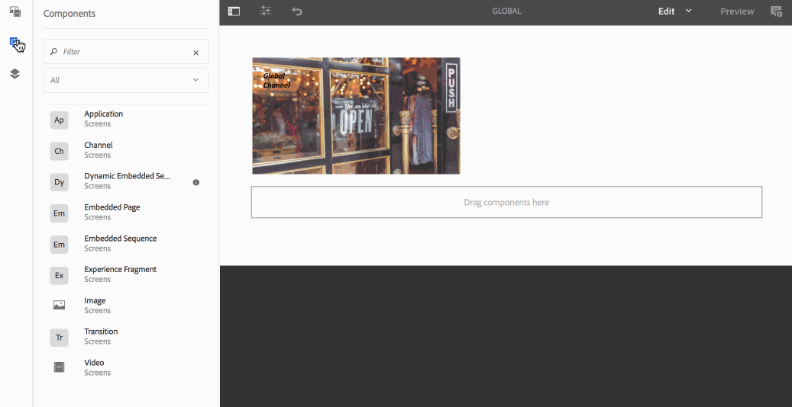

# 使用動態內嵌序列 {#using-dynamic-embedded-sequence}

使用動態內嵌序列涵蓋下列主題：

* **概觀**
* **在AEM Screens中使用動態內嵌體驗**
* **檢視結果**
* **限制使用者並修改ACL**

## 概觀 {#overview}

***動態內嵌序列***&#x200B;是為遵循父子階層的大型專案所建立，其中子系參考於位置資料夾而非管道資料夾內。 它可讓使用者透過&#x200B;***頻道角色***&#x200B;在頻道中嵌入序列。 它可讓使用者使用主頻道內的內嵌順序，為不同的辦公室定義位置特定的預留位置。

將通道指定給顯示時，您可以選擇指定顯示的路徑。 或者，您可以指定根據內容解析為實際管道的管道角色。

若要使用動態內嵌順序，請由&#x200B;***頻道角色***&#x200B;指派頻道。 管道角色定義顯示的內容。 角色以各種動作為目標，與履行角色的實際管道無關。 本節說明依角色定義管道的使用案例，並說明如何將該內容套用至全域管道。 您也可以將角色視為指派的識別碼，或前後關聯中管道的別名。

### 使用動態內嵌序列的優點 {#benefits-of-using-dynamic-embedded-sequences}

將順序頻道放在位置而非頻道資料夾中，可讓本機或區域作者編輯與他們相關的內容。 它也能限制您編輯階層中較高位置的管道。

參考&#x200B;*依角色的管道*，可讓您建立管道的本機版本。 這樣做會動態解析特定於位置的內容，並可讓您建立將內容用於特定於位置的管道的全域管道。

>[!NOTE]
>
>**內嵌序列與動態內嵌序列**
>
>「動態內嵌序列」類似於內嵌序列，但可讓使用者遵循階層，對其中一個管道所做的變更和更新會傳播至相關的另一個管道。 它遵循上下階層，也包含影像或視訊等資產。
>
>***動態內嵌序列***&#x200B;可讓您顯示特定位置的內容，而&#x200B;***內嵌序列***&#x200B;只會顯示內容的一般投影片。 此外，在設定動態內嵌序列時，請使用頻道角色和名稱來設定頻道。 如需實際實施，請參閱下列步驟。
>
>若要深入瞭解如何實作內嵌序列，請參閱AEM Screens中的[內嵌序列](embedded-sequences.md)。

下列範例著重下列主要辭彙，提供解決方案：

* 全域序列的&#x200B;***主要序列頻道***。
* 每個可本機自訂的序列部分有&#x200B;***動態內嵌序列***&#x200B;元件。
* 在符合&#x200B;**動態內嵌順序元件&#x200B;*角色***的顯示區中，具有&#x200B;*角色*的個別位置中的&#x200B;***個別順序頻道***。

>[!NOTE]
>
>若要深入瞭解頻道指定任務，請參閱AEM Screens檔案中「撰寫」一節下的&#x200B;**[頻道指定任務](channel-assignment.md)**。

## 使用動態內嵌序列 {#using-dynamic-embedded-sequence-2}

下節將說明如何在AEM Screens管道中建立動態內嵌序列。

### 先決條件 {#prerequisites}

開始實作此功能之前，請確定您已具備下列必要條件，可以開始實作動態內嵌順序：

* 建立AEM Screens專案（在此範例中為&#x200B;**示範**）。
* 在&#x200B;**管道**&#x200B;資料夾下建立&#x200B;**全域**&#x200B;管道。
* 新增內容至您的&#x200B;**全域**&#x200B;頻道（*檢查&#x200B;**Resources.zip**&#x200B;以取得相關資產*）。

下列影像顯示&#x200B;**管道**&#x200B;資料夾中具有&#x200B;**全域**&#x200B;管道的&#x200B;**示範**&#x200B;專案。

### 資源 {#resources}

您可以下載下列資源（影像並將其新增至資產），然後進一步將這些資源作為示範用途的管道內容。

[取得檔案](assets/resources.zip)

>[!NOTE]
>
>如需如何建立專案及如何建立順序頻道的詳細資訊，請參閱下列資源：
>
>* **[建立和管理專案](creating-a-screens-project.md)**
>* **[管理頻道](managing-channels.md)**
>

在AEM Screens專案中實作動態內嵌序列涉及三個主要工作：

1. **設定專案分類法，包括頻道、位置和顯示區**
1. **正在建立排程**
1. **指派排程給每個顯示區**

請依照下列步驟實作此功能：

>[!CAUTION]
>
>實作動態內嵌序列時，在每個位置下建立管道時，請小心&#x200B;**Name**&#x200B;和&#x200B;**Title**&#x200B;欄位。 請仔細遵循命名法的指示。

1. **建立兩個位置資料夾。**

   導覽至您AEM Screens專案中的&#x200B;**位置**&#x200B;資料夾，並建立兩個位置資料夾為&#x200B;**地區A**&#x200B;和&#x200B;**地區B**。

   >[!NOTE]
   >
   >建立&#x200B;**地區A**&#x200B;位置資料夾時，請確定您輸入&#x200B;**標題**&#x200B;作為&#x200B;**地區A**，而且您可以將&#x200B;**名稱**&#x200B;欄位保留空白，這樣系統就會自動擷取&#x200B;**地區A**&#x200B;名稱。
   >
   >建立位置資料夾&#x200B;**區域B**&#x200B;的情況類似，如下所示：

   

   >[!NOTE]
   >若要瞭解如何建立位置，請參閱&#x200B;**[建立和管理位置](managing-locations.md)**。

1. **在每個位置資料夾下建立兩個位置和一個頻道。**

   1. 導覽至&#x200B;**示範** > **位置** > **地區A**。
   1. 按一下&#x200B;**區域A**，然後從動作列按一下&#x200B;**+建立**。
   1. 從精靈中按一下&#x200B;**位置** （使用&#x200B;**標題**&#x200B;作為&#x200B;**存放區1**）。 同樣地，從精靈建立標題為&#x200B;**商店2**&#x200B;且標題為&#x200B;**商店2**&#x200B;的位置為&#x200B;**商店2**。 建立&#x200B;**存放區1**&#x200B;和&#x200B;**存放區2**&#x200B;時，您可以將&#x200B;**名稱**&#x200B;欄位保留空白。
   1. 重複步驟(b)，現在從精靈按一下&#x200B;**順序頻道**。 輸入&#x200B;**Title**&#x200B;作為&#x200B;**區域A**，並輸入&#x200B;**Name**&#x200B;作為此頻道的&#x200B;**區域**。

   >[!CAUTION]
   >
   >在建立頻道&#x200B;**區域A**&#x200B;時，請務必輸入&#x200B;**標題**&#x200B;作為&#x200B;**區域A**，並輸入&#x200B;**名稱**&#x200B;作為&#x200B;**區域**。

   

   同樣地，在&#x200B;**區域B** （標題為&#x200B;**市集3**&#x200B;和&#x200B;**市集4**）下建立兩個位置。 此外，請以&#x200B;**標題**&#x200B;為&#x200B;**地區B**，**名稱**&#x200B;為&#x200B;**地區**，建立&#x200B;**順序頻道**。

   >[!CAUTION]
   >
   >請確定在&#x200B;**區域A**&#x200B;和&#x200B;**區域B**&#x200B;中建立的管道可以使用與&#x200B;**區域**&#x200B;相同的名稱。

   

1. **在每個位置下建立顯示器和頻道。**

   1. 導覽至&#x200B;**示範** > **位置** > **地區A** > **商店1**。
   1. 按一下&#x200B;**存放區1**，然後從動作列按一下&#x200B;**+建立**。
   1. 從精靈按一下&#x200B;**顯示**&#x200B;並建立&#x200B;**`Store1Display`**。
   1. 重複步驟(b)，然後按一下精靈中的&#x200B;**順序頻道**。 輸入&#x200B;**Title**&#x200B;作為&#x200B;**`Store1Channel`**，並輸入&#x200B;**Name**&#x200B;作為&#x200B;**存放區**。

   >[!CAUTION]
   >
   >建立順序頻道時，請務必注意，頻道的&#x200B;**Title**&#x200B;可以根據您的需求而定，但&#x200B;**Name**&#x200B;在所有本機頻道中應該是相同的。
   >在此範例中，**區域A**&#x200B;和&#x200B;**區域B**&#x200B;下的管道將&#x200B;**名稱**&#x200B;共用為&#x200B;**區域**，而&#x200B;**`Store 1`**、**`Store 2`**、**`Store 3`**&#x200B;和&#x200B;**`Store 4`**&#x200B;下的管道將&#x200B;**名稱**&#x200B;共用為&#x200B;**存放區**。

   

   同樣地，在&#x200B;**`Store `2** （名稱為&#x200B;**存放區**）下建立顯示為&#x200B;**`Store2Display`**&#x200B;和頻道&#x200B;**`Store2Channel`**。

   >[!NOTE]
   >確定您對&#x200B;**`Store 1`**&#x200B;和&#x200B;**`Store 2`**&#x200B;中建立的管道可以使用與&#x200B;**存放區**&#x200B;相同的名稱。

   

   請依照上述步驟進行，以便您可以在&#x200B;**區域B**&#x200B;下建立頻道並顯示在&#x200B;**`Store 3`**&#x200B;和&#x200B;**`Store 4`**&#x200B;中。 再次確認在建立頻道&#x200B;**`Store3Channel`**&#x200B;和&#x200B;**`Store4Channel`**&#x200B;時，您使用相同的&#x200B;**Name**&#x200B;作為&#x200B;**存放區**。

   下圖顯示&#x200B;**`Store 3`**&#x200B;中的顯示和色版。

   

   下圖顯示&#x200B;**`Store 4`**&#x200B;中的顯示和色版。

   

1. **將內容新增至各自位置的頻道。**

   導覽至&#x200B;**示範** > **位置** > **區域A** > **區域A**，然後按一下動作列中的&#x200B;**編輯**。 拖放您要新增至頻道的資產。

   >[!NOTE]
   >您可以使用上面&#x200B;**資源**&#x200B;區段中的&#x200B;***Resources.zip***&#x200B;檔案，將這些影像當成您頻道內容的資產。

   

   同樣地，導覽至&#x200B;**示範** > **位置** > **地區B** > **地區B**，然後按一下動作列中的&#x200B;**編輯**，將資產拖放至您的頻道，如下所示：

   

   請依照上述步驟和資源操作，以便將內容新增至下列頻道：

   * **`Store1Channel`**
   * **`Store2Channel`**
   * **`Store3Channel`**
   * **`Store4Channel`**

1. **建立排程**

   瀏覽並按一下AEM Screens專案中的&#x200B;**排程**&#x200B;資料夾。 然後按一下動作列中的[建立&#x200B;**&#x200B;**]。

   下圖顯示在&#x200B;**示範**&#x200B;專案中建立的&#x200B;**AdSchedule**。

   

1. **將頻道指派給排程**

   1. 導覽至&#x200B;**示範** > **排程** > **AdSchedule**，然後按一下動作列中的&#x200B;**儀表板**。
   1. 按一下「**已指派的管道**」面板中的「**+指派管道**」，即可開啟「**管道指派**」對話方塊。
   1. 依路徑按一下&#x200B;**參考頻道**。
   1. 按一下&#x200B;**頻道路徑**，就像&#x200B;**示範** > ***頻道*** > ***全域***。
   1. 輸入&#x200B;**頻道角色**，就像&#x200B;**GlobalAdSegment**&#x200B;一樣。
   1. 按一下&#x200B;**支援的事件**，例如&#x200B;**初始載入**、**閒置畫面**&#x200B;和&#x200B;**使用者互動**。
   1. 按一下「**儲存**」。

   **依地區角色指派頻道：**

   1. 按一下&#x200B;**指派的頻道**&#x200B;面板中的&#x200B;**+指派頻道**。
   1. 在[頻道指定任務]對話方塊中，按一下[依名稱&#x200B;**參考頻道**]。
   1. 輸入&#x200B;**頻道名稱**&#x200B;作為&#x200B;**區域***。
   1. 輸入&#x200B;**頻道角色**&#x200B;作為&#x200B;**RegionAdSegment**。
   1. 按一下「**儲存**」。

   **依儲存區的角色指派頻道：**

   1. 按一下&#x200B;**指派的頻道**&#x200B;面板中的&#x200B;**+指派頻道**。
   1. 在[頻道指定任務]對話方塊中，按一下[依名稱&#x200B;**參考頻道**]。
   1. 輸入&#x200B;**頻道名稱**&#x200B;作為&#x200B;**存放區**。
   1. 輸入&#x200B;**頻道角色**&#x200B;作為&#x200B;**StoreAdSegment**。
   1. 按一下「**儲存**」。

   下圖顯示依路徑及依角色指派的色版。

   

1. **設定動態內嵌序列至全域通道。**

   導覽至您最初在&#x200B;**示範**&#x200B;專案中建立的&#x200B;**全域**&#x200B;頻道。

   按一下動作列中的&#x200B;**編輯**。

   

   在編輯器中，拖放兩個&#x200B;**動態內嵌順序**&#x200B;元件到管道編輯器中。

   開啟其中一個元件的屬性，並輸入&#x200B;**頻道指派角色**&#x200B;作為&#x200B;**RegionAdSegment**。

   同樣地，按一下其他元件並開啟屬性，以輸入&#x200B;**頻道指派角色**&#x200B;作為&#x200B;**StoreAdSegment**。

   

1. **指派排程給每個顯示區**

   1. 導覽至每個顯示區，例如&#x200B;**示範** > **位置** > **地區A** >**商店1** >**`Store1Display`**。
   1. 從動作列按一下&#x200B;**儀表板**。
   1. 在儀表板上，從&#x200B;**指派的管道和排程**&#x200B;面板按一下&#x200B;**...**，然後按一下&#x200B;**+指派排程**。
   1. 按一下排程的路徑（例如，**示範** > **排程** > **AdSchedule**）。
   1. 按一下「**儲存**」。

## 檢視結果 {#viewing-the-results}

設定好管道並顯示完成時，請啟動AEM Screens Player以檢視內容。

>[!NOTE]
>
>若要瞭解AEM Screens Player，請參閱下列資源：
>
>* [下載AEM Screens Player](https://download.macromedia.com/screens/)
>* [使用AEM Screens Player](working-with-screens-player.md)

以下輸出會根據顯示路徑，確認您在AEM Screens Player中的管道內容。

**案例1**：

如果您將顯示路徑指派為&#x200B;**示範** > **位置** > **地區A** > **商店1** > **`Store1Display`**，則下列內容會顯示在AEM Screens播放器中。

**案例1**：

如果您將顯示路徑指派為&#x200B;**示範** > **位置** > **地區B** > **商店3** > **`Store3Display`**，則下列內容會顯示在AEM Screens播放器中。

## 限制使用者和修改ACL {#restricting-users-and-modifying-the-acls}

您可以建立全域、區域或本機作者來編輯與他們相關的內容，同時受限制無法編輯階層中較高層的管道。

編輯ACL，讓您可以根據使用者的位置限制使用者對內容的存取權。

### 範例使用案例 {#example-use-case}

下列範例可讓您為上述示範專案建立三個使用者。

指派給每個群組的許可權如下：

**群組**：

* **Global-Author**：包含可存取&#x200B;**示範**&#x200B;專案中所有位置和管道的使用者，以及擁有所有讀取、寫入和編輯許可權的使用者。

* **Region-Author**：包含擁有&#x200B;**區域A**&#x200B;和&#x200B;**區域B**&#x200B;讀取、寫入和編輯許可權的使用者。

* **Store-Author**：包含只對&#x200B;**存放區1**、**存放區2**、**存放區3**&#x200B;和&#x200B;**存放區4**&#x200B;具有讀取、寫入和編輯許可權的使用者。

#### 建立使用者群組、使用者和設定ACL的步驟 {#steps-for-creating-user-groups-users-and-setting-up-acls}

>[!NOTE]
>
>若要詳細瞭解如何使用ACL來分隔專案，以便每個個人或團隊處理自己的專案，請參閱&#x200B;**設定ACL**。

請依照下列步驟建立群組、使用者，並根據許可權修改ACL：

1. **建立群組**

   1. 導覽至&#x200B;**Adobe Experience Manager**。
   1. 按一下&#x200B;**工具** > **安全性** > **群組**。
   1. 按一下&#x200B;**建立群組**，然後在&#x200B;**ID**&#x200B;中輸入&#x200B;**Global-Author**。
   1. 按一下&#x200B;**「儲存並關閉」**。

   同樣地，建立其他兩個群組，例如&#x200B;**Region-Author**&#x200B;和&#x200B;**Store-Author**。

   

1. **建立使用者並將使用者新增至群組**

   1. 導覽至&#x200B;**Adobe Experience Manager**。
   1. 按一 **下「工具** >安 **全性** >使 **用者**」。
   1. 按一下&#x200B;**建立使用者**，然後在&#x200B;**ID**&#x200B;中輸入&#x200B;**全域使用者**。
   1. 輸入&#x200B;**密碼**&#x200B;並確認此使用者的密碼。
   1. 按一下「**群組**」標籤，然後在「**按一下群組**」中輸入群組名稱，例如，輸入&#x200B;**Global-Author**，將&#x200B;**Global-User**&#x200B;新增至該特定群組。
   1. 按一下&#x200B;**「儲存並關閉」**。

   同樣地，建立其他兩個使用者，例如&#x200B;**Region-User**&#x200B;和&#x200B;**Store-User**，並將它們分別新增至&#x200B;**Region-Author**&#x200B;和&#x200B;**Store-Author**。

   >[!NOTE]
   >最佳實務是在群組中新增使用者，然後將許可權指派給每個特定的使用者群組。

   

1. **將所有群組新增至貢獻者**

   1. 導覽至&#x200B;**Adobe Experience Manager**。
   1. 按一下&#x200B;**工具** > **安全性** > **群組**。
   1. 從清單中按一下&#x200B;**參與者**，然後按一下&#x200B;**成員**&#x200B;標籤。
   1. 按一下&#x200B;**群組** （例如&#x200B;**Global-Author**、**Region-Author、**&#x200B;和&#x200B;**Store-Author**）以加入貢獻者。
   1. 按一下&#x200B;**「儲存並關閉」**。

1. **存取每個群組的許可權**

   1. 瀏覽至&#x200B;*使用者管理員*，並使用此UI修改不同群組的許可權。
   1. 搜尋&#x200B;**Global-Author**&#x200B;並按一下&#x200B;**許可權**&#x200B;標籤，如下圖所示。
   1. 同樣地，您可以存取&#x200B;**Region-Author**&#x200B;和&#x200B;**Store-Author**&#x200B;的許可權。

   

1. **修改每個群組的許可權**

   全域作者的&#x200B;**：**

   1. 瀏覽至&#x200B;**許可權**&#x200B;標籤
   1. 導覽至&#x200B;***/content/screens/demo***&#x200B;並檢查所有許可權
   1. 導覽至&#x200B;***/content/screens/demo/locations***&#x200B;並檢查所有許可權
   1. 導覽至&#x200B;***/content/screens/demo/locations/region-a***&#x200B;並檢查所有許可權。 同樣地，檢查&#x200B;**`region-b`**&#x200B;的許可權。

   如需瞭解步驟，請參閱下圖：
   

   下列顯示&#x200B;**全域使用者**&#x200B;可以存取&#x200B;**全域頻道**。 而且，使用所有四個商店（即&#x200B;**商店1**、**商店2**、**商店3**&#x200B;和&#x200B;**商店4**）來存取&#x200B;**區域A**&#x200B;和&#x200B;**區域B**。

   

   區域作者的&#x200B;**：**

   1. 瀏覽至&#x200B;**許可權**&#x200B;標籤。
   1. 導覽至&#x200B;***/content/screens/demo***，並僅檢查&#x200B;**讀取**&#x200B;許可權。
   1. 導覽至&#x200B;***/content/screens/demo/locations***，並僅檢查&#x200B;**讀取**&#x200B;許可權。
   1. 導覽至&#x200B;***/content/screens/demo/channels***，並取消勾選&#x200B;**全域**&#x200B;管道的許可權。
   1. 導覽至&#x200B;***/content/screens/demo/locations***/***region-a***&#x200B;並檢查所有許可權。 同樣地，檢查&#x200B;**`region-b`**&#x200B;的許可權。

   請參閱下圖，以便您瞭解步驟：

   

   下列顯示區域使用者同時可以存取&#x200B;**區域A**&#x200B;和&#x200B;**區域B**。 此外，可存取所有四個存放區，即&#x200B;**存放區1**、**存放區2**、**存放區3**&#x200B;和&#x200B;**存放區4**，但無法存取&#x200B;**全域**&#x200B;頻道。

   

   存放區 — 作者的&#x200B;**：**

   1. 瀏覽至&#x200B;**許可權**&#x200B;標籤。
   1. 導覽至&#x200B;***/content/screens/demo***，並僅檢查&#x200B;**讀取**&#x200B;許可權。
   1. 導覽至&#x200B;***/content/screens/demo/locations***，並僅檢查&#x200B;**讀取**&#x200B;許可權。
   1. 導覽至&#x200B;***/content/screens/demo/channels***，並取消勾選&#x200B;**全域**&#x200B;管道的許可權。
   1. 導覽至&#x200B;***/content/screens/demo/locations/region-a***，並僅檢查&#x200B;**讀取**&#x200B;許可權。 同樣地，請只檢查&#x200B;**`region-b`**&#x200B;的&#x200B;**讀取**&#x200B;許可權。
   1. 導覽至&#x200B;***/content/screens/demo/locations***/***region-a /store-1***&#x200B;並檢查所有許可權。 同樣地，檢查&#x200B;**store-2、store-3、**&#x200B;和&#x200B;**store-4**&#x200B;的許可權。

   請參閱下圖，以便您瞭解步驟：

   

   下列顯示&#x200B;**Store-User**&#x200B;只能存取&#x200B;**存放區1**、**存放區2**、**存放區3**&#x200B;和&#x200B;**存放區4**。 但是，它沒有存取&#x200B;**全域**&#x200B;或區域（**區域A**&#x200B;和&#x200B;**區域B**）頻道的許可權。

   

>[!NOTE]
>
>若要深入瞭解設定許可權，請參閱[設定ACL](setting-up-acls.md)。
