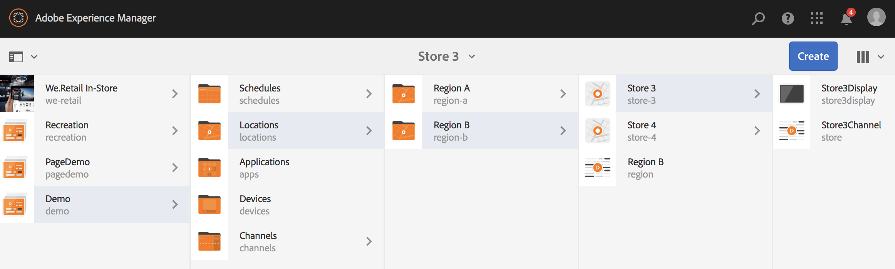

# 使用動態嵌入序列 {#using-dynamic-embedded-sequence}

使用動態嵌入序列包括以下主題：

* **概觀**
* **動態嵌入體驗在AEM Screens**
* **查看結果**
* **限制用戶和修改ACL**

## 概觀 {#overview}

***動態嵌入序列*** 為父子層次結構後面的大型項目建立，其中子項在位置資料夾中引用，而不是在通道資料夾中引用。 它允許用戶通過 ***渠道角色***。 它允許用戶使用主通道內的嵌入序列為不同辦公室定義特定於位置的佔位符。

在為顯示器分配通道時，您可以選擇指定顯示路徑或通道角色，這些通道將按上下文解析為實際通道。

要使用動態嵌入序列，請通過 ***渠道角色***。 通道角色定義顯示的上下文。 該角色被各種操作所針對，並且與實現該角色的實際渠道無關。 本節介紹一個使用案例，它按角色定義渠道，以及如何將該內容利用到全局渠道。 您還可以將角色視為分配的標識符，或在的上下文中將角色視為渠道的別名。

### 動態嵌入序列的優點 {#benefits-of-using-dynamic-embedded-sequences}

將序列頻道放置在位置而不是頻道資料夾內的主要好處是允許本地或區域作者編輯與他們相關的內容，同時限制他們編輯層次中上層的頻道。

引用 *按角色播放頻道*，允許您建立頻道的本地版本，以便動態解析特定於位置的內容，還允許您建立一個全局頻道，利用特定於位置的頻道的內容。

>[!NOTE]
>
>**嵌入序列與動態嵌入序列**
>
>動態嵌入序列類似於嵌入序列，但允許用戶遵循層次結構，其中對一個通道所做的更改/更新傳播到相關的其它通道。 它遵循上下階層，也包含影像或視訊等資產。
>
>***動態嵌入序列*** 允許您顯示特定於位置的內容，而 ***嵌入序列*** 只顯示內容的一般幻燈片。 此外，在設定動態嵌入序列時，需要使用通道角色和名稱配置通道。 有關實際實施，請參閱以下步驟。
>
>要瞭解有關實現嵌入式序列的詳細資訊，請參閱 [嵌入序列](embedded-sequences.md) 在AEM Screens。

以下示例重點介紹以下關鍵術語，提供瞭解決方案：

* a ***主序列通道*** 全局序列
* ***動態嵌入序列*** 序列中每個本地可定製部分的元件
* ***單個序列通道*** 在各自的位置 *角色* 與 **動態嵌入式序列元件 *角色*。**

>[!NOTE]
>
>要瞭解有關渠道分配的詳細資訊，請參閱 **[渠道分配](channel-assignment.md)** 在AEM Screens文檔的創作部分。

## 使用動態嵌入序列 {#using-dynamic-embedded-sequence-2}

下節說明在AEM Screens通道中建立動態嵌入式序列。

### 必備條件 {#prerequisites}

在開始實施此功能之前，請確保您具備以下先決條件，可以開始實施動態嵌入序列：

* 建立AEM Screens項目(在本示例中， **演示**)

* 建立通道為 **全球** 在 **頻道** 資料夾

* 將內容添加到 **全球** 頻道(*請檢查&#x200B;**資源.zip**相關資產*)

下圖顯示 **演示** 項目 **全球** 通道 **頻道** 的子菜單。

### 資源 {#resources}

您可以下載以下資源（映像並將這些資源添加到資產中），並進一步將這些資源用作渠道內容以進行演示。

[取得檔案](assets/resources.zip)

>[!NOTE]
>
>有關如何建立項目以及如何建立序列通道的其他資訊，請參閱以下資源：
>
>* **[建立和管理項目](creating-a-screens-project.md)**
>* **[管理渠道](managing-channels.md)**
>

在AEM Screens項目中實施動態嵌入序列涉及三大任務：

1. **設定項目分類，包括通道、位置和顯示**
1. **建立計畫**
1. **為每個顯示分配計畫**

按照以下步驟實施功能：

>[!CAUTION]
>
>在實施動態嵌入序列時，請注意 **名稱** 和 **標題** 在每個位置下建立通道時執行。 請認真按照命名法的說明。

1. **建立兩個位置資料夾。**

   導航到 **位置** 資料夾，並建立兩個位置資料夾 **區域A** 和 **B區**。

   >[!NOTE]
   >
   >建立 **區域A** 位置資料夾，確保輸入 **標題** 如 **區域A** 你可以離開 **名稱** 欄位為空，因此自動 **區域a** 名稱被選取。
   >
   >類似，也是建立位置資料夾的情況 **B區**，如下所示：

   

   >[!NOTE]
   >要瞭解如何建立位置，請參閱 **[建立和管理位置](managing-locations.md)**。

1. **在每個位置資料夾下建立兩個位置和一個通道。**

   1. 導航到 **演示** —> **位置** —> **區域A**。
   1. 選擇 **區域A** 按一下 **+建立** 按鈕。
   1. 選擇 **位置** 從嚮導中 **標題** 如 **儲存1**。 同樣，從標題為 **儲存2** 與 **標題** 如 **儲存2**。 你可以離開 **名稱** 建立時欄位為空 **儲存1** 和 **儲存2**。
   1. 重複步驟(b)，現在選擇 **序列通道** 的子菜單。 輸入 **標題** 如 **區域A** 和 **名稱** 如 **區域** 這個頻道。

   >[!CAUTION]
   >
   >請確保在建立渠道時 **區域A**，輸入 **標題** 如 **區域A** 和 **名稱** 如 **區域**。

   

   同樣，在 **B區** 標題 **儲存3** 和 **商店4**。 另外，建立 **序列通道** 與 **標題** 如 **B區** 和 **名稱** 如 **區域**。

   >[!CAUTION]
   >
   >請確保可以對中建立的頻道使用相同的名稱 **區域A** 和 **B區** 如 **區域**。

   

1. **在每個位置下建立「顯示」(Display)和「通道」(Channel)。**

   1. 導航到 **演示** —> **位置** —> **區域A** —> **儲存1**。
   1. 選擇 **儲存1** 按一下 **+建立** 按鈕。
   1. 選擇 **顯示** 建立 **儲存1顯示。**
   1. 重複步驟(b)，此時選擇 **序列通道** 的子菜單。 輸入 **標題** 如 **儲存通道** 和 **名稱** 如 **商店**。

   >[!CAUTION]
   >
   >建立序列通道時， **標題** 可以按你的要求，但是 **名稱** 應該在所有本地頻道都一樣。
   >在此示例中， **區域A** 和 **B區** 共用相同 **名稱** 如 **區域** 和 **儲存1**。 **儲存2**。 **儲存3**, **商店4** 共用相同 **名稱** 如 **商店**。

   

   同樣，將顯示建立為 **儲存2顯示** 和頻道 **儲存2通道** 在 **儲存2** (名稱為 **商店**)。

   >[!NOTE]
   >請確保可以對中建立的頻道使用相同的名稱 **儲存1** 和 **儲存2** 如 **商店**。

   

   按照前面的步驟建立通道並在中顯示 **儲存3** 和 **商店4** 在 **B區**。 再次，請確保使用相同 **名稱** 如 **商店** 建立通道 **儲存3通道** 和 **儲存4通道** 分別進行。

   下圖顯示中的顯示器和通道 **儲存3**。

   

   下圖顯示中的顯示器和通道 **商店4**。

   

1. **將內容添加到各自位置的頻道。**

   導航到 **演示** -> **位置** -> **區域A** -> **區域A** 按一下 **編輯** 按鈕。 拖放要添加到頻道的資產。

   >[!NOTE]
   >您可以使用 ***資源.zip*** 檔案 **資源** 的子菜單。

   

   同樣，導航到 **演示** -> **位置** -> **B區** -> **B區** 按一下 **編輯** 從操作欄將資產拖放到您的渠道，如下所示：

   

   按照前面的步驟和資源，將內容添加到以下渠道：

   * **Store1Channel**
   * **Store2Channel**
   * **Store3Channel**
   * **Store4Channel**

1. **建立計畫**

   導航並選擇 **計畫** 資料夾 **建立** 的子菜單。

   下圖顯示 **AdSchedule** 建立 **演示** 項目。

   

1. **將通道分配給計畫**

   1. 導航到 **演示** —> **計畫** —> **AdSchedule** 按一下 **儀表板** 按鈕。
   1. 按一下 **+分配通道** 從 **分配的頻道** 開啟面板 **渠道分配** 對話框。
   1. 選擇 **參考通道**.. 依路徑.
   1. 選擇 **通道路徑** 如 **演示** —> ***頻道*** —> ***全球***。
   1. 輸入 **渠道角色** 如 **全局廣告段**。
   1. 選擇 **支援的事件** 如 **初始載入**。 **空閒螢幕**, **用戶交互**。
   1. 按一下「**儲存**」。

   **按角色為區域分配渠道：**

   1. 按一下 **+分配通道** 從 **分配的頻道** 開啟面板 **渠道分配** 對話框。
   1. 選擇 **參考通道**.. 依名稱.
   1. 輸入 **通道名稱** 如 **區域***。
   1. 輸入 **渠道角色** 如 **區域廣告段**。
   1. 按一下「**儲存**」。

   **按角色為儲存分配通道：**

   1. 按一下 **+分配通道** 從 **分配的頻道** 開啟面板 **渠道分配** 對話框。
   1. 選擇 **參考通道**.. 依名稱.
   1. 輸入 **通道名稱** 如 **商店**。
   1. 輸入 **渠道角色** 如 **儲存廣告段**。
   1. 按一下「**儲存**」。

   下圖按路徑和角色顯示已分配的通道。

   

1. **將動態嵌入序列配置到全局通道。**

   導航到 **全球** 頻道，您最初建立於 **演示** 項目。

   按一下 **編輯** 的子菜單。

   

   拖放兩個 **動態嵌入序列** 中的元件。

   從其中一個元件開啟屬性並輸入 **渠道分配角色** 如 **區域廣告段**。

   同樣，選擇其他元件並開啟屬性以輸入 **渠道分配角色** 如 **儲存廣告段**。

   

1. **將計劃分配給每個顯示**

   1. 導航到每個顯示，如 **演示** —> **位置** —> **區域A** —>**儲存1** —>**儲存1顯示**。
   1. 按一下 **儀表板** 開啟顯示操控板。
   1. 按一下 **...** 從 **分配的渠道和計畫** 按一下 **+分配計畫**。
   1. 選擇調度的路徑(例如，此處， **演示** —> **計畫** —>**AdSchedule**)。
   1. 按一下「**儲存**」。

## 查看結果 {#viewing-the-results}

設定頻道並顯示完整後，請啟動AEM Screens播放器查看內容。

>[!NOTE]
>
>要瞭解Screen AEM Player，請參閱以下資源：
>
>* [AEM Screens播放器下載](https://download.macromedia.com/screens/)
>* [與AEM Screens玩家合作](working-with-screens-player.md)

以下輸出將根據顯示路徑確定AEM Screens播放器中的頻道內容。

**方案1**:

如果將顯示路徑指定為 **演示** —> **位置** —> **區域A** —> **儲存1** —> **儲存1顯示**，以下內容將顯示在您的AEM Screens播放器上。

**方案1**:

如果將顯示路徑指定為 **演示** —> **位置** —> **B區** —> **儲存3** —> **儲存3顯示**，以下內容將顯示在您的AEM Screens播放器上。

## 限制用戶和修改ACL {#restricting-users-and-modifying-the-acls}

您可以建立全局、區域或本地作者來編輯與其相關的內容，同時限制編輯層次結構中上方的頻道。

您需要修改ACL，以根據用戶的位置限制用戶訪問內容。

### 示例用例 {#example-use-case}

以下示例允許您為上述演示項目建立三個用戶。

為每個組分配的權限如下：

**群組**:

* **全球作者**:包括有權訪問中所有位置和通道的用戶 **演示** 具有所有讀、寫和編輯權限。

* **區域 — 作者**:由具有讀、寫和編輯權限的用戶組成 **區域A** 和 **B區**。

* **儲存作者**:由只具有讀、寫和編輯權限的用戶組成 **儲存1**。 **儲存2**。 **儲存3**, **商店4**。

#### 建立用戶組、用戶和設定ACL的步驟 {#steps-for-creating-user-groups-users-and-setting-up-acls}

>[!NOTE]
>
>要詳細瞭解如何使用ACL隔離項目，以便每個個人或團隊都能處理自己的項目，請參閱 **設定ACL**。

按照以下步驟建立組、用戶和按權限修改ACL:

1. **建立組**

   1. 導航到 **Adobe Experience Manager**。
   1. 按一下 **工具** —> **安全** —> **組**。
   1. 按一下 **建立組** 輸入 **全球作者** 在 **ID**。
   1. 按一下&#x200B;**「儲存並關閉」**。

   同樣，建立兩個其他組，如 **區域 — 作者** 和 **儲存作者**。

   

1. **建立用戶並將用戶添加到組**

   1. 導航到 **Adobe Experience Manager**。
   1. 按一下 **工具** —> **安全** —> **用戶**。
   1. 按一下 **建立用戶** 輸入 **全局用戶** 在 **ID**。
   1. 輸入 **密碼** 並確認此用戶的密碼。
   1. 按一下 **組** 中輸入組名稱 **選擇組**，例如，輸入 **全球作者** 添加 **全局用戶** 給那個特定群體。
   1. 按一下&#x200B;**「儲存並關閉」**。

   同樣，建立兩個其他用戶，如 **區域用戶** 和 **儲存用戶** 並添加 **區域 — 作者** 和 **儲存作者** 分別進行。

   >[!NOTE]
   >在組中添加用戶，然後將權限分配給每個特定用戶組是一種最佳做法。

   

1. **將所有組添加到參與者**

   1. 導航到 **Adobe Experience Manager**。
   1. 按一下 **工具** —> **安全** —> **組**。
   1. 選擇 **撰稿人** 從清單中選擇 **成員** 頁籤。
   1. 選擇 **組** 例如 **全球作者**。 **區域 — 作者，** 和 **儲存作者** 給撰稿人。
   1. 按一下&#x200B;**「儲存並關閉」**。

1. **訪問每個組的權限**

   1. 導航到 *烏塞拉明* 並使用此UI修改不同組的權限。
   1. 搜索 **全球作者** 按一下 **權限** 頁籤，如下圖所示。
   1. 同樣，您可以訪問 **區域 — 作者** 和 **儲存作者**。

   

1. **修改每個組的權限**

   **對於Global-Author:**

   1. 導航到 **權限** 頁籤
   1. 導航到 ***/內容/螢幕/演示*** 並檢查所有權限
   1. 導航到 ***/內容/螢幕/演示/位置*** 並檢查所有權限
   1. 導航到 ***/content/screens/demo/locations/regiona-a*** 並檢查所有權限。 同樣，檢查 **區域b**。

   請參閱下圖瞭解步驟：
   

   下圖顯示 **全局用戶** 有權訪問 **全局頻道** 和 **區域A** 和 **B區** 四家商店，即 **儲存1**。 **儲存2**。 **儲存3**, **商店4**。

   

   **對於區域作者：**

   1. 導航到 **權限** 頁籤。
   1. 導航到 ***/內容/螢幕/演示*** 只檢查 **閱讀** 權限。
   1. 導航到 ***/內容/螢幕/演示/位置*** 只檢查 **閱讀** 權限。
   1. 導航到 ***/內容/螢幕/演示/頻道*** 並取消檢查 **全球** 頻道。
   1. 導航到 ***/內容/螢幕/演示/位置***/***區域a*** 並檢查所有權限。 同樣，檢查 **區域b**。

   請參閱下圖瞭解步驟：

   

   下圖顯示，區域用戶現在可以訪問 **區域A** 和 **B區** 四家商店，即 **儲存1**。 **儲存2**。 **儲存3**, **商店4** 但無法 **全球** 頻道。

   

   **對於Store-Author:**

   1. 導航到 **權限** 頁籤。
   1. 導航到 ***/內容/螢幕/演示*** 只檢查 **閱讀** 權限。
   1. 導航到 ***/內容/螢幕/演示/位置*** 只檢查 **閱讀** 權限。
   1. 導航到 ***/內容/螢幕/演示/頻道*** 並取消檢查 **全球** 頻道。
   1. 導航到 ***/content/screens/demo/locations/regiona-a*** 只檢查 **閱讀** 權限。 同樣，僅檢查 **閱讀** 權限 **區域b**。
   1. 導航到 ***/內容/螢幕/演示/位置***/***區域a/store-1*** 並檢查所有權限。 同樣，檢查 **商店2號，商店3號，** 和 **儲存4**。

   請參閱下圖瞭解步驟：

   

   下圖顯示 **儲存用戶** 只能進入四家商店 **儲存1**。 **儲存2**。 **儲存3**, **商店4** 但無權訪問 **全球** 或區域(**區域A** 和 **B區**)頻道。

   

>[!NOTE]
>
>要詳細瞭解設定權限，請參閱 [設定ACL](setting-up-acls.md)。
