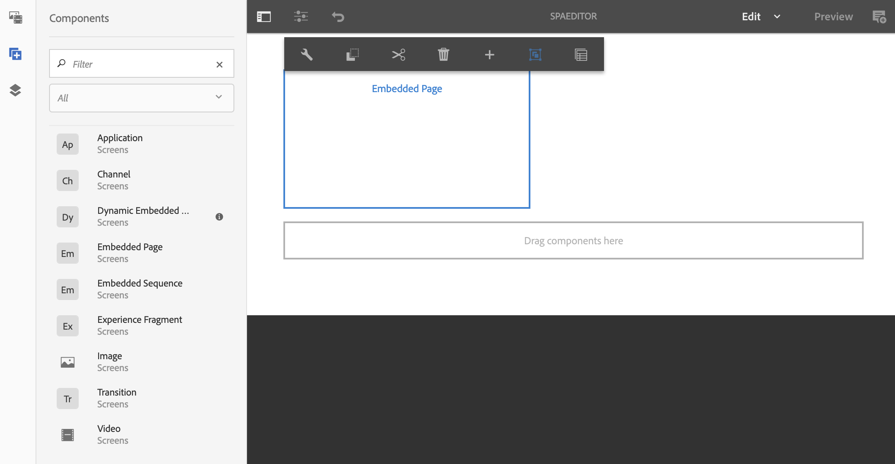

# 使用AEM SPA編輯器內嵌REACT應用程式並與AEM Screens Analytics整合 {#embedding-a-react-application-using-the-aem-spa-editor-and-integrating-with-aem-screens-analytics}

本節說明如何使用AEM SPA編輯器(可由AEM的業務專業人員設定)內嵌使用REACT(或Angular)的互動式單頁應用程式，以及如何將您的互動式應用程式與離線Adobe Analytics整合。

## 使用AEM SPA編輯器 {#using-the-aem-spa-editor}

請依照下列步驟使用AEM SPA編輯器：

1. 複製位於[https://github.com/adobe/aem-spa-project-archetype的AEM SPA編輯器存放庫。](https://github.com/adobe/aem-spa-project-archetype)

   >[!NOTE]
   >
   >此原型會建立簡單的Adobe Experience Manager專案，作為您專屬SPA專案的起點。 使用此原型時必須提供的屬性可讓您為此專案的所有部分命名。

1. 請依照自述檔案指示，建立AEM SPA編輯器原型專案：

   ```
   mvn clean install archetype:update-local-catalog
   mvn archetype:crawl
   
   mvn archetype:generate \
   -DarchetypeCatalog=internal \
   -DarchetypeGroupId=com.adobe.cq.spa.archetypes \
   -DarchetypeArtifactId=aem-spa-project-archetype \
   -DarchetypeVersion=1.0.3-SNAPSHOT \
   ```

   >[!NOTE]
   >
   >我們使用&#x200B;**GroupId**&#x200B;作為&#x200B;***com.adobe.aem.screens***&#x200B;和&#x200B;**ArtifactId**&#x200B;作為&#x200B;***我的範例SPA***（預設值）。 您可以視需要選擇自己的。

1. 建立項目後，使用您選擇的IDE或編輯器並導入生成的Maven項目。
1. 使用命令&#x200B;***mvn clean install -PautoInstallPackage***&#x200B;部署到本地AEM實例。

### 編輯REACT應用程式中的內容 {#editing-content-in-the-react-app}

若要編輯REACT應用程式中的內容：

1. 導覽至`https://localhost:4502/editor.html/content/mysamplespa/en/home.html`（如適用，取代主機名稱、連接埠和專案名稱）。
1. 您應該可以編輯Hello World應用程式中顯示的文本。

### 將互動式REACT應用程式新增至AEM Screens {#adding-the-interactive-react-app-to-aem-screens}

請依照下列步驟，將互動式REACT應用程式新增至AEM Screens:

1. 建立新的AEM Screens專案。 如需詳細資訊，請參閱[建立和管理專案](creating-a-screens-project.md)。

1. 在Screens專案的&#x200B;**Channels**&#x200B;資料夾中建立新的&#x200B;**應用程式通道**（最好是1x1範本或多區域通道）。

   >[!NOTE]
   >**此使** 用案例不鼓勵使用序列管道，因為這些管道原本會附帶投影片放映邏輯，而且會與體驗的互動性質衝突
   >如需詳細資訊，請參閱[建立和管理通道](managing-channels.md) 。


1. 編輯任何序列管道，並拖放內嵌的頁面元件。

   如需詳細資訊，請參閱[將元件新增至通道](adding-components-to-a-channel.md) 。

   >[!NOTE]
   >
   >將管道指派給顯示時，請務必新增使用者互動事件。

1. 按一下動作列中的&#x200B;**編輯**&#x200B;以編輯通道的屬性。

   

1. 拖放&#x200B;**內嵌頁面**&#x200B;元件，或重新使用應用程式頻道中的現有元件，並選取mysamplespa應用程式下的首頁，例如&#x200B;***/content/mysamplespa/en/home***。

   

1. 將通道指派給顯示器。

   >[!NOTE]
   >將管道指派給顯示時，請務必新增使用者互動事件。

1. 根據此專案註冊播放器，並將其指派給顯示器。 您現在應該可以看到您的互動式應用程式在AEM Screens上執行。

   請參考[設備註冊](device-registration.md)了解有關註冊設備的詳細資訊。

## 透過AEM Screens將SPA與Adobe Analytics整合及離線功能 {#integrating-the-spa-with-adobe-analytics-with-offline-capability-through-aem-screens}

請依照下列步驟，透過AEM Screens將SPA與Adobe Analytics整合，並提供離線功能：

1. 在AEM Screens中設定Adobe Analytics。

   請參閱[使用AEM Screens設定Adobe Analytics](configuring-adobe-analytics-aem-screens.md) ，了解如何使用AEM Screens在Adobe Analytics中執行排序，以及使用離線Adobe Analytics傳送自訂事件。

1. 在您選擇的IDE/編輯器中編輯您的react應用程式（尤其是要開始發出事件的文本元件或其他元件）。
1. 在您要為元件擷取的點擊事件或其他事件上，使用標準資料模型新增分析資訊。

   如需詳細資訊，請參閱[使用AEM Screens設定Adobe Analytics](configuring-adobe-analytics-aem-screens.md)s 。

1. 呼叫AEM Screens Analytics API以離線儲存事件，並以猝發傳送至Adobe Analytics。

   例如，

   ```
   handleClick() {
       if ((window.parent) && (window.parent.CQ) && (window.parent.CQ.screens) && (window.parent.CQ.screens.analytics))
       {
           var analyticsEvent = {};
           analyticsEvent['event.type'] = 'play'; // Type of event
    analyticsEvent['event.coll_dts'] = new Date().toISOString(); // Start of collecting the event
    analyticsEvent['event.dts_start'] = new Date().toISOString(); // Event start
    analyticsEvent['content.type'] = 'Washing machine'; // Mime Type or product category
    analyticsEvent['content.action'] = 'Path to the washing machine asset in AEM'; // Path in AEM to relevant asset
    analyticsEvent['trn.product'] = 'Washing machine Model number'; // Product being explored
    analyticsEvent['trn.amount'] = 1000; // Product pricing or other numeric value or weight
    analyticsEvent['event.dts_end'] = new Date().toISOString(); // Event end
    analyticsEvent['event.count'] = 100; // Numeric value that may count a number of clicks or keystrokes or wait time in seconds for example
    analyticsEvent['event.value'] = 'My favorite analytics event';
           analyticsEvent['trn.quantity'] = 10; // Quantity of product selection
    analyticsEvent['event.subtype'] = 'end'; // Event subtype if applicable
    window.parent.CQ.screens.analytics.sendTrackingEvent(analyticsEvent);
       }
   }
   ```

   >[!NOTE]
   >
   >播放器韌體會自動將播放器及其執行階段環境的詳細資訊新增至您傳送的自訂分析資料。 因此，除非絕對必要，否則您可能不需要擷取低層作業系統/裝置詳細資訊。 您只需要專注於業務分析資料。
