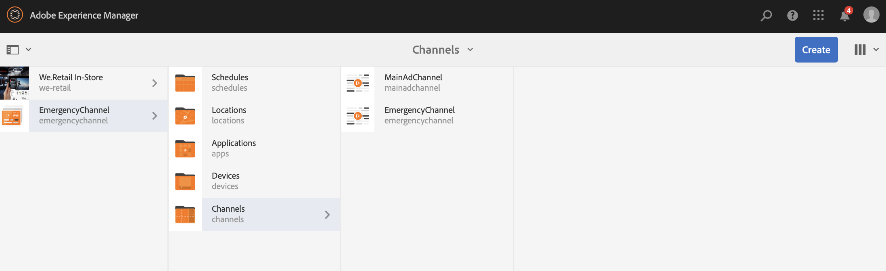

# 緊急通道 {#emergency-channel}

## 使用案例說明 {#use-case-description}

本節說明使用案例範例。 它強調建立和管理緊急通道，內容作者可以在有先決條件時從順序通道切換。

### 先決條件 {#preconditions}

開始此使用案例前，請確定您瞭解如何：

* **[建立和管理頻道](managing-channels.md)**
* **[建立和管理位置](managing-locations.md)**
* **[建立和管理排程](managing-schedules.md)**
* **[裝置註冊](device-registration.md)**

### 主要執行者 {#primary-actors}

內容作者

## 基本流程：設定專案 {#basic-flow-setting-up-the-project}

請依照下列步驟設定緊急通道：

1. 建立名為&#x200B;**EmergencyChannel**&#x200B;的AEM Screens專案，如下所示。

   >[!NOTE]
   >若要進一步瞭解如何在AEM Screens中建立和管理專案，請參閱建立專案。

   

1. **正在建立順序頻道**

   1. 按一下&#x200B;**頻道**&#x200B;資料夾，然後按一下&#x200B;**建立**。

   1. 從精靈按一下&#x200B;**順序頻道**，並建立標題為&#x200B;**MainAdChannel**&#x200B;的頻道。

   

1. **正在新增內容至順序頻道**

   1. 按一下頻道(**MainAdChannel**)。
   1. 按一下動作列中的&#x200B;**編輯**。
   1. 將一些資產拖放至您的頻道。

   

1. **正在建立緊急通道**

   1. 按一下&#x200B;**頻道**&#x200B;資料夾。
   1. 按一下&#x200B;**建立**。
   1. 從精靈按一下&#x200B;**順序頻道**，並建立標題為&#x200B;**緊急頻道**&#x200B;的頻道。

   >[!NOTE]
   >
   >一般而言，您的緊急通道會新增至您既有的生產專案。

   

1. **正在新增內容到緊急頻道**

   1. 按一下頻道（**緊急頻道）**。
   1. 按一下動作列中的&#x200B;**編輯**。
   1. 將您要在緊急情況下執行的資產拖放到您的頻道。

   

1. **正在建立位置**

   1. 導覽至&#x200B;**位置**&#x200B;資料夾。
   1. 按一下動作列中的&#x200B;**建立**，並從精靈中建立標題為&#x200B;**商店**&#x200B;的位置。

   

1. **在您的位置中建立顯示區**

   導覽至您的位置（**商店**），然後從動作列按一下&#x200B;**建立**。 依照精靈，建立兩個標題為&#x200B;**StoreFront**&#x200B;和&#x200B;**StoreRear**&#x200B;的&#x200B;**顯示器**。

   

1. **正在建立排程**

   1. 導覽至您的&#x200B;**排程**&#x200B;資料夾。
   1. 按一下動作列中的&#x200B;**建立**。
   1. 依照精靈，建立標題為&#x200B;**StoreSchedule**&#x200B;的排程。

   

1. 將兩個顯示指定給排程並設定優先順序

   1. 按一下排程&#x200B;**(StoreSchedule)**，然後從動作列按一下&#x200B;**儀表板**。

   1. 按一下&#x200B;**指派的頻道**&#x200B;面板中的&#x200B;**+指派頻道**。

   1. 從&#x200B;**頻道指定任務**&#x200B;對話方塊：

      1. 按一下&#x200B;**MainAdChannel**&#x200B;的路徑
      1. 將&#x200B;**優先順序**&#x200B;設為2
      1. 將支援的事件設定為&#x200B;**初始載入**&#x200B;和&#x200B;**閒置畫面**。
      1. 按一下&#x200B;**儲存**

      同樣地，請再次執行相同的步驟來指派&#x200B;**緊急通道**&#x200B;並設定其&#x200B;**優先順序**。

   >[!NOTE]
   >
   >當有多個指派符合播放條件時，優先順序可用於排序指派。 值最高的總是優先於較低的值。

   

1. 按一下&#x200B;**指派的頻道**&#x200B;面板中的&#x200B;**+指派頻道**。

1. 從&#x200B;**頻道指定任務**&#x200B;對話方塊：

   1. 按一下&#x200B;**緊急通道**&#x200B;的路徑
   1. 將&#x200B;**優先順序**&#x200B;設為1

   1. 將支援的事件設定為&#x200B;**初始載入**、**閒置畫面**&#x200B;和&#x200B;**使用者互動**

   1. 按一下&#x200B;**儲存**

   

   您可以從&#x200B;**StoreSchedule**&#x200B;儀表板檢視指派的管道。

   

1. **指派排程給每個顯示區**

   1. 導覽至每個顯示區，例如&#x200B;**EmergencyChannel** > **位置** > **商店** >**商店前端**。

   1. 從動作列按一下&#x200B;**儀表板**。
   1. 按一下&#x200B;**指派的管道與排程**&#x200B;面板中的&#x200B;**...**，然後按一下&#x200B;**+指派排程**。

   1. 按一下排程的路徑（例如，**EmergencyChannel** > **排程** >**StoreSchedule**）。

   1. 按一下「**儲存**」。

   您可以從&#x200B;**StoreSchedule**儀表板檢視指派給顯示器的排程。
   

1. **裝置註冊**

   完成裝置註冊程式。 註冊後，您可以在AEM Screens Player上檢視以下輸出。

   

## 切換到緊急頻道 {#switching-to-emergency-channel}

如果發生緊急狀況，請執行下列步驟：

1. 導覽至&#x200B;**EmergencyChannel** > **排程** > **StoreSchedule**，然後按一下動作列中的&#x200B;**儀表板**。

   

1. 從&#x200B;**StoreSchedule**&#x200B;儀表板按一下&#x200B;**EmergencyChannel**，然後按一下&#x200B;**編輯指派**。

   

1. 從&#x200B;**頻道指派**&#x200B;對話方塊將&#x200B;**緊急頻道**&#x200B;的&#x200B;**優先順序**&#x200B;更新為&#x200B;**3**，然後按一下&#x200B;**儲存**。

   

1. 當管道的優先順序更新時，所有AEM Screens Player都會顯示&#x200B;**EmergencyChannel**&#x200B;內容。

   

### 結論 {#conclusion}

**EmergencyChannel**&#x200B;會繼續顯示其內容，直到內容作者將優先順序值重設為1為止。

內容作者收到緊急狀況已清除的指示時，應更新&#x200B;**MainAdChannel**&#x200B;的優先順序。 這樣做會導致恢復正常播放。
