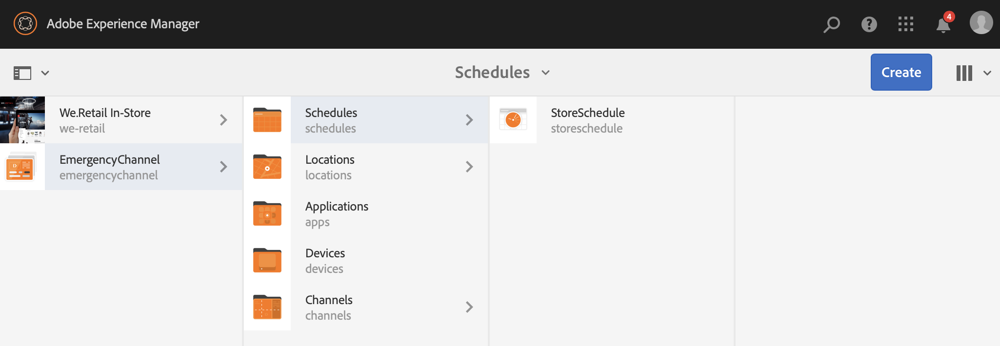

# 緊急通道 {#emergency-channel}

## 用例說明 {#use-case-description}

本節介紹一個用例示例，該示例強調建立和管理緊急頻道，內容作者可以在先決條件情況下從序列頻道切換該緊急頻道。

### 先決條件 {#preconditions}

在開始此使用案例之前，請確保您瞭解如何：

* **[建立和管理渠道](managing-channels.md)**
* **[建立和管理位置](managing-locations.md)**
* **[建立和管理計畫](managing-schedules.md)**
* **[裝置註冊](device-registration.md)**

### 主要參與者 {#primary-actors}

內容作者

## 基本流：設定項目 {#basic-flow-setting-up-the-project}

按照以下步驟設定緊急通道：

1. 建立名為的AEM Screens項目 **緊急通道**，如下所示。

   >[!NOTE]
   >要瞭解有關在AEM Screens建立和管理項目的詳細資訊，請參閱建立項目。

   

1. **建立序列通道**

   1. 選擇 **頻道** 資料夾，按一下 **建立** 開啟嚮導以建立通道。

   1. 選擇 **序列通道** 建立標題為 **主AdChannel**。

   

1. **將內容添加到序列通道**

   1. 選擇頻道(**主AdChannel**)。
   1. 按一下 **編輯** 的子菜單。 將很少的資產拖放到您的頻道。

   

1. **建立緊急通道**

   1. 選擇 **頻道** 的子菜單。
   1. 按一下 **建立** 開啟嚮導以建立通道。
   1. 選擇 **序列通道** 建立標題為 **緊急通道**。

   >[!NOTE]
   >
   >通常，您的緊急渠道會添加到您先前存在的生產項目中。

   

1. **將內容添加到緊急通道**

   1. 選擇頻道(**緊急通道)**。
   1. 按一下 **編輯** 的子菜單。 將要在緊急情況期間運行的資產拖放到您的頻道。

   

1. **建立位置**

   1. 導航到 **位置** 的子菜單。
   1. 按一下 **建立** 建立標題為 **儲存** 的子菜單。

   

1. **在您的位置建立顯示**

   導航到您的位置(**儲存**) **建立** 按鈕。 按照嚮導建立兩個 **顯示** 標題 **商店前** 和 **儲存後**。

   

1. **建立計畫**

   1. 導航到 **計畫** 的子菜單。
   1. 按一下 **建立** 按鈕。 按照嚮導建立標題為 **儲存計畫**。

   

1. 將「顯示」(Displays)分配給計畫並設定優先順序

   1. 選擇計畫 **(StoreSchedule)** 按一下 **儀表板** 按鈕。

   1. 按一下 **+分配通道** 從 **分配的頻道** 的子菜單。

   1. 從 **渠道分配** 對話框：

      1. 選擇指向 **主AdChannel**
      1. 設定 **優先順序** 2
      1. 將支援的事件設定為 **初始載入** 和 **空閒螢幕**。
      1. 按一下 **保存**

      同樣，您必須再次執行相同的步驟來分配 **緊急通道** 設定 **優先順序**。
   >[!NOTE]
   >
   >優先順序用於在多個分配匹配播放條件時對分配進行排序。 值最高的值總是優先於值較低的值。

   

1. 按一下 **+分配通道** 從 **分配的頻道** 的子菜單。

1. 從 **渠道分配** 對話框：

   1. 選擇指向 **緊急通道**
   1. 設定 **優先順序** 1

   1. 將支援的事件設定為 **初始載入**。 **空閒螢幕**, **用戶交互**

   1. 按一下 **保存**

   

   您可以從 **儲存計畫** 控制項欄。

   

1. **將計劃分配給每個顯示**

   1. 導航到每個顯示，如 **緊急通道** —> **位置** —> **儲存** —>**商店前**。

   1. 按一下 **儀表板** 開啟顯示操控板。
   1. 按一下 **...** 從 **分配的渠道和計畫** 按一下 **+分配計畫**。

   1. 選擇調度的路徑(例如，此處， **緊急通道** —> **計畫** —>**儲存計畫**)。

   1. 按一下「**儲存**」。

   您可以通過 **儲存計畫** 控制項欄。
   

1. **裝置註冊**

   完成設備註冊過程，註冊後將查看AEM Screens播放器上的以下輸出。

   

## 切換到緊急通道 {#switching-to-emergency-channel}

發生緊急情況時，請執行以下步驟：

1. 導航到 **緊急通道** —> **計畫** —> **儲存計畫** 選擇 **儀表板** 按鈕。

   

1. 選擇 **緊急通道** 從 **儲存計畫** 操控板，按一下 **編輯分配**。

   

1. 更新 **優先順序** 的 **緊急通道** 至 **3** 從 **渠道分配** 對話框，按一下 **保存**。

   

1. 一旦頻道的優先順序更新，所有AEM Screens玩家將顯示 **緊急通道** 內容，如下所示。

   

### 結論 {#conclusion}

的 **緊急通道** 將繼續顯示其內容，直到內容作者將優先順序值重置為1。

一旦內容作者收到緊急事件已清除的指示，他/她應更新 **主AdChannel** 將導致正常回放恢復。
