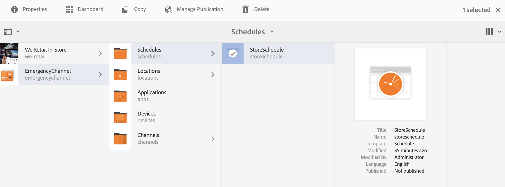

# 緊急通道 {#emergency-channel}

## 使用案例說明 {#use-case-description}

本節說明一個使用案例範例，著重於建立和管理緊急管道，內容作者在有先決條件時可從序列管道切換。

### 先決條件 {#preconditions}

開始此使用案例前，請務必了解如何：

* **[建立和管理管道](managing-channels.md)**
* **[建立和管理位置](managing-locations.md)**
* **[建立和管理排程](managing-schedules.md)**
* **[裝置註冊](device-registration.md)**

### 主要行為者 {#primary-actors}

內容作者

## 基本流：設定專案 {#basic-flow-setting-up-the-project}

請依照下列步驟設定緊急通道：

1. 建立名為&#x200B;**EmergencyChannel**&#x200B;的AEM Screens專案，如下所示。

   >[!NOTE]
   >若要進一步了解如何在AEM Screens中建立和管理專案，請參閱建立專案。

   

1. **建立序列管道**

   1. 選擇&#x200B;**通道**&#x200B;資料夾，然後按一下&#x200B;**建立**&#x200B;以開啟嚮導以建立通道。

   1. 從嚮導中選擇&#x200B;**序列通道**&#x200B;並建立標題為&#x200B;**MainAdChannel**&#x200B;的通道。

   

1. **新增內容至序列頻道**

   1. 選取通道(**MainAdChannel**)。
   1. 按一下動作列中的&#x200B;**編輯**&#x200B;以開啟編輯器。 將數個資產拖放至管道。

   

1. **建立緊急通道**

   1. 選擇&#x200B;**通道**&#x200B;資料夾。
   1. 按一下&#x200B;**Create**&#x200B;以開啟精靈以建立通道。
   1. 從嚮導中選擇&#x200B;**序列通道**&#x200B;並建立名為&#x200B;**EmergencyChannel**&#x200B;的通道。

   >[!NOTE]
   >
   >通常，您的緊急管道會新增至您預先存在的生產專案。

   

1. **新增內容至緊急管道**

   1. 選擇通道（**緊急通道）**。
   1. 按一下動作列中的&#x200B;**編輯**&#x200B;以開啟編輯器。 將您要在緊急情況下執行的資產拖放至管道。

   

1. **建立位置**

   1. 導覽至&#x200B;**Locations**&#x200B;資料夾。
   1. 按一下動作列中的&#x200B;**建立**，然後從精靈中建立標題為&#x200B;**儲存**&#x200B;的位置。

   

1. **在您的位置中建立顯示**

   導覽至您的位置(**Store**)，然後按一下動作列中的&#x200B;**Create**。 按照嚮導建立兩個&#x200B;**Displays**，標題為&#x200B;**StoreFront**&#x200B;和&#x200B;**StoreRear**。

   

1. **建立排程**

   1. 導覽至您的&#x200B;**排程**&#x200B;資料夾。
   1. 按一下動作列中的&#x200B;**建立**。 按照嚮導建立名為&#x200B;**StoreSchedule**&#x200B;的計畫。

   

1. 將「顯示」指派給您的排程並設定優先順序

   1. 選擇計畫&#x200B;**(StoreSchedule)**，然後從操作欄按一下&#x200B;**儀表板**。

   1. 從&#x200B;**ASSIGNED CHANNELS**&#x200B;面板按一下「**+分配通道**」。

   1. 在&#x200B;**通道分配**&#x200B;對話框中：

      1. 選擇&#x200B;**MainAdChannel**&#x200B;的路徑
      1. 將&#x200B;**優先順序**&#x200B;設定為2
      1. 將「支援的事件」設定為&#x200B;**「初始載入」**&#x200B;和&#x200B;**「空閒螢幕」**。
      1. 按一下&#x200B;**儲存**

      同樣地，您也必須再次執行相同的步驟來指派&#x200B;**EmergencyChannel**&#x200B;並設定其&#x200B;**Priority**。
   >[!NOTE]
   >
   >優先順序可用來排序指派，以備多個指派符合播放條件時使用。 值最高的一律優先於值較低的。

   

1. 從&#x200B;**ASSIGNED CHANNELS**&#x200B;面板按一下「**+分配通道**」。

1. 在&#x200B;**通道分配**&#x200B;對話框中：

   1. 選擇&#x200B;**EmergencyChannel**&#x200B;的路徑
   1. 將&#x200B;**優先順序**&#x200B;設定為1

   1. 將支援的事件設定為&#x200B;**初始載入**、**空閒螢幕**&#x200B;和&#x200B;**用戶交互**

   1. 按一下&#x200B;**儲存**

   

   您可以從&#x200B;**StoreSchedule**&#x200B;控制面板檢視指派的通道。

   

1. **為每個顯示分配調度**

   1. 導航到每個顯示，如&#x200B;**EmergencyChannel** —> **Locations** —> **Store** —>**StoreFront**。

   1. 從動作按一下&#x200B;**控制面板**&#x200B;以開啟顯示控制面板。
   1. 按一下&#x200B;**...**「已分配通道和計畫」**面板中的**，然後按一下&#x200B;**+「已分配計畫」**。

   1. 選擇「調度」的路徑（例如，此處&#x200B;**EmergencyChannel** —> **調度** —>**StoreSchedule**）。

   1. 按一下「**儲存**」。

   您可以從&#x200B;**StoreSchedule**控制面板檢視指派給顯示的排程。
   

1. **裝置註冊**

   完成裝置註冊程式，一旦完成註冊，您就會在AEM Screens播放器上檢視下列輸出。

   

## 切換到緊急通道 {#switching-to-emergency-channel}

在發生緊急情況時，請執行以下步驟：

1. 導航至&#x200B;**EmergencyChannel** —> **Schedules** —> **StoreSchedule**&#x200B;並從操作欄中選擇&#x200B;**Dashboard**。

   

1. 從&#x200B;**StoreSchedule**&#x200B;控制面板中選擇&#x200B;**EmergencyChannel**，然後按一下&#x200B;**Edit Assignment**。

   

1. 從&#x200B;**通道分配**&#x200B;對話框將&#x200B;**EmergencyChannel**&#x200B;的&#x200B;**優先順序**&#x200B;更新為&#x200B;**3**，然後按一下&#x200B;**Save**。

   

1. 更新頻道的優先順序後，所有AEM Screens播放器都會顯示&#x200B;**EmergencyChannel**&#x200B;內容，如下所示。

   

### 結論 {#conclusion}

**EmergencyChannel**&#x200B;將繼續顯示其內容，直到內容作者將優先順序值重設為1。

內容作者收到緊急狀況已清除的指示後，應更新&#x200B;**MainAdChannel**&#x200B;的優先順序，以恢復正常播放。
