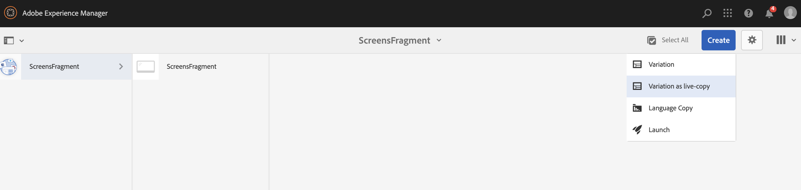

# 使用體驗片段 {#using-experience-fragments}

本頁涵蓋下列主題：

* **概觀**
* **在AEM Screens中使用體驗片段**
* **將變更傳播至頁面**

## 概觀 {#overview}

一個 ***體驗片段*** 是一組一或多個元件，包括可在頁面中參考的內容和版面。 體驗片段可以包含任何元件（例如，一個或多個元件），這些元件可以包含段落系統內的任何內容，這些元件將被參考到完整體驗中或由第三個端點請求。

## 在AEM Screens中使用體驗片段 {#using-experience-fragments-in-aem-screens}

>[!NOTE]
>以下範例使用 **We.Retail** 作為示範專案，從中運用體驗片段的 **網站** AEM Screens專案的頁面。

以下工作流程以為例，示範如何使用Sites中We.Retail的體驗片段。 您可以選擇網頁，並在其中一個專案的AEM Screens頻道中運用該內容。

### 先決條件 {#pre-requisites}

**使用頻道建立示範專案**

***建立專案***

1. 按一下 **建立畫面專案** 以建立新專案。
1. 輸入標題為 **示範專案**.
1. 按一下「**儲存**」。

A **示範專案** 將會新增至您的AEM Screens。

***建立頻道***

1. 導覽至 **示範專案** 您已建立並選取 **頻道** 資料夾。

1. 按一下 **建立** 以開啟精靈。
1. 選擇 **序列頻道** 範本，然後按一下 **下一個**.

1. 輸入 **標題** 作為 **TestChannel** 並按一下 **建立**.

A **TestChannel** 將會新增至您的 **示範專案**.\

### 建立體驗片段 {#creating-an-experience-fragment}

請依照下列步驟操作，以運用中的內容 **We.Retail** 至您的 **TestChannel** 在 **示範專案**.

1. **導覽至We.Retail中的網站頁面**

   1. 導覽至「網站」並選取 **We.Retail** -> **美國** -> **英文** -> **裝置** 並選取此頁面，以將其用作Screens頻道的體驗片段。

   1. 按一下 **編輯** 從動作列開啟您要用作Screens頻道體驗片段的頁面。

1. **重複使用內容**

   1. 選取您要包含在頻道中的片段。
   1. 按一下右側的最後一個圖示以開啟 **轉換為體驗片段** 對話方塊。

   

1. **建立體驗片段**

   1. 選擇 **動作** 作為 **建立新的體驗片段**.

   1. 選取 **父路徑**.
   1. 選取 **範本**. 選擇 **體驗片段 — 畫面變數** 範本在這裡（欄位中的值） `/libs/settings/screens/experience-fragments/templates/experience-fragment-template-screens`)。

   1. 輸入 **片段標題** 作為 **ScreensFragment**.

   1. 按一下核取記號以完成新體驗片段的建立。

   

   附註：若要選取較簡單的選項，請按一下欄位右側的勾號以開啟選取對話方塊。

1. **建立體驗片段的即時副本**

   1. 導覽至AEM首頁。
   1. 選取 **體驗片段** 並反白顯示 **ScreensFragment** 並按一下 **變數為live-copy**，如下圖所示：

   

   c.選取 **ScreensFragment** 從 **建立即時副本** 精靈並按一下 **下一個**.

   d.輸入 **標題** 和 **名稱** 作為 **Screens**.

   e.按一下 **建立** 以建立即時副本。

   f.按一下 **完成** 移回到 **ScreensFragment** 頁面。

   

   >[!NOTE]
   >
   >建立Screens片段後，您可以編輯片段的屬性。 選取片段並按一下 **屬性** 動作列中的。

   **編輯畫面片段的屬性**

   1. 導覽至 **ScreensFragment** （您已在上述步驟中建立），然後按一下 **屬性** 動作列中的。

   1. 選取 **離線設定** 標籤，如下圖所示。

   您可以新增 **使用者端資料庫** （java和css）和 **靜態檔案** 至您的體驗片段。

   以下範例顯示新增使用者端程式庫和字型，作為靜態檔案的一部分加入您的體驗片段。  

1. **在Screens頻道中使用體驗片段作為元件**

   1. 導覽至您要使用的畫面頻道 **Screens** 片段。
   1. 選取 **TestChannel** 並按一下 **編輯** 動作列中的。

   1. 按一下側邊標籤中的元件圖示。
   1. 拖放 **體驗片段** 至您的頻道。

   

   e.選取 **體驗片段** 元件並選取左上角（扳手）圖示以開啟 **體驗片段** 對話方塊。

   f.選取 **Screens** 您在中建立的片段的即時副本 *步驟3* 在 **路徑**.

   

   f.選取 **Screens** 您在中建立的片段的即時副本 *步驟3* 在 **體驗片段**.

   

   h.輸入毫秒，單位： **持續時間**.

   i.選取 **離線設定** 從 **體驗片段** 用來定義使用者端程式庫和靜態檔案的對話方塊。

   >[!NOTE]
   >
   >除了您在步驟(4)中設定的專案外，如果您還想新增使用者端程式庫或靜態檔案，您可以從 **離線設定** 索引標籤中的 **體驗片段** 對話方塊。

   

   j.按一下核取記號以完成處理。

### 驗證結果 {#validating-the-result}

完成上述步驟後，您便可以在中驗證體驗片段 **ChannelOne** 作者：

1. 瀏覽至 **TestChannel**.
1. 選取 **預覽** 動作列中的。

您將從以下位置檢視內容： **網站** 頁面（體驗片段的即時副本），如下圖所示：\

## 將變更傳播至頁面 {#propagating-changes-from-the-master-page}

***即時副本*** 是指由轉出設定所定義的同步化動作所維護的（來源的）副本。

由於有體驗片段，因此我們建立的為來自 **網站** 因此，如果您從主版頁面變更該特定片段，您將會在頻道中或您使用體驗片段的目的地中檢視變更。

>[!NOTE]
>
>如需即時副本的詳細資訊，請參閱重複使用內容：多網站管理員和即時副本。

請依照下列步驟，將變更從主要管道傳播至您的目的地管道：

1. 從中選擇體驗片段 **網站** （主版）頁面，然後按一下鉛筆圖示來編輯體驗片段中的專案。

   

1. 選取體驗片段並按一下扳手圖示，開啟對話方塊以編輯影像。

   

1. 此 **產品格線** 對話方塊開啟。

   

1. 您可以編輯任何影像。 例如，這裡第一個影像會在此片段中取代。

   

1. 選取體驗片段並按一下轉出圖示，以將變更傳播到您的頻道中使用的片段。

   

1. 按一下轉出以確認變更。

   您將看到變更已轉出。

   

### 驗證變更 {#validating-the-changes}

請依照下列步驟，確認管道中的變更：

1. 導覽至 **Screens** -> **頻道** -> **TestChannel**.

1. 按一下 **預覽** 以確認變更。

下圖說明了 **TestChannel**：\

