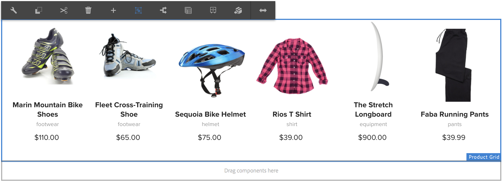

# 使用體驗片段 {#using-experience-fragments}

本頁涵蓋下列主題：

* **概觀**
* **在AEM Screens中使用體驗片段**
* **將變更傳播至頁面**

## 概觀 {#overview}

一個 ***體驗片段*** 是一組一或多個元件，包括可在頁面中參考的內容和版面。 體驗片段可以包含任何元件，例如一個或多個元件，這些元件可以包含段落系統中被參考到完整體驗或由第三個端點請求的任何內容。

## 在AEM Screens中使用體驗片段 {#using-experience-fragments-in-aem-screens}

>[!NOTE]
>以下範例使用 **`We.Retail`** 作為示範專案，從套用體驗片段的 **網站** AEM Screens專案的頁面。

以下工作流程以為例，示範如何使用中的體驗片段 `We.Retail` 在Sites中。 您可以選取網頁，並在其中一個專案的AEM Screens頻道中使用該內容。

### 必要條件  {#pre-requisites}

**使用頻道建立示範專案**

***建立專案***

1. 若要建立專案，請按一下 **建立畫面專案**.
1. 輸入標題為 **示範專案**.
1. 按一下「**儲存**」。

A **示範專案** 已新增至您的AEM Screens。

***建立頻道***

1. 導覽至 **示範專案** 您已建立並按一下 **頻道** 資料夾。

1. 按一下 **建立** 以開啟精靈。
1. 選擇 **順序頻道** 範本，然後按一下 **下一個**.

1. 輸入 **標題** 作為 **TestChannel** 並按一下 **建立**.

A **TestChannel** 已新增至您的 **示範專案**.\

### 建立體驗片段 {#creating-an-experience-fragment}

請依照下列步驟，套用來自的內容 **`We.Retail`** 至您的 **TestChannel** 在 **示範專案**.

1. **導覽至We.Retail中的網站頁面**

   1. 導覽至網站，然後按一下 **`We.Retail`** > **美國** > **英文** > **裝置** 並按一下此頁面，以便將其用作Screens頻道的體驗片段。

   1. 按一下 **編輯** 從動作列開啟，以開啟您要用作Screens頻道體驗片段的頁面。

1. **重複使用內容**

   1. 按一下您要包含在頻道中的片段。
   1. 按一下右側的最後一個圖示，您就可以開啟 **轉換為體驗片段** 對話方塊。

   

1. **建立體驗片段**

   1. 選擇 **動作** 作為 **建立新的體驗片段**.

   1. 按一下 **父路徑**.
   1. 按一下 **範本**. 選擇 **體驗片段 — 畫面變數** 範本在此（欄位中的值） `/libs/settings/screens/experience-fragments/templates/experience-fragment-template-screens`)。

   1. 輸入 **片段標題** 作為 **ScreensFragment**.

   1. 若要完成新體驗片段的建立，請按一下核取記號。

   

   附註：若要按一下較簡單的選項，請按一下欄位右側的核取記號，以開啟選取對話方塊。

1. **建立體驗片段的即時副本**

   1. 導覽至AEM首頁。
   1. 按一下 **體驗片段** 並反白顯示 **ScreensFragment** 並按一下 **變數為live-copy**，如下圖所示：

   

   c.按一下 **ScreensFragment** 從 **建立即時副本** 精靈並按一下 **下一個**.

   d.輸入 **標題** 和 **名稱** 作為 **Screens**.

   e.按一下 **建立** 以便建立即時副本。

   f.按一下 **完成** 以便移回 **ScreensFragment** 頁面。

   

   >[!NOTE]
   >
   >建立AEM Screens片段後，您可以編輯片段的屬性。 按一下片段，然後按一下 **屬性** 從動作列移除。

   **編輯畫面片段的屬性**

   1. 導覽至 **ScreensFragment** （您已在前述步驟中建立），然後按一下 **屬性** 從動作列移除。

   1. 按一下 **離線設定** 標籤，如下圖所示。

   您可以新增 **使用者端資料庫** (Java™和css)和 **靜態檔案** 至您的體驗片段。

   以下範例顯示新增使用者端程式庫和字型作為靜態檔案的一部分到您的體驗片段。  

1. **在畫面頻道中使用體驗片段作為元件**

   1. 導覽至畫面頻道，您想在此使用 **Screens** 片段。
   1. 按一下 **TestChannel** 並按一下 **編輯** 從動作列移除。

   1. 按一下側邊標籤中的元件圖示。
   1. 拖放 **體驗片段** 至您的頻道。

   

   e.按一下 **體驗片段** 元件並按一下左上角（扳手）圖示，開啟 **體驗片段** 對話方塊。

   f.按一下 **Screens** 您在中建立的片段的即時副本 *步驟3* 在 **路徑**.

   

   f.按一下 **Screens** 您在中建立的片段的即時副本 *步驟3* 在 **體驗片段**.

   

   h.輸入毫秒數，單位： **持續時間**.

   i.按一下 **離線設定** 從 **體驗片段** 對話方塊，讓您可以定義使用者端程式庫和靜態檔案。

   >[!NOTE]
   >
   >若要新增使用者端程式庫或靜態檔案(除了您在步驟(4)中設定的專案外)，您可以從以下位置新增： **離線設定** 索引標籤中的 **體驗片段** 對話方塊。

   

   j.按一下核取記號，以便完成處理。

### 驗證結果 {#validating-the-result}

完成上述步驟後，您便可以在中驗證體驗片段 **ChannelOne** 作者：

1. 瀏覽至 **TestChannel**.
1. 選取 **預覽** 從動作列移除。

從檢視內容 **網站** 頁面（體驗片段的即時副本），如下圖所示：\

## 將變更傳播至頁面 {#propagating-changes-from-the-master-page}

***即時副本*** 是指由轉出設定定義的同步化動作所維護的（來源的）副本。

因為您建立的體驗片段是來自 **網站** 頁面，而從主要頁面變更該特定片段，即可在您的頻道中檢視變更。 或者，檢視您使用體驗片段的目的地。

>[!NOTE]
>
>如需即時副本的詳細資訊，請參閱重複使用內容：多網站管理員和即時副本。

請依照下列步驟，將變更從主要管道傳播至您的目的地管道：

1. 從按一下體驗片段 **網站** （主要）頁面，然後按一下鉛筆圖示，這樣您就可以編輯體驗片段中的專案。

   

1. 按一下體驗片段，然後按一下扳手圖示，即可開啟對話方塊以編輯影像。

   

1. 此 **產品格線** 對話方塊開啟。

   

1. 您可以編輯任何影像。 例如，這裡會取代此片段中的第一個影像。

   

1. 按一下體驗片段，然後按一下轉出圖示，這樣您就可以將變更傳播到您的頻道中使用的片段。

   

1. 按一下「轉出」。

   請注意，變更已轉出。

   

### 驗證變更 {#validating-the-changes}

請依照下列步驟，確認管道中的變更：

1. 導覽至 **Screens** > **頻道** > **TestChannel**.

1. 按一下 **預覽** 從動作列移除。

下圖說明中的變更， **TestChannel**：\

