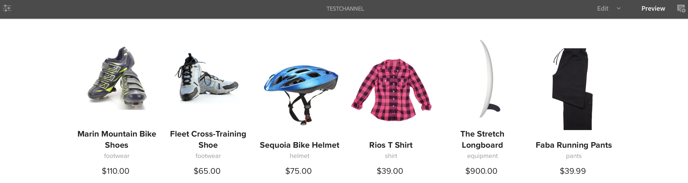
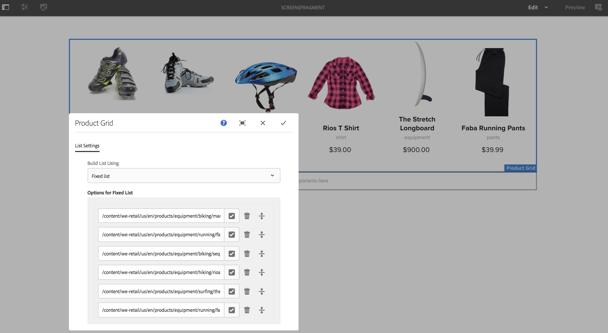

# 使用體驗片段 {#using-experience-fragments}

本頁介紹以下主題：

* **概觀**
* **使用經驗片段在AEM Screens**
* **將更改傳播到頁面**

## 概觀 {#overview}

安 ***體驗片段*** 是一個或多個元件的組，包括可在頁面中引用的內容和佈局。 體驗片段可以包含任何元件，例如，一個或多個元件可以包含段落系統中的任何內容，這些元件將被引用到完整體驗中或由第三端點請求。

## 使用經驗片段在AEM Screens {#using-experience-fragments-in-aem-screens}

>[!NOTE]
>以下示例使用 **We.Retail** 作為演示項目，從中可以從 **站點** 一個AEM Screens項目。

例如，以下工作流演示了在站點中使用We.Retail的經驗片段。 您可以選擇一個網頁，並在您的某個項目中利用您的AEM Screens渠道中的內容。

### 先決條件 {#pre-requisites}

**使用渠道建立演示項目**

***建立項目***

1. 按一下 **建立螢幕項目** 來修改標籤元素的屬性。
1. 將標題輸入為 **演示項目**。
1. 按一下「**儲存**」。

A **演示項目** 會被加到你的AEM Screens。

***建立通道***

1. 導航到 **演示項目** 建立並選擇 **頻道** 的子菜單。

1. 按一下 **建立** 的子菜單。
1. 選擇 **序列通道** 模板，然後按一下 **下一個**。

1. 輸入 **標題** 如 **測試通道** 按一下 **建立**。

A **測試通道** 將添加到 **演示項目**。\

### 建立體驗片段 {#creating-an-experience-fragment}

按照以下步驟來利用 **We.Retail** 到 **測試通道** 在 **演示項目**。

1. **導航到We.Retail中的「站點」頁**

   1. 導航到站點並選擇 **We.Retail** -> **美國** -> **英語** -> **設備** 並選擇此頁以將此內容用作螢幕頻道的體驗片段。

   1. 按一下 **編輯** 從操作欄開啟要用作螢幕頻道的體驗片段的頁面。

1. **重新使用內容**

   1. 選擇要包括在頻道中的片段。
   1. 按一下右側的最後一個表徵圖以開啟 **轉換為體驗片段** 對話框。

   

1. **建立體驗片段**

   1. 選擇 **操作** 如 **建立新體驗片段**。

   1. 選擇 **父路徑**。
   1. 選擇 **模板**。 選擇 **體驗片段 — 螢幕變體** 此處的模板（欄位中的值） `/libs/settings/screens/experience-fragments/templates/experience-fragment-template-screens`)。

   1. 輸入 **片段標題** 如 **螢幕片段**。

   1. 按一下複選標籤以完成新體驗片段的建立。

   

   注：要更容易地選擇選項，請按一下欄位右側的複選標籤以開啟選擇對話框。

1. **建立體驗片段的即時副本**

   1. 導航到AEM首頁。
   1. 選擇 **體驗片段** 並突出顯示 **螢幕片段** 按一下 **變體為即時拷貝**，如下圖所示：

   

   c.選擇 **螢幕片段** 從 **建立即時拷貝** 嚮導 **下一個**。

   d.輸入 **標題** 和 **名稱** 如 **螢幕**。

   e.按一下 **建立** 建立活動副本。

   f按一下 **完成** 移回 **螢幕片段** 的子菜單。

   

   >[!NOTE]
   >
   >建立「螢幕」片段後，可以編輯片段的屬性。 選擇片段並按一下 **屬性** 按鈕。

   **編輯螢幕片段的屬性**

   1. 導航到 **螢幕片段** （在前面的步驟中建立），然後按一下 **屬性** 按鈕。

   1. 選擇 **離線配置** 頁籤，如下圖所示。

   可以添加 **客戶端庫** （java和css）和 **靜態檔案** 你經歷的殘缺。

   下面的示例將客戶端庫和字型作為靜態檔案的一部分添加到您的體驗片段中。  

1. **在螢幕通道中將體驗片段用作元件**

   1. 導航至要使用的螢幕通道 **螢幕** 碎片。
   1. 選擇 **測試通道** 按一下 **編輯** 按鈕。

   1. 按一下側面頁籤中的元件表徵圖。
   1. 拖放 **體驗片段** 你的頻道。

   

   e.選擇 **體驗片段** 並選取左上（扳手）表徵圖以開啟 **體驗片段** 對話框。

   f選擇 **螢幕** 您建立的片段的即時副本 *步驟3* 在 **路徑**。

   

   f選擇 **螢幕** 您建立的片段的即時副本 *步驟3* 的 **體驗片段**。

   

   h輸入毫秒（以為單位） **持續時間**。

   我。選擇 **離線配置** 從 **體驗片段** 對話框，定義客戶端庫和靜態檔案。

   >[!NOTE]
   >
   >如果除了在步驟(4)中配置的外，還要添加客戶端庫或靜態檔案，可以從 **離線配置** 的 **體驗片段** 對話框。

   

   j按一下複選標籤以完成該過程。

### 驗證結果 {#validating-the-result}

完成上述步驟後，您可以在中驗證您的體驗片段 **第一頻道** 按：

1. 導航到 **測試通道**。
1. 選擇 **預覽** 按鈕。

您將從 **站點** （體驗片段的即時拷貝），如下圖所示：\

## 將更改傳播到頁面 {#propagating-changes-from-the-master-page}

***即時拷貝*** 指由同步操作維護的（源的）副本（由部署配置定義）。

自體驗片段以來，我們建立的是 **站點** 因此，如果從母版頁對該特定片段進行更改，您將查看頻道或使用體驗片段的目標中的更改。

>[!NOTE]
>
>有關Live Copy的詳細資訊，請參閱重新使用內容：多站點管理器和即時拷貝。

按照以下步驟將更改從主通道傳播到目標通道：

1. 從中選擇體驗片段 **站點** （母版）頁面，然後按一下鉛筆表徵圖以編輯「體驗片段」中的項。

   

1. 選擇「體驗片段」(Experience Fragment)，然後按一下扳手錶徵圖以開啟對話框以編輯影像。

   

1. 的 **產品網格** 對話框。

   

1. 可以編輯任何影像。 例如，此處將替換此片段中的第一個影像。

   

1. 選擇「體驗片段」，然後按一下「展示」表徵圖，將更改傳播到通道中使用的片段。

   

1. 按一下「展示」(Ollovate)確認更改。

   您將看到已展開更改。

   

### 驗證更改 {#validating-the-changes}

按照以下步驟確認您的渠道中的更改：

1. 導航到 **螢幕** -> **頻道** -> **測試通道**。

1. 按一下 **預覽** 的子菜單。

下圖說明了您 **測試通道**:\

