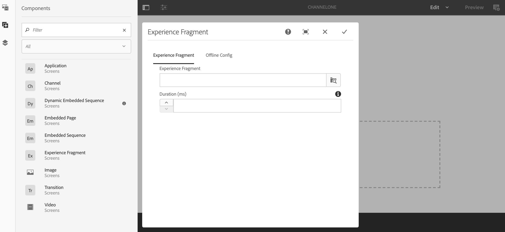
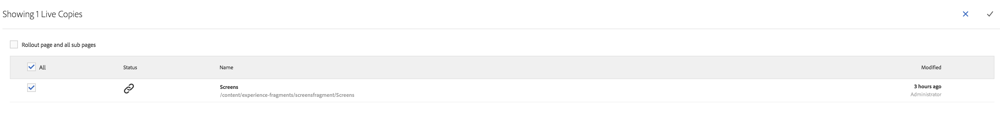

# 使用體驗片段 {#using-experience-fragments}

本頁涵蓋下列主題：

* **概覽**
* **在AEM畫面中使用體驗片段**
* **從主版頁面傳播變更**

## 概覽 {#overview}

體驗 ***片段是一組由一或多個元件組成的群組*** ，包括可在頁面中參考的內容和版面。 體驗片段可包含任何元件，例如，一個或多個元件可包含段落系統內任何內容，這些元件將參照至完整體驗或由第三端點要求。

## 在AEM畫面中使用體驗片段 {#using-experience-fragments-in-aem-screens}

>[!NOTE]
>
>下列範例使用 **We.Retail** 做為示範專案，將體驗片段從「網站」頁面運用至 **** AEM Screens專案。

例如，下列工作流程示範在網站中使用We.Retail的體驗片段。 您可以選擇網頁，並將AEM Screens頻道中的該內容運用在其中一個專案中。

### 先決條件 {#pre-requisites}

**使用渠道建立示範專案**

***建立專案***

1. 按一 **下「建立畫面專案** 」以建立新專案。
1. 將標題輸入為 **DemoProject**。
1. 按一下&#x200B;**「儲存」**。

DemoProject **將會新增** 至您的AEM畫面。

***建立渠道***

1. 導覽至您建 **立的DemoProject** ，然後選取「 **Channels** 」檔案夾。

1. 按一 **下動作列** 中的「建立」，以開啟精靈。
1. 從嚮導中 **選擇「序列渠道** 」模板，然後按一下「 **下一步」**。

1. 將標題輸 **入為** TestChannel **，然後按一** 下Create ****。

您 **的DemoProject將會新增** TestChannel ****。\

### 建立體驗片段 {#creating-an-experience-fragment}

請依照下列步驟，將 **We.Retail的內容運用到您的** TestChannel **** in DemoProject ****。

1. **導覽至We.Retail中的「網站」頁面**

   1. 導覽至「網站」並選 **擇「We.Retail In-Store** -> **United States** ->英文&#x200B;**,****** Select EquipmentPage」，將此作為螢幕頻道的體驗片段。

   1. 從動 **作列按一下** 「編輯」，以開啟您要用作「畫面」頻道體驗片段的頁面。

      

1. **重新使用內容**

   1. 選取您要加入渠道的片段。
   1. 按一下右側的最後一個圖示，開啟「轉 **換為體驗片段** 」對話方塊。
   

1. **建立體驗片段**

   1. 選擇「 **動作** 」 **為「建立新體驗片段」**。

   1. 選擇父 **路徑**。
   1. 選擇 **範本**。 在這裡選 **擇「體驗片段——螢幕變化** 」範本。

   1. 將「片段 **標題」輸入** 「 **畫面片段」**。

   1. 按一下核取標籤，完成新體驗片段的建立。
   

1. **建立體驗片段的即時副本**

   1. 導覽至AEM首頁。
   1. 選取 **Experience Fragments** ，然後反白標示 **ScreensFragment** ，然後按一下「 **變數」作為即時副本**，如下圖所示：
   

   c. 從「建立即時副本」精靈中選取** ScreensFragment ****** ，然後按一 **下Next**。

   d. 輸入「標 **題** 」和「 **名稱** 」為「 **畫面**」。

   e. 按一 **下「建立** 」以建立即時副本。

   f. 按一 **下「完成** 」以返回 **ScreensFragment** 頁面。

   

   >[!NOTE]
   >
   >建立「畫面」片段後，您就可以編輯片段的屬性。 選取片段，然後從動 **作列按一下** 「屬性」。

   **編輯畫面片段的屬性**

   1. 導覽至 **ScreensFragment** （您在前述步驟中建立），然後從動作列按 **一下「屬性** 」。

   1. 選擇「 **離線配置** 」頁籤，如下圖所示。
   您可以將用戶 **端程式庫** （java和css）和 **** 靜態檔案新增至體驗片段。

   下列範例顯示在體驗片段中加入用戶端程式庫和靜態檔案中的字型。  

1. **在畫面頻道中使用體驗片段做為元件**

   1. 導覽至您要使用「畫面」片段的「畫 **面** 」頻道。
   1. 選取 **TestChannel** ，然後從動作 **列按一下** 「編輯」。

   1. 按一下側面頁籤中的元件表徵圖。
   1. 將體驗片段 **拖放至您** 的頻道。
   

   e. 選取 **Experience Fragment** （體驗片段）元件，並選取左上角（扳手）圖示以開啟「 **體驗片段** 」對話方塊。

   f. 選取您 **在Path中** Step 3中建立之片段的「畫面 *」* 即時 **副本**。

   

   f. 選取您 **在** Experience Fragment中於步驟3中建立之片段的「畫面 *」即時* 副本 ****。

   

   h. 在「持續時間」中輸 **入毫秒**。

   i. 從「體 **驗片段」對話方塊中** ，選取「離線設定 **** 」，以定義用戶端程式庫和靜態檔案。

   >[!NOTE]
   >
   >如果除了在步驟(4)中配置的檔案外，還要添加客戶端庫或靜態檔案，可以從「 **Experience Fragment** 」（體驗片段）對話框的「離線配置 **」(Offline Config** )頁籤添加。

   

   j. 按一下核取標籤以完成程式。

### 驗證結果 {#validating-the-result}

完成上述步驟後，您可以透過下列方式在 **ChannelOne中驗證您的體驗片段** :

1. 導覽至 **TestChannel**。
1. 從操作 **欄中選** 擇「預覽」。

您會從您的頻道中 **的** 「網站」頁面（體驗片段的即時副本）檢視內容，如下圖所示：\

## 從主版頁面傳播變更 {#propagating-changes-from-the-master-page}

***即時副本*** 是指由同步動作（如轉出組態所定義）維護的復本（來源）。

由於「體驗片段」是從「 **Sites** 」頁面建立的即時副本，因此，如果您從主版頁面變更該特定片段，您將檢視您的頻道或使用「體驗片段」的目的地的變更。

>[!NOTE]
>
>如需即時副本的詳細資訊，請參閱重複使用內容： 多網站管理員和即時副本。

請依照下列步驟，將變更從主頻道傳播至您的目的地頻道：

1. 從「網站 **** （主版）」頁面選取「體驗片段」，然後按一下鉛筆圖示以編輯「體驗片段」中的項目。

   

1. 選取「體驗片段」，然後按一下扳手圖示以開啟對話方塊以編輯影像。

   

1. 「產 **品格線** 」(Product Grid)對話框開啟。

   

1. 您可以編輯任何影像。 例如，此處會在此片段中取代第一個影像。

   

1. 選取「體驗片段」，然後按一下「轉出」圖示，將變更傳播至您頻道中使用的片段。

   

1. 按一下轉出以確認變更。

   您會看到變更已推出。

   

### 驗證更改 {#validating-the-changes}

請依照下列步驟確認您的渠道變更：

1. 導覽至「 **畫面** 」->「頻 **道** 」-> **「測試頻道**」。

1. 從動 **作列按一下** 「預覽」，以確認變更。

下圖說明您的 **TestChannel變更**:\

