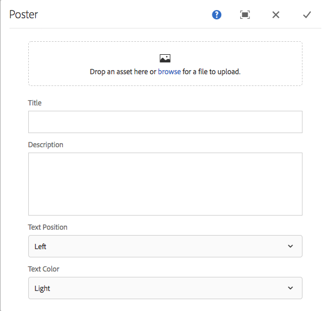

# 擴充AEM Screens元件

下列教學課程會逐步解說擴充現成可用的AEM Screens元件的步驟和最佳作法。 影像元件會延伸以新增可編寫的文字覆蓋。

## 概觀 {#overview}

本教學課程適用於AEM Screens的新手開發人員。 在本教學課程中，Screens影像元件已擴充以建立海報元件。 標題、說明和標誌會覆蓋在影像上，以便在序列頻道中建立引人入勝的體驗。

>[!NOTE]
>
>開始此教學課程之前，建議您完成此教學課程： [為AEM Screens開發自訂元件](developing-custom-component-tutorial-develop.md)。


`Custom Poster`元件是透過擴充影像元件所建立。

## 先決條件 {#prerequisites}

若要完成本教學課程，您需要完成下列事項：

1. AEM 6.5 +最新Screens Feature Pack
1. [AEM Screens 播放器](/help/user-guide/aem-screens-introduction.md)
1. 本機開發環境

教學課程步驟和熒幕擷取畫面使用CRXDE-Lite執行。 [Eclipse](https://experienceleague.adobe.com/en/docs/experience-manager-65/content/implementing/developing/devtools/aem-eclipse)或[IntelliJ](https://experienceleague.adobe.com/en/docs/experience-manager-65/content/implementing/developing/devtools/ht-intellij) IDE也可以用來完成本教學課程。 有關使用IDE [搭配AEM開發的詳細資訊，請參閱此處](https://experienceleague.adobe.com/en/docs/experience-manager-learn/getting-started-wknd-tutorial-develop/project-archetype/project-setup)。

## 專案設定 {#project-setup}

Screens專案的原始程式碼通常會作為多模組Maven專案來管理。 為了加快教學課程，已使用[AEM Project Archetype 13](https://github.com/adobe/aem-project-archetype)預先產生專案。 有關[使用Maven AEM Project Archetype建立專案的更多詳細資訊，請參閱此處](https://experienceleague.adobe.com/en/docs/experience-manager-learn/getting-started-wknd-tutorial-develop/project-archetype/project-setup)。

1. 使用&#x200B;**CRX封裝管理** `http://localhost:4502/crx/packmgr/index.jsp)r:`下載並安裝下列封裝

[取得檔案](assets/start-poster-screens-weretail-runuiapps-001-snapshot.zip)

   [取得檔案](assets/start-poster-screens-weretail-runuicontent-001-snapshot.zip)
   **或者**&#x200B;如果搭配使用Eclipse或其他IDE，請下載下列來源套件。 使用Maven命令將專案部署到本機AEM執行個體：

   **`mvn -PautoInstallPackage clean install`**

   SRC啟動Screens `We.Retail`執行專案

[取得檔案](assets/start-poster-screens-weretail-run.zip)

1. 在&#x200B;**CRX Package Manager** `http://localhost:4502/crx/packmgr/index.jsp`中安裝了下列兩個套件：

   1. **`screens-weretail-run.ui.content-0.0.1-SNAPSHOT.zip`**
   1. **`screens-weretail-run.ui.apps-0.0.1-SNAPSHOT.zip`**

   

   透過AEM Screens封裝管理員安裝的CRX `We.Retail Run Ui.Apps`和`Ui.Content`封裝

## 建立海報元件 {#poster-cmp}

海報元件可延伸現成的AEM Screens影像元件。 Sling `sling:resourceSuperType`的機制可用來繼承影像元件的核心功能，而不需要複製和貼上。 如需[Sling要求處理基本概念的詳細資訊，請參閱此處。](https://experienceleague.adobe.com/zh-hant/docs/experience-manager-65/content/implementing/developing/introduction/the-basics)

海報元件會在預覽/生產模式中以全熒幕呈現。 在編輯模式中，以不同方式呈現元件很重要，以方便編寫「序列」通道。

1. 在&#x200B;**CRXDE-Lite** `http://localhost:4502/crx/de/index.jsp` （或選擇的IDE）中，於`/apps/weretail-run/components/content`下建立名為`poster`的`cq:Component`。

   將下列屬性新增至`poster`元件：

   ```xml
   <?xml version="1.0" encoding="UTF-8"?>
   <jcr:root xmlns:sling="https://sling.apache.org/jcr/sling/1.0" xmlns:cq="https://www.day.com/jcr/cq/1.0" xmlns:jcr="https://www.jcp.org/jcr/1.0"
       jcr:primaryType="cq:Component"
       jcr:title="Poster"
       sling:resourceSuperType="screens/core/components/content/image"
       componentGroup="We.Retail Run - Content"/>
   ```

   /apps/weretail-run/components/content/poster](assets/poster.png)的![屬性

   /apps/weretail-run/components/content/poster的屬性

   透過將`sling:resourceSuperType`屬性設定為等於`screens/core/components/content/image`，海報元件將有效地繼承影像元件的所有功能。 在`screens/core/components/content/image`下找到的對等節點和檔案可以在`poster`元件下新增，以覆寫和擴充功能。

1. 複製`/libs/screens/core/components/content/image`底下的`cq:editConfig`節點。 在`/apps/weretail-run/components/content/poster`元件下方貼上`cq:editConfig`。

   在`cq:editConfig/cq:dropTargets/image/parameters`節點上，將`sling:resourceType`屬性更新為等於`weretail-run/components/content/poster`。

   

   以下表示的`cq:editConfig`的XML表示法：

   ```xml
   <?xml version="1.0" encoding="UTF-8"?>
   <jcr:root xmlns:sling="https://sling.apache.org/jcr/sling/1.0" xmlns:cq="https://www.day.com/jcr/cq/1.0" xmlns:jcr="https://www.jcp.org/jcr/1.0" xmlns:nt="https://www.jcp.org/jcr/nt/1.0"
       jcr:primaryType="cq:EditConfig">
       <cq:dropTargets jcr:primaryType="nt:unstructured">
           <image
               jcr:primaryType="cq:DropTargetConfig"
               accept="[image/.*]"
               groups="[media]"
               propertyName="./fileReference">
               <parameters
                   jcr:primaryType="nt:unstructured"
                   sling:resourceType="weretail-run/components/content/poster"
                   imageCrop=""
                   imageMap=""
                   imageRotate=""/>
           </image>
       </cq:dropTargets>
   </jcr:root>
   ```

1. 複製WCM Foundation `image`對話方塊以用於`poster`元件。

   最簡單的方式是從現有的對話方塊開始，然後進行修改。

   1. 複製對話方塊來源： `/libs/wcm/foundation/components/image/cq:dialog`
   1. 在`/apps/weretail-run/components/content/poster`下方貼上對話方塊

   

   已將對話方塊從`/libs/wcm/foundation/components/image/cq:dialog`複製到`/apps/weretail-run/components/content/poster`

   AEM Screens `image`元件是WCM Foundation `image`元件的超型別。 因此，`poster`元件會從兩者繼承功能。 海報元件的對話方塊是由Screens和Foundation對話方塊的組合所組成。 **Sling Resource Merger**&#x200B;的功能可用來隱藏從超級型別元件繼承的不相關對話方塊欄位和索引標籤。

1. 以下列以XML表示的變更更新`/apps/weretail-run/components/content/poster`下方的`cq:dialog`：

   ```xml
   <?xml version="1.0" encoding="UTF-8"?>
   <jcr:root xmlns:sling="https://sling.apache.org/jcr/sling/1.0" xmlns:cq="https://www.day.com/jcr/cq/1.0" xmlns:jcr="https://www.jcp.org/jcr/1.0" xmlns:nt="https://www.jcp.org/jcr/nt/1.0"
       jcr:primaryType="nt:unstructured"
       jcr:title="Poster"
       sling:resourceType="cq/gui/components/authoring/dialog">
       <content
           jcr:primaryType="nt:unstructured"
           sling:resourceType="granite/ui/components/foundation/container">
           <layout
               jcr:primaryType="nt:unstructured"
               sling:resourceType="granite/ui/components/foundation/layouts/tabs"
               type="nav"/>
           <items jcr:primaryType="nt:unstructured">
               <image
                   jcr:primaryType="nt:unstructured"
                   jcr:title="Elements"
                   sling:resourceType="granite/ui/components/foundation/section">
                   <layout
                       jcr:primaryType="nt:unstructured"
                       sling:resourceType="granite/ui/components/foundation/layouts/fixedcolumns"
                       margin="{Boolean}false"/>
                   <items jcr:primaryType="nt:unstructured">
                       <column
                           jcr:primaryType="nt:unstructured"
                           sling:resourceType="granite/ui/components/foundation/container">
                           <items
                               jcr:primaryType="nt:unstructured"
                               sling:hideChildren="[linkURL,size]">
                               <file
                                   jcr:primaryType="nt:unstructured"
                                   sling:resourceType="cq/gui/components/authoring/dialog/fileupload"
                                   autoStart="{Boolean}false"
                                   class="cq-droptarget"
                                   fieldLabel="Image asset"
                                   fileNameParameter="./fileName"
                                   fileReferenceParameter="./fileReference"
                                   mimeTypes="[image]"
                                   multiple="{Boolean}false"
                                   name="./file"
                                   title="Upload Image Asset"
                                   uploadUrl="${suffix.path}"
                                   useHTML5="{Boolean}true"/>
                               <title
                                   jcr:primaryType="nt:unstructured"
                                   sling:resourceType="granite/ui/components/foundation/form/textfield"
                                   fieldLabel="Title"
                                   name="./jcr:title"/>
                               <description
                                   jcr:primaryType="nt:unstructured"
                                   sling:resourceType="granite/ui/components/foundation/form/textarea"
                                   fieldLabel="Description"
                                   name="./jcr:description"/>
                               <position
                                   jcr:primaryType="nt:unstructured"
                                   sling:resourceType="granite/ui/components/coral/foundation/form/click"
                                   fieldLabel="Text Position"
                                   name="./textPosition">
                                   <items jcr:primaryType="nt:unstructured">
                                       <left
                                           jcr:primaryType="nt:unstructured"
                                           text="Left"
                                           value="left"/>
                                       <center
                                           jcr:primaryType="nt:unstructured"
                                           text="Center"
                                           value="center"/>
                                       <right
                                           jcr:primaryType="nt:unstructured"
                                           text="Right"
                                           value="right"/>
                                   </items>
                               </position>
                               <color
                                   jcr:primaryType="nt:unstructured"
                                   sling:resourceType="granite/ui/components/coral/foundation/form/click"
                                   fieldLabel="Text Color"
                                   name="./textColor">
                                   <items jcr:primaryType="nt:unstructured">
                                       <light
                                           jcr:primaryType="nt:unstructured"
                                           text="Light"
                                           value="light"/>
                                       <dark
                                           jcr:primaryType="nt:unstructured"
                                           text="Dark"
                                           value="dark"/>
                                   </items>
                               </color>
                           </items>
                       </column>
                   </items>
               </image>
               <accessibility
                   jcr:primaryType="nt:unstructured"
                   sling:hideResource="{Boolean}true"/>
           </items>
       </content>
   </jcr:root>
   ```

   屬性`sling:hideChildren`= `"[linkURL,size]`」用於`items`節點，以確保對話方塊中的&#x200B;**linkURL**&#x200B;與&#x200B;**size**&#x200B;欄位隱藏。 從海報對話方塊中移除這些節點是不夠的。 協助工具標籤上的屬性`sling:hideResource="{Boolean}true"`可用來隱藏整個標籤。

   在對話方塊中新增兩個按一下欄位（文字位置和文字顏色），讓作者可以控制文字的位置以及「標題」和「說明」的顏色。

   

   海報 — 最後一個對話方塊結構

   此時，可以將`poster`元件的執行個體新增至`We.Retail` Run專案中的&#x200B;**閒置頻道**&#x200B;頁面： `http://localhost:4502/editor.html/content/screens/we-retail-run/channels/idle-channel.edit.html`。

   

   海報對話方塊欄位

1. 在`/apps/weretail-run/components/content/poster`下建立名為`production.html.`的檔案

   將下列專案填入檔案中：

   ```xml
   <!--/*
   
       /apps/weretail-run/components/content/poster/production.html
   
   */-->
   <div data-sly-use.image="image.js"
        data-duration="${properties.duration}"
        class="cmp-poster"
        style="background-image: url(${request.contextPath @ context='uri'}${image.src @ context='uri'});">
       <div class="cmp-poster__text
                   cmp-poster__text--${properties.textPosition @ context='attribute'}
                   cmp-poster__text--${properties.textColor @ context='attribute'}">
           <h1 class="cmp-poster__title">${properties.jcr:title}</h1>
            <h2 class="cmp-poster__description">${properties.jcr:description}</h2>
       </div>
    
   </div>
   ```

   可直接在上方看到海報元件的生產標籤。 HTL指令碼會覆寫`screens/core/components/content/image/production.html`。 `image.js`是伺服器端指令碼，可建立類似POJO的影像物件。 然後可以呼叫Image物件將`src`演算為內嵌樣式background-image。

   已新增`The h1`和h2標籤，根據元件屬性顯示標題和說明： `${properties.jcr:title}`和`${properties.jcr:description}`。

   `h1`和`h2`標籤周圍是div包裝函式，其中包含三個CSS類別，變數為&quot;`cmp-poster__text`&quot;。 `textPosition`和`textColor`屬性的值是用來變更根據作者對話方塊選取範圍演算的CSS類別。 在下一個區段中，會寫入使用者端資料庫的CSS以啟用這些變更的顯示。

   標誌也會以覆蓋圖的形式納入元件中。 在此範例中，` We.Retail`標誌的路徑在DAM中以硬式編碼。 視使用案例而定，更合理的做法是建立對話方塊欄位，將標誌路徑設為動態填入值。

   另請注意，元件會使用BEM （區塊元素修飾元）記號。 BEM是CSS編碼慣例，可讓您更輕鬆地建立可重複使用的元件。 BEM是[AEM核心元件](https://github.com/adobe/aem-core-wcm-components/wiki/CSS-coding-conventions)所使用的記號。<!-- DEAD LINK More info can be found at: [https://getbem.com/](https://getbem.com/) -->

1. 在`/apps/weretail-run/components/content/poster`下建立名為`edit.html.`的檔案

   將下列專案填入檔案中：

   ```xml
   <!--/*
   
       /apps/weretail-run/components/content/poster/edit.html
   
   */-->
   
   <div class="aem-Screens-editWrapper ${image.cssClass} cmp-poster" data-sly-use.image="image.js" data-emptytext="${'Poster' @ i18n, locale=request.locale}">
       
       <div class="cmp-poster__text
              cmp-poster__text--${properties.textPosition @ context='attribute'}
          cmp-poster__text--${properties.textColor @ context='attribute'}">
         <p class="cmp-poster__title">${properties.jcr:title}</p>
         <p class="cmp-poster__description">${properties.jcr:description}</p>
       </div>
   </div>
   ```

   直接在上方可以看到海報元件的&#x200B;**編輯**&#x200B;標籤。 HTL指令碼會覆寫`/libs/screens/core/components/content/image/edit.html`。 此標籤類似於`production.html`標籤，並在影像上方顯示標題和說明。

   已新增`aem-Screens-editWrapper`，因此元件不會在編輯器中呈現全熒幕。 `data-emptytext`屬性可確保當沒有填入影像或內容時顯示預留位置。

## 建立使用者端程式庫 {#clientlibs}

使用者端資料庫提供一種機制，可整理和管理AEM實施所需的CSS和JavaScript檔案。 如需有關使用[使用者端資料庫的詳細資訊，請參閱此處。](https://experienceleague.adobe.com/en/docs/experience-manager-65/content/implementing/developing/introduction/clientlibs)

AEM Screens元件在編輯模式與預覽/生產模式中的轉譯方式不同。 已建立兩組使用者端程式庫，一組用於編輯模式，另一組用於預覽/生產模式。

1. 為海報元件的使用者端程式庫建立資料夾。

   在`/apps/weretail-run/components/content/poster`下方，建立名為`clientlibs`的資料夾。

   

1. 在`clientlibs`資料夾下，建立名稱為`shared`且型別為`cq:ClientLibraryFolder.`的節點

   

1. 將下列屬性新增至共用使用者端程式庫：

   * `allowProxy` | 布林值 | `true`
   * `categories` | 字串[] | `cq.screens.components`

   /apps/weretail-run/components/content/poster/clientlibs/shared](assets/2018-05-03_at_1026pm-1.png)的

1. 在共用資料夾下建立名為`css.txt`的檔案。

   將下列專案填入檔案中：

   ```
   #base=css
   
   styles.less
   ```

1. 在`shared`資料夾下建立名為`css`的資料夾。 在`css`資料夾下新增名為`style.less`的檔案。 使用者端程式庫的結構現在看起來應該像這樣：

   

   本教學課程不直接撰寫CSS，而是使用LESS。 [LESS](https://lesscss.org/)是一種常用的CSS預先編譯器，支援CSS變數、mixin和函式。 AEM使用者端程式庫原生支援LESS編譯。 可以使用Sass或其他預先編譯程式，但必須在AEM外部編譯。

1. 以下列專案填入`/apps/weretail-run/components/content/poster/clientlibs/shared/css/styles.less`：

   ```css
   /*
    /apps/weretail-run/components/content/poster/clientlibs/shared/css/styles.less
    Poster component - Shared Style
   */
   
   @import url('https://fonts.googleapis.com/css?family=Fjalla+One|Open+Sans:400i');
   
   @text-light-color: #fff;
   @text-dark-color: #000;
   @title-font-family: 'Fjalla One', sans-serif;
   @description-font-family: 'Open Sans', sans-serif;
   
   .cmp-poster {
   
         &__text {
         position: absolute;
         color: @text-light-color;
         top: 0;
         text-align:center;
         width: 100%;
   
         &--left {
          text-align: left;
                margin-left: 1em;
         }
   
         &--right {
          text-align: right;
                margin-right: 1em;
         }
   
         &--dark {
          color: @text-dark-color;
         }
       }
   
       &__title {
         font-weight: bold;
            font-family: @title-font-family;
            font-size: 1.2em;
       }
   
       &__description {
     font-style: italic;
           font-family: @description-font-family;
    }
   
   }
   ```

   >[!NOTE]
   >
   >GoogleWeb Fonts用於字型系列。 Web Fonts需要網際網路連線，而且並非所有AEM Screens實作都有可靠的連線。 離線模式的Planning是AEM Screens部署的重要考量。

1. 複製`shared`使用者端程式庫資料夾。 貼上為同層級，並將其重新命名為`production`。

   

1. 將生產使用者端程式庫的`categories`屬性更新為`cq.screens.components.production.`

   `cq.screens.components.production`類別可確保僅在「預覽/生產」模式中載入樣式。

   /apps/weretail-run/components/content/poster/clientlibs/production的

   /apps/weretail-run/components/content/poster/clientlibs/production的屬性

1. 以下列專案填入`/apps/weretail-run/components/content/poster/clientlibs/production/css/styles.less`：

   ```css
   /*
    /apps/weretail-run/components/content/poster/clientlibs/production/css/styles.less
    Poster component - Production Style
   */
   
   .cmp-poster {
   
       background-size: cover;
    height: 100%;
    width: 100%;
    position:absolute;
   
        &__text {
   
           top: 2em;
   
           &--left {
               width: 40%;
               top: 5em;
           }
   
           &--right {
               width: 40%;
               right: 1em;
           }
       }
   
       &__title {
     font-size: 5rem;
     font-weight: 900;
     margin: 0.1rem;
    }
   
    &__description {
     font-size: 2rem;
     margin: 0.1rem;
     font-weight: 400;
   
    }
   
       &__logo {
     position: absolute;
     max-width: 200px;
     top: 1em;
     left: 0;
    }
   
   }
   ```

   上述樣式會在畫面上以絕對位置顯示「標題」和「說明」。 顯示的標題比說明大。 元件的BEM標籤法可讓您在cmp-poster類別中輕鬆調整樣式的範圍。

第三個使用者端程式庫類別： `cq.screens.components.edit`可用來將「僅編輯」特定樣式新增至元件。

| Clientlib類別 | 使用情況 |
|---|---|
| `cq.screens.components` | 在編輯和生產模式之間共用的樣式和指令碼 |
| `cq.screens.components.edit` | 僅用於編輯模式的樣式和指令碼 |
| `cq.screens.components.production` | 僅用於生產模式的樣式和指令碼 |

## 新增海報元件至序列頻道 {#add-sequence-channel}

海報元件用於序列色版。 本教學課程的入門套件包含「閒置」頻道。 閒置通道已預先設定為允許群組&#x200B;**`We.Retail Run - Content`**&#x200B;的元件。 海報元件的群組已設為`We.Retail Run - Content`，且可供新增至頻道。

1. 從`We.Retail`執行專案開啟[閒置]頻道： **`http://localhost:4502/editor.html/content/screens/we-retail-run/channels/idle-channel.edit.html`**
1. 從側邊列將&#x200B;**Poster**&#x200B;元件的新執行個體拖放到頁面上。

   

1. 編輯「海報」元件的對話方塊，以便新增影像、標題、說明。 使用「文字位置」和「文字顏色」選項，確保標題/說明在影像上是可讀的。

   

1. 若要新增一些「海報」元件，請重複上述步驟。 在元件之間新增轉變。

   

## 整合所有內容 {#putting-it-all-together}

以下影片說明完成的元件，以及如何將其新增到序列頻道。 該管道隨後會新增至「位置」顯示，並最終指派給Screens播放器。

>[!VIDEO](https://video.tv.adobe.com/v/22414?quaity=9)

## 完成的程式碼 {#finished-code}

以下是教學課程中完成的程式碼。 **screens-weretail-run.ui.apps-0.0.1-SNAPSHOT.zip**&#x200B;和&#x200B;**screens-weretail-run.ui.content-0.0.1-SNAPSHOT.zip**&#x200B;是編譯的AEM套件。 **SRC-screens-weretail-run-0.0.1.zip**&#x200B;是可以使用Maven部署的未編譯原始程式碼。

[取得檔案](assets/final-poster-screens-weretail-runuiapps-001-snapshot.zip)

[取得檔案](assets/final-poster-screens-weretail-runuicontent-001-snapshot.zip)

SRC最終AEM Screens `We.Retail`執行專案

[取得檔案](assets/src-screens-weretail-run-001.zip)
