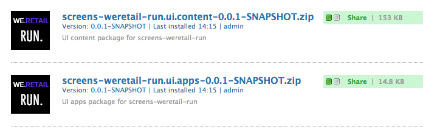

# 擴充AEM Screens元件

下列教學課程會逐步解說擴充現成可用的AEM Screens元件的步驟和最佳作法。 影像元件會延伸以新增可編寫的文字覆蓋。

## 概觀 {#overview}

本教學課程適用於AEM Screens的新手開發人員。 在本教學課程中，Screens影像元件已擴充為建立海報元件。 標題、說明和標誌會覆蓋在影像上，以便在序列頻道中建立引人入勝的體驗。

>[!NOTE]
>
>開始進行本教學課程之前，建議您先完成本教學課程： [為AEM Screens開發自訂元件](developing-custom-component-tutorial-develop.md).


自訂海報元件是透過擴充影像元件而建立。

## 先決條件 {#prerequisites}

若要完成本教學課程，您需要完成下列事項：

1. AEM 6.5 +最新Screens Feature Pack
1. [AEM Screens 播放器](/help/user-guide/aem-screens-introduction.md)
1. 本機開發環境

教學課程步驟和熒幕擷取畫面使用CRXDE-Lite執行。 [Eclipse](https://experienceleague.adobe.com/en/docs/experience-manager-65/content/implementing/developing/devtools/aem-eclipse) 或 [IntelliJ](https://experienceleague.adobe.com/en/docs/experience-manager-65/content/implementing/developing/devtools/ht-intellij) 您也可以使用IDE來完成本教學課程。 有關使用IDE的詳細資訊 [您可以在此處找到使用AEM開發](https://experienceleague.adobe.com/en/docs/experience-manager-learn/getting-started-wknd-tutorial-develop/project-archetype/project-setup).

## 專案設定 {#project-setup}

Screens專案的原始程式碼通常會作為多模組Maven專案來管理。 為了加速教學課程，已使用預先產生專案 [AEM專案原型13](https://github.com/adobe/aem-project-archetype). 更多詳細資訊 [您可以在此處找到使用Maven AEM專案原型建立專案](https://experienceleague.adobe.com/en/docs/experience-manager-learn/getting-started-wknd-tutorial-develop/project-archetype/project-setup).

1. 使用下載並安裝下列套件 **CRX封裝管理** `http://localhost:4502/crx/packmgr/index.jsp)r:`

[取得檔案](assets/start-poster-screens-weretail-runuiapps-001-snapshot.zip)

   [取得檔案](assets/start-poster-screens-weretail-runuicontent-001-snapshot.zip)
   **或者** 如果使用Eclipse或其他IDE，請下載以下來源套件。 使用Maven命令將專案部署到本機AEM執行個體：

   **`mvn -PautoInstallPackage clean install`**

   SRC開始畫面 `We.Retail` 執行專案

[取得檔案](assets/start-poster-screens-weretail-run.zip)

1. 在 **CRX封裝管理員** `http://localhost:4502/crx/packmgr/index.jsp` 已安裝下列兩個套件：

   1. **`screens-weretail-run.ui.content-0.0.1-SNAPSHOT.zip`**
   1. **`screens-weretail-run.ui.apps-0.0.1-SNAPSHOT.zip`**

   

   AEM Screens `We.Retail Run Ui.Apps` 和 `Ui.Content` 透過CRX封裝管理員安裝的封裝

## 建立海報元件 {#poster-cmp}

海報元件可延伸現成的AEM Screens影像元件。 Sling的機制， `sling:resourceSuperType`，可用來繼承影像元件的核心功能，而無須複製和貼上。 關於基本概念的詳細資訊 [您可以在此處找到Sling請求處理。](https://experienceleague.adobe.com/en/docs/experience-manager-65/content/implementing/developing/introduction/the-basics)

海報元件會在預覽/生產模式中以全熒幕呈現。 在編輯模式中，必須以不同方式呈現元件，以促進序列頻道的製作。

1. 在 **CRXDE-Lite** `http://localhost:4502/crx/de/index.jsp` （或選擇的IDE）到 `/apps/weretail-run/components/content`建立 `cq:Component` 已命名 `poster`.

   將下列屬性新增至 `poster` 元件：

   ```xml
   <?xml version="1.0" encoding="UTF-8"?>
   <jcr:root xmlns:sling="https://sling.apache.org/jcr/sling/1.0" xmlns:cq="https://www.day.com/jcr/cq/1.0" xmlns:jcr="https://www.jcp.org/jcr/1.0"
       jcr:primaryType="cq:Component"
       jcr:title="Poster"
       sling:resourceSuperType="screens/core/components/content/image"
       componentGroup="We.Retail Run - Content"/>
   ```

   

   /apps/weretail-run/components/content/poster的屬性

   透過設定 `sling:resourceSuperType`屬性等於 `screens/core/components/content/image`，海報元件實際上會繼承影像元件的所有功能。 在下找到的對等節點和檔案 `screens/core/components/content/image` 可新增至下方 `poster` 元件以覆寫及擴充功能。

1. 複製 `cq:editConfig` 節點在下 `/libs/screens/core/components/content/image`. 貼上 `cq:editConfig` 在 `/apps/weretail-run/components/content/poster` 元件。

   在 `cq:editConfig/cq:dropTargets/image/parameters` 節點，更新 `sling:resourceType` 屬性等於 `weretail-run/components/content/poster`.

   

   的XML表示法 `cq:editConfig` 如下所表示：

   ```xml
   <?xml version="1.0" encoding="UTF-8"?>
   <jcr:root xmlns:sling="https://sling.apache.org/jcr/sling/1.0" xmlns:cq="https://www.day.com/jcr/cq/1.0" xmlns:jcr="https://www.jcp.org/jcr/1.0" xmlns:nt="https://www.jcp.org/jcr/nt/1.0"
       jcr:primaryType="cq:EditConfig">
       <cq:dropTargets jcr:primaryType="nt:unstructured">
           <image
               jcr:primaryType="cq:DropTargetConfig"
               accept="[image/.*]"
               groups="[media]"
               propertyName="./fileReference">
               <parameters
                   jcr:primaryType="nt:unstructured"
                   sling:resourceType="weretail-run/components/content/poster"
                   imageCrop=""
                   imageMap=""
                   imageRotate=""/>
           </image>
       </cq:dropTargets>
   </jcr:root>
   ```

1. 複製WCM Foundation `image` 對話方塊用於 `poster` 元件。

   最簡單的方式是從現有的對話方塊開始，然後進行修改。

   1. 複製對話方塊來源： `/libs/wcm/foundation/components/image/cq:dialog`
   1. 在下方貼上對話方塊 `/apps/weretail-run/components/content/poster`

   

   對話方塊複製來源 `/libs/wcm/foundation/components/image/cq:dialog` 至 `/apps/weretail-run/components/content/poster`

   AEM Screens `image` 元件為WCM Foundation的超型別 `image` 元件。 因此， `poster` 元件會從兩者繼承功能。 海報元件的對話方塊是由畫面和基礎對話方塊的組合所組成。 的功能 **Sling資源合併** 用於隱藏從超級型別元件繼承的不相關對話方塊欄位和索引標籤。

1. 更新 `cq:dialog` 下 `/apps/weretail-run/components/content/poster` 下列變更以XML表示：

   ```xml
   <?xml version="1.0" encoding="UTF-8"?>
   <jcr:root xmlns:sling="https://sling.apache.org/jcr/sling/1.0" xmlns:cq="https://www.day.com/jcr/cq/1.0" xmlns:jcr="https://www.jcp.org/jcr/1.0" xmlns:nt="https://www.jcp.org/jcr/nt/1.0"
       jcr:primaryType="nt:unstructured"
       jcr:title="Poster"
       sling:resourceType="cq/gui/components/authoring/dialog">
       <content
           jcr:primaryType="nt:unstructured"
           sling:resourceType="granite/ui/components/foundation/container">
           <layout
               jcr:primaryType="nt:unstructured"
               sling:resourceType="granite/ui/components/foundation/layouts/tabs"
               type="nav"/>
           <items jcr:primaryType="nt:unstructured">
               <image
                   jcr:primaryType="nt:unstructured"
                   jcr:title="Elements"
                   sling:resourceType="granite/ui/components/foundation/section">
                   <layout
                       jcr:primaryType="nt:unstructured"
                       sling:resourceType="granite/ui/components/foundation/layouts/fixedcolumns"
                       margin="{Boolean}false"/>
                   <items jcr:primaryType="nt:unstructured">
                       <column
                           jcr:primaryType="nt:unstructured"
                           sling:resourceType="granite/ui/components/foundation/container">
                           <items
                               jcr:primaryType="nt:unstructured"
                               sling:hideChildren="[linkURL,size]">
                               <file
                                   jcr:primaryType="nt:unstructured"
                                   sling:resourceType="cq/gui/components/authoring/dialog/fileupload"
                                   autoStart="{Boolean}false"
                                   class="cq-droptarget"
                                   fieldLabel="Image asset"
                                   fileNameParameter="./fileName"
                                   fileReferenceParameter="./fileReference"
                                   mimeTypes="[image]"
                                   multiple="{Boolean}false"
                                   name="./file"
                                   title="Upload Image Asset"
                                   uploadUrl="${suffix.path}"
                                   useHTML5="{Boolean}true"/>
                               <title
                                   jcr:primaryType="nt:unstructured"
                                   sling:resourceType="granite/ui/components/foundation/form/textfield"
                                   fieldLabel="Title"
                                   name="./jcr:title"/>
                               <description
                                   jcr:primaryType="nt:unstructured"
                                   sling:resourceType="granite/ui/components/foundation/form/textarea"
                                   fieldLabel="Description"
                                   name="./jcr:description"/>
                               <position
                                   jcr:primaryType="nt:unstructured"
                                   sling:resourceType="granite/ui/components/coral/foundation/form/select"
                                   fieldLabel="Text Position"
                                   name="./textPosition">
                                   <items jcr:primaryType="nt:unstructured">
                                       <left
                                           jcr:primaryType="nt:unstructured"
                                           text="Left"
                                           value="left"/>
                                       <center
                                           jcr:primaryType="nt:unstructured"
                                           text="Center"
                                           value="center"/>
                                       <right
                                           jcr:primaryType="nt:unstructured"
                                           text="Right"
                                           value="right"/>
                                   </items>
                               </position>
                               <color
                                   jcr:primaryType="nt:unstructured"
                                   sling:resourceType="granite/ui/components/coral/foundation/form/select"
                                   fieldLabel="Text Color"
                                   name="./textColor">
                                   <items jcr:primaryType="nt:unstructured">
                                       <light
                                           jcr:primaryType="nt:unstructured"
                                           text="Light"
                                           value="light"/>
                                       <dark
                                           jcr:primaryType="nt:unstructured"
                                           text="Dark"
                                           value="dark"/>
                                   </items>
                               </color>
                           </items>
                       </column>
                   </items>
               </image>
               <accessibility
                   jcr:primaryType="nt:unstructured"
                   sling:hideResource="{Boolean}true"/>
           </items>
       </content>
   </jcr:root>
   ```

   屬性 `sling:hideChildren`= `"[linkURL,size]`「 」用於 `items` 節點，以確保 **linkURL** 和 **大小** 對話方塊中的欄位會隱藏。 從海報對話方塊中移除這些節點是不夠的。 屬性 `sling:hideResource="{Boolean}true"` 「輔助功能」標籤上的是用來隱藏整個標籤。

   對話方塊中新增兩個選取欄位，讓作者可以控制標題和說明的文字位置和顏色。

   

   海報 — 最後一個對話方塊結構

   此時，的實體 `poster` 元件可新增至 **閒置頻道** 中的頁面`We.Retail` 執行專案： `http://localhost:4502/editor.html/content/screens/we-retail-run/channels/idle-channel.edit.html`.

   

   海報對話方塊欄位

1. 在下方建立檔案 `/apps/weretail-run/components/content/poster` 已命名 `production.html.`

   將下列專案填入檔案中：

   ```xml
   <!--/*
   
       /apps/weretail-run/components/content/poster/production.html
   
   */-->
   <div data-sly-use.image="image.js"
        data-duration="${properties.duration}"
        class="cmp-poster"
        style="background-image: url(${request.contextPath @ context='uri'}${image.src @ context='uri'});">
       <div class="cmp-poster__text
                   cmp-poster__text--${properties.textPosition @ context='attribute'}
                   cmp-poster__text--${properties.textColor @ context='attribute'}">
           <h1 class="cmp-poster__title">${properties.jcr:title}</h1>
            <h2 class="cmp-poster__description">${properties.jcr:description}</h2>
       </div>
    
   </div>
   ```

   可直接在上方看到海報元件的生產標籤。 HTL指令碼覆寫 `screens/core/components/content/image/production.html`. 此 `image.js` 是伺服器端指令碼，可建立類似POJO的影像物件。 接著，您可以呼叫Image物件來轉譯 `src` 作為內嵌樣式background-image。

   `The h1` 和h2標籤新增後，會根據元件屬性顯示「標題」和「說明」： `${properties.jcr:title}` 和 `${properties.jcr:description}`.

   周邊 `h1` 和 `h2` tags是一個包含三個CSS類別的div包裝函式，其變數為&quot; `cmp-poster__text`「。 的值 `textPosition` 和 `textColor` 屬性是用來變更根據作者選取的對話方塊演算的CSS類別。 在下一個區段中，會寫入使用者端資料庫的CSS以啟用這些變更的顯示。

   標誌也會以覆蓋圖的形式納入元件中。 在此範例中，` We.Retail` 標誌在DAM中採用硬式編碼。 視使用案例而定，更合理的做法是建立對話方塊欄位，將標誌路徑設為動態填入值。

   另請注意，元件會使用BEM （區塊元素修飾元）記號。 BEM是CSS編碼慣例，可讓您更輕鬆地建立可重複使用的元件。 BEM是以下專案使用的記號： [AEM Core Components](https://github.com/adobe/aem-core-wcm-components/wiki/CSS-coding-conventions). <!-- DEAD LINK More info can be found at: [https://getbem.com/](https://getbem.com/) -->

1. 在下方建立檔案 `/apps/weretail-run/components/content/poster` 已命名 `edit.html.`

   將下列專案填入檔案中：

   ```xml
   <!--/*
   
       /apps/weretail-run/components/content/poster/edit.html
   
   */-->
   
   <div class="aem-Screens-editWrapper ${image.cssClass} cmp-poster" data-sly-use.image="image.js" data-emptytext="${'Poster' @ i18n, locale=request.locale}">
       
       <div class="cmp-poster__text
              cmp-poster__text--${properties.textPosition @ context='attribute'}
          cmp-poster__text--${properties.textColor @ context='attribute'}">
         <p class="cmp-poster__title">${properties.jcr:title}</p>
         <p class="cmp-poster__description">${properties.jcr:description}</p>
       </div>
   </div>
   ```

   此 **編輯** 可直接在上方看到海報元件的標籤。 HTL指令碼覆寫 `/libs/screens/core/components/content/image/edit.html`. 此標籤類似於 `production.html` 標示，並在影像上方顯示標題和說明。

   此 `aem-Screens-editWrapper`會新增，使元件不會在編輯器中全熒幕呈現。 此 `data-emptytext` attribute可確保在未填入影像或內容時顯示預留位置。

## 建立使用者端程式庫 {#clientlibs}

使用者端資料庫提供一種機制，可整理和管理AEM實施所需的CSS和JavaScript檔案。 更多關於使用的資訊 [您可以在此處找到使用者端資料庫。](https://experienceleague.adobe.com/en/docs/experience-manager-65/content/implementing/developing/introduction/clientlibs)

AEM Screens元件在編輯模式與預覽/生產模式中的轉譯方式不同。 已建立兩組使用者端程式庫，一組用於編輯模式，另一組用於預覽/生產模式。

1. 為海報元件的使用者端程式庫建立資料夾。

   下 `/apps/weretail-run/components/content/poster`，建立名為的資料夾 `clientlibs`.

   

1. 在 `clientlibs` 資料夾，建立名為的節點 `shared` 型別 `cq:ClientLibraryFolder.`

   

1. 將下列屬性新增至共用使用者端程式庫：

   * `allowProxy` | 布林值 | `true`
   * `categories` | 字串[] | `cq.screens.components`

   

   /apps/weretail-run/components/content/poster/clientlibs/shared的屬性

   此 `categories` 屬性是識別使用者端程式庫的字串。 此 `cq.screens.components` 類別會用於編輯和預覽/生產模式。 因此，中定義的任何CSS/JS `shared` clientlib會在所有模式中載入。

   最佳實務是絕對不要在生產環境中直接向/apps公開任何路徑。 此 `allowProxy` 屬性會確保透過前置詞參照使用者端程式庫CSS和JS `/etc.clientlibs`. 關於的更多資訊 [您可在此處找到allowProxy屬性。](https://experienceleague.adobe.com/en/docs/experience-manager-65/content/implementing/developing/introduction/clientlibs)

1. 建立名為的檔案 `css.txt` 共用資料夾的下方。

   將下列專案填入檔案中：

   ```
   #base=css
   
   styles.less
   ```

1. 建立名為的資料夾 `css` 在 `shared` 資料夾。 新增名為的檔案 `style.less` 在 `css` 資料夾。 使用者端程式庫的結構現在看起來應該像這樣：

   

   本教學課程不直接撰寫CSS，而是使用LESS。 [更少](https://lesscss.org/) 是常用的CSS預先編譯器，支援CSS變數、mixin和函式。 AEM使用者端程式庫原生支援LESS編譯。 可以使用Sass或其他預先編譯程式，但必須在AEM外部編譯。

1. 填入 `/apps/weretail-run/components/content/poster/clientlibs/shared/css/styles.less` ，其功能如下：

   ```css
   /*
    /apps/weretail-run/components/content/poster/clientlibs/shared/css/styles.less
    Poster Component - Shared Style
   */
   
   @import url('https://fonts.googleapis.com/css?family=Fjalla+One|Open+Sans:400i');
   
   @text-light-color: #fff;
   @text-dark-color: #000;
   @title-font-family: 'Fjalla One', sans-serif;
   @description-font-family: 'Open Sans', sans-serif;
   
   .cmp-poster {
   
         &__text {
         position: absolute;
         color: @text-light-color;
         top: 0;
         text-align:center;
         width: 100%;
   
         &--left {
          text-align: left;
                margin-left: 1em;
         }
   
         &--right {
          text-align: right;
                margin-right: 1em;
         }
   
         &--dark {
          color: @text-dark-color;
         }
       }
   
       &__title {
         font-weight: bold;
            font-family: @title-font-family;
            font-size: 1.2em;
       }
   
       &__description {
     font-style: italic;
           font-family: @description-font-family;
    }
   
   }
   ```

   >[!NOTE]
   >
   >GoogleWeb Fonts用於字型系列。 Web Fonts需要網際網路連線，而且並非所有AEM Screens實作都有可靠的連線。 離線模式的Planning是AEM Screens部署的重要考量。

1. 複製 `shared` 使用者端資料庫資料夾。 貼上為同層級，並將其重新命名為 `production`.

   

1. 更新 `categories` 要建置的生產使用者端程式庫屬性 `cq.screens.components.production.`

   此 `cq.screens.components.production` category可確保僅在「預覽/生產」模式中載入樣式。

   

   /apps/weretail-run/components/content/poster/clientlibs/production的屬性

1. 填入 `/apps/weretail-run/components/content/poster/clientlibs/production/css/styles.less` ，其功能如下：

   ```css
   /*
    /apps/weretail-run/components/content/poster/clientlibs/production/css/styles.less
    Poster Component - Production Style
   */
   
   .cmp-poster {
   
       background-size: cover;
    height: 100%;
    width: 100%;
    position:absolute;
   
        &__text {
   
           top: 2em;
   
           &--left {
               width: 40%;
               top: 5em;
           }
   
           &--right {
               width: 40%;
               right: 1em;
           }
       }
   
       &__title {
     font-size: 5rem;
     font-weight: 900;
     margin: 0.1rem;
    }
   
    &__description {
     font-size: 2rem;
     margin: 0.1rem;
     font-weight: 400;
   
    }
   
       &__logo {
     position: absolute;
     max-width: 200px;
     top: 1em;
     left: 0;
    }
   
   }
   ```

   上述樣式會在畫面上以絕對位置顯示「標題」和「說明」。 顯示的標題比說明大。 元件的BEM標籤法可讓您在cmp-poster類別中輕鬆調整樣式的範圍。

第三個使用者端程式庫類別： `cq.screens.components.edit` 可用來將僅編輯特定樣式新增至元件。

| Clientlib類別 | 使用情況 |
|---|---|
| `cq.screens.components` | 在編輯和生產模式之間共用的樣式和指令碼 |
| `cq.screens.components.edit` | 僅用於編輯模式的樣式和指令碼 |
| `cq.screens.components.production` | 僅用於生產模式的樣式和指令碼 |

## 新增海報元件至順序頻道 {#add-sequence-channel}

海報元件用於順序頻道。 本教學課程的入門套件包含一個閒置頻道。 閒置頻道已預先設定為允許群組的元件 **`We.Retail Run - Content`**. 海報元件的群組設為 `We.Retail Run - Content` 和可供新增至通道。

1. 從以下位置開啟閒置通道： `We.Retail` 執行專案： **`http://localhost:4502/editor.html/content/screens/we-retail-run/channels/idle-channel.edit.html`**
1. 拖放的新執行個體 **海報** 元件從側欄移至頁面。

   

1. 編輯「海報」元件的對話方塊，以便新增影像、標題、說明。 使用「文字位置」和「文字顏色」選項，確保標題/說明在影像上是可讀的。

   

1. 若要新增一些「海報」元件，請重複上述步驟。 在元件之間新增轉變。

   

## 整合所有內容 {#putting-it-all-together}

以下影片說明完成的元件，以及如何將其新增到序列頻道。 該頻道接著會新增至「位置」顯示，並最終指派給Screens播放器。

>[!VIDEO](https://video.tv.adobe.com/v/22414?quaity=9)

## 完成的程式碼 {#finished-code}

以下是教學課程中完成的程式碼。 此 **screens-weretail-run.ui.apps-0.0.1-SNAPSHOT.zip** 和 **screens-weretail-run.ui.content-0.0.1-SNAPSHOT.zip** 是編譯過的AEM套件。 此 **SRC-screens-weretail-run-0.0.1.zip** 是可以使用Maven部署的未編譯原始程式碼。

[取得檔案](assets/final-poster-screens-weretail-runuiapps-001-snapshot.zip)

[取得檔案](assets/final-poster-screens-weretail-runuicontent-001-snapshot.zip)

SRC最終AEM Screens `We.Retail` 執行專案

[取得檔案](assets/src-screens-weretail-run-001.zip)
