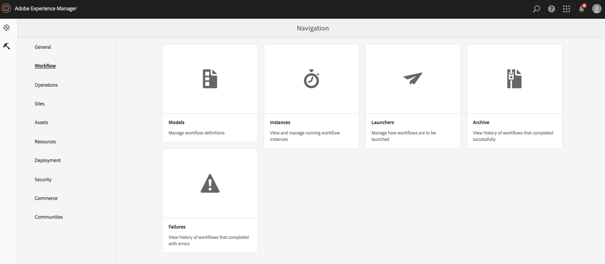

# 視訊轉譯{#video-renditions}

您可以產生手動和自動全高清轉譯。 下節說明將轉譯新增至資產的工作流程。

## 自動生成全高清格式副本{#automatically-generating-full-hd-renditions}

>[!NOTE]
>
>如果AEM Screens視訊轉譯在您的裝置上未以最佳方式播放，請聯絡硬體廠商以取得視訊的規格。 這有助於獲得裝置上的最佳效能，進而建立您自己的自訂視訊設定檔，讓您為FFMPEG提供適當的參數，以產生您的轉譯。 之後，請使用下列步驟，將您的自訂視訊描述檔新增至描述檔清單。
>
>此外，請參閱[疑難排解視訊](troubleshoot-videos.md)以偵錯和疑難排解頻道中的視訊播放。

請依照下列步驟自動產生全高清轉譯：

1. 選取Adobe Experience Manager連結（左上角），然後按一下槌子圖示以選取工具以選取&#x200B;**Workflow**。

   按一下&#x200B;**模型**&#x200B;以輸入工作流模型管理。

   

1. 選取&#x200B;**DAM更新資產**&#x200B;模型，然後按一下動作列中的「編輯」以開啟&#x200B;**DAM更新資產**&#x200B;視窗。

   

1. 按兩下&#x200B;**FFmpeg轉碼**&#x200B;步驟。

   

1. 選擇&#x200B;**Process**&#x200B;頁簽以編輯進程參數。 在&#x200B;**Arguments**&#x200B;中的清單中輸入完整的HD配置檔案，如下所示：***,profile:fullhd-bp,profile:fullhd-hp***，然後按一下&#x200B;**確定**。

   

1. 按一下&#x200B;**DAM更新資產**&#x200B;畫面左上方的&#x200B;**儲存**。

   

1. 導覽至&#x200B;**Assets**&#x200B;並上傳新視訊。 按一下影片，然後開啟「轉譯」側邊欄，您就會看到這兩部全高清影片。

   

1. 從側邊欄開啟&#x200B;**轉譯**。

   

1. 您會發現兩個新的全高清格式副本。

   

## 手動產生全高清格式副本{#manually-generating-full-hd-renditions}

請依照下列步驟手動產生全高清轉譯：

1. 選取Adobe Experience Manager連結（左上角），然後按一下槌子圖示以選取工具以選取&#x200B;**Workflow**。

   按一下&#x200B;**模型**&#x200B;以輸入工作流模型管理。

   

1. 選擇&#x200B;**Screens Update Asset**&#x200B;模型，然後按一下&#x200B;**Start Workflow**&#x200B;以開啟&#x200B;**Run Workflow**&#x200B;對話框。

   

1. 在&#x200B;**Payload**&#x200B;中選取所需的視訊，然後按一下&#x200B;**Run**。

   

1. 導覽至&#x200B;**Assets**，向下切入您的資產，然後按一下資產。

   

1. 開啟&#x200B;**轉譯**&#x200B;側邊欄，您會注意到新的全高清轉譯。

   

