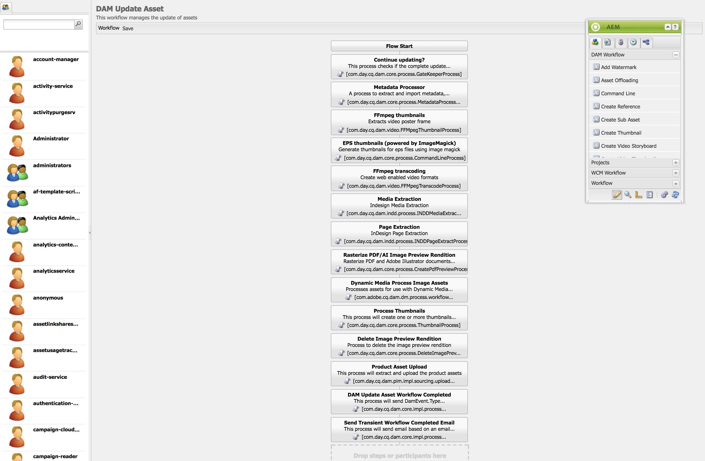

# 視頻格式副本 {#video-renditions}

您可以生成手動和自動的全高清格式副本。 以下部分介紹了向資產中添加格式副本的工作流。

## 自動生成全高清格式副本  {#automatically-generating-full-hd-renditions}

>[!NOTE]
>
>如果AEM Screens視頻呈現形式在您的設備上沒有最佳播放，請聯繫硬體供應商瞭解視頻的規格。 這將有助於獲得設備上的最佳效能，從而建立您自己的自定義視頻配置檔案，在該配置檔案中，您為FFMPEG提供適當的參數以生成格式副本。 隨後，使用以下步驟將自定義視頻配置檔案添加到配置檔案清單中。
>
>此外，請參見 [視頻故障排除](troubleshoot-videos.md) 調試和排除頻道中播放視頻的故障。

按照以下步驟自動生成全高清格式副本：

1. 選擇Adobe Experience Manager連結（左上），然後按一下錘表徵圖以選擇要選擇的工具 **工作流**。

   按一下 **模型** 中各屬性的附加資訊。

   

1. 選擇 **DAM更新資產** 模型，然後從操作欄中按一下「編輯」(Edit)以開啟 **DAM更新資產** 的子菜單。

   

1. 按兩下 **FFmpeg轉碼** 的子菜單。

   

1. 選擇 **進程** 頁籤。 將全高清配置檔案輸入到 **參數** 為： ***,profile:fullhd-bp,profile:fullhd-hp*** 按一下 **確定**。

   

1. 按一下 **保存** 左上角 **DAM更新資產** 的上界。

   

1. 導航到 **資產** 上傳新視頻。 按一下視頻並開啟「格式副本」側欄，您會注意到這兩個全高清視頻。

   

1. 開啟 **格式副本** 從側軌上。

   

1. 您會注意到兩個新的全高清格式副本。

   

## 手動生成全高清格式副本 {#manually-generating-full-hd-renditions}

按照以下步驟手動生成全高清格式副本：

1. 選擇Adobe Experience Manager連結（左上），然後按一下錘表徵圖以選擇要選擇的工具 **工作流**。

   按一下 **模型** 中各屬性的附加資訊。

   

1. 選擇 **螢幕更新資產** 模型，然後按一下 **啟動工作流** 開啟 **運行工作流** 對話框。

   

1. 在 **負載** 按一下 **運行**。

   

1. 導航到 **資產**，向下鑽取到您的資產，然後按一下。

   

1. 開啟 **格式副本** 並且您會注意到新的全高清格式副本。

   
