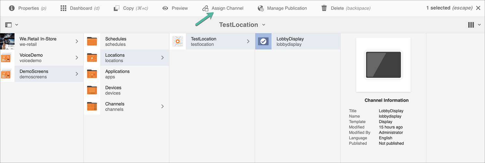

# Kickstart Guide {#kickstart-guide}

「AEM畫面的啟動」示範如何設定及執行AEM畫面專案。 它會逐步引導您設定基本的數位標牌體驗，並將資產和／或視訊等內容新增至每個頻道，並進一步將內容發佈至AEM Screens播放器。

>[!NOTE]
>開始處理專案詳細資訊之前，請確定您已安裝最新的AEM畫面功能套件。 您可以使用Adobe ID從[軟體散發入口網站](https://experience.adobe.com/#/downloads/content/software-distribution/en/aem.html)下載最新的功能套件。

## 必備條件 {#prerequisites}

請依照下列步驟建立AEM Screens的範例專案，並進一步將內容發佈至Screens播放器。

>[!NOTE]
>下列教學課程將展示在Chrome OS播放器中播放您頻道的內容。

>[!IMPORTANT]
>**OSGi配置設定**
>您必須啟用空的反向連結，才能讓裝置將資料張貼至伺服器。 例如，如果停用空的反向連結屬性，裝置就無法將螢幕擷取張貼回去。 目前，部分功能僅在OSGi設定中啟用Apache Sling Referrer Filter Allow Empty時才可用。 控制面板可能會顯示警告，指出安全性設定可能會使部分功能無法運作。
>請依照下列步驟，啟用&#x200B;***Apache Sling Referrer Filter Allow Empty***:

## 允許空的反向連結請求{#allow-empty-referrer-requests}

1. 透過AEM實例—>槌子圖示—>**操作** —> **Web控制台**&#x200B;導覽至&#x200B;**Adobe Experience Manager Web Console Configuration**。

   

1. **Adobe Experience Manager Web Console設** 定開啟。搜尋sling referrer。

   若要搜尋sling referrer屬性，請按&#x200B;**Command+F**&#x200B;以取得&#x200B;**Mac**&#x200B;和&#x200B;**Control+F**&#x200B;取得&#x200B;**Windows**。

1. 選中&#x200B;**允許空**&#x200B;選項，如下圖所示。

   

1. 按一下&#x200B;**Save**&#x200B;以啟用Apache Sling Referrer Filter Allow Empty。

## 在5分鐘內建立數位招牌體驗{#creating-a-digital-signage-experience-in-minutes}

### 建立AEM Screens專案{#creating-project}

第一個步驟是建立AEM Screens專案。

1. 導覽至您的Adobe Experience Manager(AEM)例項，然後按一下「**畫面**」。 或者，您也可以直接從`https://localhost:4502/screens.html/content/screens](https://localhost:4502/screens.html/content/screens`導覽。

1. 按一下「建立畫面專案」，以建立新的畫面專案。 ****&#x200B;將標題輸入為&#x200B;**DemoScreens**，然後按一下&#x200B;**Save**。

   

   >[!NOTE]
   >建立專案後，就會回到「畫面專案」首頁。 您現在可以選取專案。 在項目中，有5個不同的資料夾，標題為&#x200B;**Applications**、**Channels**、**Devices**、**Locations**&#x200B;和&#x200B;**Schedules**。

### 建立通道{#creating-channel}

建立AEM Screens專案後，您需要建立新的管道來管理內容。

請依照下列步驟，為您的專案建立新的管道：

1. 建立專案後，請選取&#x200B;**DemoScreens**&#x200B;專案，然後選取&#x200B;**Channels**&#x200B;資料夾，如下圖所示。 從操作欄中按一下&#x200B;**+建立**。

   

1. 從嚮導中選擇「序列通道」，然後按一下「下一步」。********
   

1. 將&#x200B;**Title**&#x200B;輸入為&#x200B;**TestChannel**，然後按一下&#x200B;**Create**。

   

   **TestChannel**&#x200B;現在會新增至您的頻道資料夾，如下圖所示。

   

### 新增內容至頻道{#adding-content}

在您的頻道就位後，您需要將AEM Screens播放器將會顯示的內容新增至頻道。

請依照下列步驟，將內容新增至專案中的頻道(**TestChannel**):

1. 導覽至您建立的&#x200B;**DemoProject**，並從&#x200B;**Channels**&#x200B;資料夾選取&#x200B;**TestChannel**。

1. 從動作列按一下「編輯」(**Edit)**（請參閱下圖）。 **TestChannel**&#x200B;的編輯器隨即開啟。

   

1. 按一下切換動作列左側側面板的圖示，以開啟資產和元件。

1. 拖放您要新增至渠道的元件。

   

### 建立位置{#creating-location}

當您的渠道到位後，您需要建立位置。

>[!NOTE]
>***位置***&#x200B;將您的各種數位招牌體驗區隔，並包含各種螢幕所在位置的顯示器組態。

請依照下列步驟，為您的專案建立新位置：

1. 導覽至您建立的&#x200B;**DemoProject**，並選取&#x200B;**Locations**&#x200B;資料夾。

1. 從操作欄中按一下&#x200B;**+建立**。

1. 從嚮導中選擇&#x200B;**位置** ，然後按一下&#x200B;**下一步**。

1. 輸入您所在位置的&#x200B;**名稱**（輸入標題為&#x200B;**TestLocation**），然後按一下&#x200B;**建立**。

將建立&#x200B;**TestLocation**&#x200B;並將其添加到&#x200B;**Locations**&#x200B;資料夾。

### 建立位置{#creating-display}的顯示

在建立位置後，您需要為位置建立新的顯示。

>[!NOTE]
>***Display***&#x200B;代表在一或多個螢幕上執行的數位體驗。

1. 導覽至&#x200B;**TestLocation**&#x200B;並選取它。

1. 從操作欄按一下&#x200B;**建立**。

   

1. 從&#x200B;**建立**&#x200B;嚮導中選擇&#x200B;**顯示** ，然後按一下&#x200B;**Next**。

   

1. 將&#x200B;**Title**&#x200B;輸入為&#x200B;**LobbyDisplay**，然後按一下&#x200B;**Create**。

   

   現在，新增名為&#x200B;**TestDisplay**&#x200B;的顯示畫面至您的位置&#x200B;**TestLocation**，如下圖所示。

   

### 分配通道{#assigning-channel}

專案設定完成後，您必須將頻道指派給顯示器，才能檢視內容。

1. 導覽至&#x200B;**DemoScreens** —> **Locations** —> **TestLocation** —> **LobbyDisplay**&#x200B;所需顯示。

1. 從動作列點選／按一下「指定頻道&#x200B;**」。**

   

   或,

   從動作列點選／按一下「**儀表板**」，然後從「已指派的頻道與排程」面板按一下「**+指定頻道**」。****

   

1. 將開啟&#x200B;**通道分配**&#x200B;對話框。

1. 從&#x200B;**Settings**&#x200B;選項中，按路徑&#x200B;**和** Supported Events **選擇通道**&#x200B;作為&#x200B;**Initial Load**&#x200B;和&#x200B;**Idle Screen**。

   >[!NOTE]
   >
   >預設情況下，**通道角色**、**優先順序**&#x200B;和&#x200B;**中斷方法**&#x200B;都填充。 請參閱[頻道屬性](/help/user-guide/channel-assignment-latest-fp.md#channel-properties)一節，以進一步瞭解頻道指派屬性。

   

   此外，您也可以選擇&#x200B;**啟動窗口**&#x200B;和&#x200B;**週期計畫**。

   >[!NOTE]
   >*週期計畫*允許您為渠道設定週期計畫。 您為渠道設定多個週期性排程。
   >如需詳細資訊，請參閱[定期排程](/help/user-guide/channel-assignment-latest-fp.md#recurrence-schedule)。

1. 在配置首選項後，按一下「保存」。****

### 註冊設備並將設備分配給顯示器{#registering-device}

您必須使用AEM儀表板註冊裝置。

>[!IMPORTANT]
>Chrome OS Player可在開發人員模式下安裝為Chrome Browser外掛程式，而不需實際的Chrome Player裝置。 如需安裝，請遵循下列步驟：
>
>1. 按一下[這裡](https://download.macromedia.com/screens/)以下載最新的Chrome Player。
>1. 解壓縮並儲存在磁碟上。
>1. 開啟Chrome瀏覽器，然後從選單中選取「**擴充功能**」，或直接導覽至&#x200B;***chrome://extensions***。
>1. 從右上角切換&#x200B;**開發人員模式**。
>1. 從左上角按一下「載入已解壓縮的&#x200B;****」，然後載入已解壓縮的Chrome Player。
>1. 如果副檔名清單中有提供，請勾選&#x200B;**AEM Screens Chrome Player**&#x200B;增效模組。
>1. 開啟新標籤，然後按一下左上角的&#x200B;**Apps**&#x200B;圖示，或直接導覽至&#x200B;***chrome://apps***。
>1. 按一下「**AEM Screens**&#x200B;增效模組」以啟動Chrome Player。 依預設，播放器會以全螢幕模式啟動。 按&#x200B;**esc**&#x200B;退出全螢幕模式。

在您的Chrome OS播放器開啟後，請依照下列步驟註冊Chrome裝置。

1. 從您的AEM例項導覽至專案的&#x200B;**Devices**&#x200B;資料夾。

1. 從操作欄點選／按一下&#x200B;**設備管理器**。

   

1. 點選／按一下右上角的&#x200B;**裝置註冊**。

1. 選擇所需設備並點選／按一下「Register Device **（註冊設備&lt;a1/>）」。**

   

1. 等待裝置傳送其註冊碼，並同時從您的Chrome裝置檢查&#x200B;**註冊碼**。
   

1. 如果兩部電腦的&#x200B;**註冊代碼**&#x200B;都相同，請點選／按一下AEM中的&#x200B;**驗證**。

1. 將所需的名稱設為裝置的&#x200B;**ChromeDeviceforDemo**，然後按一下「註冊」**。**

   

1. 從&#x200B;**設備註冊成功**&#x200B;對話框中按一下&#x200B;**分配顯示**。

   

1. 選擇顯示路徑為&#x200B;**DemoScreens** —> **Locations** —> **TestLocation** —> **LobbyDisplay**，然後按一下&#x200B;**Assign**。

   

1. 成功分配設備後，您將看到以下確認資訊。

   

1. 點選／按一下「完成&#x200B;**」以完成註冊程式。**&#x200B;您應可從顯示控制面板檢視已註冊的裝置。

   

### 在Chrome Player中檢視內容{#viewing-content-output}

您頻道中的所有資產現在都會在Chrome OS播放器上播放。

恭喜您現在正在AEM Screens頻道中播放內容！

