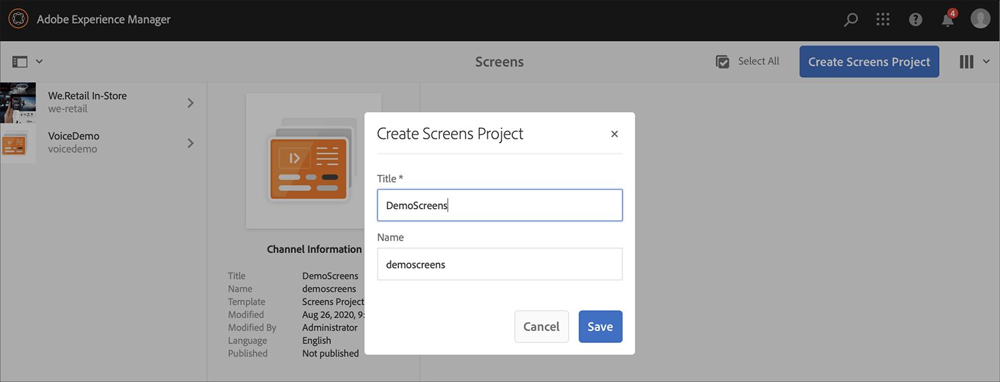
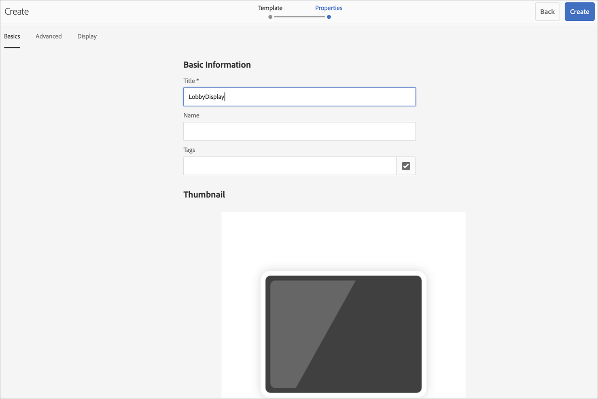
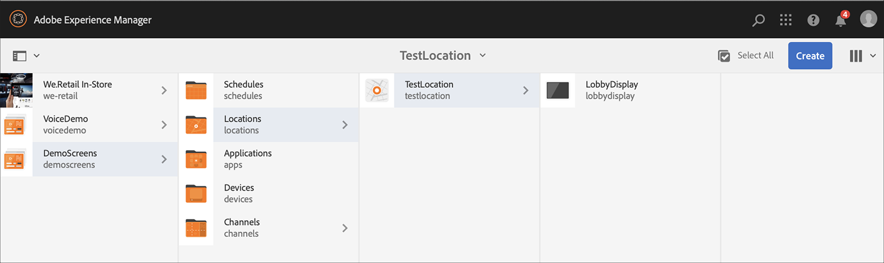

# Kickstart指南 {#kickstart-guide}

AEM Screens快速入門示範如何設定和執行AEM Screens專案。 它會逐步引導您設定基本的數位看板體驗，以及新增內容（例如資產和/或視訊）至每個管道，並進一步將內容發佈至AEM Screens播放器。

>[!NOTE]
>在處理專案詳細資料之前，請確定您已安裝AEM Screens的最新Feature Pack。 您可以使用您的Adobe ID從[軟體發佈入口網站](https://experience.adobe.com/#/downloads/content/software-distribution/en/aem.html)下載最新的Feature Pack。

## 先決條件 {#prerequisites}

請依照下列步驟為AEM Screens建立範例專案，並進一步將內容發佈到Screens播放器。

>[!NOTE]
>下列教學課程會示範如何在Chrome作業系統播放器中播放您的頻道內容。

>[!IMPORTANT]
>**OSGi組態設定**
>>您必須啟用空白反向連結，才能讓裝置將資料張貼至伺服器。 例如，如果停用空白反向連結屬性，裝置就無法張貼熒幕擷圖。 目前這些功能中的某些功能，只有在OSGi設定中啟用`Apache Sling`反向連結篩選允許空白時才能使用。 儀表板可能會顯示警告，指出安全性設定可能會使這些功能的部分功能無法運作。
>>請依照下列步驟來啟用&#x200B;***Apache Sling反向連結篩選允許空白***：

## 允許空的反向連結請求 {#allow-empty-referrer-requests}

1. 透過Adobe Experience Manager執行個體>槌子圖示> **作業** > **Web主控台**，瀏覽至&#x200B;**AEM Web主控台設定**。

   

1. **Adobe Experience Manager Web主控台組態**&#x200B;開啟。 搜尋Sling查閱者。

   若要搜尋Sling查閱者屬性，請按&#x200B;**Command+F**&#x200B;搜尋&#x200B;**Mac**，然後按&#x200B;**Control+F**&#x200B;搜尋&#x200B;**Windows**。

1. 勾選&#x200B;**允許空白**&#x200B;選項，如下圖所示。

   

1. 按一下&#x200B;**儲存**&#x200B;以啟用Apache Sling查閱者篩選允許空白。

## 在5分鐘內建立數位看板體驗 {#creating-a-digital-signage-experience-in-minutes}

### 建立AEM Screens專案 {#creating-project}

第一步是建立AEM Screens專案。

1. 導覽至您的Adobe Experience Manager (AEM)執行個體，然後按一下&#x200B;**Screens**。 或者，您可以直接從`https://localhost:4502/screens.html/content/screens](https://localhost:4502/screens.html/content/screens`導覽。

1. 按一下&#x200B;**建立Screens專案**，以便建立Screens專案。
1. 輸入標題為&#x200B;**DemoScreens**，然後按一下&#x200B;**儲存**。

   

   >[!NOTE]
   >建立專案後，系統會帶您回到AEM Screens專案首頁。 您現在可以按一下專案。 專案中有五個標題為&#x200B;**應用程式**、**管道**、**裝置**、**位置**&#x200B;和&#x200B;**排程**&#x200B;的不同資料夾。

### 建立頻道 {#creating-channel}

建立AEM Screens專案後，請建立管理內容的管道。

請依照下列步驟，為您的專案建立管道：

1. 建立專案後，按一下&#x200B;**DemoScreens**&#x200B;專案，然後按一下&#x200B;**Channels**&#x200B;資料夾，如下圖所示。 按一下動作列中的&#x200B;**+建立**。

   

1. 從精靈中選擇&#x200B;**順序頻道**，然後按一下&#x200B;**下一步**。
   

1. 輸入&#x200B;**標題**&#x200B;作為&#x200B;**TestChannel**，然後按一下&#x200B;**建立**。

   

   **TestChannel**&#x200B;現在已新增至您的管道資料夾，如下圖所示。

   

### 新增內容至頻道 {#adding-content}

管道就緒後，請將內容新增至AEM Screens Player可顯示的管道。

請依照下列步驟，將內容新增至專案中的頻道(**TestChannel**)：

1. 導覽至您建立的&#x200B;**DemoProject**，然後從&#x200B;**Channels**&#x200B;資料夾按一下&#x200B;**TestChannel**。

1. 按一下動作列中的&#x200B;**編輯** （請參閱下圖）。 **TestChannel**&#x200B;的編輯器開啟。

   

1. 按一下可切換動作列左側側面板的圖示，以開啟資產和元件。

1. 拖放您要新增至頻道的元件。

   

### 建立位置 {#creating-location}

設定好管道後，請建立位置。

>[!NOTE]
>***位置***&#x200B;將您不同的數位看板體驗加以區隔，並依據各種熒幕的位置包含顯示器的組態。

請依照下列步驟，為您的專案建立位置：

1. 導覽至您建立的&#x200B;**DemoProject**，然後按一下&#x200B;**位置**&#x200B;資料夾。
1. 按一下動作列中的&#x200B;**+建立**。
1. 從精靈按一下&#x200B;**位置**，然後按一下&#x200B;**下一步**。
1. 輸入您位置的&#x200B;**名稱** （輸入標題為&#x200B;**TestLocation**），然後按一下&#x200B;**建立**。

已建立&#x200B;**TestLocation**，並已新增至您的&#x200B;**位置**&#x200B;資料夾。

### 建立位置顯示 {#creating-display}

建立位置後，請建立位置的顯示。

>[!NOTE]
>***顯示器***&#x200B;代表在一或多個熒幕上執行的數位體驗。

1. 瀏覽至&#x200B;**TestLocation**&#x200B;並按一下它。
1. 按一下動作列中的&#x200B;**建立**。

   

1. 從&#x200B;**建立**&#x200B;精靈按一下&#x200B;**顯示**，然後按一下&#x200B;**下一步**。

   

1. 輸入&#x200B;**Title**&#x200B;作為&#x200B;**LobbyDisplay**，然後按一下&#x200B;**建立**。

   

   標題為&#x200B;**TestDisplay**&#x200B;的新顯示現在已新增至您的位置&#x200B;**TestLocation**，如下圖所示。

   

### 指派管道 {#assigning-channel}

專案設定完成後，將頻道指派給顯示區，以檢視內容。

1. 從&#x200B;**DemoScreens** > **位置** > **TestLocation** > **LobbyDisplay**&#x200B;瀏覽至所需的顯示區。

1. 按一下動作列中的&#x200B;**指派頻道**。

   

   或，

   按一下動作列中的&#x200B;**儀表板**，然後按一下&#x200B;**「已指派的管道和排程」**&#x200B;面板中的&#x200B;**+指派管道**。

   

1. **頻道指定任務**&#x200B;對話方塊開啟。

1. 從&#x200B;**設定**&#x200B;選項中，選擇頻道&#x200B;**依路徑**&#x200B;和&#x200B;**支援的事件**，例如&#x200B;**初始載入**&#x200B;和&#x200B;**閒置熒幕**。

   >[!NOTE]
   >
   >預設會填入&#x200B;**頻道角色**、**優先順序**&#x200B;和&#x200B;**中斷方法**。 請參閱[管道屬性](/help/user-guide/channel-assignment-latest-fp.md#channel-properties)區段，以取得有關管道指派屬性的詳細資訊。

   

   您也可以按一下&#x200B;**啟用期間**&#x200B;和&#x200B;**週期排程**。

   >[!NOTE]
   >*遞回排程*可讓您設定頻道的遞回排程。 您可以為通道設定多個週期排程。
   >如需詳細資訊，請參閱[遞回排程](/help/user-guide/channel-assignment-latest-fp.md#recurrence-schedule)。

1. 設定您的偏好設定後，按一下&#x200B;**儲存**。

### 註冊裝置並將裝置指定到顯示器 {#registering-device}

使用AEM儀表板註冊裝置。

>[!IMPORTANT]
>Chrome OS播放器可在開發人員模式中安裝為Chrome瀏覽器外掛程式，而不需要實際的Chrome Player裝置。 請依照下列步驟進行安裝：
>
>1. 按一下[這裡](https://download.macromedia.com/screens/)以下載最新的Chrome Player。
>1. 解壓縮並儲存在磁碟上。
>1. 開啟Chrome瀏覽器，然後在功能表按一下&#x200B;**擴充功能**，或直接導覽至&#x200B;***chrome://extensions***。
>1. 從右上角開啟&#x200B;**開發人員模式**。
>1. 從左上角按一下「**載入解壓縮**」，然後載入解壓縮的Chrome Player。
>1. 檢查擴充功能清單中是否有&#x200B;**AEM Screens Chrome Player**&#x200B;外掛程式。
>1. 開啟新標籤，然後從左上角按一下&#x200B;**應用程式**&#x200B;圖示，或直接導覽至&#x200B;***chrome://apps***。
>1. 按一下&#x200B;**AEM Screens**&#x200B;外掛程式，即可啟動Chrome Player。 依預設，播放器會以全熒幕模式啟動。 按&#x200B;**Esc**&#x200B;結束全熒幕模式。

開啟Chrome作業系統播放器後，請依照下列步驟註冊Chrome裝置。

1. 從您的AEM執行個體瀏覽至專案的&#x200B;**裝置**&#x200B;資料夾。

1. 從動作列按一下&#x200B;**裝置管理員**。

   

1. 按一下右上角的&#x200B;**裝置註冊**。

1. 按一下所需的裝置，然後按一下&#x200B;**註冊裝置**。

   

1. 等候裝置傳送其註冊代碼，同時從您的Chrome裝置檢查&#x200B;**註冊代碼**。
   

1. 如果兩部電腦上的&#x200B;**註冊代碼**&#x200B;相同，請按一下AEM中的&#x200B;**驗證**。

1. 將裝置的所需名稱設定為&#x200B;**ChromeDeviceforDemo**，然後按一下&#x200B;**註冊**。

   

1. 從&#x200B;**裝置註冊成功**&#x200B;對話方塊按一下&#x200B;**指派顯示區**。

   

1. 按一下顯示為&#x200B;**DemoScreens** > **位置** > **TestLocation** > **LobbyDisplay**&#x200B;的路徑，然後按一下&#x200B;**指派**。

   

1. 成功指派裝置時，您會看到下列確認訊息。

   

1. 按一下&#x200B;**完成**&#x200B;以完成註冊程式。 您現在可以從顯示儀表板檢視已註冊的裝置。

   

### 在Chrome播放器中檢視內容 {#viewing-content-output}

您頻道中的所有資產現在都會在Chrome作業系統播放器上播放。

恭喜您現在在AEM Screens頻道中播放內容！

