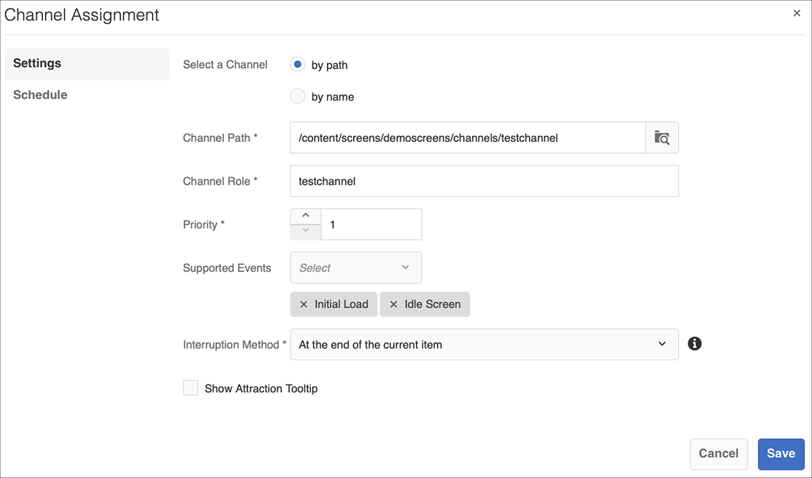

# 副標題指南 {#kickstart-guide}

AEM Screens的啟動示範如何設定及執行AEM Screens專案。 它會逐步引導您設定基本的數位看板體驗，並將資產和/或視訊等內容新增至每個頻道，並進一步將內容發佈至AEM Screens播放器。

>[!NOTE]
>開始處理專案詳細資訊之前，請確定您已安裝最新的AEM Screens Feature Pack。 您可以使用Adobe ID從[Software Distribution Portal](https://experience.adobe.com/#/downloads/content/software-distribution/en/aem.html)下載最新的Feature Pack。

## 必備條件 {#prerequisites}

請依照下列步驟，建立AEM Screens的範例專案，並進一步將內容發佈至Screens播放器。

>[!NOTE]
>下列教學課程將在Chrome OS播放器中展示管道內容。

>[!IMPORTANT]
>**OSGi配置設定**
>您必須啟用空的反向連結，才能讓裝置將資料發佈至伺服器。 例如，如果停用空的反向連結屬性，裝置就無法將螢幕擷圖張貼回。 目前，部分功能僅在OSGi設定中啟用Apache Sling Referrer Filter Allow Empty時才可用。 控制面板可能會顯示警告，指出安全設定可能會使部分功能無法運作。
>請依照下列步驟啟用&#x200B;***Apache Sling Referrer Filter Allow Empty***:

## 允許空的反向連結請求 {#allow-empty-referrer-requests}

1. 透過AEM例項 — >槌子圖示 — > **Operations** —> **Web主控台**&#x200B;導覽至&#x200B;**Adobe Experience Manager Web主控台設定**。

   

1. **Adobe Experience Manager Web主控台設** 定隨即開啟。搜尋Sling反向連結。

   要搜尋Sling反向連結屬性，請按&#x200B;**Command+F**&#x200B;鍵(**Mac**)和&#x200B;**Control+F**&#x200B;鍵(**Windows**)。

1. 勾選&#x200B;**允許空白**&#x200B;選項，如下圖所示。

   

1. 按一下&#x200B;**Save**&#x200B;以啟用Apache Sling反向連結篩選器允許空白。

## 在5分鐘內建立數位看板體驗 {#creating-a-digital-signage-experience-in-minutes}

### 建立AEM Screens專案 {#creating-project}

第一步是建立AEM Screens專案。

1. 導覽至您的Adobe Experience Manager(AEM)例項，然後按一下&#x200B;**Screens**。 或者，您也可以直接從`https://localhost:4502/screens.html/content/screens](https://localhost:4502/screens.html/content/screens`導覽。

1. 按一下&#x200B;**建立螢幕專案**&#x200B;以建立新的螢幕專案。 輸入標題為&#x200B;**DemoScreens**，然後按一下&#x200B;**Save**。

   

   >[!NOTE]
   >建立專案後，專案會回到Screens專案首頁。 您現在可以選取專案。 在項目中，有五個不同的資料夾，標題為&#x200B;**Applications**、**Channels**、**Devices**、**Locations**&#x200B;和&#x200B;**Schedules**。

### 建立管道 {#creating-channel}

建立AEM Screens專案後，您需要建立可管理內容的新管道。

請依照下列步驟，為您的專案建立新管道：

1. 建立專案後，請選取&#x200B;**DemoScreens**&#x200B;專案並選取&#x200B;**Channels**&#x200B;資料夾，如下圖所示。 按一下動作列中的「**+建立**」 。

   

1. 從嚮導中選擇&#x200B;**序列通道**，然後按一下&#x200B;**下一步**。
   

1. 輸入&#x200B;**Title**&#x200B;作為&#x200B;**TestChannel**，然後按一下&#x200B;**Create**。

   

   **TestChannel**&#x200B;現在已新增至通道資料夾，如下圖所示。

   

### 新增內容至管道 {#adding-content}

在管道就緒後，您需要將內容新增至將顯示的AEM Screens播放器。

請依照下列步驟，將內容新增至專案中的頻道(**TestChannel**):

1. 導覽至您建立的&#x200B;**DemoProject**，並從&#x200B;**Channels**&#x200B;資料夾中選取&#x200B;**TestChannel**。

1. 按一下動作列中的&#x200B;**編輯**（請參閱下圖）。 **TestChannel**&#x200B;的編輯器開啟。

   

1. 按一下切換動作列左側側面板的圖示，以開啟資產和元件。

1. 拖放您要新增至管道的元件。

   

### 建立位置 {#creating-location}

管道就緒後，您需要建立位置。

>[!NOTE]
>***位置***&#x200B;劃分您的各種數位招牌體驗，並包含根據各種螢幕所在位置的顯示器組態。

請依照下列步驟，為專案建立新位置：

1. 導覽至您建立的&#x200B;**DemoProject** ，並選取&#x200B;**Locations**&#x200B;資料夾。

1. 按一下動作列中的「**+建立**」 。

1. 從嚮導中選擇&#x200B;**位置**，然後按一下&#x200B;**下一步**。

1. 輸入您所在位置的&#x200B;**名稱**（將標題輸入為&#x200B;**TestLocation**），然後按一下&#x200B;**Create**。

已建立&#x200B;**TestLocation**&#x200B;並將其添加到&#x200B;**Locations**&#x200B;資料夾。

### 建立位置顯示 {#creating-display}

建立位置後，您需要為位置建立新顯示。

>[!NOTE]
>***Display***&#x200B;代表在一或多個畫面上執行的數位體驗。

1. 導覽至&#x200B;**TestLocation**&#x200B;並選取它。

1. 按一下動作列中的&#x200B;**建立**。

   

1. 從&#x200B;**Create**&#x200B;嚮導中選擇&#x200B;**Display**，然後按一下&#x200B;**Next**。

   

1. 將&#x200B;**Title**&#x200B;輸入為&#x200B;**LobbyDisplay**，然後按一下&#x200B;**Create**。

   

   名為&#x200B;**TestDisplay**&#x200B;的新顯示內容現在已新增至您的位置&#x200B;**TestLocation**，如下圖所示。

   

### 指派管道 {#assigning-channel}

專案設定完成後，您必須將頻道指派給顯示器以檢視內容。

1. 從&#x200B;**DemoScreens** —> **Locations** —> **TestLocation** —> **LobbyDisplay**&#x200B;導覽至所需的顯示。

1. 從動作列點選/按一下「**指派管道**」。

   

   或,

   從動作列點選/按一下「**控制面板**」，然後從「**已指派管道與排程」面板按一下「**+指派管道&#x200B;**」。**

   

1. **通道分配**&#x200B;對話框開啟。

1. 從&#x200B;**Settings**&#x200B;選項中，選擇通道&#x200B;**按路徑**&#x200B;和&#x200B;**支援的事件**&#x200B;作為&#x200B;**初始載入**&#x200B;和&#x200B;**空閒螢幕**。

   >[!NOTE]
   >
   >預設會填入&#x200B;**通道角色**、**優先順序**&#x200B;和&#x200B;**中斷方法**。 請參閱[通道屬性](/help/user-guide/channel-assignment-latest-fp.md#channel-properties)一節，以進一步了解通道指派屬性。

   

   此外，還可以選擇&#x200B;**激活窗口**&#x200B;和&#x200B;**重複計畫**。

   >[!NOTE]
   >*重複排程*可讓您設定通道的重複排程。 您可以為管道設定多個重複執行排程。
   >如需詳細資訊，請參閱[重複排程](/help/user-guide/channel-assignment-latest-fp.md#recurrence-schedule) 。

1. 在配置首選項後，按一下&#x200B;**保存**。

### 註冊設備並將設備分配給顯示器 {#registering-device}

您必須使用AEM控制面板註冊裝置。

>[!IMPORTANT]
>Chrome OS播放器可在開發人員模式中安裝為Chrome瀏覽器外掛程式，而不需要實際的Chrome播放器裝置。 安裝時，請遵循下列步驟：
>
>1. 按一下[這裡](https://download.macromedia.com/screens/)以下載最新的Chrome播放器。
>1. 解壓縮並儲存在磁碟上。
>1. 開啟Chrome瀏覽器，從功能表選取&#x200B;**擴充功能**，或直接導覽至&#x200B;***chrome://extensions***。
>1. 從右上角開啟&#x200B;**開發人員模式**。
>1. 按一下左上角的「載入未封裝&#x200B;**」 ，然後載入未壓縮的Chrome播放器。**
>1. 如果擴充功能清單中有，請檢查&#x200B;**AEM Screens Chrome Player**&#x200B;外掛程式。
>1. 開啟新標籤，然後按一下左上角的&#x200B;**Apps**&#x200B;圖示，或直接導覽至&#x200B;***chrome://apps***。
>1. 按一下「**AEM Screens**&#x200B;外掛程式」以啟動Chrome Player。 依預設，播放器會以全螢幕模式啟動。 按&#x200B;**esc**&#x200B;退出全螢幕模式。

在您的Chrome OS播放器開啟後，請依照下列步驟註冊Chrome裝置。

1. 從AEM例項導覽至專案的&#x200B;**Devices**&#x200B;資料夾。

1. 點選/按一下動作列中的&#x200B;**裝置管理員**。

   

1. 點選/按一下右上方的&#x200B;**Device Registration**。

1. 選擇所需的設備，然後點選/按一下「註冊設備」**。**

   

1. 等候裝置傳送其註冊代碼，並同時檢查Chrome裝置的&#x200B;**註冊代碼**。
   

1. 如果兩台電腦上的&#x200B;**註冊代碼**&#x200B;相同，請點選/按一下AEM中的&#x200B;**驗證**。

1. 將裝置的所需名稱設為&#x200B;**ChromeDeviceforDemo**，然後按一下&#x200B;**Register**。

   

1. 在&#x200B;**Device Registration Successful**&#x200B;對話框中，按一下&#x200B;**Assign Display**。

   

1. 選擇顯示路徑為&#x200B;**DemoScreens** —> **Locations** —> **TestLocation** —> **LobbyDisplay**，然後按一下&#x200B;**Assign**。

   

1. 成功分配設備後，您將看到以下確認。

   

1. 點選/按一下&#x200B;**完成**&#x200B;以完成註冊過程。 您應該可以從顯示控制面板檢視已註冊的裝置。

   

### 在Chrome Player中檢視內容 {#viewing-content-output}

您管道中的所有資產現在都會在Chrome OS播放器上播放。

恭喜您正在AEM Screens頻道播放內容！

