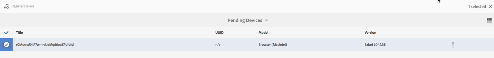

# Kickstart指南 {#kickstart-guide}

本節是AEM Screens的動畫開頭，並說明如何達成基本動作。 它會逐步帶您設定基本的數位招牌體驗，包括內容／資產，以及發佈至螢幕播放器。 如需深入瞭解螢幕開發的所有元件，請參閱頁面結尾的資源。

## 在5分鐘內建立數位標牌體驗 {#creating-a-digital-signage-experience-in-minutes}

下列步驟可讓您建立「畫面」的範例專案，並將內容發佈至「畫面播放器」。

1. 若要下載 **AEM Screens Player**，請按一 [下這裡](https://download.macromedia.com/screens/)。

   AEM Screens也可在 **Google Play中使用**。

   如需Chrome OS Player的實作，請參閱 [Chrome管理控制台](implementing-chrome-os-player.md) ，以取得詳細資訊。

   如需詳 [細資訊，請參閱安裝和設定畫面](configuring-screens-introduction.md) 。

   >[!NOTE]
   >
   >**OSGI設定**
   >
   >
   >您必須啟用空的反向連結，以允許裝置將資料張貼至伺服器。 例如，如果停用空的反向連結屬性，裝置就無法將螢幕擷取張貼回去。 目前，部分功能僅在OSGI config中啟用Apache Sling Referrer Filter Allow Empty時才可用。 控制面板可能會顯示警告，指出安全性設定可能會使部分功能無法運作。
   >
   >
   >請依照下列步驟來啟用 ***Apache Sling Referrer Filter Allow Empty***:
   >
   >
   >
   >    1. 導覽至 **Adobe Experience Manager Web Console設定**，即 `https://localhost:4502/system/console/configMgr/org.apache.sling.security.impl.ReferrerFilter`。
   >    1. 選中 **allow.empty選項** 。
   >    1. 按一下&#x200B;**「儲存」**。

1. **建立新專案**

   1. 依序選取Adobe Experience Manager連結（左上）和「畫 **面」**。 或者，您也可以直接導覽至 `https://localhost:4502/screens.html/content/screens](https://localhost:4502/screens.html/content/screens`。

   1. 按一 **下「建立** 」以建立新的「畫面」專案（請參閱下圖）。
   1. 從「建 **立畫面** 」專案精靈中選 **取「畫面」** ，然後按一下「 **下一步**」。

   1. 輸入標題為 *Test_Project* ，然後按一 **下Create**。
   

   在建立專案後，就會將您帶回「畫面專案」主控台。 您現在可以選取專案。 在項目中有五種類型：應用程式 **、通道、設備**、位置 **、**************&#x200B;位置資料夾和時間表，如下圖所示。

   >[!NOTE]
   >
   >只有在您已安裝AEM 6.3 Sites Feature Pack 1時，才能使用排程。 若要存取此功能套件，您必須聯絡Adobe支援並要求存取權。 一旦您擁有權限，就可從「套件共用」下載。

   

   如需詳 [細資訊，請參閱建立和管理畫面專案](creating-a-screens-project.md) 。

1. **建立新渠道**

   一旦您的專案就位後，您就需要建立新的管道來管理內容。

   請依照下列步驟，為您的專案建立新的管道：

   1. 導覽至您建 *立的Test_Project* ，然後選取「 **Channels** 」檔案夾。

   1. 從動 **作列按一下** 「建立」(Create)（請參閱下圖）。 嚮導將開啟。
   1. 選擇「 **Sequence Channel** 」，然後按 **「Next」**。

   1. 輸入「名 **稱** 」和「標題 **」作** 為TestChannel *，然*****&#x200B;後按一下Create Reate。
   

   TestChannel *會建立* ，並新增至您的頻道資料夾，如下圖所示。

   

   如需 [建立和管理渠道的詳細資訊](managing-channels.md) ，請參閱渠道管理。

1. **新增內容至頻道**

   在您的頻道就位後，您需要將內容新增至頻道，讓螢幕播放器顯示。

   請依照下列步驟，將內容新增至專案中&#x200B;*的頻道*(TestChannel):

   1. 導覽至您建 *立的Test_Project* ，然後選取「 **Channels** 」檔案夾。

   1. 從動 **作列按一下** 「編輯」(Edit)（請參閱下圖）。 TestChannel的編輯 *器隨即開* 啟。

   1. 按一下切換動作列左側側面板的圖示，以開啟資產和元件。
   1. 拖放您要新增至渠道的元件。
   

   在此範例中，編輯器會顯示新增至頻道的影像。

   

1. **建立新位置**

   一旦您的渠道就位後，您就需要建立您的位置。

   ***位置*** ，將您的各種數位標牌體驗加以區隔，並根據不同螢幕的位置，包含顯示器的組態。

   請依照下列步驟，為您的專案建立新位置：

   1. 導覽至您建 *立的Test_Project* ，並選取「位置 **」檔案夾** 。

   1. 按一 **下動作列** 中加號圖示旁的「建立」(Create)（請參閱下圖）。 嚮導將開啟。
   1. 從向 **導中選擇** 「位置」，然後按一下「 **下一步」**。

   1. 輸入您所 **在位置的名稱****和標題** (將標題輸入為 *TestLocation*)，然後按一下 **** CreateLocation。
   

   TestLocation *會建立* ，並新增至您的 **Locations資料** 夾。

   

1. **建立&#x200B;*TestLocation的新顯示***

   在建立位置後，您需要為位置建立新的顯示。

   ***顯示*** ，代表在一或多個螢幕上執行的數位體驗。

   1. 導覽至您要建立顯示畫面的位置(*Test_* Project —&gt; **Locations** —&gt; *TestLocation)* ，如上圖所示，然後選擇 ** TestLocationLocation。

   1. 從動 **作列按一下** 「建立」。
   1. 從「創 **建** 」嚮導中選擇「顯 **示」** ，然後按一下「 **下一步**」。

   1. 輸入 **顯示位** 置的名稱 **和標題** (將標題輸入為 *TestDisplay*)。

   1. 在「顯 **示** 」標籤下，選擇「版面」的詳細資訊。

      1. 選擇「 **Resolution** (解析 **度)」為「Full HD**（全高清）」。

      1. 選擇「 **水準設備數** 」為1。
      1. 選擇「 **Number of Devices Pregitally** （垂直裝置數）」為1。
   1. 按一下&#x200B;**「建立」**。
   新的顯示(*TestDisplay*)會新增至您的 *TestLocation位置*，如下圖所示。

   

1. **新增排程**

   *在*「AEM畫面」中，「排程」可讓您將頻道組織成可重複使用的群組，如此您就不必針對要顯示內容的每個顯示分別重複其指派。

   >[!NOTE]
   >
   >只有在您已安裝AEM 6.3 Sites Feature Pack 1時，才能使用此畫面功能。 若要存取此功能套件，您必須聯絡Adobe支援並要求存取權。 一旦您擁有權限，就可從「套件共用」下載。

   1. 從Test_Project —&gt; **Schedules** 導覽至Schedules資料夾 ****。

   1. 從動 **作列按一下** 「建立」。 嚮導將開啟。
   1. 從「創 **建** 」嚮導頁面 **選擇「計畫** 」。

   1. 在屬性 **頁面中** ，將名稱 **和標** 題輸入為MorningSchedule ** 。

   1. 按一 **下「建立** 」，排程就會新增至「排程 **** 」資料夾，如下圖所示。
   

   此外，請選取排程(*MorningSchedule*)，然後從動作列按一下「 **儀表板** 」以檢視排程控制面板。 您可以使用控制面板來檢視／變更排程的屬性、指派渠道，以及檢視指派的顯示。

   

   請參 [閱建立和管理計畫](managing-schedules.md) ，以獲取有關計畫的詳細資訊。

1. **指派渠道**

   1. 從 *Test_Dest* —&gt; **Project Locations** — *—&gt;*** TestDisplay位置導覽至顯示。

   1. 選取 *TestDisplay* ，然後從動作列點選／按一下**Assign Channel ** *或*,

   1. 按一 **下「儀表板** 」，然後從「已指派的頻道與排程」面板中，選取右上角的「指派頻道 ******** 」，如下圖所示。 **「渠道分配** 」對話框開啟。

   1. 依路 **徑選取參考** 管 **道**

   1. 將頻道角 **色輸入為***LiveStream*。

   1. 在Channel Channel中 **選擇Path** (*Test_Project* —&gt; *Channels* —&gt; ****** Test Channel)。

   1. 選擇此 **渠道的** 「優先順序」 *為1*。

   1. 選擇「支 **援的事件** 」作 **為「初始載** 入」和「 **閒置」畫面**。

   1. 輸入 **計畫** ，然後選擇活動中的 **開始日期** , **和活動**。

   1. 按一下&#x200B;**「儲存」**。
   頻道會建立並新增至面板。

   

   要瞭解有關渠道指 **派對話框** 及其相關屬性的詳細資訊，請參 [閱指派渠道](channel-assignment.md)。

1. **新增排程至渠道**

   1. 從 *Test_Dest* —&gt; **Project Locations** — *—&gt;*** TestDisplay位置導覽至顯示。

   1. 按一 **下「控制面板** 」，然後從「已指派的頻道與排程」面板中，選取右上角的「指派排程」(Assign Schedule ******** )，如上圖所示。 **「計劃分配** 」對話框開啟。

   1. 選擇您建立排程的路徑( *Test_Project* —&gt; **Schedules** —&gt; *MorningSchedule*)。

   1. 按一 **下「儲存** 」，將排程新增至您的渠道。
   

1. **註冊設備**

   您必須使用AEM儀表板註冊裝置。

   >[!NOTE]
   >
   >您可以使用您下載的AEM Screens應用程式或使用網頁瀏覽器來開啟「畫面」播放器。

   要查看暫掛設備，請執行以下操作：

   1. 啟動個別的瀏覽器視窗。
   1. 使用網頁瀏覽器前往「畫面 *播放器* 」, `https://localhost:4502/content/mobileapps/cq-screens-player/firmware.html` 或啟動AEM Screens應用程式。 當您開啟裝置時，會注意到裝置的狀態為未註冊。
   1. 從AEM儀表板，導覽至 *Test_Project* —&gt;裝 **置**

   1. 從動 **作列按一下「裝置管理器** 」。
   1. 按一 **下「裝置註冊** 」，您就會看到待審裝置，如下圖所示。
   

   選擇要註冊的設備，然後按一下「 **Register Device（註冊設備）**」。

   

   您必須從網頁瀏覽器或AEM Screens播放器驗證程式碼，以驗證程式碼。

   按一下 **驗證** ，導覽至「裝 **置註冊** 」畫面。

   

   輸入 **Title** （標題） **，然後按一下** Register（註冊），設備將被註冊。

   按一下 **完成** ，完成設備註冊步驟。

   

   按一 **下「完成** 」會返回顯示未指派和已指派之裝置的裝置頁面。

   

   >[!NOTE]
   >
   >您新增的裝置會在「已指派 **狀態」下顯示** 「未 **指派** 」。

1. **指定要顯示的設備**

   在註冊裝置後，您必須將裝置指派給顯示器。

   請遵循下列步驟來指派裝置：

   1. 選擇要分配的設備。
   1. 從動 **作列按一下** 「指定裝置」。
   1. 選取渠道的顯示路徑為 `/content/screens/Test_Project/***Locations***/TestLocation/TestDisplay.`

   1. 按一下 **指派**。
   1. 按一下 **完成** ，完成該過程，現在已分配設備。
   

   顯示控制面板隨即開啟，您將會看到與指派的頻道和排程相關的所有資訊，以及裝置設定詳細資訊。

   

### 在Screens Player中檢視內容 {#viewing-the-content-in-screens-player}

在您新增上述設定後，播放器應自動顯示裝置上顯示的預設頻道，例如影像（在此案例中，序列頻道和內容會在Screens Player中顯示於網頁瀏覽器）。

請參 [閱AEM Screens Player](working-with-screens-player.md) ，以取得AEM Screens播放器的詳細資訊。
