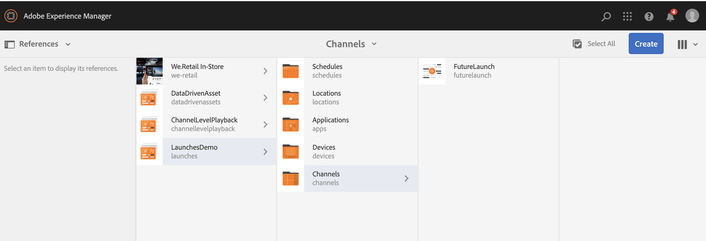

# 使用畫面啟動來更新內容 {#launches}

內容製作者可建立頻道的未來版本，稱為「畫面啟動 **** 」，並進一步設定此次啟動的即時日期，讓內容可在裝置或播放器中即時顯示。

在未來發佈的協助下，作者可以預覽啟動中的每個管道，並可以開始要求檢閱。 批准者群組會收到通知，並可核准或拒絕請求。 到達即時日期時，內容會在裝置中播放。

例如，如果作者想要建立c1、c2（頻道）的未來版本，則會建立啟動並設定即時日期（例如，11月10日上午8:00）。 內容中的任何更新都會送出供您檢閱。 核准後即可上線（11月10日上午8:00），此次啟動會在裝置或播放器上播放內容。

## 需求 {#requirements}

在AEM Screens專案中開始實作未來發佈之前，請務必瞭解寬限期的概念及其相關性。

下節說明寬限期，以及如何立即設定寬限期。 您也可以下載範例測試設定，以瞭解其使用情形。

### 瞭解寬限期 {#understanding-grace-period}

下列設定可讓管理員設定 ***寬限期***，這是日後發佈所需的。

**寬限期**，包括：

* 推廣發射
* 發佈資源以發佈例項
* 裝置從發佈例項下載內容所花的時間，以及伺服器與播放器的任何時間差異

例如，假設伺服器在PST中，裝置在EST中，此時最大時差為3小時，並假設促銷需要1分鐘，而從作者發佈需要10分鐘，而播放器通常可在10-15分鐘內下載資源。 然後寬限期=時間差（3小時）+提升啟動（1分鐘）的時間+發佈啟動（10分鐘）的時間+在播放器下載（10-15分鐘）+緩衝區（安全，例如30分鐘）= 3小時56分鐘= 14160秒。 因此，當我們排程任何即時啟動時，促銷活動會以此偏移提前開始。 在上述等式中，大部分項目不需要太多時間，只要我們知道伺服器和任何播放器的最大時間差，我們就可對此偏移量使用適當的猜測。

### 設定現成可用的寬限期 {#configuring-out-of-the-box-grace-period}

現成可用，啟動的寬限期會設為24小時，這表示當我們針對 */content/screens下的資源設定啟動的即時日期時*，促銷會從此偏移開始。 例如，如果liveDate設為11月24日，9:00 AM且寬限期為24小時，促銷工作將於11月23日09:00 AM開始。

### 下載配置 {#downloading-configurations}

下載下列測試設定：

[取得檔案](assets/launches_event_handlerconfig-10.zip)

>[!NOTE]
>
>上述設定在此測試設定中的寬限期為600秒。

#### 更新配置 {#updating-the-configurations}

如果您想要變更上述設定，請依照下列指示進行：

* 建立 ***sling:OsgiConfig/ nt:file in /apps/system/config*** ，其名稱為 **com.adobe.cq.wcm.launches.impl.LaunchesEventHandler.config** 和content

   *launches.eventhandler.updatelastmodification=B&quot;false&quot;launches.eventhandler.launch.promotion.graceperiod=[&quot;/content/screens(/)*):600&quot;]launches.eventhandler.threadpool.maxsize=I&quot;5&quot;launches.eventhandler.threadpool.priority=&quot;MIN&quot;*

* `launches.eventhandler.launch.promotion.graceperiod=["/content/screens(/.&#42;):600"`，可讓您在路徑／內容／畫面中設定600 *秒的寬限期*。

這表示當您為資源的任何啟動設定即時日期時 **，促銷會以此偏移開始。 例如，如果即時日期設為11月24日，9:00 AM且寬限期為600秒，促銷工作將於11月24日8:50 AM開始。

## 使用畫面啟動 {#using-launches}

請依照下列章節，在您的AEM Screens專案中實作啟動。 本節涵蓋下列主題：

1. **建立畫面啟動**
1. **編輯畫面啟動以設定即時日期和範圍**

### 建立畫面啟動 {#creating-a-launch}

請依照下列步驟，將啟動功能實作至您的AEM Screens專案：

1. 在您的AEM Screens專案中建立序列頻道，例如 **LaunchesDemo** —> **Channels** —> **FutureLaunch**，如下所示。

   >[!CAUTION]
   >
   >您必須從AEM Screens專案中預先存在的頻道建立啟動。

   

1. 選取渠道 **FutureLaunch** ，然後從動作 **列按一下「建立啟動** 」。

   

1. 「建 **立啟動** 」精靈隨即開啟。 您可以選取精靈中已顯示的頻道，或按一下「 **+新增頻道」** ，新增您要建立啟動的頻道。

#### 使用現有渠道 {#existing-channel-launch}

1. 選取「建立啟動」精靈中已存 **在的渠道** ，然後按一 **下Next**。

   

1. 選取渠道，然後從動 **作列按** 「下一步」。

   >[!NOTE]
   >**依預設** ,「包含子頁面」選項已選取。

   

1. 將「 **啟動標題** 」輸入 **為SummerPromotions** ，而您不需要設定 **啟動日期**，如下圖所示。 按一下 **建立**。

   >[!NOTE]
   >
   >*啟用或勾選* 「繼承來 **源頁面即時資料」選項** ，可讓頻道在啟動時建立為即時副本。 如果在原始渠道中進行任何變更，這些變更會自動套用至啟動渠道。
   >
   >
   >*停用或取消勾選* 「繼 **承來源頁面即時資料** 」，可讓頻道在啟動時複製，而不需任何即時關係。 因此，如果對原始渠道進行任何變更，這些變更不會套用至啟動渠道。

   

   >[!NOTE]
   >
   >您可以在此步驟中設定即時啟動日期，或在啟動建立後編輯其屬性時稍後加以設定。

1. 您會看到啟動已建立。 您可以按一下「 **開啟** 」，在編輯器中檢視頁面，或按一下「完成 **** 」，以返回您的專案。

   

   按一 **下** 「完成」 **，可讓您導覽回** FutureLaunch頻道。

   

#### 使用「新增渠道」選項 {#add-channel-launch}

1. 按一 **下「+新增渠道** 」，新增您要建立啟動的渠道。

   

   >[!NOTE]
   >如果您 **嘗試選取多個頻道或資料夾來新增啟動，「選取** 」選項將會停用。

1. 導覽至您要建立啟動的渠道，然後按一下「選 **取」**。

   

1. 現在，您可以選取您新增的渠道來建立啟動，然後按一下「下 **一步**」。

   

1. 將「 **啟動標題** 」輸入 **為SummerPromotions** ，而您不需要設定 **啟動日期**，如下圖所示。 按一下 **建立**。

   >[!NOTE]
   >
   >*啟用或勾選* 「繼承來 **源頁面即時資料」選項** ，可讓頻道在啟動時建立為即時副本。 如果在原始渠道中進行任何變更，這些變更會自動套用至啟動渠道。
   >
   >
   >*停用或取消勾選* 「繼 **承來源頁面即時資料** 」，可讓頻道在啟動時複製，而不需任何即時關係。 因此，如果對原始渠道進行任何變更，這些變更不會套用至啟動渠道。

   

   >[!NOTE]
   >
   >您可以在此步驟中設定即時啟動日期，或在啟動建立後編輯其屬性時稍後加以設定。

1. 您會看到啟動已建立。 您可以按一下「 **開啟** 」，在編輯器中檢視頁面，或按一下「完成 **** 」，以返回您的專案。

   

   按一 **下** 「完成」 **，可讓您導覽回** FutureLaunch頻道。

   

### 編輯啟動屬性以設定即時日期和範圍 {#editing-the-launch-properties-to-set-the-live-date-and-scope}

建立啟動後，您必須編輯啟動屬性，以將即時日期設定為啟動範圍。

請依照下列步驟編輯啟動屬性：

1. 導覽至渠道(**FutureLaunch**)並選取渠道，如下圖所示。 從左側 **邊欄開** 「參照」邊欄。

   >[!NOTE]
   >
   >從左側 **邊欄選取** 「內容樹」選項，以開啟您建立的啟動。

   

1. 導覽至「 **啟動** 」，然後選取您建立&#x200B;**的啟動(SummerPromotions**)。 按一 **下編輯屬性**。

   

1. 啟動「夏季 **促銷** 」對話方塊隨即開啟。 填入下列欄位：

   * 選擇啟 **動日期**
   * 檢查生 **產就緒**
   * 從范 **圍中選擇「升級** 」批准 **頁**
   >[!NOTE]
   >
   >瞭解「自動促銷」下 **的「啟動」項目**:

   >    * **啟動日期**，是指即時日期，即內容在螢幕播放器中依播放器時區播放的日期／時間。
   >    * **Production Ready**，可讓頻道升級，並表示啟動已準備就緒可供使用。
   >    * **範圍**，是指在啟動期間可以推廣的渠道。

   以下三個選項可用於設定範圍：
   1. **促銷完整啟動**:啟動的所有頻道都會在設定的即時日期進行促銷。
   1. **升級修改的頁面**:只會升級已編輯的啟動資源。 建議在不需要啟動檢視時使用此選項。 它可讓啟動頻道中的修改升級。
   1. **促銷已核准的頁面**:只有已核准的頁面才會在設定的即時日期升級。
   

   >[!CAUTION]
   >
   >啟動促銷會遵循播放器／裝置的時區，而非伺服器的時區。

1. 按一 **下「儲存並關閉** 」，以返回 **FutureLaunch頻道** 。

   

