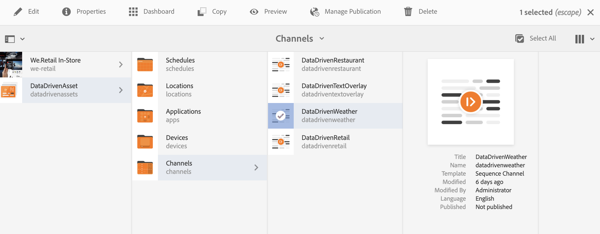
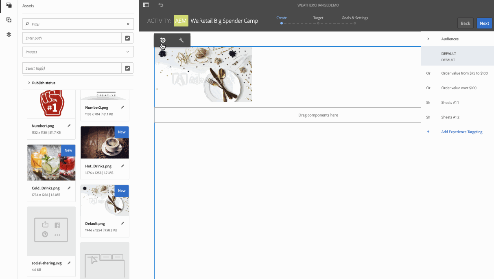
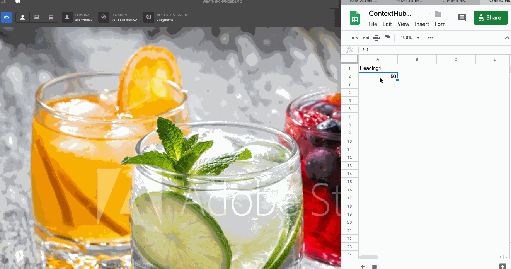

# 旅行中心溫度啟用 {#travel-center-temperature-activation}

>[!IMPORTANT]
>此內容對AEM內部部署/AMS （AEM 6.5LTS和AEM 6.5）有效。 如需AEM as a Cloud Service Screens內容，請參閱[AEM as a Cloud Service指南](https://experienceleague.adobe.com/en/docs/experience-manager-cloud-service/content/screens-as-cloud-service/overview/introduction)。

下列使用案例示範如何根據Google Sheets中填入的值，使用旅行中心本機溫度啟動。

## 說明 {#description}

針對此使用案例，如果Google Sheets中的值小於50，則會顯示含有熱飲的影像。 如果值大於或等於50，則會顯示含有冷飲的影像。 如果有其他值或完全沒有值，播放器會顯示預設影像。

## 先決條件 {#preconditions}

開始實作旅遊中心當地溫度啟動之前，請先瞭解如何在AEM Screens專案中設定&#x200B;***資料存放區***、***對象細分***&#x200B;和&#x200B;***啟用管道的目標定位***。

如需詳細資訊，請參閱[在AEM Screens中設定ContextHub](configuring-context-hub.md)。

## 基本流量 {#basic-flow}

請依照下列步驟，實作Travel Center本機溫度啟動使用案例：

1. **填入Google工作表**

   1. 導覽至ContextHubDemo Google工作表。
   1. 新增具有&#x200B;**`Heading1`**&#x200B;且有對應溫度值的欄。

   

1. **根據需求設定對象中的區段**

   1. 導覽至您對象中的區段（如需詳細資訊，請參閱&#x200B;**[在AEM Screens中設定ContextHub](configuring-context-hub.md)**&#x200B;頁面中的&#x200B;***步驟2：設定對象細分***）。

   1. 按一下&#x200B;**工作表A1 1**&#x200B;並按一下&#x200B;**編輯**。

   1. 按一下比較屬性，然後按一下設定圖示。
   1. 從&#x200B;**屬性名稱**&#x200B;的下拉式清單中按一下&#x200B;**google工作表/value/1/0**

   1. 從下拉式功能表中按一下&#x200B;**運運算元**&#x200B;做為&#x200B;**大於或等於**

   1. 輸入&#x200B;**值**&#x200B;做為&#x200B;**50**

   1. 同樣地，選取&#x200B;**工作表A1 2**&#x200B;並按一下&#x200B;**編輯**。

   1. 按一下&#x200B;**比較屬性 — 值**&#x200B;並選取組態圖示。
   1. 從&#x200B;**屬性名稱**&#x200B;的下拉式清單中按一下&#x200B;**google工作表/value/1/0**

   1. 從下拉式功能表中按一下&#x200B;**運運算元**&#x200B;為&#x200B;**小於**

   1. 輸入&#x200B;**值**&#x200B;做為&#x200B;**50**

1. 瀏覽並選取您的頻道()，然後從動作列按一下&#x200B;**編輯**。 在下列範例&#x200B;**DataDrivenWeather**&#x200B;中，使用循序頻道來展示功能。

   >[!NOTE]
   >
   >您的頻道應該已有預設影像，且對象應該已預先設定，如[在AEM Screens中設定ContextHub](configuring-context-hub.md)中所述。

   

   >[!CAUTION]
   >
   >您應已設定使用管道&#x200B;**屬性** > **Personalization**&#x200B;索引標籤的&#x200B;**ContextHub** **設定**。

   

1. 從編輯器按一下&#x200B;**鎖定目標**，然後從下拉式功能表按一下&#x200B;**品牌**&#x200B;和&#x200B;**活動**，然後按一下&#x200B;**開始鎖定目標**。

   

1. **正在檢查預覽**

   1. 按一下&#x200B;**預覽。** 此外，請開啟Google工作表並更新其值。
   1. 將值變更為小於50。 您可以檢視冷飲的影像。 如果「Google工作表」中的值為50或更大，您應該會看到熱飲的影像。

   
