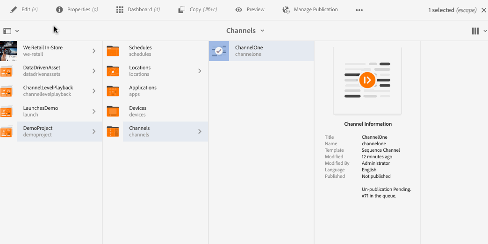

# 建立和管理管道 {#creating-and-managing-channels}

管道可顯示內容順序（影像和影片），也可顯示網站或單頁應用程式。

此頁面顯示如何建立和管理AEM Screens的管道。

**先決條件**：

* [設定和部署Screens](configuring-screens-introduction.md)
* [建立和管理Screens專案](creating-a-screens-project.md)

## 建立新頻道 {#creating-a-new-channel}

為AEM Screens建立專案後，請依照下列步驟為專案建立管道：

1. 按一下Adobe Experience Manager連結（左上方），然後按一下Screens。 或者，您可以直接導覽至 `https://localhost:4502/screens.html/content/screens`.

1. 導覽至您的畫面專案，然後按一下 **頻道** 資料夾。

1. 按一下 **建立** 從動作列移除。

   

1. 按一下 **順序頻道** 範本來自 **建立** 精靈並按一下 **下一個**.

   

1. 輸入標題為 **ScreensChannel** 並按一下 **建立**.

   

1. 順序頻道現在已新增到您的 **頻道** 資料夾。

### 管道型別 {#channel-types}

使用精靈時，可以使用下列範本選項，例如：

| **範本選項** | **說明** |
|---|---|
| 頻道資料夾 | 可讓您建立資料夾以儲存管道集合。 |
| 順序頻道 | 可讓您建立依序播放元件的色版（在投影片放映中逐一播放）。 |
| 應用程式頻道 | 可讓您在Screens播放器中展示您的自訂網頁應用程式。 |
| 1x1 拆分畫面頻道 | 可讓您在單一區域中檢視元件。 |
| 1x2 拆分畫面頻道 | 可讓您在兩個區域（水準分割）中檢視資產。 |
| 2X1拆分畫面頻道 | 可讓您檢視兩個區域中的資產（垂直分割）。 |
| 2x2 拆分畫面頻道 | 可讓您在四個區域中檢視資產（在矩陣中水平與垂直分割）。 |
| 2 至 3 拆分畫面頻道 | 可讓您檢視兩個區域中的資產（水準分割），其中一個區域大於另一個區域。 |
| 左或右L列拆分畫面頻道 | 可讓內容作者在適當大小的區域中檢視不同型別的資產。 |

>[!NOTE]
>
>「拆分畫面」頻道會將顯示分割成多個區域，以便您同時並排播放多個體驗。 體驗可以是靜態資產/文字或內嵌序列。

>[!IMPORTANT]
>
>建立內容並新增至管道後，下一步就是建立位置，然後建立顯示。 此外，將該頻道指派給顯示器。 請參閱以下章節結尾的資源。

## 使用管道 {#working-with-channels}

您可以編輯、檢視屬性和控制面板，複製、預覽和刪除管道。

### 新增/編輯內容至頻道 {#adding-editing-content-to-a-channel}

若要新增或編輯管道中的內容，請遵循下列步驟：

1. 按一下您要編輯的通道（如上圖所示）。
1. 按一下 **編輯** 從動作列的左上角，編輯色版屬性。 編輯器會開啟，讓您新增資產/元件至您要發佈的管道。

>[!NOTE]
>您可以將元件新增至頻道。 另請參閱 **[新增元件至管道](adding-components-to-a-channel.md)** 以取得更多詳細資料。

**將視訊上傳至頻道**

請依照下列步驟，將視訊上傳至您的頻道：

1. 按一下您要上傳視訊的頻道。
1. 按一下 **編輯** 從動作列移除。
1. 在編輯器中，按一下 **影片** ，然後拖放所需的影片。

>[!NOTE]
>如果您在管道中上傳視訊時遇到問題，請參閱 [疑難排解影片](troubleshoot-videos.md).

### 檢視或編輯頻道屬性 {#viewing-properties}

1. 按一下您要編輯的頻道。
1. 按一下 **屬性** 以檢視/編輯頻道屬性。 下列標籤可讓您變更選項。

### 檢視控制面板 {#viewing-dashboard}

1. 按一下您要編輯的管道。
1. 按一下 **儀表板** 從動作列移除。

### 頻道資訊 {#channel-information}

「色版資訊」面板說明色版屬性，以及色版的預覽。 此外，它可提供頻道為離線或線上狀態的相關資訊。

按一下(**...**)從 **頻道資訊** 動作列，供您檢視屬性、編輯內容或更新頻道的快取（離線內容）。

#### 檢視資訊清單 {#view-manifest}

您可以從頻道控制面板檢視資訊清單。

>[!IMPORTANT]
>此選項僅適用於AEM 6.4 Feature Pack 8或AEM 6.5 Feature Pack 4。

請依照下列步驟操作，以便從頻道控制面板啟用此選項：

1. **將頻道設為離線**
   1. 按一下頻道，然後按一下 **屬性** 從動作列
   1. 瀏覽至 **頻道** 標籤，並請務必取消勾選 **開發人員模式（強制頻道上線）** 選項
   1. 按一下 **儲存並關閉**
1. **更新離線內容**
   1. 按一下頻道，然後按一下 **儀表板** 從動作列
   1. 瀏覽至 **頻道資訊** 面板並按一下 *...*
   1. 按一下 **更新離線內容**

您應該會看到 **檢視資訊清單** 選項來自 **頻道資訊** 面板中。

### 線上和離線頻道 {#online-and-offline-channels}

>[!NOTE]
>建立管道時，預設為「離線」。

建立管道時，可以將其定義為線上或離線管道。

一個 ***線上頻道*** 會在即時環境中顯示更新的內容，而 ***離線頻道*** 顯示快取的內容。

請依照下列步驟，讓頻道上線：

1. 瀏覽至該管道做為 **測試專案** > **頻道** > **TestChannel**.

   按一下通道。

   

   按一下 **儀表板** 以檢視播放器的狀態。 此 **頻道資訊** 面板會提供管道線上上或離線的相關資訊。

   

1. 按一下 **屬性** 並從動作列導覽至 **頻道** 標籤，如下所示：

   

1. 檢查 **開發人員** **模式（強制頻道上線）** 讓頻道上線。

   按一下 **儲存並關閉** 以儲存您的選項。

   

   導覽回到頻道控制面板，現在導覽至 **頻道資訊** 面板會顯示播放器的線上狀態。

   

>[!NOTE]
>若要將您的頻道再次設定為離線，請從以下位置取消勾選「開發人員模式」選項： **屬性** 標籤(如步驟(3)所示)。 然後，從 **頻道資訊** 面板點按 **更新離線內容**，如下圖所示。

#### 從裝置控制面板自動與手動更新 {#automatic-versus-manual-updates-from-the-device-dashboard}

下表總結列出與裝置控制面板的自動和手動更新相關聯的事件。

<table>
 <tbody>
  <tr>
   <td><strong>事件</strong></td>
   <td><strong>裝置自動更新</strong></td>
   <td><strong>裝置手動更新</strong></td>
  </tr>
  <tr>
   <td>線上頻道中的變更</td>
   <td>內容已自動更新</td>
   <td>
「裝置：推送設定」上已更新內容
 
或，
 
內容更新日期 <strong><i>裝置：重新啟動</i></strong>
 </td>
  </tr>
  <tr>
   <td>離線管道變更，但未觸發管道「推送內容」（無離線套件重新建立）</td>
   <td>無內容更新</td>
   <td>無內容更新</td>
  </tr>
  <tr>
   <td>離線管道和管道中的變更會觸發「推送內容」（新的離線套件）</td>
   <td>內容已自動更新</td>
   <td>
內容更新日期 <strong><i>裝置：推送設定</i></strong>
 
或，
 
內容更新日期 <strong><i>裝置：重新啟動</i></strong>
 </td>
  </tr>
  <tr>
   <td>
設定中的變更

    <ul>
     <li>顯示（強制通道）</li>
     <li>裝置</li>
     <li>頻道指定任務（新頻道、已移除頻道）</li>
     <li>頻道指定任務（角色、事件、排程）</li>
    </ul> </td>
   <td>設定已自動更新</td>
   <td>
設定更新於 <strong><i>裝置：推送設定</i></strong>
 
或，
 
設定更新於 <strong><i>裝置：重新啟動</i></strong>
 </td>
  </tr>
 </tbody>
</table>

### 指派的顯示 {#assigned-displays}

此 **已指派的顯示** 面板會顯示與色版相關聯的顯示。 它提供指定顯示的快照以及解析度。

關聯的顯示會列在 **已指派的顯示** 面板，如下所示：

>[!NOTE]
>若要瞭解如何在位置中建立顯示，請參閱：
>
>* [建立和管理位置](managing-locations.md)
>* [建立和管理顯示區](managing-displays.md)
>

此外，按一下 **指派的顯示區** 面板，檢視顯示資訊，如下所示：

### 後續步驟 {#the-next-steps}

建立管道並在管道中新增/編輯內容後的下一個步驟是瞭解如何建立位置和顯示。 再者，為該顯示指派管道。

如需後續步驟，請參閱下列資源：

* [建立和管理頻道](managing-channels.md)
* [建立和管理位置](managing-locations.md)
* [建立和管理顯示區](managing-displays.md)
