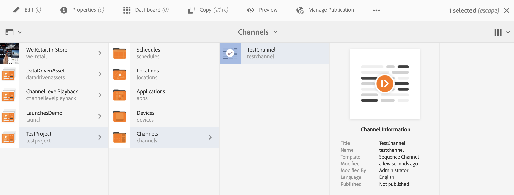
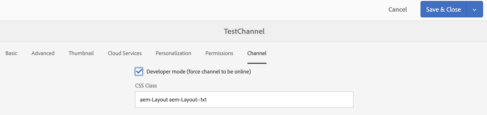

# 建立和管理渠道 {#creating-and-managing-channels}

渠道顯示一系列內容（影像和視頻），還顯示網站或單頁應用程式。

本頁顯示為AEM Screens建立和管理渠道。

**先決條件**:

* [配置和部署螢幕](configuring-screens-introduction.md)
* [建立和管理螢幕項目](creating-a-screens-project.md)

## 建立新渠道 {#creating-a-new-channel}

為AEM Screens建立項目後，請按照以下步驟為項目建立新渠道：

1. 選擇Adobe Experience Manager連結（左上），然後選擇螢幕。 或者，您可以直接導航到 `https://localhost:4502/screens.html/content/screens`。

1. 導航到您的螢幕項目並選擇 **頻道** 的子菜單。

1. 按一下 **建立** 按鈕。

   

1. 選擇 **序列通道** 模板 **建立** 嚮導 **下一個**。

   

1. 將標題輸入為 **螢幕通道** 按一下 **建立**。

   

1. 現在將序列通道添加到 **頻道** 的子菜單。

### 通道類型 {#channel-types}

使用嚮導時，以下模板選項可用，如：

| **模板選項** | **說明** |
|---|---|
| 頻道資料夾 | 允許建立資料夾以儲存通道集合。 |
| 順序頻道 | 允許建立按順序播放元件的通道（幻燈片放映中逐個播放）。 |
| 應用程式頻道 | 允許在Screens播放器中顯示您的自定義Web應用程式。 |
| 1x1 拆分畫面頻道 | 允許在單個區域中查看元件。 |
| 1x2 拆分畫面頻道 | 允許查看兩個區域中的資產（水準拆分）。 |
| 2x1分屏通道 | 允許查看兩個區域中的資產（垂直拆分）。 |
| 2x2 拆分畫面頻道 | 允許在四個區域中查看資產（在矩陣中水準和垂直拆分）。 |
| 2 至 3 拆分畫面頻道 | 允許查看兩個區域中的資產（水準拆分），其中一個區域大於另一個區域。 |
| 左或右L-Bar拆分螢幕通道 | 允許內容作者在適當大小的區域中查看不同類型的資產。 |

>[!NOTE]
>
>「分割螢幕」通道將顯示器分割為多個區域，因此您可以同時並排播放多個體驗。 體驗可以是靜態資產/文本或嵌入序列。

>[!IMPORTANT]
>
> 建立內容並將內容添加到頻道後，下一步是建立位置，然後建立顯示。 此外，您需要將該通道指定給顯示器。 請參閱下面一節末尾的資源以瞭解詳細資訊。

## 使用渠道 {#working-with-channels}

可以編輯、查看屬性和儀表板、複製、預覽和刪除通道。

### 向頻道添加/編輯內容 {#adding-editing-content-to-a-channel}

要添加或編輯頻道中的內容，請執行以下步驟：

1. 選擇要編輯的通道（如上圖所示）。
1. 按一下 **編輯** 按鈕。 將開啟編輯器，該編輯器允許您將資產/元件添加到要發佈的渠道。

>[!NOTE]
>您可以將元件添加到通道。 請參閱 **[將元件添加到通道](adding-components-to-a-channel.md)** 的子菜單。

**將視頻上載到通道**

按照以下步驟將視頻上傳到您的頻道：

1. 選擇要上載視頻的頻道。
1. 按一下 **編輯** 的子菜單。
1. 選擇 **視頻** 在Assets下，拖放所需的視頻。

>[!NOTE]
>如果在您的頻道上載視頻時遇到問題，請參閱 [視頻故障排除](troubleshoot-videos.md)。

### 查看屬性 {#viewing-properties}

要查看或編輯通道的屬性，請執行以下步驟：

1. 按一下要編輯的通道。
1. 按一下 **屬性** 的子菜單。 以下頁籤允許您更改選項。

### 查看儀表板 {#viewing-dashboard}

要查看通道的儀表板，請執行以下步驟：

1. 選擇要編輯的通道。
1. 按一下 **儀表板** 按鈕。 的 **渠道資訊**。**已分配顯示**, **掛起的啟動** 開啟面板，如下圖所示：

### 頻道資訊 {#channel-information}

「通道資訊」面板描述通道屬性以及通道的預覽。 此外，它還為您提供有關頻道是離線還是聯機的資訊。

按一下(**...**) **渠道資訊** 操作欄，用於查看屬性、編輯內容或更新頻道的快取（離線內容）。

#### 查看清單 {#view-manifest}

可以從通道儀表板查看清單。

>[!IMPORTANT]
>此選項僅適AEM用於6.4功能包8或AEM6.5功能包4。

按照以下步驟從通道儀表板啟用此選項：

1. **將通道設定為離線**
   1. 選擇頻道並選擇 **屬性** 從操作欄
   1. 導航到 **頻道** 確保取消檢查 **開發模式（強制通道聯機）** 選項
   1. 按一下 **保存並關閉**
1. **更新離線內容**
   1. 選擇頻道並選擇 **儀表板** 從操作欄
   1. 導航到 **渠道資訊** 按一下 *...*
   1. 按一下 **更新離線內容**

您應該看到 **查看清單** 的 **渠道資訊** 的子菜單。

### 聯機和離線通道 {#online-and-offline-channels}

>[!NOTE]
>預設情況下，在建立通道時，它為「離線」。

建立頻道時，它可以定義為聯機頻道或離線頻道。

安 ***線上渠道***，將在即時環境中顯示更新的內容，而 ***離線通道***，顯示快取的內容。

按照以下步驟使頻道聯機：

1. 導航到通道時為 **測試項目** —> **頻道** —> **測試通道**。

   選擇頻道。

   

   按一下 **儀表板** 的子菜單。 的 **渠道資訊** 「面板」提供有關通道是聯機還是離線的資訊。

   

1. 按一下 **屬性** 從操作欄中，導航到 **頻道** 頁籤，如下所示：

   

1. 檢查 **開發人員** **模式（強制通道聯機）** 讓頻道線上。

   按一下 **保存並關閉** 的子菜單。

   

   導航回通道儀表板，現在 **渠道資訊** 面板顯示播放器的聯機狀態。

   

>[!NOTE]
>如果要將通道再次配置為離線，請從 **屬性** 頁籤(如步驟(3)所示) **渠道資訊** 面板 **更新離線內容**，如下圖所示。

#### 從設備儀表板自動更新與手動更新 {#automatic-versus-manual-updates-from-the-device-dashboard}

下表匯總了與設備儀表板中的自動和手動更新關聯的事件。

<table>
 <tbody>
  <tr>
   <td><strong>Event</strong></td>
   <td><strong>設備自動更新</strong></td>
   <td><strong>設備手動更新</strong></td>
  </tr>
  <tr>
   <td>線上渠道中的更改</td>
   <td>內容自動更新</td>
   <td>
在「設備：推送配置"
 
或,
 
更新內容於 <strong><i>設備：重新啟動</i></strong>
 </td>
  </tr>
  <tr>
   <td>離線頻道中的更改，但未觸發頻道「推送內容」（未重新建立離線包）</td>
   <td>無內容更新</td>
   <td>無內容更新</td>
  </tr>
  <tr>
   <td>觸發離線頻道和頻道「推送內容」更改（新的離線包）</td>
   <td>內容自動更新</td>
   <td>
更新內容於 <strong><i>設備：推送配置</i></strong>
 
或,
 
更新內容於 <strong><i>設備：重新啟動</i></strong>
 </td>
  </tr>
  <tr>
   <td>
配置中的更改

    <ul>
     <li>顯示（強制通道）</li>
     <li>裝置</li>
     <li>頻道分配（新頻道，已刪除頻道）</li>
     <li>渠道分配（角色、事件、計畫）</li>
    </ul> </td>
   <td>配置已自動更新</td>
   <td>
配置更新時間 <strong><i>設備：推送配置</i></strong>
 
或,
 
配置更新時間 <strong><i>設備：重新啟動</i></strong>
 </td>
  </tr>
 </tbody>
</table>

### 指派的顯示 {#assigned-displays}

分配的顯示面板顯示與通道關聯的顯示。 它提供已分配顯示的快照以及解析度。

關聯的顯示將列在 **已分配顯示** ，如下所示：

>[!NOTE]
>要瞭解在位置中建立顯示，請參閱：
>
>* [建立和管理位置](managing-locations.md)
>* [建立和管理顯示](managing-displays.md)
>

此外，按一下 **已分配顯示** ，查看顯示資訊，如下所示：

### 後續步驟 {#the-next-steps}

在建立頻道和在頻道中添加/編輯內容後，下一步是瞭解如何建立位置和顯示。 此外，然後為該顯示器指定通道。

有關後續步驟，請參閱以下資源：

* [建立和管理渠道](managing-channels.md)
* [建立和管理位置](managing-locations.md)
* [建立和管理顯示](managing-displays.md)
