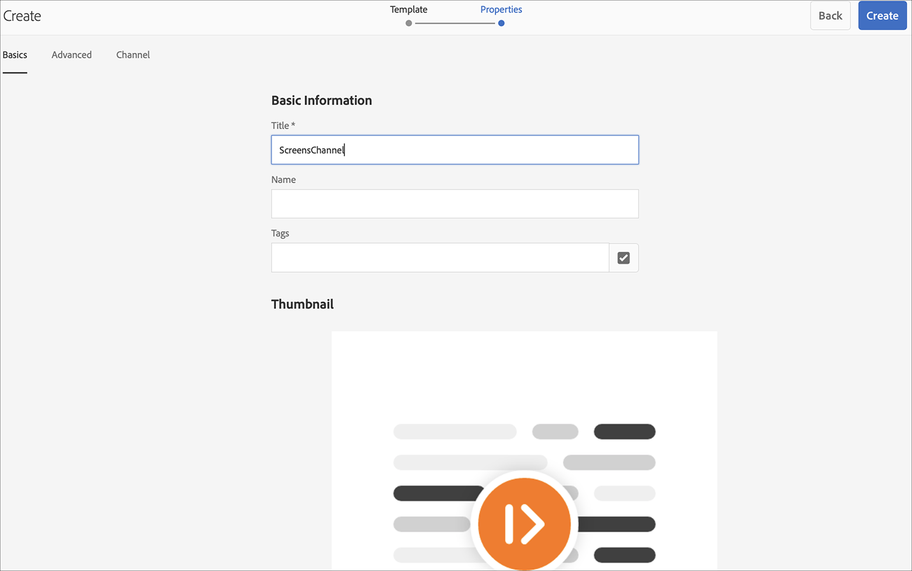

# 建立和管理通道{#creating-and-managing-channels}

頻道會顯示一系列內容（影像和影片），也會顯示網站或單頁應用程式。

本頁顯示如何建立及管理AEM Screens的管道。

**先決條件**:

* [設定和部署畫面](configuring-screens-introduction.md)
* [建立和管理Screens專案](creating-a-screens-project.md)

## 建立新通道{#creating-a-new-channel}

為AEM Screens建立專案後，請依照下列步驟為專案建立新管道：

1. 依序選取Adobe Experience Manager連結（左上角）和Screens。 或者，您也可以直接導覽至`https://localhost:4502/screens.html/content/screens`。

1. 導覽至您的Screens專案，並選取&#x200B;**Channels**&#x200B;資料夾。

1. 按一下動作列中的&#x200B;**建立**。

   

1. 從&#x200B;**建立**&#x200B;嚮導中選擇&#x200B;**序列通道**&#x200B;模板，然後按一下&#x200B;**下一步**。

   

1. 將標題輸入為&#x200B;**ScreensChannel**，然後按一下&#x200B;**Create**。

   

1. 「序列」通道現在已新增至您的&#x200B;**Channels**&#x200B;資料夾。

### 通道類型{#channel-types}

使用精靈時，可使用下列範本選項，例如：

| **範本選項** | **說明** |
|---|---|
| 頻道資料夾 | 允許建立資料夾以儲存管道集合。 |
| 順序頻道 | 可建立循序播放元件的管道（在幻燈片放映中逐個播放）。 |
| 應用程式頻道 | 可在Screens播放器中展示您的自訂Web應用程式。 |
| 1x1 拆分畫面頻道 | 可在單一區域中檢視元件。 |
| 1x2 拆分畫面頻道 | 允許在兩個區域中檢視資產（水準分割）。 |
| 2X1分屏通道 | 允許在兩個區域中檢視資產（垂直分割）。 |
| 2x2 拆分畫面頻道 | 允許在四個區域中檢視資產（在矩陣中水準和垂直分割）。 |
| 2 至 3 拆分畫面頻道 | 允許在兩個區域中檢視資產（水準分割），其中一個區域大於另一個區域。 |
| 左或右L形分屏通道 | 可讓內容作者在適當大小的區域中檢視不同類型的資產。 |

>[!NOTE]
>
>「分割畫面」管道會將顯示器分割為多個區域，讓您可以並排播放多個體驗。 體驗可以是靜態資產/文字或內嵌序列。

>[!IMPORTANT]
>
> 建立內容並新增至管道後，下一步是建立位置，然後建立顯示。 此外，您需要將該管道指派給顯示器。 請參閱下方小節結尾的資源，以了解更多資訊。

## 使用通道{#working-with-channels}

您可以編輯、檢視屬性和控制面板、複製、預覽和刪除管道。

### 新增/編輯內容至頻道{#adding-editing-content-to-a-channel}

若要新增或編輯頻道中的內容，請遵循下列步驟：

1. 選取您要編輯的管道（如上圖所示）。
1. 按一下動作列左上角的「**編輯** 」以編輯通道屬性。 編輯器隨即開啟，可讓您新增資產/元件至您要發佈的管道。

>[!NOTE]
>您可以新增元件至通道。 如需詳細資訊，請參閱&#x200B;**[將元件新增至通道](adding-components-to-a-channel.md)** 。

**上傳影片至頻道**

請依照下列步驟將影片上傳至您的頻道：

1. 選取您要上傳視訊的管道。
1. 按一下動作列中的&#x200B;**編輯**&#x200B;以開啟編輯器。
1. 在「資產」下方選取「**影片**」，並拖放所需影片。

>[!NOTE]
>如果您在頻道中上傳視訊時遇到問題，請參閱[疑難排解視訊](troubleshoot-videos.md)。

### 查看屬性{#viewing-properties}

要查看或編輯通道的屬性，請執行以下步驟：

1. 按一下您要編輯的管道。
1. 按一下動作列中的&#x200B;**屬性**&#x200B;以檢視/編輯通道屬性。 下列索引標籤可讓您變更選項。

### 查看儀表板{#viewing-dashboard}

若要檢視管道的控制面板，請遵循下列步驟：

1. 選取您要編輯的管道。
1. 按一下動作列中的&#x200B;**控制面板**&#x200B;以檢視控制面板。 **通道資訊**、**已分配顯示**&#x200B;和&#x200B;**待定啟動**&#x200B;面板隨即開啟，如下圖所示：

### 頻道資訊 {#channel-information}

「通道資訊」面板描述通道屬性以及通道預覽。 此外，它也提供通道離線或上線的資訊。

按一下(**...**)，以檢視屬性、編輯內容，或更新頻道的快取（離線內容）。****

#### 查看清單{#view-manifest}

您可以從通道控制面板檢視資訊清單。

>[!IMPORTANT]
>此選項僅適用於AEM 6.4 Feature Pack 8或AEM 6.5 Feature Pack 4。

請依照下列步驟，從通道控制面板啟用此選項：

1. **將頻道設為離線**
   1. 選取通道，然後從動作列選取&#x200B;**屬性**
   1. 導覽至&#x200B;**Channel**&#x200B;標籤，並確定您取消勾選&#x200B;**開發人員模式（強制管道上線）**&#x200B;選項
   1. 按一下「**儲存並關閉**」
1. **更新離線內容**
   1. 選取通道，然後從動作列選取&#x200B;**Dashboard**
   1. 導航至&#x200B;**通道資訊**&#x200B;面板，然後按一下&#x200B;*...*
   1. 按一下「**更新離線內容**」

您應該會從「通道」控制面板的&#x200B;**CHANNEL INFORMATION**&#x200B;面板看到&#x200B;**檢視資訊清單**&#x200B;選項。

### 線上和離線通道{#online-and-offline-channels}

>[!NOTE]
>依預設，當您建立管道時，該管道為「離線」。

當您建立管道時，可將其定義為線上或離線管道。

***線上頻道***&#x200B;將在即時環境中顯示更新的內容，而&#x200B;***離線頻道***&#x200B;顯示快取內容。

請依照下列步驟，讓管道上線：

1. 以&#x200B;**TestProject** —> **Channels** —> **TestChannel**&#x200B;導航到通道。

   選取通道。

   

   按一下動作列中的&#x200B;**Dashboard**&#x200B;以檢視播放器狀態。 **通道資訊**&#x200B;面板提供有關通道是線上還是離線的資訊。

   

1. 按一下動作列中的&#x200B;**屬性**&#x200B;並導覽至&#x200B;**Channel**&#x200B;標籤，如下所示：

   

1. 檢查&#x200B;**Developer** **mode（強制通道聯機）**&#x200B;以使通道聯機。

   按一下「**儲存並關閉**」以儲存選項。

   

   導覽回頻道控制面板，現在&#x200B;**頻道資訊**&#x200B;面板會顯示播放器的線上狀態。

   

>[!NOTE]
>如果您想要將頻道再次設定為離線，請從&#x200B;**屬性**&#x200B;標籤(如步驟(3)所示)取消勾選開發人員模式選項，然後從&#x200B;**管道資訊**&#x200B;面板按一下&#x200B;**更新離線內容**，如下圖所示。

#### 從設備儀表板{#automatic-versus-manual-updates-from-the-device-dashboard}自動更新和手動更新

下表匯總了與設備儀表板中的自動和手動更新相關的事件。

<table>
 <tbody>
  <tr>
   <td><strong>事件</strong></td>
   <td><strong>設備自動更新</strong></td>
   <td><strong>設備手動更新</strong></td>
  </tr>
  <tr>
   <td>線上頻道變更</td>
   <td>內容已自動更新</td>
   <td>
在「裝置：推送設定」
 
或,
 
<strong><i>裝置上更新的內容：重新啟動</i></strong>
 </td>
  </tr>
  <tr>
   <td>離線管道中的變更但未觸發管道「推播內容」（未重新建立離線套件）</td>
   <td>無內容更新</td>
   <td>無內容更新</td>
  </tr>
  <tr>
   <td>已觸發離線管道和管道「推播內容」變更（新的離線套件）</td>
   <td>內容已自動更新</td>
   <td>
<strong><i>裝置上更新的內容：推送設定</i></strong>
 
或,
 
<strong><i>裝置上更新的內容：重新啟動</i></strong>
 </td>
  </tr>
  <tr>
   <td>
設定變更

    <ul>
     <li>顯示（強制通道）</li>
     <li>裝置</li>
     <li>通道分配（新通道，已移除通道）</li>
     <li>管道指派（角色、事件、排程）</li>
    </ul> </td>
   <td>已自動更新設定</td>
   <td>
<strong><i>裝置上更新的設定：推送設定</i></strong>
 
或,
 
<strong><i>裝置上更新的設定：重新啟動</i></strong>
 </td>
  </tr>
 </tbody>
</table>

### 指派的顯示 {#assigned-displays}

指派的顯示面板會顯示與頻道相關聯的顯示。 它提供已分配顯示的快照以及解析度。

關聯的顯示將列在&#x200B;**已分配顯示**&#x200B;面板中，如下所示：

>[!NOTE]
>若要了解如何在位置建立顯示，請參閱：
>
>* [建立和管理位置](managing-locations.md)
* [建立和管理顯示](managing-displays.md)

此外，按一下&#x200B;**ASSIGNED DISPLAYS**&#x200B;面板中的顯示，查看顯示資訊，如下所示：

### 後續步驟{#the-next-steps}

建立頻道和在您的頻道中新增/編輯內容後的下一步，是了解如何建立位置和顯示。 再者，將頻道指派給該顯示器。

如需後續步驟，請參閱下列資源：

* [建立和管理管道](managing-channels.md)
* [建立和管理位置](managing-locations.md)
* [建立和管理顯示](managing-displays.md)

