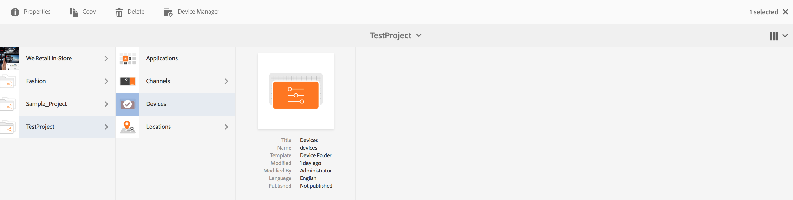
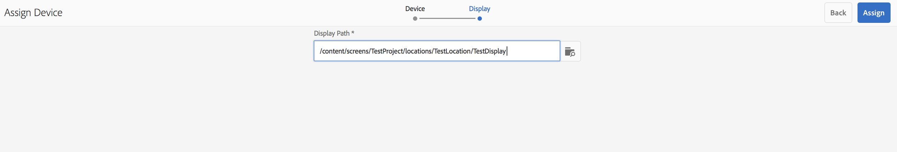
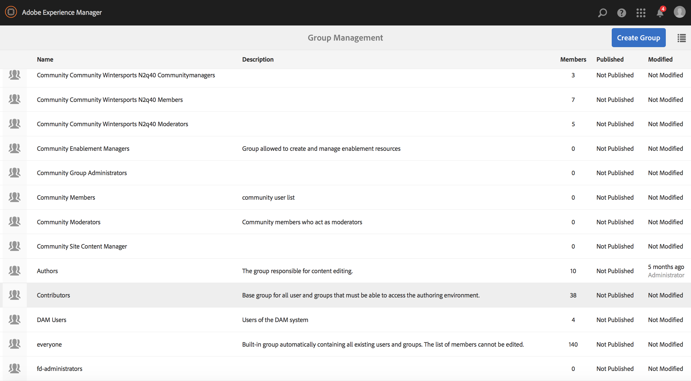

# 管理裝置 {#managing-devices}

>[!IMPORTANT]
>此內容對AEM內部部署/AMS （AEM 6.5LTS和AEM 6.5）有效。 如需AEM as a Cloud Service Screens內容，請參閱[AEM as a Cloud Service指南](https://experienceleague.adobe.com/en/docs/experience-manager-cloud-service/content/screens-as-cloud-service/overview/introduction)。

此頁面說明裝置指定任務。

裝置主控台可讓您存取裝置管理員，將裝置指派給顯示器。

>[!CAUTION]
>
>指派裝置之前，請先註冊該裝置。 請參閱[裝置註冊](device-registration.md)。

## 裝置指派 {#device-assignment}

請依照下列步驟，將裝置指定給顯示器：

1. 導覽至專案的「裝置」資料夾，例如

   `http://localhost:4502/screens.html/content/screens/TestProject`

   

1. 按一下您的&#x200B;**裝置**&#x200B;資料夾，然後按一下動作列中的&#x200B;**裝置管理員**。 已指派和未指派的裝置隨即顯示。

   

1. 從清單中按一下未指派的裝置，然後在動作列中按一下&#x200B;**指派裝置**。

   

1. 從清單中按一下您要指派裝置的顯示畫面，然後按一下&#x200B;**指派**。

   

1. 按一下&#x200B;**完成**&#x200B;以完成指派程式。

   顯示儀表板會在&#x200B;**裝置**&#x200B;面板中顯示指派的裝置。

   

   按一下(**...**) 在&#x200B;**裝置**&#x200B;面板的右上角，新增裝置設定或更新裝置。

   

>[!NOTE]
>
>每次將第一個裝置新增到新的Screens專案時，都會建立使用者群組。例如，如果專案節點名稱為&#x200B;*we-retail*，則使用者群組名稱為&#x200B;*screens-we-retail-devices*。此群組已新增為&#x200B;**參與者**&#x200B;群組的成員，如下圖所示：

### 後續步驟 {#the-next-steps}

在您熟悉指派通道給顯示區之後，請參閱t[監視與疑難排解](monitoring-screens.md)。

