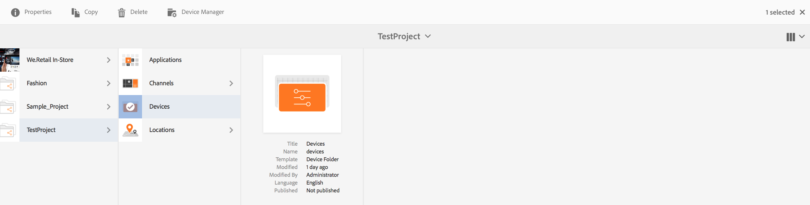

# 管理設備{#managing-devices}

本頁介紹設備分配。

「裝置」主控台可讓您存取裝置管理員，將裝置指派給顯示器。

>[!CAUTION]
>
>在指定裝置之前，您必須先註冊它。 如需詳細資訊，請參閱[裝置註冊](device-registration.md)。

## 設備分配{#device-assignment}

請依照下列步驟將裝置指派給顯示器：

1. 導覽至專案的「裝置」檔案夾，例如

   `http://localhost:4502/screens.html/content/screens/TestProject`

   

1. 選擇&#x200B;**Devices**&#x200B;資料夾，然後點選／按一下動作列中的&#x200B;**Device Manager**。 將顯示已分配和未分配的設備。

   

1. 從清單中選擇未分配的設備，並點選／按一下操作欄中的&#x200B;**Assign Device**。

   

1. 從清單中選擇要將設備分配給的顯示，然後點選／按一下&#x200B;**Assign**。

   

1. 點選／按一下&#x200B;**完成**&#x200B;以完成指派程式。

   顯示儀表板在&#x200B;**DEVICES**&#x200B;面板中顯示指定的設備。

   

   按一下(**...**)，以新增裝置設定或更新裝置。****

   

>[!NOTE]
>
>每次將第一個裝置新增至新的「畫面」專案時，都會建立使用者群組。
>例如，如果專案節點名稱為&#x200B;*we-retail*，則使用者群組名稱為&#x200B;*screens-we-retail-devices*。
>此組將添加為&#x200B;**Contributor**&#x200B;組的成員，如下圖所示：

### 後續步驟{#the-next-steps}

熟悉將頻道指派給顯示器後，請參閱下列資源：

* [監控和疑難排解](monitoring-screens.md)

